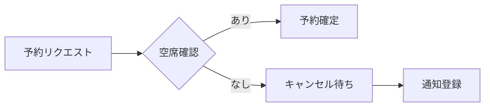

## Triggers
- User identifies new learning or pattern to remember
- Context needs to be preserved for future reference  
- Information not already documented in existing steering files

## Usage
```
/hm:steering-remember [--format rule|guide|knowledge] [--verbose]
```

## Behavioral Flow

1. **Extract Core Learning**: Identify the essential insight from recent conversation
   - Focus on actionable knowledge, not general observations
   - Extract concrete examples if code was discussed
   - Capture the "why" behind decisions
   - **Always auto-generate title**: Create 2-4 word descriptive title from content

2. **Auto-Detect Format**: Analyze content to choose optimal format
   ```
   if (contains code snippets OR "always/never/must/should/avoid"):
     → Rule format (with ✅/❌ examples)
   elif (contains "step/how to/investigate" OR numbered lists):
     → Guide format (with numbered steps)
   elif (contains "definition/concept/formula/domain"):
     → Knowledge format (with domain context)
   else:
     → Rule format (default)
   ```

3. **Generate Concise Output**: Create formatted content based on detected type
   
   **Rule Format** (7-15 lines with code):
   ````markdown
   ## [Concise Title]
   **When**: [Specific trigger condition]
   - [Key rule 1]
   - [Key rule 2]
   - [Key rule 3 if essential]
   
   ```language
   # ✅ Good
   [correct example]
   
   # ❌ Bad  
   [incorrect example]
   ```
   ````
   
   **Guide Format** (8-12 lines):
   ```markdown
   ## [Action-Oriented Title]
   **Context**: [When/why to use this guide]
   1. [First step]
   2. [Second step]
   3. [Third step]
   ⚠️ [Critical warning if any]
   ```
   
   **Knowledge Format** (10-20 lines):
   ````markdown
   ## [Concept Name]
   **Domain**: [Business/Technical domain]
   **Definition**: [Can be multi-line or bullet points]
   - [Key aspect 1]
   - [Key aspect 2]
   
   **Formula/Logic**: `[If applicable]`
   
   **Diagram**: [Optional mermaid diagram]
   ```mermaid
   graph LR
     A --> B --> C
   ```
   
   **Context**: [Why this matters, business impact]
   ````

4. **Generate Filename**: Create descriptive filename
   - Get timestamp: `date +%Y%m%d-%H%M%S`
   - Sanitize title: lowercase, alphanumeric, max 30 chars
   - Pattern: `{timestamp}-{format}-{title}.md`
   - Example: `20250108-143022-rule-batch-memory.md`

5. **Save to Draft**: Write to `.kiro/steering/draft/` directory
   - Check if draft directory exists
   - Write formatted content to file
   - Confirm successful save

Key behaviors:
- **Maximum brevity**: Remove all unnecessary explanation
- **Concrete over abstract**: Include specific examples, not theory
- **Action-oriented**: Focus on what to DO, not background
- **One learning per file**: Don't combine multiple insights
- **Auto-detect format**: Code→Rule, Steps→Guide, Concepts→Knowledge

## Examples

### Rule Format (with code)
````
/hm:steering-remember
# Analyzes recent conversation about service object patterns
# Auto-generates title: "service-return-values"
# Output: 20250108-143022-rule-service-return-values.md

## Service Return Values
**When**: Creating service objects in this codebase
- Return plain hashes for performance
- Wrap in transactions for consistency
- Use Japanese error messages

```ruby
# ✅ Good
def call
  { success: true, data: @result }
end

# ❌ Bad
OpenStruct.new(success: true)
```
````

### Guide Format (procedural)
```
/hm:steering-remember
# Analyzes recent conversation about BigQuery debugging steps
# Auto-generates title: "bigquery-debug-process"
# Output: 20250108-143523-guide-bigquery-debug-process.md

## BigQuery Debug Process
**Context**: Troubleshooting query failures
1. Check Cloud Logging for errors
2. Verify connection string format
3. Run EXTERNAL_QUERY with minimal scope
⚠️ No Japanese comments in SQL files
```

### Knowledge Format (conceptual)
````
/hm:steering-remember
# Analyzes recent conversation about restaurant reservation systems
# Auto-generates title: "reservation-system-architecture"
# Output: 20250108-144012-knowledge-reservation-system-architecture.md

## Restaurant Reservation System
**Domain**: Booking Management

**Definition**: 
- 空席管理と予約調整を行うシステム
- リアルタイム在庫と予約状態の同期
- キャンセル待ちリストの自動管理

**Formula**: 
```
予約可能数 = 総席数 - 既存予約 - バッファ
キャンセル率 = 過去30日のキャンセル数 / 予約総数
```

**Flow**:


**Context**: ダブルブッキング防止とキャンセル率を考慮した収益最適化
````

### Manual Format Override
```
/hm:steering-remember --format guide
# Forces Guide format even if content suggests Rule format
# Still auto-generates title from conversation context
```

## Boundaries

**Will:**
- Create one file per learning in draft directory
- Auto-detect optimal format from content
- Keep output under 15 lines maximum
- Include concrete examples when relevant
- Support Japanese content naturally

**Will Not:**
- Combine multiple learnings in one file
- Create verbose explanations (100+ lines)
- Modify existing steering files directly
- Process without clear learning to capture