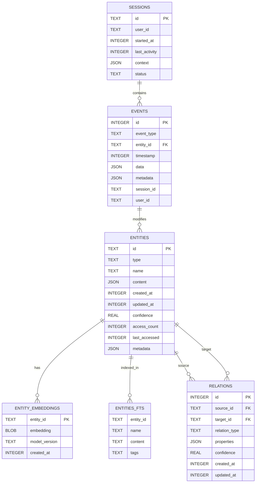

```mermaid
%%{init: {
  'theme': 'dark',
  'themeCSS': '
    .nodeLabel { color: #FD971F !important; }
    .edgeLabel { color: #A6E22E !important; background-color: transparent !important; }
    .cluster rect { fill: #272822 !important; stroke: #F92672 !important; stroke-width: 2px !important; rx: 5px !important; ry: 5px !important; }
    .node rect, .node circle, .node ellipse, .node polygon, .node path { fill: #272822 !important; stroke: #A6E22E !important; stroke-width: 2px !important; }
    .flowchart-link { stroke: #66D9EF !important; stroke-width: 2px !important; }
  '
}}%%
graph TB
    subgraph "Client Layer"
        A[MCP Client<br/>Claude/Other AI] 
    end
    
    subgraph "MCP Server Layer"
        B[Memory MCP Server<br/>Rust + rmcp]
        B --> C[Tool Router]
        C --> D[remember]
        C --> E[recall]
        C --> F[forget]
        C --> G[relate]
    end
    
    subgraph "Processing Layer"
        H[Text Processor]
        I[Embedding Generator<br/>fastembed]
        J[Duplicate Detector]
        K[Event Logger]
        L[Search Engine]
    end
    
    subgraph "Data Layer"
        M[(SQLite Database)]
        N[Events Table]
        O[Entities Table]
        P[Embeddings<br/>sqlite-vec]
        Q[FTS5 Index]
        R[Relations Table]
    end
    
    A -.->|stdio/HTTP| B
    D --> H
    E --> L
    F --> K
    G --> K
    
    H --> I
    I --> J
    J --> K
    K --> M
    
    L --> P
    L --> Q
    L --> O
    
    M --> N
    M --> O
    M --> P
    M --> Q
    M --> R
    
    classDef type1 fill:#272822,stroke:#A6E22E,stroke-width:2px;
    classDef type2 fill:#272822,stroke:#66D9EF,stroke-width:2px;
    classDef type3 fill:#272822,stroke:#F92672,stroke-width:2px;
    classDef highlighted fill:#AE81FF,stroke:#66D9EF,stroke-width:3px,color:#FFF;
    
    class A,B,C type1;
    class H,I,J,K,L type2;
    class D,E,F,G type3;
    class M,N,O,P,Q,R highlighted;
```

# Memory MCP Server 設計仕様書

## 1. 概要

### 1.1 プロジェクト概要
Memory MCP Serverは、AIアシスタント（特にClaude）に永続的な記憶機能を提供するModel Context Protocol (MCP) サーバーの実装です。Rust言語で開発し、SQLite、sqlite-vec、fastembedを組み合わせることで、高性能かつ軽量な記憶システムを実現します。

### 1.2 目的と背景
- **課題**: 現在のMemory MCP実装は重複データ、コンテキストウィンドウの圧迫、データ可変性の問題を抱えている
- **解決策**: イベントソーシング、ベクトル検索、全文検索を統合した効率的なアーキテクチャ
- **目標**: 単一バイナリで配布可能な、高性能でプライバシーを重視したメモリシステム

### 1.3 主要な特徴
- 🚀 **高性能**: Rust実装により従来比10-50倍の性能向上
- 🔒 **プライバシー**: 完全ローカル処理、外部API不要
- 📦 **簡単な配布**: 単一バイナリ、依存関係なし
- 🔍 **ハイブリッド検索**: ベクトル検索 + 全文検索の組み合わせ
- 📝 **イベントソーシング**: 完全な変更履歴の保持
- 🧩 **MCP準拠**: 標準MCPプロトコルに完全準拠

## 2. アーキテクチャ

### 2.1 全体アーキテクチャ



### 2.2 コンポーネント説明

#### 2.2.1 MCP Server Layer
- **Memory MCP Server**: メインサーバープロセス、rmcp SDKを使用
- **Tool Router**: MCPツールのルーティングと処理

#### 2.2.2 Processing Layer
- **Text Processor**: テキストの前処理と正規化
- **Embedding Generator**: fastembedによるベクトル埋め込み生成
- **Duplicate Detector**: 類似度計算による重複検出
- **Event Logger**: イベントソーシングの実装
- **Search Engine**: ハイブリッド検索（ベクトル + 全文）

#### 2.2.3 Data Layer
- **SQLite Database**: 全データの永続化
- **sqlite-vec**: ベクトル検索拡張
- **FTS5**: 全文検索インデックス

## 3. データベース設計

### 3.1 データベーススキーマ



### 3.2 テーブル詳細

#### 3.2.1 events テーブル
```sql
CREATE TABLE events (
    id INTEGER PRIMARY KEY AUTOINCREMENT,
    event_type TEXT NOT NULL CHECK(event_type IN ('CREATE', 'UPDATE', 'DELETE', 'MERGE', 'ACCESS')),
    entity_id TEXT NOT NULL,
    timestamp INTEGER NOT NULL DEFAULT (unixepoch()),
    data JSON NOT NULL,
    metadata JSON,
    session_id TEXT,
    user_id TEXT,
    FOREIGN KEY (entity_id) REFERENCES entities(id)
);

CREATE INDEX idx_events_entity_time ON events(entity_id, timestamp DESC);
CREATE INDEX idx_events_session ON events(session_id);
CREATE INDEX idx_events_type ON events(event_type);
```

#### 3.2.2 entities テーブル
```sql
CREATE TABLE entities (
    id TEXT PRIMARY KEY,
    type TEXT NOT NULL CHECK(type IN ('person', 'project', 'concept', 'fact', 'event', 'note')),
    name TEXT,
    content JSON NOT NULL,
    created_at INTEGER NOT NULL DEFAULT (unixepoch()),
    updated_at INTEGER NOT NULL DEFAULT (unixepoch()),
    confidence REAL DEFAULT 1.0 CHECK(confidence >= 0 AND confidence <= 1),
    access_count INTEGER DEFAULT 0,
    last_accessed INTEGER,
    metadata JSON
);

CREATE INDEX idx_entities_type ON entities(type);
CREATE INDEX idx_entities_updated ON entities(updated_at DESC);
CREATE INDEX idx_entities_accessed ON entities(last_accessed DESC);
```

#### 3.2.3 entity_embeddings テーブル（sqlite-vec）
```sql
CREATE VIRTUAL TABLE entity_embeddings USING vec0(
    entity_id TEXT PRIMARY KEY,
    embedding FLOAT[384],  -- All-MiniLM-L6-v2: 384次元
    model_version TEXT DEFAULT 'all-MiniLM-L6-v2',
    created_at INTEGER DEFAULT (unixepoch())
);
```

#### 3.2.4 entities_fts テーブル（FTS5）
```sql
CREATE VIRTUAL TABLE entities_fts USING fts5(
    entity_id UNINDEXED,
    name,
    content,
    tags,
    tokenize = 'porter unicode61'
);
```

#### 3.2.5 relations テーブル
```sql
CREATE TABLE relations (
    id INTEGER PRIMARY KEY AUTOINCREMENT,
    source_id TEXT NOT NULL,
    target_id TEXT NOT NULL,
    relation_type TEXT NOT NULL,
    properties JSON,
    confidence REAL DEFAULT 1.0,
    created_at INTEGER DEFAULT (unixepoch()),
    updated_at INTEGER DEFAULT (unixepoch()),
    FOREIGN KEY (source_id) REFERENCES entities(id),
    FOREIGN KEY (target_id) REFERENCES entities(id),
    UNIQUE(source_id, target_id, relation_type)
);

CREATE INDEX idx_relations_source ON relations(source_id);
CREATE INDEX idx_relations_target ON relations(target_id);
CREATE INDEX idx_relations_type ON relations(relation_type);
```

#### 3.2.6 sessions テーブル
```sql
CREATE TABLE sessions (
    id TEXT PRIMARY KEY,
    user_id TEXT,
    started_at INTEGER DEFAULT (unixepoch()),
    last_activity INTEGER DEFAULT (unixepoch()),
    context JSON,
    status TEXT DEFAULT 'active' CHECK(status IN ('active', 'closed', 'expired'))
);

CREATE INDEX idx_sessions_user ON sessions(user_id);
CREATE INDEX idx_sessions_status ON sessions(status);
```

## 4. データフロー

### 4.1 Remember（記憶）フロー

```mermaid
%%{init: {
  'theme': 'dark',
  'themeCSS': '
    .nodeLabel { color: #FD971F !important; }
    .edgeLabel { color: #A6E22E !important; background-color: transparent !important; }
    .cluster rect { fill: #272822 !important; stroke: #F92672 !important; stroke-width: 2px !important; rx: 5px !important; ry: 5px !important; }
    .node rect, .node circle, .node ellipse, .node polygon, .node path { fill: #272822 !important; stroke: #A6E22E !important; stroke-width: 2px !important; }
    .flowchart-link { stroke: #66D9EF !important; stroke-width: 2px !important; }
  '
}}%%
flowchart TD
    A[Client: remember request] --> B{Input Validation}
    B -->|Valid| C[Text Preprocessing]
    B -->|Invalid| Z[Error Response]
    
    C --> D[Generate Embedding<br/>fastembed]
    D --> E[Vector Similarity Search<br/>sqlite-vec]
    
    E --> F{Duplicate Found?}
    F -->|Yes: Similarity > 0.85| G[Merge Strategy]
    F -->|No| H[Create New Entity]
    
    G --> I[Update Existing Entity]
    G --> J[Log MERGE Event]
    
    H --> K[Generate Entity ID]
    K --> L[Store Entity]
    L --> M[Store Embedding]
    M --> N[Update FTS Index]
    N --> O[Log CREATE Event]
    
    I --> P[Update Embedding]
    P --> Q[Update FTS Index]
    Q --> J
    
    J --> R[Success Response]
    O --> R
    
    style A fill:#F92672
    style R fill:#A6E22E
    style Z fill:#FF6188
    
    classDef type1 fill:#272822,stroke:#A6E22E,stroke-width:2px;
    classDef type2 fill:#272822,stroke:#66D9EF,stroke-width:2px;
    classDef type3 fill:#272822,stroke:#F92672,stroke-width:2px;
```



### 4.2 Recall（検索）フロー

```mermaid
%%{init: {
  'theme': 'dark',
  'themeCSS': '
    .nodeLabel { color: #FD971F !important; }
    .edgeLabel { color: #A6E22E !important; background-color: transparent !important; }
    .cluster rect { fill: #272822 !important; stroke: #F92672 !important; stroke-width: 2px !important; rx: 5px !important; ry: 5px !important; }
    .node rect, .node circle, .node ellipse, .node polygon, .node path { fill: #272822 !important; stroke: #A6E22E !important; stroke-width: 2px !important; }
    .flowchart-link { stroke: #66D9EF !important; stroke-width: 2px !important; }
  '
}}%%
flowchart TD
    A[Client: recall request] --> B[Parse Query Parameters]
    B --> C{Search Strategy}
    
    C -->|Semantic| D[Generate Query Embedding]
    C -->|Keyword| E[Prepare FTS Query]
    C -->|Hybrid| F[Both Paths]
    
    D --> G[Vector Search<br/>sqlite-vec k-NN]
    E --> H[Full-Text Search<br/>FTS5]
    F --> G
    F --> H
    
    G --> I[Vector Results]
    H --> J[Text Results]
    
    I --> K[Result Merger]
    J --> K
    
    K --> L[Apply Filters<br/>type, date, confidence]
    L --> M[Ranking Algorithm]
    M --> N[Load Full Entities]
    N --> O[Expand Relations]
    O --> P[Log ACCESS Event]
    P --> Q[Update Access Count]
    Q --> R[Format Response]
    R --> S[Return Results]
    
    style A fill:#F92672
    style S fill:#A6E22E
    
    classDef type1 fill:#272822,stroke:#A6E22E,stroke-width:2px;
    classDef type2 fill:#272822,stroke:#66D9EF,stroke-width:2px;
    classDef type3 fill:#272822,stroke:#F92672,stroke-width:2px;
```



### 4.3 重複検出と統合フロー



```mermaid
%%{init: {
  'theme': 'dark',
  'themeCSS': '
    .nodeLabel { color: #FD971F !important; }
    .edgeLabel { color: #A6E22E !important; background-color: transparent !important; }
    .cluster rect { fill: #272822 !important; stroke: #F92672 !important; stroke-width: 2px !important; rx: 5px !important; ry: 5px !important; }
    .node rect, .node circle, .node ellipse, .node polygon, .node path { fill: #272822 !important; stroke: #A6E22E !important; stroke-width: 2px !important; }
    .flowchart-link { stroke: #66D9EF !important; stroke-width: 2px !important; }
  '
}}%%
flowchart TD
    A[New Information] --> B[Generate Embedding]
    B --> C[Cosine Similarity Search]
    
    C --> D{Similarity Score}
    D -->|< 0.7| E[Different Entity]
    D -->|0.7 - 0.85| F[Related Entity]
    D -->|> 0.85| G[Same Entity]
    
    E --> H[Create New]
    F --> I[Create Relation]
    G --> J[Merge Strategy]
    
    J --> K{Information Type}
    K -->|Additive| L[Append Information]
    K -->|Updating| M[Replace Old Info]
    K -->|Conflicting| N[Version Branch]
    
    L --> O[Update Entity]
    M --> O
    N --> P[Keep Both Versions]
    
    O --> Q[Update Confidence]
    P --> Q
    Q --> R[Log Event]
    
    style A fill:#F92672
    style R fill:#A6E22E
    
    classDef type1 fill:#272822,stroke:#A6E22E,stroke-width:2px;
    classDef type2 fill:#272822,stroke:#66D9EF,stroke-width:2px;
    classDef type3 fill:#272822,stroke:#F92672,stroke-width:2px;
```

## 5. API仕様

### 5.1 MCP Tools

#### 5.1.1 remember
```typescript
interface RememberParams {
  content: string;           // 記憶する内容
  type?: EntityType;         // エンティティタイプ
  metadata?: Record<string, any>;  // 追加メタデータ
  relations?: {              // 関係性の定義
    target_id: string;
    type: string;
  }[];
}

interface RememberResponse {
  entity_id: string;
  action: 'created' | 'updated' | 'merged';
  confidence: number;
  similar_entities?: string[];
}
```

#### 5.1.2 recall
```typescript
interface RecallParams {
  query: string;              // 検索クエリ
  limit?: number;             // 結果数上限（デフォルト: 10）
  search_type?: 'semantic' | 'keyword' | 'hybrid';  // 検索タイプ
  filters?: {
    type?: EntityType[];      // エンティティタイプフィルタ
    since?: number;           // 時間フィルタ（Unix timestamp）
    min_confidence?: number;  // 最小信頼度
  };
  include_relations?: boolean;  // 関係性を含めるか
}

interface RecallResponse {
  results: Memory[];
  total_count: number;
  search_type: string;
}

interface Memory {
  entity_id: string;
  type: EntityType;
  name?: string;
  content: any;
  confidence: number;
  relevance_score: number;
  created_at: number;
  updated_at: number;
  access_count: number;
  relations?: Relation[];
}
```

#### 5.1.3 forget
```typescript
interface ForgetParams {
  entity_id?: string;         // 特定エンティティの削除
  query?: string;             // クエリに基づく削除
  type?: EntityType;          // タイプ別削除
  before?: number;            // 時間基準削除
  confirm?: boolean;          // 確認フラグ
}

interface ForgetResponse {
  deleted_count: number;
  deleted_ids: string[];
}
```

#### 5.1.4 relate
```typescript
interface RelateParams {
  source_id: string;
  target_id: string;
  relation_type: string;
  properties?: Record<string, any>;
  bidirectional?: boolean;
}

interface RelateResponse {
  relation_id: number;
  created: boolean;
}
```

### 5.2 内部API

#### 5.2.1 Embedding Service
```rust
pub trait EmbeddingService {
    async fn generate(&self, text: &str) -> Result<Vec<f32>>;
    async fn batch_generate(&self, texts: &[String]) -> Result<Vec<Vec<f32>>>;
    fn dimension(&self) -> usize;
    fn model_name(&self) -> &str;
}
```

#### 5.2.2 Search Service
```rust
pub trait SearchService {
    async fn vector_search(
        &self,
        embedding: &[f32],
        limit: usize,
        threshold: f32,
    ) -> Result<Vec<SearchResult>>;
    
    async fn text_search(
        &self,
        query: &str,
        limit: usize,
    ) -> Result<Vec<SearchResult>>;
    
    async fn hybrid_search(
        &self,
        query: &str,
        embedding: &[f32],
        limit: usize,
        vector_weight: f32,
    ) -> Result<Vec<SearchResult>>;
}
```

## 6. 実装詳細

### 6.1 プロジェクト構造
```
hail-mary/
├── src/
│   ├── commands/
│   │   ├── mod.rs
│   │   └── mcp/
│   │       ├── mod.rs             # MCPコマンドエントリ
│   │       ├── server.rs          # MCPサーバー実装
│   │       ├── handlers/          # ツールハンドラー
│   │       │   ├── remember.rs
│   │       │   ├── recall.rs
│   │       │   ├── forget.rs
│   │       │   └── relate.rs
│   │       ├── services/          # ビジネスロジック
│   │       │   ├── embedding.rs  # fastembed統合
│   │       │   ├── search.rs     # 検索エンジン
│   │       │   ├── duplicate.rs  # 重複検出
│   │       │   └── event.rs      # イベントログ
│   │       ├── database/          # データ層
│   │       │   ├── mod.rs
│   │       │   ├── schema.rs     # スキーマ定義
│   │       │   ├── migrations.rs # マイグレーション
│   │       │   └── queries.rs    # SQLクエリ
│   │       └── models/            # データモデル
│   │           ├── entity.rs
│   │           ├── event.rs
│   │           └── relation.rs
│   └── main.rs
├── Cargo.toml
├── data/
│   └── memory.db                  # SQLiteデータベース
└── config/
    └── memory_mcp.toml            # 設定ファイル
```

### 6.2 依存関係（Cargo.toml）
```toml
[dependencies]
# MCP SDK
rmcp = { version = "0.2", features = ["server"] }

# Database
rusqlite = { version = "0.31", features = ["bundled", "json", "chrono"] }
sqlite-vec = "0.1"
rusqlite_migration = "1.0"

# Embedding
fastembed = "3"

# Async runtime
tokio = { version = "1", features = ["full"] }

# Serialization
serde = { version = "1", features = ["derive"] }
serde_json = "1"

# Utils
anyhow = "1"
tracing = "0.1"
tracing-subscriber = "0.3"
uuid = { version = "1", features = ["v4", "serde"] }
chrono = "0.4"

# CLI
clap = { version = "4", features = ["derive"] }

# Config
toml = "0.8"
```

### 6.3 設定ファイル（memory_mcp.toml）
```toml
[server]
host = "127.0.0.1"
port = 3333
transport = "stdio"  # or "http"

[database]
path = "./data/memory.db"
wal_mode = true
cache_size = 10000  # pages
busy_timeout = 5000  # ms

[embedding]
model = "all-MiniLM-L6-v2"  # or "multilingual-e5-large"
cache_embeddings = true
batch_size = 32

[search]
default_limit = 10
max_limit = 100
similarity_threshold = 0.85
hybrid_vector_weight = 0.7  # 0.0-1.0

[performance]
max_concurrent_requests = 10
request_timeout = 30  # seconds
cache_ttl = 3600  # seconds

[logging]
level = "info"  # trace, debug, info, warn, error
format = "json"  # or "pretty"
```

## 7. パフォーマンス最適化

### 7.1 インデックス戦略
- 頻繁にアクセスされるカラムには必ずインデックスを作成
- 複合インデックスは最も選択性の高いカラムを先頭に
- FTS5とsqlite-vecの併用でハイブリッド検索を高速化

### 7.2 キャッシュ戦略
- 埋め込みベクトルのLRUキャッシュ（メモリ制限付き）
- 頻繁にアクセスされるエンティティのホットキャッシュ
- セッション単位でのクエリ結果キャッシュ

### 7.3 バッチ処理
- 複数の記憶リクエストをバッチ化して埋め込み生成
- トランザクション内での複数更新
- 非同期I/Oの活用

### 7.4 SQLite最適化
```sql
-- WALモード有効化
PRAGMA journal_mode = WAL;

-- キャッシュサイズ調整
PRAGMA cache_size = 10000;

-- 同期モード調整（パフォーマンス重視）
PRAGMA synchronous = NORMAL;

-- メモリマップI/O
PRAGMA mmap_size = 30000000000;

-- 自動VACUUM
PRAGMA auto_vacuum = INCREMENTAL;
```

## 8. セキュリティとプライバシー

### 8.1 データ保護
- SQLiteデータベースファイルの暗号化（SQLCipher検討）
- センシティブ情報の自動検出と除外
- セッション分離によるユーザー間のデータ隔離

### 8.2 アクセス制御
- セッションベースの認証
- rate limitingの実装
- 監査ログの記録

### 8.3 プライバシー機能
- データの完全ローカル処理
- 外部API呼び出しなし
- ユーザー制御による削除機能

## 9. エラーハンドリング

### 9.1 エラー分類
```rust
#[derive(Debug, thiserror::Error)]
pub enum MemoryMcpError {
    #[error("Database error: {0}")]
    Database(#[from] rusqlite::Error),
    
    #[error("Embedding error: {0}")]
    Embedding(String),
    
    #[error("Entity not found: {0}")]
    EntityNotFound(String),
    
    #[error("Invalid input: {0}")]
    InvalidInput(String),
    
    #[error("Duplicate entity: {0}")]
    DuplicateEntity(String),
    
    #[error("Search error: {0}")]
    SearchError(String),
}
```

### 9.2 リトライ戦略
- データベースロック時の指数バックオフ
- 埋め込み生成失敗時の再試行
- トランザクション失敗時のロールバック

## 10. テスト戦略

### 10.1 単体テスト
```rust
#[cfg(test)]
mod tests {
    use super::*;
    
    #[tokio::test]
    async fn test_remember_new_entity() {
        // テスト実装
    }
    
    #[tokio::test]
    async fn test_duplicate_detection() {
        // テスト実装
    }
    
    #[tokio::test]
    async fn test_hybrid_search() {
        // テスト実装
    }
}
```

### 10.2 統合テスト
- MCPプロトコル準拠テスト
- エンドツーエンドシナリオテスト
- パフォーマンステスト

### 10.3 ベンチマーク
```rust
use criterion::{black_box, criterion_group, criterion_main, Criterion};

fn benchmark_embedding(c: &mut Criterion) {
    c.bench_function("generate embedding", |b| {
        b.iter(|| {
            // ベンチマーク実装
        });
    });
}
```

## 11. 実装計画

### 11.1 フェーズ1: 基本機能（3日間）
- [x] プロジェクト構造のセットアップ
- [ ] SQLiteデータベースの初期化
- [ ] 基本的なMCPサーバー実装
- [ ] remember/recallの基本実装
- [ ] FTS5による全文検索

### 11.2 フェーズ2: ベクトル検索（3日間）
- [ ] fastembed統合
- [ ] sqlite-vec設定
- [ ] ベクトル類似度検索
- [ ] ハイブリッド検索実装
- [ ] 重複検出の高度化

### 11.3 フェーズ3: 高度な機能（3日間）
- [ ] 関係性グラフの実装
- [ ] イベントソーシング完全実装
- [ ] セッション管理
- [ ] バッチ処理最適化
- [ ] キャッシュ実装

### 11.4 フェーズ4: 品質保証（2日間）
- [ ] 包括的なテスト作成
- [ ] パフォーマンステスト
- [ ] ドキュメント整備
- [ ] CI/CD設定

## 12. 監視とメトリクス

### 12.1 パフォーマンスメトリクス
- 記憶操作のレイテンシ
- 検索クエリの応答時間
- 埋め込み生成時間
- データベースクエリ時間

### 12.2 ビジネスメトリクス
- 総エンティティ数
- 日次アクティブメモリ数
- 検索成功率
- 重複検出率

### 12.3 システムメトリクス
- メモリ使用量
- CPU使用率
- データベースサイズ
- キャッシュヒット率

## 13. 将来の拡張計画

### 13.1 短期計画（1ヶ月）
- グラフデータベース機能の強化
- より高度な重複検出アルゴリズム
- マルチモーダル対応（画像、音声）

### 13.2 中期計画（3ヶ月）
- 分散システム対応
- リアルタイム同期
- 高度な関係性推論

### 13.3 長期計画（6ヶ月）
- 知識グラフの自動構築
- セマンティック推論エンジン
- フェデレーテッドラーニング

## 14. リスクと軽減策

### 14.1 技術的リスク
| リスク | 影響度 | 確率 | 軽減策 |
|--------|--------|------|--------|
| sqlite-vecの不安定性 | 高 | 中 | FTS5フォールバック実装 |
| 埋め込みモデルの精度 | 中 | 低 | 複数モデルの評価と選択 |
| スケーラビリティ | 高 | 低 | シャーディング戦略の準備 |
| データ破損 | 高 | 低 | 定期バックアップとWAL |

### 14.2 運用リスク
- データベースの肥大化 → 定期的なVACUUMとアーカイブ
- メモリリーク → Rustの所有権システムで防止
- 同時アクセス制限 → コネクションプールとキュー

## 15. まとめ

Memory MCP Serverは、最新の技術スタック（Rust + SQLite + sqlite-vec + fastembed）を活用し、高性能でプライバシーを重視した永続的メモリシステムを実現します。単一バイナリでの配布により、導入が容易で、完全にローカルで動作するため、企業環境でも安心して利用できます。

段階的な実装アプローチにより、リスクを最小化しながら着実に機能を拡張し、最終的には高度な知識管理システムへと発展させることが可能です。

## 付録A: SQL定義完全版

```sql
-- データベース初期設定
PRAGMA journal_mode = WAL;
PRAGMA foreign_keys = ON;
PRAGMA cache_size = 10000;
PRAGMA synchronous = NORMAL;

-- events テーブル
CREATE TABLE IF NOT EXISTS events (
    id INTEGER PRIMARY KEY AUTOINCREMENT,
    event_type TEXT NOT NULL CHECK(event_type IN ('CREATE', 'UPDATE', 'DELETE', 'MERGE', 'ACCESS')),
    entity_id TEXT NOT NULL,
    timestamp INTEGER NOT NULL DEFAULT (unixepoch()),
    data JSON NOT NULL,
    metadata JSON,
    session_id TEXT,
    user_id TEXT,
    FOREIGN KEY (entity_id) REFERENCES entities(id) ON DELETE CASCADE
);

CREATE INDEX idx_events_entity_time ON events(entity_id, timestamp DESC);
CREATE INDEX idx_events_session ON events(session_id) WHERE session_id IS NOT NULL;
CREATE INDEX idx_events_type ON events(event_type);
CREATE INDEX idx_events_timestamp ON events(timestamp DESC);

-- entities テーブル
CREATE TABLE IF NOT EXISTS entities (
    id TEXT PRIMARY KEY,
    type TEXT NOT NULL CHECK(type IN ('person', 'project', 'concept', 'fact', 'event', 'note')),
    name TEXT,
    content JSON NOT NULL,
    created_at INTEGER NOT NULL DEFAULT (unixepoch()),
    updated_at INTEGER NOT NULL DEFAULT (unixepoch()),
    confidence REAL DEFAULT 1.0 CHECK(confidence >= 0 AND confidence <= 1),
    access_count INTEGER DEFAULT 0,
    last_accessed INTEGER,
    metadata JSON
);

CREATE INDEX idx_entities_type ON entities(type);
CREATE INDEX idx_entities_updated ON entities(updated_at DESC);
CREATE INDEX idx_entities_accessed ON entities(last_accessed DESC) WHERE last_accessed IS NOT NULL;
CREATE INDEX idx_entities_confidence ON entities(confidence DESC);
CREATE INDEX idx_entities_name ON entities(name) WHERE name IS NOT NULL;

-- relations テーブル
CREATE TABLE IF NOT EXISTS relations (
    id INTEGER PRIMARY KEY AUTOINCREMENT,
    source_id TEXT NOT NULL,
    target_id TEXT NOT NULL,
    relation_type TEXT NOT NULL,
    properties JSON,
    confidence REAL DEFAULT 1.0 CHECK(confidence >= 0 AND confidence <= 1),
    created_at INTEGER DEFAULT (unixepoch()),
    updated_at INTEGER DEFAULT (unixepoch()),
    FOREIGN KEY (source_id) REFERENCES entities(id) ON DELETE CASCADE,
    FOREIGN KEY (target_id) REFERENCES entities(id) ON DELETE CASCADE,
    UNIQUE(source_id, target_id, relation_type)
);

CREATE INDEX idx_relations_source ON relations(source_id);
CREATE INDEX idx_relations_target ON relations(target_id);
CREATE INDEX idx_relations_type ON relations(relation_type);
CREATE INDEX idx_relations_confidence ON relations(confidence DESC);

-- sessions テーブル
CREATE TABLE IF NOT EXISTS sessions (
    id TEXT PRIMARY KEY,
    user_id TEXT,
    started_at INTEGER DEFAULT (unixepoch()),
    last_activity INTEGER DEFAULT (unixepoch()),
    context JSON,
    status TEXT DEFAULT 'active' CHECK(status IN ('active', 'closed', 'expired'))
);

CREATE INDEX idx_sessions_user ON sessions(user_id) WHERE user_id IS NOT NULL;
CREATE INDEX idx_sessions_status ON sessions(status);
CREATE INDEX idx_sessions_activity ON sessions(last_activity DESC);

-- sqlite-vec virtual table
-- Note: This is created at runtime after loading the extension
-- CREATE VIRTUAL TABLE entity_embeddings USING vec0(
--     entity_id TEXT PRIMARY KEY,
--     embedding FLOAT[384]
-- );

-- FTS5 virtual table
CREATE VIRTUAL TABLE IF NOT EXISTS entities_fts USING fts5(
    entity_id UNINDEXED,
    name,
    content,
    tags,
    tokenize = 'porter unicode61'
);

-- トリガー: entities更新時にupdated_atを自動更新
CREATE TRIGGER update_entities_timestamp 
AFTER UPDATE ON entities
BEGIN
    UPDATE entities SET updated_at = unixepoch() WHERE id = NEW.id;
END;

-- トリガー: relations更新時にupdated_atを自動更新
CREATE TRIGGER update_relations_timestamp 
AFTER UPDATE ON relations
BEGIN
    UPDATE relations SET updated_at = unixepoch() WHERE id = NEW.id;
END;

-- ビュー: 最近アクセスされたエンティティ
CREATE VIEW recent_entities AS
SELECT 
    e.*,
    COUNT(ev.id) as event_count,
    MAX(ev.timestamp) as last_event
FROM entities e
LEFT JOIN events ev ON e.id = ev.entity_id
WHERE e.last_accessed > unixepoch() - 86400 * 7  -- 過去7日間
GROUP BY e.id
ORDER BY e.last_accessed DESC;

-- ビュー: エンティティの関係性グラフ
CREATE VIEW entity_graph AS
SELECT 
    e1.id as source_id,
    e1.name as source_name,
    e1.type as source_type,
    r.relation_type,
    e2.id as target_id,
    e2.name as target_name,
    e2.type as target_type,
    r.confidence
FROM relations r
JOIN entities e1 ON r.source_id = e1.id
JOIN entities e2 ON r.target_id = e2.id;
```

## 付録B: 使用例

### B.1 CLI使用例
```bash
# Memory MCPサーバーを起動
$ hail-mary mcp start

# デーモンモードで起動
$ hail-mary mcp start --daemon

# HTTPモードで起動
$ hail-mary mcp start --transport http --port 8080

# 設定ファイルを指定
$ hail-mary mcp start --config ./custom_config.toml

# ステータス確認
$ hail-mary mcp status

# データベース情報
$ hail-mary mcp info
```

### B.2 Claude.aiからの接続
```json
// Claude Desktop config.json
{
  "mcpServers": {
    "memory": {
      "command": "hail-mary",
      "args": ["mcp", "start"],
      "env": {}
    }
  }
}
```

### B.3 プログラマティック使用
```rust
use hail_mary::mcp::MemoryMcpServer;

#[tokio::main]
async fn main() -> Result<()> {
    let server = MemoryMcpServer::new("./data/memory.db").await?;
    
    // 記憶
    let response = server.remember(RememberParams {
        content: "田中さんはプロジェクトマネージャーです".to_string(),
        type: Some(EntityType::Person),
        metadata: None,
        relations: None,
    }).await?;
    
    // 検索
    let results = server.recall(RecallParams {
        query: "田中さんの役職は？".to_string(),
        limit: Some(5),
        search_type: Some(SearchType::Hybrid),
        filters: None,
        include_relations: Some(true),
    }).await?;
    
    println!("Found {} results", results.results.len());
    Ok(())
}
```