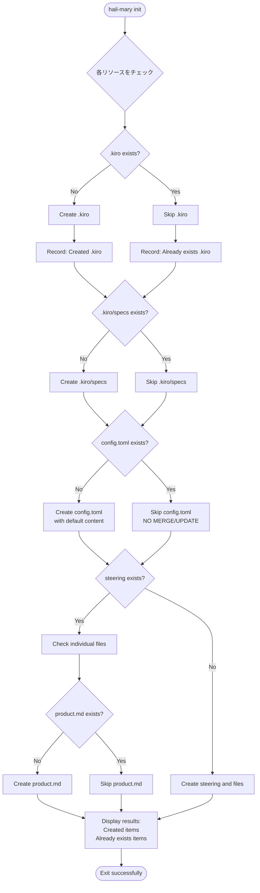

# Design

## Architecture Overview

### 設計方針
`hail-mary init` コマンドを冪等（idempotent）にし、`--force` フラグを削除します。

**冪等性の定義**：
- 何度実行しても同じ結果になる
- エラーを返さない（常に成功）
- 既存のファイルは保護される（上書きしない）
- 不足しているリソースのみ作成される

### レイヤー構造

```
CLI Layer (init.rs)
    ↓ force フラグを削除
Application Layer (initialize_project.rs)
    ↓ 冪等な初期化ロジック（シンプルに）
Infrastructure Layer (project.rs)
    ↓ 各メソッドを冪等に修正
File System
```

## Data Flow

### 初期化フロー



## 実装詳細

### 1. シンプルな initialize_project 関数（InitResult なし）

```rust
// より単純な実装方法 1: 表示をインラインで行う
pub fn initialize_project(
    repository: &impl ProjectRepository
) -> Result<(), ApplicationError> {
    println!("Initializing .kiro directory structure:");
    
    // .kiro ディレクトリ
    if !repository.exists()? {
        repository.initialize()?;  // 既存のメソッドを再利用
        println!("  ✅ Created .kiro/");
        println!("  ✅ Created .kiro/specs/");
    } else {
        println!("  ⏭️  Already exists .kiro/");
        println!("  ⏭️  Already exists .kiro/specs/");
    }
    
    // config.toml（既存のsave_configを活用、既存なら何もしない）
    let config_path = repository.config_path();
    if !config_path.exists() {
        repository.save_config()?;
        println!("  ✅ Created .kiro/config.toml");
    } else {
        println!("  ⏭️  Already exists .kiro/config.toml");
    }
    
    // steering（既存のメソッドを活用）
    repository.initialize_steering()?;  // 既存なら何もしない
    repository.create_steering_files(&SteeringConfig::default_for_new_project())?;
    
    // .gitignore
    repository.update_gitignore()?;  // 既存なら何もしない
    
    println!("\nInitialization complete.");
    Ok(())
}
```

または

```rust
// より単純な実装方法 2: 既存メソッドを最大限活用
pub fn initialize_project(
    repository: &impl ProjectRepository
) -> Result<(), ApplicationError> {
    // 既存のディレクトリがあってもエラーにしない
    // 各メソッドを冪等にする
    
    repository.initialize()?;  // .kiro と .kiro/specs を作成（既存ならスキップ）
    repository.save_config()?;  // config.toml を作成（既存ならスキップ）
    repository.initialize_steering()?;  // steering ディレクトリを作成
    repository.create_steering_files(&SteeringConfig::default_for_new_project())?;
    repository.update_gitignore()?;
    
    println!("Initialization complete.");
    Ok(())
}
```

### 2. 最もシンプルな実装案

```rust
// 最終案: 既存のインフラ層メソッドをそのまま活用
pub fn initialize_project(
    repository: &impl ProjectRepository
) -> Result<(), ApplicationError> {
    // すべてのメソッドを冪等にして順番に実行
    // 各メソッドは内部で「既存なら何もしない」を実装
    
    repository.initialize()?;  // .kiro, .kiro/specs
    repository.save_config()?;  // config.toml（既存なら何もしない）
    repository.initialize_steering()?;  // steering, draft
    
    let steering_config = SteeringConfig::default_for_new_project();
    repository.create_steering_files(&steering_config)?;  // *.md（既存なら何もしない）
    
    repository.update_gitignore()?;  // .gitignore
    
    Ok(())
}
```

### 3. インフラ層の修正点

既存のメソッドを冪等にするだけ：

```rust
impl ProjectRepository {
    fn initialize(&self) -> Result<(), ApplicationError> {
        // 既存チェックを追加
        if !self.path_manager.kiro_dir(true).exists() {
            fs::create_dir_all(&kiro_dir)?;
        }
        if !self.path_manager.specs_dir(true).exists() {
            fs::create_dir_all(&specs_dir)?;
        }
        Ok(())
    }
    
    fn save_config(&self) -> Result<(), ApplicationError> {
        let config_path = self.path_manager.config_path(true);
        if config_path.exists() {
            return Ok(());  // 既存なら何もしない
        }
        // 新規作成処理...
    }
    
    // 他のメソッドも同様に冪等化
}
```

### 4. 変更点まとめ

| コンポーネント | 変更前 | 変更後 |
|------------|--------|--------|
| CLI引数 | `--force` フラグあり | フラグ削除 |
| 既存チェック | エラーを返す | スキップして続行 |
| config.toml | ensure_steering_config でマージ | 存在チェックのみ |
| 出力メッセージ | 成功/エラー | Created/Already exists |
| 戻り値 | `Result<(), Error>` | `Result<InitResult, Error>` |

## ファイル保護ポリシー

### 原則
1. **既存ファイルは絶対に上書きしない**
2. **内容のマージや更新は行わない**
3. **ファイルの存在チェックのみで判断**

### 対象リソース
- `.kiro/` ディレクトリ
- `.kiro/specs/` ディレクトリ  
- `.kiro/config.toml` ファイル
- `.kiro/steering/` ディレクトリ
- `.kiro/steering/*.md` ファイル
- `.kiro/steering/draft/` ディレクトリ
- `.gitignore` ファイル

## テスト戦略

### 削除するテスト
- `test_init_command_execute_already_exists` - エラーを期待するテスト
- `test_init_command_execute_with_force` - force フラグのテスト
- force フラグ関連のすべてのテスト

### 追加するテスト
```rust
#[test]
fn test_init_is_idempotent() {
    // 1回目の実行
    let result1 = InitCommand::new().execute();
    assert!(result1.is_ok());
    
    // 2回目の実行（エラーにならない）
    let result2 = InitCommand::new().execute();
    assert!(result2.is_ok());
    
    // 3回目も成功
    let result3 = InitCommand::new().execute();
    assert!(result3.is_ok());
}

#[test]
fn test_init_partial_initialization() {
    // 一部のみ存在する状態を作る
    create_dir(".kiro").unwrap();
    
    // init を実行
    let result = InitCommand::new().execute();
    assert!(result.is_ok());
    
    // 不足していたリソースが作成される
    assert!(Path::new(".kiro/specs").exists());
    assert!(Path::new(".kiro/config.toml").exists());
}
```

## 期待される効果

1. **ユーザーエクスペリエンスの向上**
   - エラーで中断されない
   - 何度実行しても安全
   - 部分的な初期化状態を修復できる

2. **コードの簡潔化**
   - force フラグ関連のロジックを削除
   - エラーハンドリングがシンプルに

3. **保守性の向上**
   - 冪等性により予測可能な動作
   - テストが簡単に
