# Investigation: fix-init

## Research Notes

### Control Flow Analysis for `hail-mary init` Commands

The `hail-mary init` command follows a layered architecture pattern:
1. **CLI Layer** (`init.rs`): Handles command execution and user feedback
2. **Application Layer** (`initialize_project.rs`): Contains business logic  
3. **Infrastructure Layer** (`project.rs`): Implements file system operations

## Key Findings

### 1. Control Flow for `hail-mary init` (without --force)

```mermaid
%%{init: {
  'theme': 'dark',
  'themeCSS': '
    .nodeLabel { color: #FD971F !important; }
    .edgeLabel { color: #A6E22E !important; background-color: transparent !important; }
    .cluster rect { fill: #272822 !important; stroke: #F92672 !important; stroke-width: 2px !important; rx: 5px !important; ry: 5px !important; }
    .node rect, .node circle, .node ellipse, .node polygon, .node path { fill: #272822 !important; stroke: #A6E22E !important; stroke-width: 2px !important; }
    .flowchart-link { stroke: #66D9EF !important; stroke-width: 2px !important; }
  '
}}%%
flowchart TD
    classDef type1 fill:#272822,stroke:#A6E22E,stroke-width:2px
    classDef type2 fill:#272822,stroke:#66D9EF,stroke-width:2px
    classDef type3 fill:#272822,stroke:#F92672,stroke-width:2px
    classDef highlighted fill:#AE81FF,stroke:#66D9EF,stroke-width:3px,color:#FFF
    classDef dashed fill:#272822,stroke:#FD971F,stroke-width:2px,stroke-dasharray: 5 5
    
    Start([hail-mary init]):::type1
    Start --> CreatePathManager[Create PathManager<br/>from current directory]:::type2
    CreatePathManager --> CreateRepo[Create ProjectRepository]:::type2
    CreateRepo --> CallUseCase[Call initialize_project<br/>with force=false]:::highlighted
    
    CallUseCase --> CheckExists{repository.exists}:::type3
    CheckExists -->|true| ReturnError[Return<br/>ProjectAlreadyExists]:::type3
    CheckExists -->|false| InitStructure[repository.initialize]:::type2
    
    ReturnError --> ShowError[Display error:<br/>'Project already initialized.<br/>Use --force to reinitialize.']:::type3
    ShowError --> End([Exit with error]):::type3
    
    InitStructure --> InitSteering[repository.initialize_steering]:::type2
    InitSteering --> EnsureConfig[repository.ensure_steering_config]:::highlighted
    
    EnsureConfig --> ConfigExists{config.toml<br/>exists?}:::type3
    ConfigExists -->|no| CreateNewConfig[Create new config.toml<br/>with steering section]:::type2
    ConfigExists -->|yes| CheckSteering{Has steering<br/>section?}:::type3
    
    CheckSteering -->|yes| SkipConfig[Skip config update]:::dashed
    CheckSteering -->|no| AppendSteering[Append steering section<br/>to existing config]:::highlighted
    
    CreateNewConfig --> CreateSteeringFiles
    SkipConfig --> CreateSteeringFiles
    AppendSteering --> CreateSteeringFiles
    
    CreateSteeringFiles[repository.create_steering_files]:::type2
    CreateSteeringFiles --> CheckFileExists{Steering file<br/>exists?}:::type3
    CheckFileExists -->|yes| SkipFile[Skip file creation]:::dashed
    CheckFileExists -->|no| WriteFile[Write steering file<br/>product.md, tech.md, structure.md]:::type2
    
    SkipFile --> UpdateGitignore
    WriteFile --> UpdateGitignore
    
    UpdateGitignore[repository.update_gitignore]:::type2
    UpdateGitignore --> Success[Display success message<br/>and list created items]:::type1
    Success --> EndSuccess([Exit successfully]):::type1
```



### 2. Control Flow for `hail-mary init --force`

```mermaid
%%{init: {
  'theme': 'dark',
  'themeCSS': '
    .nodeLabel { color: #FD971F !important; }
    .edgeLabel { color: #A6E22E !important; background-color: transparent !important; }
    .cluster rect { fill: #272822 !important; stroke: #F92672 !important; stroke-width: 2px !important; rx: 5px !important; ry: 5px !important; }
    .node rect, .node circle, .node ellipse, .node polygon, .node path { fill: #272822 !important; stroke: #A6E22E !important; stroke-width: 2px !important; }
    .flowchart-link { stroke: #66D9EF !important; stroke-width: 2px !important; }
  '
}}%%
flowchart TD
    classDef type1 fill:#272822,stroke:#A6E22E,stroke-width:2px
    classDef type2 fill:#272822,stroke:#66D9EF,stroke-width:2px
    classDef type3 fill:#272822,stroke:#F92672,stroke-width:2px
    classDef highlighted fill:#AE81FF,stroke:#66D9EF,stroke-width:3px,color:#FFF
    classDef dashed fill:#272822,stroke:#FD971F,stroke-width:2px,stroke-dasharray: 5 5
    
    Start([hail-mary init --force]):::type1
    Start --> CreatePathManager[Create PathManager<br/>from current directory]:::type2
    CreatePathManager --> CreateRepo[Create ProjectRepository]:::type2
    CreateRepo --> CallUseCase[Call initialize_project<br/>with force=true]:::highlighted
    
    CallUseCase --> CheckExists{repository.exists}:::type3
    CheckExists -->|true & force=true| BypassCheck[Continue anyway<br/>due to force flag]:::highlighted
    CheckExists -->|false| InitStructure[repository.initialize]:::type2
    
    BypassCheck --> InitStructure
    
    InitStructure --> InitSteering[repository.initialize_steering]:::type2
    InitSteering --> EnsureConfig[repository.ensure_steering_config]:::highlighted
    
    EnsureConfig --> ConfigExists{config.toml<br/>exists?}:::type3
    ConfigExists -->|no| CreateNewConfig[Create new config.toml<br/>with steering section]:::type2
    ConfigExists -->|yes| PreserveConfig[PRESERVE existing config<br/>Never overwrite with --force]:::highlighted
    
    PreserveConfig --> CheckSteering{Has steering<br/>section?}:::type3
    CheckSteering -->|yes| SkipConfig[Skip config update]:::dashed
    CheckSteering -->|no| AppendSteering[Append steering section<br/>to existing config]:::highlighted
    
    CreateNewConfig --> CreateSteeringFiles
    SkipConfig --> CreateSteeringFiles
    AppendSteering --> CreateSteeringFiles
    
    CreateSteeringFiles[repository.create_steering_files]:::type2
    CreateSteeringFiles --> CheckFileExists{Steering file<br/>exists?}:::type3
    CheckFileExists -->|yes| PreserveFile[PRESERVE existing file<br/>Never overwrite with --force]:::highlighted
    CheckFileExists -->|no| WriteFile[Write steering file<br/>product.md, tech.md, structure.md]:::type2
    
    PreserveFile --> UpdateGitignore
    WriteFile --> UpdateGitignore
    
    UpdateGitignore[repository.update_gitignore]:::type2
    UpdateGitignore --> Success[Display success message<br/>and list created items]:::type1
    Success --> EndSuccess([Exit successfully]):::type1
```



## Technical Considerations

### Critical Implementation Details

1. **The --force flag behavior is LIMITED**:
   - Only bypasses the initial existence check
   - Does NOT overwrite config.toml (protected at repository level)
   - Does NOT overwrite existing steering files (protected at repository level)
   - This is intentional to prevent data loss

2. **Configuration Protection** (in `project.rs:99-102`):
   ```rust
   // Never overwrite existing config.toml (even with --force)
   if config_path.exists() {
       return Ok(());
   }
   ```

3. **Steering File Protection** (in `project.rs:402-405`):
   ```rust
   // Never overwrite existing files
   if file_path.exists() {
       continue;
   }
   ```

4. **Smart Configuration Update** (`ensure_steering_config` method):
   - Checks if config.toml exists
   - If exists, reads content and checks for [steering] section
   - Only appends [steering] section if missing
   - Preserves all existing configuration

## Questions & Uncertainties

- [x] Does --force actually force reinitialize everything? **NO - it only bypasses existence check**
- [x] Are existing files preserved? **YES - config.toml and steering files are never overwritten**
- [ ] Should the --force flag behavior be changed to actually force overwrite?
- [ ] Should there be a separate flag for complete reinitialization?

## Resources & References

- `crates/hail-mary/src/cli/commands/init.rs` - CLI command implementation
- `crates/hail-mary/src/application/use_cases/initialize_project.rs` - Business logic
- `crates/hail-mary/src/infrastructure/repositories/project.rs` - File system operations
- Test case: `test_init_command_execute_with_force` (lines 103-124 in init.rs)
