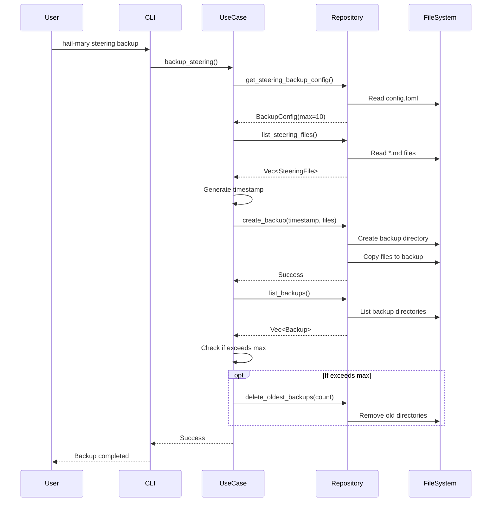

# Design: Steering Backup Command

## Architecture Overview

Clean Architecture の4層構造に従って実装します：

```
┌─────────────────────────────────────────────────────┐
│                    CLI Layer                        │
│            SteeringBackupCommand                    │
└─────────────────────────────────────────────────────┘
                          ↓
┌─────────────────────────────────────────────────────┐
│                Application Layer                    │
│              backup_steering use case               │
└─────────────────────────────────────────────────────┘
                          ↓
┌─────────────────────────────────────────────────────┐
│                  Domain Layer                       │
│         SteeringBackupConfig value object           │
└─────────────────────────────────────────────────────┘
                          ↓
┌─────────────────────────────────────────────────────┐
│              Infrastructure Layer                   │
│         FilesystemProjectRepository                 │
└─────────────────────────────────────────────────────┘
```

## Data Flow



## Implementation Details

### 1. Domain Layer

#### SteeringBackupConfig (domain/entities/steering.rs)

```rust
#[derive(Debug, Clone, PartialEq)]
pub struct SteeringBackupConfig {
    pub max: usize,
}

impl Default for SteeringBackupConfig {
    fn default() -> Self {
        Self { max: 10 }
    }
}
```

#### SteeringConfig Update (domain/entities/steering.rs)

```rust
#[derive(Debug, Clone, PartialEq)]
pub struct SteeringConfig {
    pub types: Vec<SteeringType>,  // 既存の構造を維持
    pub backup: SteeringBackupConfig,  // 新規追加
}

impl SteeringConfig {
    pub fn default_for_new_project() -> Self {
        Self {
            types: vec![/* existing default types */],
            backup: SteeringBackupConfig::default(),
        }
    }
}
```

### 2. Application Layer

#### Use Case: backup_steering (application/use_cases/backup_steering.rs)

```rust
use crate::domain::entities::steering::SteeringBackupConfig;
use crate::application::repositories::ProjectRepository;
use crate::application::errors::ApplicationError;
use chrono::Local;
use std::path::PathBuf;

pub fn backup_steering(
    repository: &impl ProjectRepository,
) -> Result<String, ApplicationError> {
    // 1. Load backup configuration from TOML
    let backup_config = repository.load_steering_backup_config()
        .unwrap_or_else(|_| SteeringBackupConfig::default());
    
    // 2. List current steering files (exclude backup/ and draft/)
    let steering_files = repository.list_steering_files()?;
    
    if steering_files.is_empty() {
        return Err(ApplicationError::NoSteeringFiles);
    }
    
    // 3. Generate timestamp for backup directory
    let timestamp = Local::now().format("%Y-%m-%d-%H-%M").to_string();
    
    // 4. Create backup directory and copy files
    repository.create_steering_backup(&timestamp, &steering_files)?;
    
    // 5. Rotate backups if necessary
    let existing_backups = repository.list_steering_backups()?;
    
    if existing_backups.len() > backup_config.max {
        let to_delete = existing_backups.len() - backup_config.max;
        repository.delete_oldest_steering_backups(to_delete)?;
    }
    
    Ok(format!(
        "Backup created: .kiro/steering/backup/{}\n{} files backed up",
        timestamp,
        steering_files.len()
    ))
}
```

#### Repository Trait Extension (application/repositories/project_repository.rs)

```rust
use std::path::PathBuf;
use std::time::SystemTime;

pub trait ProjectRepository: Send + Sync {
    // ... existing methods ...
    
    // Steering backup operations (同期メソッド)
    fn list_steering_files(&self) -> Result<Vec<PathBuf>, ApplicationError>;
    fn create_steering_backup(
        &self, 
        timestamp: &str, 
        files: &[PathBuf]
    ) -> Result<(), ApplicationError>;
    fn list_steering_backups(&self) -> Result<Vec<BackupInfo>, ApplicationError>;
    fn delete_oldest_steering_backups(
        &self, 
        count: usize
    ) -> Result<(), ApplicationError>;
    fn load_steering_backup_config(&self) -> Result<SteeringBackupConfig, ApplicationError>;
}

#[derive(Debug, Clone)]
pub struct BackupInfo {
    pub name: String,
    pub created_at: SystemTime,
    pub path: PathBuf,
}
```

### 3. CLI Layer

#### Command Implementation (cli/args.rs and cli/commands/steering_backup.rs)

First, update `cli/args.rs`:
```rust
#[derive(Subcommand, Debug)]
pub enum Commands {
    // ... existing commands ...
    
    /// Steering system management
    Steering {
        #[command(subcommand)]
        command: SteeringCommands,
    },
}

#[derive(Subcommand, Debug)]
pub enum SteeringCommands {
    /// Create a backup of current steering files
    Backup,
}
```

Then create `cli/commands/steering_backup.rs`:
```rust
use crate::application::use_cases::backup_steering;
use crate::application::repositories::ProjectRepository;
use std::sync::Arc;

pub struct SteeringBackupCommand;

impl SteeringBackupCommand {
    pub fn execute(repository: Arc<dyn ProjectRepository>) -> Result<(), Box<dyn std::error::Error>> {
        let result = backup_steering(repository.as_ref())?;
        println!("{}", result);
        Ok(())
    }
}
```

### 4. Infrastructure Layer

#### Repository Implementation (infrastructure/repositories/project.rs)

```rust
use std::ffi::OsStr;

// TOML structure for backup configuration
#[derive(Debug, Serialize, Deserialize)]
struct BackupSection {
    #[serde(default = "default_max_backups")]
    max: usize,
}

fn default_max_backups() -> usize {
    10
}

impl ProjectRepository for ProjectRepositoryImpl {
    fn list_steering_files(&self) -> Result<Vec<PathBuf>, ApplicationError> {
        let steering_dir = self.path_manager.steering_dir()?;
        let mut files = Vec::new();
        
        for entry in fs::read_dir(&steering_dir)? {
            let entry = entry?;
            let path = entry.path();
            
            // Only include .md files, exclude directories
            if path.is_file() && path.extension() == Some(OsStr::new("md")) {
                files.push(path);
            }
        }
        
        Ok(files)
    }
    
    fn create_steering_backup(
        &self,
        timestamp: &str,
        files: &[PathBuf]
    ) -> Result<(), ApplicationError> {
        let backup_base = self.path_manager.steering_backup_dir()?;
        let backup_dir = backup_base.join(timestamp);
        
        // Create backup directory
        fs::create_dir_all(&backup_dir)?;
        
        // Copy each file to backup
        for file_path in files {
            if let Some(file_name) = file_path.file_name() {
                let dest = backup_dir.join(file_name);
                fs::copy(file_path, dest)?;
            }
        }
        
        Ok(())
    }
    
    fn list_steering_backups(&self) -> Result<Vec<BackupInfo>, ApplicationError> {
        let backup_dir = self.path_manager.steering_backup_dir()?;
        
        if !backup_dir.exists() {
            return Ok(Vec::new());
        }
        
        let mut backups = Vec::new();
        
        for entry in fs::read_dir(&backup_dir)? {
            let entry = entry?;
            let path = entry.path();
            
            if path.is_dir() {
                let metadata = entry.metadata()?;
                let name = entry.file_name().to_string_lossy().to_string();
                
                backups.push(BackupInfo {
                    name,
                    created_at: metadata.created()?,
                    path,
                });
            }
        }
        
        // Sort by creation time (oldest first)
        backups.sort_by_key(|b| b.created_at);
        
        Ok(backups)
    }
    
    fn delete_oldest_steering_backups(
        &self,
        count: usize
    ) -> Result<(), ApplicationError> {
        let backups = self.list_steering_backups()?;
        
        for backup in backups.iter().take(count) {
            fs::remove_dir_all(&backup.path)?;
        }
        
        Ok(())
    }
    
    fn load_steering_backup_config(&self) -> Result<SteeringBackupConfig, ApplicationError> {
        let config_path = self.path_manager.config_path(true);
        
        if !config_path.exists() {
            return Ok(SteeringBackupConfig::default());
        }
        
        let content = fs::read_to_string(&config_path)?;
        
        // Parse TOML and extract backup section
        let toml_value: toml::Value = toml::from_str(&content)?;
        
        if let Some(steering) = toml_value.get("steering") {
            if let Some(backup) = steering.get("backup") {
                let backup_section: BackupSection = backup.clone().try_into()?;
                return Ok(SteeringBackupConfig {
                    max: backup_section.max,
                });
            }
        }
        
        Ok(SteeringBackupConfig::default())
    }
}
```

#### Path Manager Extension (infrastructure/filesystem/path_manager.rs)

```rust
impl PathManager {
    pub fn steering_backup_dir(&self) -> Result<PathBuf, ApplicationError> {
        let backup_dir = self.steering_dir()?.join("backup");
        Ok(backup_dir)
    }
}
```

### 5. Init Command Updates

#### Initialize Project Use Case Updates (application/use_cases/initialize_project.rs)

```rust
pub fn initialize_project(
    repository: &impl ProjectRepository,
    force: bool,
) -> Result<String, ApplicationError> {
    // ... existing implementation ...
    
    // Ensure steering.backup configuration in config.toml
    repository.ensure_steering_backup_config()?;
    
    // ... rest of implementation ...
}
```

#### Repository Method for Init (infrastructure/repositories/project.rs)

```rust
impl ProjectRepository for ProjectRepositoryImpl {
    fn ensure_steering_backup_config(&self) -> Result<(), ApplicationError> {
        let config_path = self.path_manager.config_path(true);
        
        if !config_path.exists() {
            // Config doesn't exist, it will be created with defaults
            return Ok(());
        }
        
        let content = fs::read_to_string(&config_path)?;
        let mut toml_value: toml::Value = toml::from_str(&content)?;
        
        // Check if [steering.backup] exists
        let needs_update = if let Some(steering) = toml_value.get_mut("steering") {
            if let Some(steering_table) = steering.as_table_mut() {
                if !steering_table.contains_key("backup") {
                    // Add backup section
                    let backup = toml::value::Table::from_iter(vec![
                        ("max".to_string(), toml::Value::Integer(10)),
                    ]);
                    steering_table.insert("backup".to_string(), toml::Value::Table(backup));
                    true
                } else {
                    false
                }
            } else {
                false
            }
        } else {
            false
        };
        
        if needs_update {
            let updated_content = toml::to_string_pretty(&toml_value)?;
            fs::write(&config_path, updated_content)?;
        }
        
        Ok(())
    }
}
```

## Error Handling

### New Error Types (application/errors.rs)

```rust
#[derive(Debug, Error)]
pub enum ApplicationError {
    // ... existing errors ...
    
    #[error("No steering files found to backup")]
    NoSteeringFiles,
    
    #[error("Failed to create backup: {0}")]
    BackupCreationFailed(String),
    
    #[error("Failed to rotate backups: {0}")]
    BackupRotationFailed(String),
}
```

## Testing Strategy

### Unit Tests

1. **Domain Layer Tests**
   - Test `SteeringBackupConfig` serialization/deserialization
   - Test default values

2. **Application Layer Tests**
   - Test `backup_steering` with mock repository
   - Test rotation logic with various backup counts
   - Test error cases (no files, permission errors)

3. **Infrastructure Layer Tests**
   - Test file listing (with exclusion of backup/draft directories)
   - Test backup creation
   - Test backup rotation
   - Test timestamp generation

### Integration Tests (tests/steering_backup_test.rs)

```rust
#[tokio::test]
async fn test_steering_backup_creates_timestamped_directory() {
    let temp_dir = TempDir::new().unwrap();
    let repo = create_test_repository(&temp_dir);
    
    // Setup: Create steering files
    create_test_steering_files(&temp_dir);
    
    // Execute backup
    let result = backup_steering(&repo).await;
    
    // Verify backup directory exists with timestamp format
    assert!(result.is_ok());
    let backup_dir = temp_dir.path().join(".kiro/steering/backup");
    assert!(backup_dir.exists());
    
    let entries: Vec<_> = fs::read_dir(backup_dir).unwrap().collect();
    assert_eq!(entries.len(), 1);
}

#[tokio::test]
async fn test_steering_backup_rotation() {
    let temp_dir = TempDir::new().unwrap();
    let repo = create_test_repository(&temp_dir);
    
    // Setup: Create config with max=2
    let config = ProjectConfig {
        steering: Some(SteeringConfig {
            backup: SteeringBackupConfig { max: 2 },
            ..Default::default()
        }),
        ..Default::default()
    };
    repo.save_project_config(&config).await.unwrap();
    
    // Create 3 backups
    for _ in 0..3 {
        backup_steering(&repo).await.unwrap();
        tokio::time::sleep(Duration::from_millis(100)).await;
    }
    
    // Verify only 2 backups remain
    let backups = repo.list_steering_backups().await.unwrap();
    assert_eq!(backups.len(), 2);
}
```

## Configuration Management

### TOML Structure

```toml
[project]
name = "my-project"
version = "0.1.0"

[steering]
types = ["product", "tech", "structure"]

[steering.backup]
max = 10  # This section is added automatically during init

[[steering.criteria.product]]
name = "Product Overview"
description = "Core value proposition and use cases"
```

## Security Considerations

1. **Path Traversal Prevention**: Validate all paths stay within .kiro directory
2. **File Permissions**: Preserve original file permissions in backups
3. **Atomic Operations**: Use temporary directories and rename for atomicity
4. **Error Recovery**: Ensure partial failures don't corrupt existing data

## Performance Considerations

1. **Async I/O**: Use tokio::fs for non-blocking file operations
2. **Batch Operations**: Copy multiple files in parallel if needed
3. **Lazy Loading**: Only read file contents when necessary
4. **Directory Listing Cache**: Cache backup list during rotation check

## Future Enhancements

1. **Restore Command**: `hail-mary steering restore <timestamp>`
2. **List Command**: `hail-mary steering backups --list`
3. **Diff Command**: `hail-mary steering diff <timestamp>`
4. **Compression**: Optional gzip compression for old backups
5. **Remote Backup**: Support for cloud storage backends