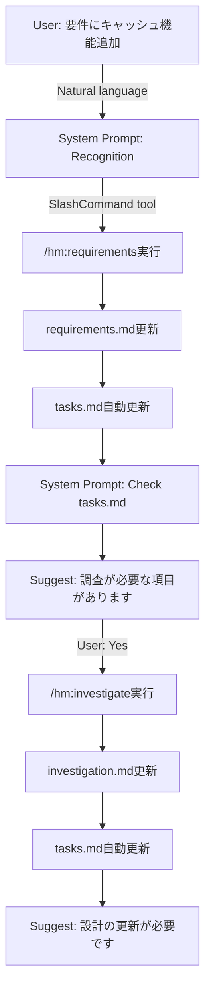

# Design - Slash Command責務分離とTasks中心アーキテクチャ

## Meta
- **Completeness**: 85%
- **Requirements**: Slash commandの責務分離、Orchestration除去、時系列管理の実現
- **Architecture Scope**: Slash Commands + System Prompt + Document Management

## Overview

現在のslash commandは単一コマンドに多くの責務が混在し、Orchestrator的な役割も担っている。`SlashCommand` toolの登場により、自然言語での呼び出しが可能になったことを受け、責務を明確に分離し、新たに`tasks.md`を中心とした時系列管理アーキテクチャを導入する。

### As-Is (現状の課題)
- 各slash commandがdocument生成 + orchestration + navigation を担当
- ドキュメント間の依存関係が不明瞭
- 変更の時系列追跡が困難
- テンプレートへの追加が全体再構築ではなくappendになる

### To-Be (目標アーキテクチャ)
- 各slash commandは単一責任（document操作のみ）
- `tasks.md`で時系列と状態を一元管理
- System promptは軽量な認識とルーティングのみ
- ドキュメントは常に最新の完成形を維持

## Design

### 1. Document責務の明確化

```yaml
requirements.md:
  purpose: WHAT（何を作るか）
  state: 常に最新の完成形
  versioning: なし（tasks.mdで管理）
  content:
    - User Stories
    - Acceptance Criteria
    - Functional Requirements
    - Non-Functional Requirements

investigation.md:
  purpose: RESEARCH（調査結果）
  state: 累積的な知識ベース
  versioning: セクション単位で追加
  content:
    - Research Questions
    - Technical Findings
    - Evidence & Sources
    - Confidence Levels

design.md:
  purpose: HOW（どう作るか）
  state: 常に最新の設計
  versioning: なし（tasks.mdで管理）
  content:
    - Architecture Decisions
    - Implementation Approach
    - File Changes
    - Evidence Links

tasks.md:  # NEW!
  purpose: WHEN & WHY（いつ何をしたか、なぜ更新が必要か）
  state: 時系列ログと状態管理
  versioning: append-only
  content:
    - State Tracking
    - Change Log
    - Pending Actions
    - Implementation Tasks
```

### 2. System Prompt設計（軽量化）

```xml
<!-- フラット構造で素早いアクセスと明確な責務 -->

<kiro-orchestrator-recognition>
  <!-- 自然言語からintentを認識 -->
  - 「要件を」「仕様」「PRD」 → requirements context
  - 「調査」「検証」「リサーチ」 → investigation context
  - 「設計」「アーキテクチャ」 → design context
</kiro-orchestrator-recognition>

<kiro-orchestrator-routing>
  <!-- SlashCommand toolへの委譲 -->
  requirements context → SlashCommand(/hm:requirements)
  investigation context → SlashCommand(/hm:investigate)
  design context → SlashCommand(/hm:design)
  <!-- tasks.mdは各コマンドの副作用として自動更新される -->
</kiro-orchestrator-routing>

<kiro-orchestrator-nudging>
  <!-- tasks.mdを読んで次のアクションを優しく提案 -->
  After any slash command execution:
  1. Check tasks.md for state changes
  2. Identify impacted documents
  3. Gently suggest next logical action (never force)

  Example:
  "要件が更新されました。調査が必要な項目があります：
   - 新しい認証方式の技術選定
   調査してみませんか？ [Y/n]"
</kiro-orchestrator-nudging>
```

### 3. Slash Commands詳細設計

#### 3.1 /hm:requirements（単一責任化）

````markdown
---
name: requirements
description: "Generate or update requirements document"
complexity: simple
allowed-tools: Read, Write, MultiEdit
---

## Single Purpose
Generate/Update requirements.md ONLY

## Behavioral Flow
1. Read existing requirements.md (if exists)
2. Gather requirements interactively
3. Write complete requirements.md (full replacement, not append)
4. Add entry to tasks.md change log:
   ```
   - [x] Requirements updated: [section names]
   ```
5. End (NO "what's next" orchestration)

## Will NOT
- Suggest next commands
- Check dependencies
- Manage workflow
- Ask "what's next?"
````

#### 3.2 /hm:investigate（累積的記録）

````markdown
---
name: investigate
description: "Record investigation findings"
complexity: simple
allowed-tools: Read, Write, MultiEdit, Grep, Glob, WebSearch
---

## Single Purpose
Append findings to investigation.md ONLY

## Behavioral Flow
1. Read existing investigation.md
2. Conduct investigation using tools
3. Append findings to appropriate section:
   ```markdown
   ## [Topic Name]
   **Confidence**: 85%
   **Date**: YYYY-MM-DD

   ### Findings
   [Investigation results]

   ### Evidence
   - Source: [file/URL]
   - Method: [how investigated]
   ```
4. Add entry to tasks.md change log
5. End (NO suggestions)

## Topic Management
- --topic flag for continuing existing investigation
- Auto-generate section names from topic
- Maintain confidence scores
````

#### 3.3 /hm:design（Evidence Linking強化）

````markdown
---
name: design
description: "Generate or update technical design with evidence"
complexity: standard
allowed-tools: Read, Write, MultiEdit, Task
---

## Single Purpose
Generate/Update design.md with evidence links

## Evidence Linking Pattern
```markdown
## Architecture Decision: [Name]
- **Decision**: [What was chosen]
- **Evidence**: investigation.md#section-name
- **Requirements**: requirements.md#user-story-id
- **Trade-offs**:
  - Pros: [benefits]
  - Cons: [drawbacks]
```

## Behavioral Flow
1. Read requirements.md and investigation.md
2. Generate/Update design document (full replacement)
3. Link every decision to evidence
4. Add implementation approach details
5. Add entry to tasks.md change log
6. End (NO orchestration)
````

#### 3.4 tasks.md管理（slash commandではなくsystem promptで自動管理）

**Note**: tasks.mdは専用のslash commandを持たず、他コマンドの副作用として自動更新される

```xml
<kiro-orchestrator-auto-tracking>
  <!-- 各コマンド実行後に自動的にtasks.mdを更新 -->
  After /hm:requirements execution:
    → Append to Timeline: "[x] Requirements updated → requirements.md#section"
    → Update State Tracking: requirements.md status

  After /hm:investigate execution:
    → Append to Timeline: "[x] Investigation: [topic] → investigation.md#section"
    → Update State Tracking: investigation.md confidence level

  After /hm:design execution:
    → Append to Timeline: "[x] Design updated → design.md"
    → Extract and add implementation tasks from design
    → Update State Tracking: design.md status
</kiro-orchestrator-auto-tracking>
```

### Tasks.md テンプレート

```markdown
# Tasks - [Project Name]

## State Tracking

| Document | Status | Notes |
|----------|--------|-------|
| requirements.md | complete | auth features added |
| investigation.md | in-progress | 85% confidence |
| design.md | outdated | needs sync with requirements |

## Timeline

- [x] Initial requirements defined → requirements.md created
- [x] Technology stack researched → investigation.md#tech-stack
- [x] Basic architecture designed → design.md created
- [x] Authentication requirements added → requirements.md#security
- [x] JWT vs Session investigation → investigation.md#auth-research
- [ ] Complete performance benchmarks
- [ ] Update design based on JWT investigation findings
- [ ] Setup authentication middleware
  - source: design.md#auth-middleware
  - requirements: requirements.md#security-requirements
- [ ] Implement user registration
  - source: design.md#user-registration
  - requirements: requirements.md#user-stories
- [ ] Add caching layer
  - source: design.md#cache-strategy
  - investigation: investigation.md#redis-evaluation
- [ ] Configure session management
  - source: design.md#session-config
  - investigation: investigation.md#jwt-analysis
- [ ] Implement token validation
  - source: design.md#token-validation
  - requirements: requirements.md#auth-requirements
- [ ] Review design decisions against investigation findings
```

### 4. Evidence Linking実装

#### 4.1 Design.mdでのEvidence参照

```markdown
## Architecture Decision: Authentication Method

### Decision
JWT with Redis session store

### Evidence & Rationale
- **Investigation**: investigation.md#jwt-vs-session-analysis
  - JWT provides stateless scalability (confidence: 90%)
  - Redis enables token revocation (confidence: 85%)
- **Requirements**: requirements.md#security-requirements
  - Must support 10K concurrent users
  - Session timeout required

### Trade-offs
| Aspect | JWT + Redis | Pure Session | Pure JWT |
|--------|-------------|--------------|----------|
| Scalability | High | Medium | High |
| Revocation | Yes | Yes | No |
| Complexity | Medium | Low | Low |
| Source | investigation.md#comparison-table | - | - |
```

#### 4.2 自動リンク生成ルール

```yaml
When creating design.md:
  For each technical decision:
    1. Find related investigation sections
    2. Find related requirements
    3. Generate evidence links automatically
    4. Flag decisions without evidence as "NEEDS INVESTIGATION"
```

### 5. ワークフロー例

#### 5.1 要件追加フロー



#### 5.2 State Tracking自動化

```yaml
On any document update:
  1. Detect change type
  2. Update tasks.md state tracking
  3. Add to change log with timestamp
  4. Identify impacted documents
  5. Add pending actions if needed

Example:
  requirements.md changed →
    - Mark design.md as "outdated"
    - Add pending: "Sync design with new requirements"
    - Log: "[x] Requirements updated: cache feature"
```

### 6. 実装計画

#### 実装ファイル一覧

```
.claude/commands/hm/requirements.md  # orchestration除去 + tasks.md自動更新追加
.claude/commands/hm/investigate.md   # suggestions除去 + tasks.md自動更新追加
.claude/commands/hm/design.md        # what's next除去 + tasks.md自動更新追加
.kiro/system-prompt.md               # 新規作成（軽量orchestrator + auto-tracking）
```

#### 実装順序

1. 既存コマンドからorchestration機能を削除
   - requirements.md修正（orchestration削除 + tasks.md更新処理追加）
   - investigate.md修正（suggestions削除 + tasks.md更新処理追加）
   - design.md修正（what's next削除 + tasks.md更新処理追加）

2. system-prompt.md作成
   - recognition層実装
   - routing層実装（/hm:tasksなし）
   - auto-tracking層実装（tasks.md自動管理）
   - nudging層実装

3. tasks.mdテンプレート定義
   - 初回作成時のテンプレート構造
   - 自動更新される内容の定義

4. Evidence Linking機能追加
   - design.md内でのリンク生成
   - リンク検証機能

## Benefits

### 1. Clear Separation of Concerns
- 各コマンドは単一のドキュメント操作に集中
- Orchestrationはユーザーとの対話で実現
- 依存関係はtasks.mdで可視化

### 2. Time-Series Visibility
- すべての変更が時系列で追跡可能
- どのドキュメントがいつ更新されたか明確
- 更新の理由（WHY）が記録される

### 3. State Centralization
- 状態管理がtasks.mdに集約
- 各ドキュメントは状態を持たない
- 全体の進捗が一目瞭然

### 4. Natural Workflow
- 強制的なフローではなく提案ベース
- ユーザーの判断を尊重
- 柔軟な作業順序

### 5. Evidence-Based Design
- すべての設計判断に根拠を明示
- Investigation結果との紐付け
- Requirements traceability確保

## Risks & Mitigations

### Risk 1: Tasks.md肥大化
- **Risk**: 長期プロジェクトでtasks.mdが巨大化
- **Mitigation**:
  - 古いエントリーのアーカイブ機能
  - 月単位でのセクション分割

### Risk 2: 手動更新の負担
- **Risk**: tasks.md更新を忘れる可能性
- **Mitigation**:
  - 各slash commandに自動更新ロジック組み込み
  - Git hookでの整合性チェック

### Risk 3: Evidence Link切れ
- **Risk**: Investigationセクション名変更でリンク切れ
- **Mitigation**:
  - セクション名は原則変更しない
  - リンクバリデーション機能追加

## Success Criteria

1. **責務分離**: 各slash commandが単一責任を持つ
2. **時系列管理**: すべての変更がtasks.mdで追跡可能
3. **自然な対話**: 強制ではなく提案ベースのフロー
4. **Evidence**: すべての設計判断に根拠リンクがある
5. **状態可視化**: プロジェクト全体の状態が一目瞭然

## Completeness Scoring Rule
- 0-30%: 基本構造と責務定義
- 30-60%: 各コマンドの詳細設計
- 60-80%: テンプレートとフロー定義
- 80-100%: 実装詳細とエラーハンドリング
- **Current: 85%**（実装可能レベル、エラーハンドリング詳細が未定）