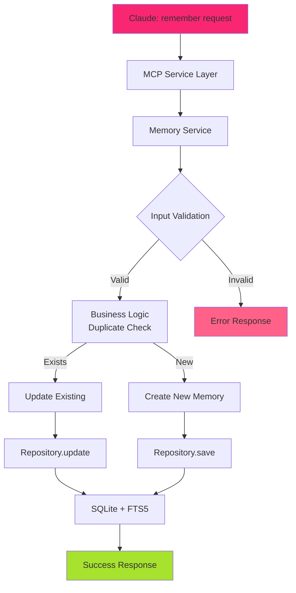
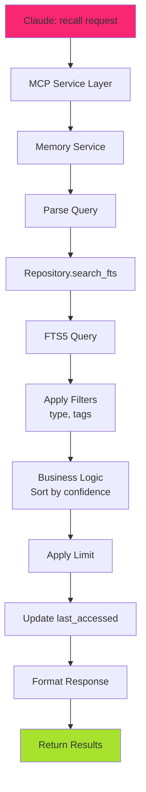
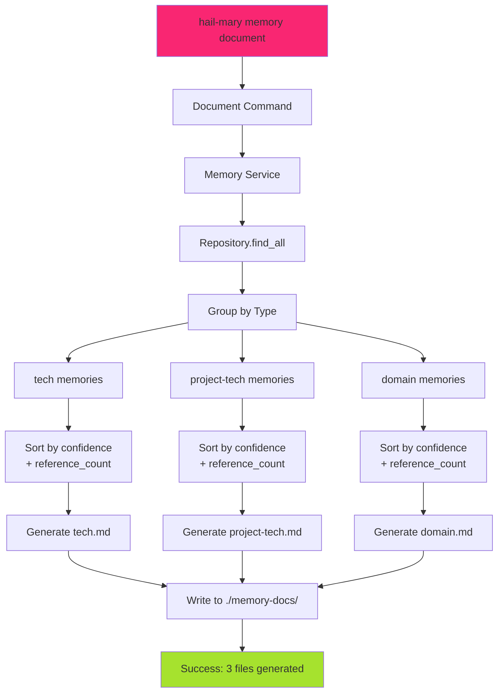
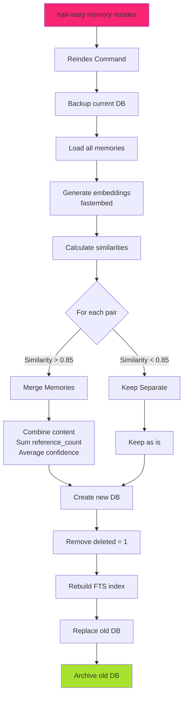

```mermaid
%%{init: {
  'theme': 'dark',
  'themeCSS': '
    .nodeLabel { color: #FD971F !important; }
    .edgeLabel { color: #A6E22E !important; background-color: transparent !important; }
    .cluster rect { fill: #272822 !important; stroke: #F92672 !important; stroke-width: 2px !important; rx: 5px !important; ry: 5px !important; }
    .node rect, .node circle, .node ellipse, .node polygon, .node path { fill: #272822 !important; stroke: #A6E22E !important; stroke-width: 2px !important; }
    .flowchart-link { stroke: #66D9EF !important; stroke-width: 2px !important; }
  '
}}%%
graph TB
    subgraph "Presentation Layer"
        A[Claude Code<br/>MCP Client]
        B[CLI Commands<br/>hail-mary]
        C[Generated Docs<br/>*.md files]
    end
    
    subgraph "Service Layer"
        D[Memory Service<br/>Business Logic]
        E[MCP Service<br/>Protocol Handler]
    end
    
    subgraph "Repository Layer"
        F[Memory Repository<br/>trait]
        G[SQLite Repository<br/>impl]
        H[InMemory Repository<br/>impl for tests]
    end
    
    subgraph "Infrastructure Layer"
        I[(SQLite DB<br/>memory.db)]
        J[FTS5 Index]
        K[Refinery<br/>Migrations]
        L[Archive<br/>old DBs]
    end
    
    A -.->|stdio| E
    B --> D
    B --> C
    
    E --> D
    D --> F
    F --> G
    F --> H
    
    G --> I
    G --> J
    K --> I
    
    I --> L
    
    classDef type1 fill:#272822,stroke:#A6E22E,stroke-width:2px;
    classDef type2 fill:#272822,stroke:#66D9EF,stroke-width:2px;
    classDef type3 fill:#272822,stroke:#F92672,stroke-width:2px;
    classDef highlighted fill:#AE81FF,stroke:#66D9EF,stroke-width:3px,color:#FFF;
    
    class A,B,C type1;
    class D,E type2;
    class F,G,H type3;
    class I,J,K,L highlighted;
```

# Memory MCP v3 設計仕様書

## 1. 概要

### 1.1 コンセプト
Memory MCP v3は、**クリーンアーキテクチャ**と**SOLID原則**に基づいた永続的メモリシステムです。v2の設計を改良し、より高いテスタビリティと保守性を実現します。

### 1.2 設計原則
- **KISS (Keep It Simple, Stupid)**: 最小限の機能から始める
- **YAGNI (You Aren't Gonna Need It)**: 今必要ないものは作らない
- **疎結合**: 各機能が独立して動作可能
- **進化的アーキテクチャ**: 実際の使用に基づいて成長
- **SOLID原則**: 特にDIP（依存性逆転の原則）を重視
- **クリーンアーキテクチャ**: 層間の依存関係を明確化

### 1.3 主要な特徴
- 📝 **シンプルなデータモデル**: 単一テーブル + FTS5
- 🔍 **高速な全文検索**: SQLite FTS5による日本語対応検索
- 📚 **ドキュメント生成**: Markdown形式で記憶を整理
- 🔄 **定期的な最適化**: reindex機能による重複排除と再構築
- 🏷️ **記憶の分類**: tech / project-tech / domain の3カテゴリ
- 🚀 **段階的実装**: 各フェーズで動く価値を提供
- 🏗️ **クリーンアーキテクチャ**: 4層構造による責任の明確な分離
- 💉 **依存性注入**: トレイトによる抽象化とテスタビリティ向上

## 2. アーキテクチャ

### 2.0 技術選定の根拠

#### SQLite + rusqlite の選択理由

**なぜDieselではなくrusqliteなのか？**

1. **FTS5との完全な統合**
   - Memory MCPの中核機能である全文検索にFTS5が必須
   - DieselはFTS5を直接サポートしていない（`sql_query`での回避策が必要）
   - rusqliteはFTS5とシームレスに統合

2. **シンプルな構造に適合**
   - テーブルが1つだけの単純な構造
   - 複雑なリレーションがない
   - ORMのオーバーヘッドが不要

3. **開発速度**
   - Phase 1（2-3日）での迅速な実装が可能
   - 学習曲線が緩やか
   - FTS5統合に追加作業が不要

#### Refinery採用の理由（v3で新規採用）

1. **成熟したマイグレーションツール**
   - rusqlite_migrationより豊富な機能
   - SQLとRustの両方のマイグレーションをサポート
   - より大きなコミュニティとエコシステム

2. **運用上の利点**
   - ロールバック機能
   - バージョン管理の柔軟性
   - CI/CDとの統合が容易

**型安全性の補完策**:
```rust
// SQLクエリを定数化して管理
const INSERT_MEMORY: &str = "INSERT INTO memories ...";
const SEARCH_FTS: &str = "SELECT * FROM memories_fts ...";

// Repository層で型安全なインターフェースを提供
trait MemoryRepository {
    fn save(&mut self, memory: &Memory) -> Result<()>;
    fn search(&self, query: &str) -> Result<Vec<Memory>>;
}
```

### 2.1 全体構成



### 2.2 コンポーネント説明

#### Presentation Layer（プレゼンテーション層）
- **CLI Commands**: ユーザーインターフェース（`hail-mary memory`サブコマンド）
- **MCP Client**: Claude Codeからの接続を受け付ける

#### Service Layer（サービス層）
- **Memory Service**: ビジネスロジックの実装（重複チェック、信頼度計算など）
- **MCP Service**: MCPプロトコルのハンドリング（remember/recallツール）

#### Repository Layer（リポジトリ層）
- **Memory Repository trait**: データアクセスの抽象化
- **SQLite Repository**: 本番用の永続化実装
- **InMemory Repository**: テスト用のインメモリ実装

#### Infrastructure Layer（インフラ層）
- **SQLite DB**: 実際のデータ永続化
- **FTS5 Index**: 高速全文検索
- **Refinery**: マイグレーション管理
- **Archive**: 古いデータベースの保管

## 3. データベース設計

### 3.1 最小限のスキーマ

```sql
-- メインテーブル（これだけ！）
CREATE TABLE memories (
    id TEXT PRIMARY KEY,              -- UUID v4
    type TEXT NOT NULL CHECK(         -- 記憶のカテゴリ
        type IN ('tech', 'project-tech', 'domain')
    ),
    topic TEXT NOT NULL,              -- タイトル/要約（人間が読みやすい）
    tags TEXT,                        -- カンマ区切りのタグ（例: "rust,async,tokio"）
    content TEXT NOT NULL,            -- 本文
    examples TEXT,                    -- JSON配列でコード例などを保存
    reference_count INTEGER DEFAULT 0, -- 参照された回数
    confidence REAL DEFAULT 1.0       -- 信頼度スコア (0.0-1.0)
        CHECK(confidence >= 0 AND confidence <= 1),
    created_at INTEGER DEFAULT (unixepoch()), -- 作成日時
    last_accessed INTEGER,            -- 最終アクセス日時
    source TEXT,                      -- 情報源（オプション）
    deleted INTEGER DEFAULT 0         -- 論理削除フラグ
);

-- FTS5全文検索インデックス
CREATE VIRTUAL TABLE memories_fts USING fts5(
    memory_id UNINDEXED,              -- 検索対象外
    topic,                            -- 検索対象
    tags,                             -- 検索対象
    content,                          -- 検索対象
    tokenize = 'porter unicode61'     -- 日本語対応トークナイザー
);

-- 必要最小限のインデックス
CREATE INDEX idx_memories_type 
    ON memories(type) 
    WHERE deleted = 0;

CREATE INDEX idx_memories_ref_count 
    ON memories(reference_count DESC) 
    WHERE deleted = 0;

CREATE INDEX idx_memories_created 
    ON memories(created_at DESC) 
    WHERE deleted = 0;

-- トリガー: FTS5インデックスの自動更新
CREATE TRIGGER memories_ai AFTER INSERT ON memories
WHEN NEW.deleted = 0
BEGIN
    INSERT INTO memories_fts(memory_id, topic, tags, content)
    VALUES (NEW.id, NEW.topic, NEW.tags, NEW.content);
END;

CREATE TRIGGER memories_au AFTER UPDATE ON memories
WHEN NEW.deleted = 0 AND OLD.deleted = 0
BEGIN
    UPDATE memories_fts 
    SET topic = NEW.topic, tags = NEW.tags, content = NEW.content
    WHERE memory_id = NEW.id;
END;

CREATE TRIGGER memories_ad AFTER DELETE ON memories
BEGIN
    DELETE FROM memories_fts WHERE memory_id = OLD.id;
END;

-- 論理削除時のFTS削除
CREATE TRIGGER memories_soft_delete AFTER UPDATE ON memories
WHEN NEW.deleted = 1 AND OLD.deleted = 0
BEGIN
    DELETE FROM memories_fts WHERE memory_id = NEW.id;
END;
```

### 3.2 マイグレーション構造（Refinery使用）

```
migrations/
├── V1__initial_schema.sql         # 初期スキーマ
├── V2__add_fts5_index.sql        # FTS5インデックス追加
└── V3__add_triggers.sql          # トリガー追加
```

### 3.3 データ型の説明

| フィールド | 型 | 説明 | 例 |
|-----------|-----|------|-----|
| type | TEXT | 記憶の分類 | 'tech', 'project-tech', 'domain' |
| topic | TEXT | 人間が読みやすいタイトル | "Rustの非同期プログラミング" |
| tags | TEXT | 検索用キーワード | "rust,async,tokio,futures" |
| content | TEXT | 詳細な内容 | "Rustでは async/await を使って..." |
| examples | TEXT | JSON配列のコード例 | '["async fn main() {}", "tokio::spawn"]' |

## 4. 機能仕様

### 4.1 MCP Tools

#### 4.1.1 remember
```typescript
interface RememberParams {
  type: 'tech' | 'project-tech' | 'domain';
  topic: string;        // タイトル（必須）
  content: string;      // 本文（必須）
  tags?: string[];      // タグリスト
  examples?: string[];  // コード例など
  source?: string;      // 情報源
}

interface RememberResponse {
  memory_id: string;
  action: 'created' | 'updated';
  similar_count?: number;  // 類似記憶の数（Phase 3で追加）
}
```

#### 4.1.2 recall
```typescript
interface RecallParams {
  query: string;        // 検索クエリ
  type?: 'tech' | 'project-tech' | 'domain';  // フィルタ
  tags?: string[];      // タグフィルタ
  limit?: number;       // 結果数上限（デフォルト: 10）
}

interface RecallResponse {
  memories: Memory[];
  total_count: number;
}

interface Memory {
  id: string;
  type: string;
  topic: string;
  tags: string[];
  content: string;
  examples?: string[];
  reference_count: number;
  confidence: number;
  created_at: number;
}
```

### 4.2 CLIコマンド

#### 4.2.1 MCPサーバー起動
```bash
# Memory MCPサーバーを起動
$ hail-mary memory serve

# バックグラウンドで起動
$ hail-mary memory serve --daemon
```

#### 4.2.2 ドキュメント生成
```bash
# 記憶をMarkdownファイルにエクスポート
$ hail-mary memory document

# 出力:
# - ./memory-docs/tech.md
# - ./memory-docs/project-tech.md
# - ./memory-docs/domain.md

# 特定のタイプのみ
$ hail-mary memory document --type tech

# 出力先を指定
$ hail-mary memory document --output ./docs/
```

#### 4.2.3 Reindex（Phase 3）
```bash
# データベースを最適化・再構築
$ hail-mary memory reindex

# ドライラン（変更内容を確認）
$ hail-mary memory reindex --dry-run

# 詳細ログ付き
$ hail-mary memory reindex --verbose
```

## 5. データフロー

### 5.1 Remember（記憶）フロー



### 5.2 Recall（検索）フロー



### 5.3 Document Generation フロー



### 5.4 Reindex フロー（Phase 3）



## 6. 実装詳細

### 6.1 プロジェクト構造（クリーンアーキテクチャ）

```
hail-mary/
├── src/
│   ├── commands/              # プレゼンテーション層
│   │   └── memory/
│   │       ├── mod.rs        # サブコマンドエントリ
│   │       ├── serve.rs      # MCPサーバー起動
│   │       ├── document.rs   # ドキュメント生成
│   │       └── reindex.rs    # 再構築処理
│   ├── services/              # サービス層（ビジネスロジック）
│   │   ├── memory.rs         # MemoryService実装
│   │   └── memory_mcp.rs     # MCP統合サービス
│   ├── models/                # ドメインモデル層
│   │   ├── memory.rs         # Memory構造体とバリデーション
│   │   └── error.rs          # エラー定義
│   ├── repositories/          # リポジトリ層（データアクセス）
│   │   └── memory.rs         # trait定義とSQLite/InMemory実装
│   └── poc/                   # 実験用コード
├── migrations/                 # Refineryマイグレーション
│   ├── V1__initial_schema.sql
│   ├── V2__add_fts5_index.sql
│   └── V3__add_triggers.sql
├── data/
│   ├── memory.db              # 現在のデータベース
│   └── archive/               # 旧DBのアーカイブ
│       └── memory_20250116.db
└── memory-docs/               # 生成されたドキュメント
    ├── tech.md
    ├── project-tech.md
    └── domain.md
```

### 6.2 依存関係（Cargo.toml）

```toml
[dependencies]
# Phase 1: 基本機能
rmcp = { version = "0.5.0", features = ["server", "macros", "transport-io"] }
rusqlite = { version = "0.31", features = ["bundled", "json"] }
refinery = { version = "0.8", features = ["rusqlite"] }  # v3で変更
tokio = { version = "1", features = ["full"] }
serde = { version = "1", features = ["derive"] }
serde_json = "1"
schemars = "1"  # For structured output schemas
uuid = { version = "1", features = ["v4"] }
anyhow = "1"
thiserror = "1"  # エラー定義
tracing = "0.1"  # ロギング
tracing-subscriber = "0.3"

# Phase 2: ドキュメント生成
pulldown-cmark = "0.9"  # Markdown処理

# Phase 3: Reindex機能（後で追加）
# fastembed = "3"
# sqlite-vec = "0.1"
```

### 6.3 アーキテクチャ実装

#### 6.3.1 Repository層（依存性注入対応）

```rust
// repositories/memory.rs
use anyhow::Result;
use crate::models::memory::Memory;

// トレイトによる抽象化
pub trait MemoryRepository: Send + Sync {
    fn save(&mut self, memory: &Memory) -> Result<()>;
    fn find_by_id(&self, id: &str) -> Result<Option<Memory>>;
    fn find_by_topic(&self, topic: &str) -> Result<Option<Memory>>;
    fn search_fts(&self, query: &str, limit: usize) -> Result<Vec<Memory>>;
    fn update_reference_count(&mut self, id: &str) -> Result<()>;
    fn find_all(&self) -> Result<Vec<Memory>>;
}

// SQLite実装
pub struct SqliteMemoryRepository {
    conn: rusqlite::Connection,
}

impl SqliteMemoryRepository {
    pub fn new(db_path: impl AsRef<Path>) -> Result<Self> {
        let mut conn = rusqlite::Connection::open(db_path)?;
        
        // Refineryでマイグレーション実行
        mod embedded {
            use refinery::embed_migrations;
            embed_migrations!("./migrations");
        }
        embedded::migrations::runner().run(&mut conn)?;
        
        Ok(Self { conn })
    }
    
    // FTS5クエリビルダー
    fn build_fts_query(&self, query: &str) -> String {
        // FTS5のMATCH構文を安全に構築
        format!("SELECT m.* FROM memories m
                 JOIN memories_fts f ON m.id = f.memory_id
                 WHERE f.memories_fts MATCH ?
                 AND m.deleted = 0
                 ORDER BY rank
                 LIMIT ?")
    }
}

impl MemoryRepository for SqliteMemoryRepository {
    fn save(&mut self, memory: &Memory) -> Result<()> {
        const INSERT_MEMORY: &str = r#"
            INSERT INTO memories (id, type, topic, tags, content, examples, 
                                 reference_count, confidence, created_at, 
                                 source, deleted)
            VALUES (?1, ?2, ?3, ?4, ?5, ?6, ?7, ?8, ?9, ?10, ?11)
        "#;
        
        self.conn.execute(
            INSERT_MEMORY,
            rusqlite::params![
                &memory.id,
                &memory.memory_type.to_string(),
                &memory.topic,
                &memory.tags.join(","),
                &memory.content,
                serde_json::to_string(&memory.examples)?,
                memory.reference_count,
                memory.confidence,
                memory.created_at,
                &memory.source,
                memory.deleted as i32,
            ],
        )?;
        Ok(())
    }
    
    fn search_fts(&self, query: &str, limit: usize) -> Result<Vec<Memory>> {
        let sql = self.build_fts_query(query);
        let mut stmt = self.conn.prepare(&sql)?;
        let memory_iter = stmt.query_map(
            rusqlite::params![query, limit],
            |row| Memory::from_row(row)
        )?;
        
        let mut memories = Vec::new();
        for memory in memory_iter {
            memories.push(memory?);
        }
        Ok(memories)
    }
    
    // 他のメソッド実装...
}

// テスト用InMemory実装
#[cfg(test)]
pub struct InMemoryRepository {
    memories: std::collections::HashMap<String, Memory>,
}

#[cfg(test)]
impl InMemoryRepository {
    pub fn new() -> Self {
        Self {
            memories: std::collections::HashMap::new(),
        }
    }
}

#[cfg(test)]
impl MemoryRepository for InMemoryRepository {
    fn save(&mut self, memory: &Memory) -> Result<()> {
        self.memories.insert(memory.id.clone(), memory.clone());
        Ok(())
    }
    
    fn find_by_id(&self, id: &str) -> Result<Option<Memory>> {
        Ok(self.memories.get(id).cloned())
    }
    
    // 他のメソッド実装...
}
```

#### 6.3.2 Service層（ビジネスロジック）

```rust
// services/memory.rs
use anyhow::Result;
use crate::models::memory::{Memory, MemoryType};
use crate::repositories::memory::MemoryRepository;

// ジェネリックによる依存性注入
pub struct MemoryService<R: MemoryRepository> {
    repository: R,
}

impl<R: MemoryRepository> MemoryService<R> {
    pub fn new(repository: R) -> Self {
        Self { repository }
    }
    
    pub async fn remember(
        &mut self,
        memory_type: MemoryType,
        topic: String,
        content: String,
        tags: Vec<String>,
        examples: Vec<String>,
        source: Option<String>,
    ) -> Result<Memory> {
        // ビジネスロジック: 重複チェック
        if let Some(existing) = self.repository.find_by_topic(&topic)? {
            // 既存の記憶を更新
            self.repository.update_reference_count(&existing.id)?;
            return Ok(existing);
        }
        
        // 新規作成
        let memory = Memory::new(memory_type, topic, content)
            .with_tags(tags)
            .with_examples(examples)
            .with_source(source);
            
        self.repository.save(&memory)?;
        Ok(memory)
    }
    
    pub async fn recall(
        &self,
        query: &str,
        limit: usize,
        type_filter: Option<MemoryType>,
        tag_filter: Vec<String>,
    ) -> Result<Vec<Memory>> {
        // FTS5検索実行
        let mut memories = self.repository.search_fts(query, limit)?;
        
        // ビジネスロジック: フィルタリング
        if let Some(memory_type) = type_filter {
            memories.retain(|m| m.memory_type == memory_type);
        }
        
        if !tag_filter.is_empty() {
            memories.retain(|m| {
                tag_filter.iter().any(|tag| m.tags.contains(tag))
            });
        }
        
        // ビジネスロジック: 信頼度でソート
        memories.sort_by(|a, b| {
            b.confidence.partial_cmp(&a.confidence).unwrap()
                .then(b.reference_count.cmp(&a.reference_count))
        });
        
        Ok(memories)
    }
    
    pub async fn generate_documents(&self, output_dir: &Path) -> Result<()> {
        let memories = self.repository.find_all()?;
        
        // タイプ別にグループ化
        let mut by_type: std::collections::HashMap<MemoryType, Vec<Memory>> = 
            std::collections::HashMap::new();
            
        for memory in memories {
            by_type.entry(memory.memory_type.clone())
                   .or_insert_with(Vec::new)
                   .push(memory);
        }
        
        // 各タイプごとにMarkdownファイル生成
        for (memory_type, mut memories) in by_type {
            // 信頼度と参照回数でソート
            memories.sort_by(|a, b| {
                b.confidence.partial_cmp(&a.confidence).unwrap()
                    .then(b.reference_count.cmp(&a.reference_count))
            });
            
            let content = self.format_as_markdown(&memories);
            let filename = format!("{}.md", memory_type.to_string());
            let path = output_dir.join(filename);
            
            std::fs::write(path, content)?;
        }
        
        Ok(())
    }
    
    fn format_as_markdown(&self, memories: &[Memory]) -> String {
        // Markdown生成ロジック
        // ...
    }
}

// ファクトリ関数による依存性注入
pub fn create_memory_service(repo: impl MemoryRepository) -> MemoryService<impl MemoryRepository> {
    MemoryService::new(repo)
}

#[cfg(test)]
mod tests {
    use super::*;
    use crate::repositories::memory::InMemoryRepository;
    
    #[tokio::test]
    async fn test_remember_new_memory() {
        let repo = InMemoryRepository::new();
        let mut service = MemoryService::new(repo);
        
        let memory = service.remember(
            MemoryType::Tech,
            "Test Topic".to_string(),
            "Test Content".to_string(),
            vec!["test".to_string()],
            vec![],
            None,
        ).await.unwrap();
        
        assert_eq!(memory.topic, "Test Topic");
        assert_eq!(memory.reference_count, 0);
    }
}
```

#### 6.3.3 MCP Service層（プロトコル統合）

```rust
// services/memory_mcp.rs
use rmcp::{
    ErrorData as McpError, Json, ServiceExt,
    handler::server::{router::tool::ToolRouter, tool::Parameters},
    tool, tool_handler, tool_router,
    transport::stdio,
    serve_server,
};
use schemars::JsonSchema;
use std::sync::Arc;
use tokio::sync::Mutex;
use crate::services::memory::MemoryService;
use crate::repositories::memory::MemoryRepository;

#[derive(Debug, Serialize, Deserialize, JsonSchema)]
pub struct RememberParams {
    pub r#type: String,
    pub topic: String,
    pub content: String,
    pub tags: Option<Vec<String>>,
    pub examples: Option<Vec<String>>,
    pub source: Option<String>,
}

#[derive(Debug, Serialize, Deserialize, JsonSchema)]
pub struct RememberResponse {
    pub memory_id: String,
    pub action: String,
}

#[derive(Debug, Serialize, Deserialize, JsonSchema)]
pub struct RecallParams {
    pub query: String,
    pub r#type: Option<String>,
    pub tags: Option<Vec<String>>,
    pub limit: Option<u32>,
}

#[derive(Debug, Serialize, Deserialize, JsonSchema)]
pub struct RecallResponse {
    pub memories: Vec<MemoryDto>,
    pub total_count: usize,
}

#[derive(Clone)]
pub struct MemoryMcpServer<R: MemoryRepository> {
    service: Arc<Mutex<MemoryService<R>>>,
    tool_router: ToolRouter<Self>,
}

#[tool_handler(router = self.tool_router)]
impl<R: MemoryRepository + 'static> rmcp::ServerHandler for MemoryMcpServer<R> {}

#[tool_router(router = tool_router)]
impl<R: MemoryRepository + 'static> MemoryMcpServer<R> {
    pub fn new(service: MemoryService<R>) -> Self {
        Self {
            service: Arc::new(Mutex::new(service)),
            tool_router: Self::tool_router(),
        }
    }
    
    #[tool(name = "remember", description = "Store a memory for future recall")]
    pub async fn remember(
        &self,
        params: Parameters<RememberParams>,
    ) -> Result<Json<RememberResponse>, McpError> {
        let mut service = self.service.lock().await;
        
        let memory_type = params.0.r#type.parse()
            .map_err(|e| McpError {
                code: -32602,
                message: format!("Invalid type: {}", e),
                data: None,
            })?;
            
        let memory = service.remember(
            memory_type,
            params.0.topic,
            params.0.content,
            params.0.tags.unwrap_or_default(),
            params.0.examples.unwrap_or_default(),
            params.0.source,
        ).await
        .map_err(|e| McpError {
            code: -32603,
            message: e.to_string(),
            data: None,
        })?;
        
        Ok(Json(RememberResponse {
            memory_id: memory.id,
            action: "created".to_string(),
        }))
    }
    
    #[tool(name = "recall", description = "Search and retrieve stored memories")]
    pub async fn recall(
        &self,
        params: Parameters<RecallParams>,
    ) -> Result<Json<RecallResponse>, McpError> {
        let service = self.service.lock().await;
        
        let type_filter = params.0.r#type
            .map(|t| t.parse())
            .transpose()
            .map_err(|e| McpError {
                code: -32602,
                message: format!("Invalid type: {}", e),
                data: None,
            })?;
            
        let memories = service.recall(
            &params.0.query,
            params.0.limit.unwrap_or(10) as usize,
            type_filter,
            params.0.tags.unwrap_or_default(),
        ).await
        .map_err(|e| McpError {
            code: -32603,
            message: e.to_string(),
            data: None,
        })?;
        
        let total_count = memories.len();
        let memories_dto = memories.into_iter()
            .map(|m| m.into())
            .collect();
        
        Ok(Json(RecallResponse {
            memories: memories_dto,
            total_count,
        }))
    }
}
```

#### 6.3.4 Commands層（プレゼンテーション）

```rust
// commands/memory/serve.rs
use anyhow::Result;
use crate::services::memory::MemoryService;
use crate::services::memory_mcp::MemoryMcpServer;
use crate::repositories::memory::SqliteMemoryRepository;
use rmcp::{serve_server, transport::stdio};

pub async fn execute(daemon: bool) -> Result<()> {
    // 依存性注入でサービスを構築
    let repository = SqliteMemoryRepository::new("data/memory.db")?;
    let service = MemoryService::new(repository);
    let mcp_server = MemoryMcpServer::new(service);
    
    if daemon {
        // バックグラウンドで起動
        tokio::spawn(async move {
            serve_server(mcp_server, stdio()).await
        });
        println!("Memory MCP server started in background");
    } else {
        // フォアグラウンドで起動
        println!("Starting Memory MCP server...");
        serve_server(mcp_server, stdio()).await?;
    }
    
    Ok(())
}
```

### 6.4 データモデル

```rust
// models/memory.rs
use serde::{Deserialize, Serialize};
use uuid::Uuid;

#[derive(Debug, Clone, Serialize, Deserialize, PartialEq)]
pub enum MemoryType {
    Tech,         // プロジェクトに依存しない技術
    ProjectTech,  // プロジェクト固有の技術
    Domain,       // ドメイン知識
}

impl std::fmt::Display for MemoryType {
    fn fmt(&self, f: &mut std::fmt::Formatter<'_>) -> std::fmt::Result {
        match self {
            MemoryType::Tech => write!(f, "tech"),
            MemoryType::ProjectTech => write!(f, "project-tech"),
            MemoryType::Domain => write!(f, "domain"),
        }
    }
}

impl std::str::FromStr for MemoryType {
    type Err = String;
    
    fn from_str(s: &str) -> Result<Self, Self::Err> {
        match s {
            "tech" => Ok(MemoryType::Tech),
            "project-tech" => Ok(MemoryType::ProjectTech),
            "domain" => Ok(MemoryType::Domain),
            _ => Err(format!("Invalid memory type: {}", s)),
        }
    }
}

#[derive(Debug, Clone, Serialize, Deserialize)]
pub struct Memory {
    pub id: String,
    pub memory_type: MemoryType,
    pub topic: String,
    pub tags: Vec<String>,
    pub content: String,
    pub examples: Vec<String>,
    pub reference_count: u32,
    pub confidence: f32,
    pub created_at: i64,
    pub last_accessed: Option<i64>,
    pub source: Option<String>,
    pub deleted: bool,
}

impl Memory {
    pub fn new(
        memory_type: MemoryType,
        topic: String,
        content: String,
    ) -> Self {
        Self {
            id: Uuid::new_v4().to_string(),
            memory_type,
            topic,
            tags: Vec::new(),
            content,
            examples: Vec::new(),
            reference_count: 0,
            confidence: 1.0,
            created_at: chrono::Utc::now().timestamp(),
            last_accessed: None,
            source: None,
            deleted: false,
        }
    }
    
    // ビルダーパターン
    pub fn with_tags(mut self, tags: Vec<String>) -> Self {
        self.tags = tags;
        self
    }
    
    pub fn with_examples(mut self, examples: Vec<String>) -> Self {
        self.examples = examples;
        self
    }
    
    pub fn with_source(mut self, source: Option<String>) -> Self {
        self.source = source;
        self
    }
    
    // SQLiteからの変換
    pub fn from_row(row: &rusqlite::Row) -> rusqlite::Result<Self> {
        let type_str: String = row.get("type")?;
        let tags_str: String = row.get("tags")?;
        let examples_str: String = row.get("examples")?;
        
        Ok(Self {
            id: row.get("id")?,
            memory_type: type_str.parse().unwrap(),
            topic: row.get("topic")?,
            tags: if tags_str.is_empty() {
                Vec::new()
            } else {
                tags_str.split(',').map(|s| s.to_string()).collect()
            },
            content: row.get("content")?,
            examples: serde_json::from_str(&examples_str).unwrap_or_default(),
            reference_count: row.get("reference_count")?,
            confidence: row.get("confidence")?,
            created_at: row.get("created_at")?,
            last_accessed: row.get("last_accessed")?,
            source: row.get("source")?,
            deleted: row.get::<_, i32>("deleted")? != 0,
        })
    }
}
```

### 6.5 エラーハンドリング

```rust
// models/error.rs
use thiserror::Error;

#[derive(Debug, Error)]
pub enum MemoryError {
    #[error("Database error: {0}")]
    Database(#[from] rusqlite::Error),
    
    #[error("Migration error: {0}")]
    Migration(#[from] refinery::Error),
    
    #[error("Serialization error: {0}")]
    Serialization(#[from] serde_json::Error),
    
    #[error("IO error: {0}")]
    Io(#[from] std::io::Error),
    
    #[error("MCP protocol error: {0}")]
    Mcp(String),
    
    // ドメインエラー
    #[error("Memory not found: {0}")]
    NotFound(String),
    
    #[error("Duplicate memory: {0}")]
    Duplicate(String),
    
    #[error("Invalid input: {0}")]
    InvalidInput(String),
    
    #[error("Invalid memory type: {0}")]
    InvalidType(String),
}

// Result型のエイリアス
pub type Result<T> = std::result::Result<T, MemoryError>;
```

## 7. 生成されるドキュメントフォーマット

### 7.1 tech.md の例

```markdown
# Technical Knowledge

## Rustの非同期プログラミング
*Tags: rust, async, tokio*
*References: 15, Confidence: 0.95*

Rustでは `async`/`await` 構文を使用して非同期プログラミングを行います。
`tokio` ランタイムが最も一般的に使用されています。

### Examples:
\```rust
#[tokio::main]
async fn main() {
    let result = fetch_data().await;
}
\```

---

## React Hooksのベストプラクティス
*Tags: react, hooks, frontend*
*References: 8, Confidence: 0.88*

（以下続く）
```

### 7.2 project-tech.md の例

```markdown
# Project Technical Standards

## エラーハンドリング規約
*Tags: error-handling, rust, project-standard*
*References: 12, Confidence: 0.92*

このプロジェクトでは、すべてのエラーは `anyhow::Result` を使用して処理します。
カスタムエラー型は `thiserror` を使用して定義します。

### Examples:
\```rust
use anyhow::Result;

pub fn process_data() -> Result<()> {
    // 実装
}
\```

---

（以下続く）
```

## 8. 実装計画

### 8.0 Phase 0: アーキテクチャ基盤（1日）

**目標**: クリーンアーキテクチャの基盤構築

- [ ] ディレクトリ構造の作成
- [ ] 基本的なトレイト定義（MemoryRepository）
- [ ] エラー型定義（thiserror使用）
- [ ] データモデル定義（Memory, MemoryType）
- [ ] Cargo.toml設定

**成果物**: コンパイル可能な基本構造

### 8.1 Phase 1: 基本機能（2日）

**目標**: 最小限のMCPサーバーを動かす

- [ ] Refineryマイグレーション設定
- [ ] SQLiteデータベースの初期化
- [ ] memoriesテーブルとFTS5インデックスの作成
- [ ] SqliteMemoryRepository実装
- [ ] InMemoryRepository実装（テスト用）
- [ ] MemoryService実装
- [ ] MemoryMcpServer実装
- [ ] rememberツールの実装
- [ ] recallツールの実装（FTS5検索）
- [ ] 単体テスト作成

**成果物**: `hail-mary memory serve` で起動し、Claudeから記憶の保存と検索が可能

### 8.2 Phase 2: ドキュメント生成（1日）

**目標**: 記憶をMarkdownで参照可能にする

- [ ] `hail-mary memory document` コマンドの実装
- [ ] Markdown生成ロジック
- [ ] タイプ別のファイル分割
- [ ] フォーマッティングとソート
- [ ] Claude Codeから `@tech.md` で参照可能に

**成果物**: 生成されたMarkdownファイルを直接参照可能

### 8.3 Phase 3: Reindex機能（2日）

**目標**: 定期的な最適化と重複排除

- [ ] `hail-mary memory reindex` コマンドの実装
- [ ] fastembed統合
- [ ] sqlite-vec統合
- [ ] 類似度計算とマージロジック
- [ ] データベースのバックアップとアーカイブ
- [ ] 論理削除の物理削除

**成果物**: データベースの自動最適化機能

## 9. パフォーマンス目標

### 9.1 レスポンスタイム

| 操作 | 目標時間 | 備考 |
|------|---------|---------|
| remember | < 50ms | 単純なINSERT/UPDATE |
| recall (FTS) | < 100ms | 1000件での検索 |
| document生成 | < 1s | 1000件での生成 |
| reindex | < 30s | 1000件での再構築 |

### 9.2 スケーラビリティ

- 10,000件の記憶まで問題なく動作
- データベースサイズ: < 100MB（10,000件時）
- メモリ使用量: < 50MB（通常運用時）

## 10. セキュリティとプライバシー

### 10.1 基本方針

- **完全ローカル処理**: 外部APIを一切使用しない
- **データ保護**: SQLiteファイルへの適切なアクセス権限
- **センシティブ情報**: 自動検出と警告（Phase 4で検討）

### 10.2 データ管理

- データベースファイルは `~/.local/share/hail-mary/` に保存
- アーカイブは自動的に圧縮（Phase 4で検討）
- エクスポート時のフィルタリング機能

## 11. テスト戦略

### 11.1 単体テスト

```rust
#[cfg(test)]
mod tests {
    use super::*;
    use crate::repositories::memory::InMemoryRepository;
    
    #[test]
    fn test_memory_creation() {
        let memory = Memory::new(
            MemoryType::Tech,
            "Test Topic".to_string(),
            "Test Content".to_string(),
        );
        assert!(!memory.id.is_empty());
        assert_eq!(memory.reference_count, 0);
        assert_eq!(memory.confidence, 1.0);
    }
    
    #[tokio::test]
    async fn test_service_remember() {
        let repo = InMemoryRepository::new();
        let mut service = MemoryService::new(repo);
        
        let memory = service.remember(
            MemoryType::Tech,
            "Test".to_string(),
            "Content".to_string(),
            vec![],
            vec![],
            None,
        ).await.unwrap();
        
        assert_eq!(memory.topic, "Test");
    }
    
    #[tokio::test]
    async fn test_service_recall() {
        let repo = InMemoryRepository::new();
        let service = MemoryService::new(repo);
        
        let results = service.recall("test", 10, None, vec![])
            .await.unwrap();
        
        assert!(results.is_empty());
    }
}
```

### 11.2 統合テスト

- MCPプロトコル準拠テスト
- エンドツーエンドシナリオ
- ドキュメント生成の確認
- マイグレーションテスト

## 12. 将来の拡張可能性

### 12.1 Phase 4以降の機能候補

- **関係性グラフ**: memories間の関連を管理
- **自動タグ生成**: contentから自動的にタグを抽出
- **インポート/エクスポート**: JSON/CSV形式での入出力
- **Web UI**: ブラウザから記憶を管理
- **同期機能**: 複数デバイス間での同期（暗号化付き）

### 12.2 拡張ポイント

- MemoryTypeの追加（例: personal, team）
- 検索アルゴリズムの改善
- より高度な重複検出
- マルチユーザー対応

## 13. v2からv3への主な変更点

### 13.1 アーキテクチャ改善

| 項目 | v2 | v3 | 改善点 |
|------|-----|-----|--------|
| **層構造** | 3層（混在） | 4層（明確） | 責任の明確な分離 |
| **依存性管理** | 直接依存 | トレイトによる抽象化 | テスタビリティ向上 |
| **テスト** | 統合テストのみ | 単体テスト + 統合テスト | 高速なフィードバック |
| **マイグレーション** | rusqlite_migration | Refinery | より柔軟な管理 |

### 13.2 コード品質向上

- **SOLID原則の適用**: 特にDIP（依存性逆転の原則）
- **エラーハンドリング**: thiserrorによる構造化
- **ビルダーパターン**: Memoryの柔軟な構築
- **ファクトリ関数**: サービスの依存性注入

### 13.3 保守性向上

- **明確な層分離**: 各層の責任が明確
- **テスト容易性**: InMemoryRepositoryによる高速テスト
- **拡張容易性**: 新しいRepositoryの追加が容易

## 14. まとめ

Memory MCP v3は、**クリーンアーキテクチャ**と**SOLID原則**を適用することで、v2の設計を大幅に改善しました。

### 主な利点

1. **高いテスタビリティ**: 依存性注入により単体テストが容易
2. **明確な責任分離**: 4層構造による役割の明確化
3. **拡張容易性**: トレイトによる抽象化で新機能追加が容易
4. **保守性向上**: エラーハンドリングとコード構造の改善
5. **実用的**: 段階的実装で早期に価値を提供

### 成功の鍵

- **クリーンアーキテクチャ**: 層間の依存関係を明確化
- **依存性注入**: テスタビリティと柔軟性の向上
- **段階的実装**: 各フェーズで動くものを提供
- **シンプルさの維持**: 必要な複雑性のみを導入

この設計により、保守性が高く、拡張可能で、テストしやすいメモリシステムを実現します。