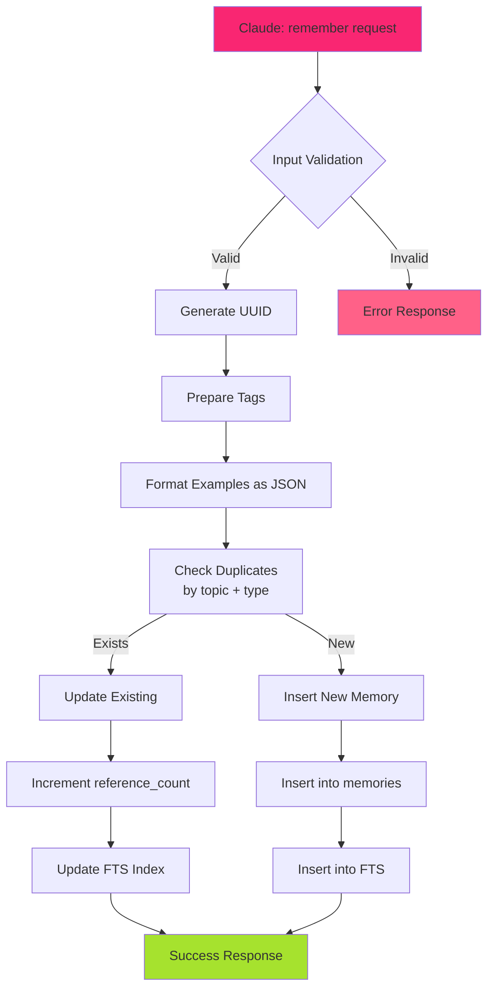
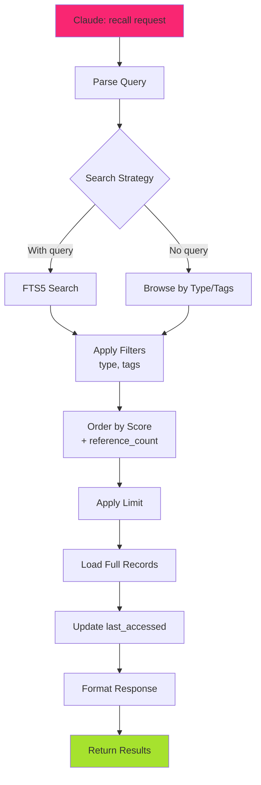
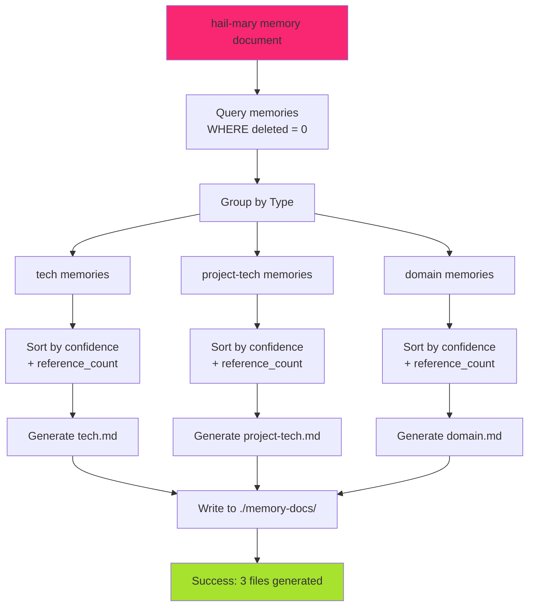
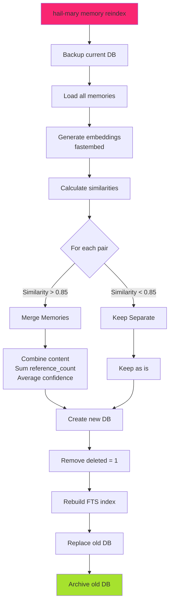

# Memory MCP v2 設計仕様書

## 1. 概要

### 1.1 コンセプト
Memory MCP v2は、**シンプルさと実用性**を最優先した永続的メモリシステムです。過度な複雑性を避け、段階的に価値を提供できる設計を採用しています。

### 1.2 設計原則
- **KISS (Keep It Simple, Stupid)**: 最小限の機能から始める
- **YAGNI (You Aren't Gonna Need It)**: 今必要ないものは作らない
- **疎結合**: 各機能が独立して動作可能
- **進化的アーキテクチャ**: 実際の使用に基づいて成長

### 1.3 主要な特徴
- 📝 **シンプルなデータモデル**: 単一テーブル + FTS5
- 🔍 **高速な全文検索**: SQLite FTS5による日本語対応検索
- 📚 **ドキュメント生成**: Markdown形式で記憶を整理
- 🔄 **定期的な最適化**: reindex機能による重複排除と再構築
- 🏷️ **記憶の分類**: tech / project-tech / domain の3カテゴリ
- 🚀 **段階的実装**: 各フェーズで動く価値を提供

## 2. アーキテクチャ

### 2.1 全体構成

```mermaid
%%{init: {
  'theme': 'dark',
  'themeCSS': '
    .nodeLabel { color: #FD971F !important; }
    .edgeLabel { color: #A6E22E !important; background-color: transparent !important; }
    .cluster rect { fill: #272822 !important; stroke: #F92672 !important; stroke-width: 2px !important; rx: 5px !important; ry: 5px !important; }
    .node rect, .node circle, .node ellipse, .node polygon, .node path { fill: #272822 !important; stroke: #A6E22E !important; stroke-width: 2px !important; }
    .flowchart-link { stroke: #66D9EF !important; stroke-width: 2px !important; }
  '
}}%%
graph TB
    subgraph "User Interface"
        A[Claude Code<br/>MCP Client]
        B[CLI<br/>hail-mary]
        C[Generated Docs<br/>*.md files]
    end
    
    subgraph "Application Layer"
        D[MCP Server<br/>remember/recall]
        E[Document Generator<br/>markdown export]
        F[Reindexer<br/>optimization]
    end
    
    subgraph "Data Layer"
        G[(SQLite DB<br/>memory.db)]
        H[FTS5 Index]
        I[Archive<br/>old DBs]
    end
    
    A -.->|stdio| D
    B --> D
    B --> E
    B --> F
    
    D --> G
    E --> G
    F --> G
    
    G --> H
    F --> I
    E --> C
    
    A -.->|@tech.md| C
    
    classDef type1 fill:#272822,stroke:#A6E22E,stroke-width:2px;
    classDef type2 fill:#272822,stroke:#66D9EF,stroke-width:2px;
    classDef type3 fill:#272822,stroke:#F92672,stroke-width:2px;
    classDef highlighted fill:#AE81FF,stroke:#66D9EF,stroke-width:3px,color:#FFF;
    
    class A,B,C type1;
    class D,E,F type2;
    class G,H,I highlighted;
```

### 2.2 コンポーネント説明

#### Application Layer
- **MCP Server**: remember/recallツールを提供するMCPサーバー
- **Document Generator**: 記憶をMarkdown形式でエクスポート
- **Reindexer**: 定期的な最適化と重複排除（Phase 3で実装）

#### Data Layer
- **SQLite DB**: すべての記憶を保存する単一データベース
- **FTS5 Index**: 高速全文検索インデックス
- **Archive**: reindex時の旧データベース保存

## 3. データベース設計

### 3.1 最小限のスキーマ

```sql
-- メインテーブル（これだけ！）
CREATE TABLE memories (
    id TEXT PRIMARY KEY,              -- UUID v4
    type TEXT NOT NULL CHECK(         -- 記憶のカテゴリ
        type IN ('tech', 'project-tech', 'domain')
    ),
    topic TEXT NOT NULL,              -- タイトル/要約（人間が読みやすい）
    tags TEXT,                        -- カンマ区切りのタグ（例: "rust,async,tokio"）
    content TEXT NOT NULL,            -- 本文
    examples TEXT,                    -- JSON配列でコード例などを保存
    reference_count INTEGER DEFAULT 0, -- 参照された回数
    confidence REAL DEFAULT 1.0       -- 信頼度スコア (0.0-1.0)
        CHECK(confidence >= 0 AND confidence <= 1),
    created_at INTEGER DEFAULT (unixepoch()), -- 作成日時
    last_accessed INTEGER,            -- 最終アクセス日時
    source TEXT,                      -- 情報源（オプション）
    deleted INTEGER DEFAULT 0         -- 論理削除フラグ
);

-- FTS5全文検索インデックス
CREATE VIRTUAL TABLE memories_fts USING fts5(
    memory_id UNINDEXED,              -- 検索対象外
    topic,                            -- 検索対象
    tags,                             -- 検索対象
    content,                          -- 検索対象
    tokenize = 'porter unicode61'     -- 日本語対応トークナイザー
);

-- 必要最小限のインデックス
CREATE INDEX idx_memories_type 
    ON memories(type) 
    WHERE deleted = 0;

CREATE INDEX idx_memories_ref_count 
    ON memories(reference_count DESC) 
    WHERE deleted = 0;

CREATE INDEX idx_memories_created 
    ON memories(created_at DESC) 
    WHERE deleted = 0;

-- トリガー: FTS5インデックスの自動更新
CREATE TRIGGER memories_ai AFTER INSERT ON memories
WHEN NEW.deleted = 0
BEGIN
    INSERT INTO memories_fts(memory_id, topic, tags, content)
    VALUES (NEW.id, NEW.topic, NEW.tags, NEW.content);
END;

CREATE TRIGGER memories_au AFTER UPDATE ON memories
WHEN NEW.deleted = 0 AND OLD.deleted = 0
BEGIN
    UPDATE memories_fts 
    SET topic = NEW.topic, tags = NEW.tags, content = NEW.content
    WHERE memory_id = NEW.id;
END;

CREATE TRIGGER memories_ad AFTER DELETE ON memories
BEGIN
    DELETE FROM memories_fts WHERE memory_id = OLD.id;
END;

-- 論理削除時のFTS削除
CREATE TRIGGER memories_soft_delete AFTER UPDATE ON memories
WHEN NEW.deleted = 1 AND OLD.deleted = 0
BEGIN
    DELETE FROM memories_fts WHERE memory_id = NEW.id;
END;
```

### 3.2 データ型の説明

| フィールド | 型 | 説明 | 例 |
|-----------|-----|------|-----|
| type | TEXT | 記憶の分類 | 'tech', 'project-tech', 'domain' |
| topic | TEXT | 人間が読みやすいタイトル | "Rustの非同期プログラミング" |
| tags | TEXT | 検索用キーワード | "rust,async,tokio,futures" |
| content | TEXT | 詳細な内容 | "Rustでは async/await を使って..." |
| examples | TEXT | JSON配列のコード例 | '["async fn main() {}", "tokio::spawn"]' |

## 4. 機能仕様

### 4.1 MCP Tools

#### 4.1.1 remember
```typescript
interface RememberParams {
  type: 'tech' | 'project-tech' | 'domain';
  topic: string;        // タイトル（必須）
  content: string;      // 本文（必須）
  tags?: string[];      // タグリスト
  examples?: string[];  // コード例など
  source?: string;      // 情報源
}

interface RememberResponse {
  memory_id: string;
  action: 'created' | 'updated';
  similar_count?: number;  // 類似記憶の数（Phase 3で追加）
}
```

#### 4.1.2 recall
```typescript
interface RecallParams {
  query: string;        // 検索クエリ
  type?: 'tech' | 'project-tech' | 'domain';  // フィルタ
  tags?: string[];      // タグフィルタ
  limit?: number;       // 結果数上限（デフォルト: 10）
}

interface RecallResponse {
  memories: Memory[];
  total_count: number;
}

interface Memory {
  id: string;
  type: string;
  topic: string;
  tags: string[];
  content: string;
  examples?: string[];
  reference_count: number;
  confidence: number;
  created_at: number;
}
```

### 4.2 CLIコマンド

#### 4.2.1 MCPサーバー起動
```bash
# Memory MCPサーバーを起動
$ hail-mary mcp

# バックグラウンドで起動
$ hail-mary mcp --daemon
```

#### 4.2.2 ドキュメント生成
```bash
# 記憶をMarkdownファイルにエクスポート
$ hail-mary memory document

# 出力:
# - ./memory-docs/tech.md
# - ./memory-docs/project-tech.md
# - ./memory-docs/domain.md

# 特定のタイプのみ
$ hail-mary memory document --type tech

# 出力先を指定
$ hail-mary memory document --output ./docs/
```

#### 4.2.3 Reindex（Phase 3）
```bash
# データベースを最適化・再構築
$ hail-mary memory reindex

# ドライラン（変更内容を確認）
$ hail-mary memory reindex --dry-run

# 詳細ログ付き
$ hail-mary memory reindex --verbose
```

## 5. データフロー

### 5.1 Remember（記憶）フロー



### 5.2 Recall（検索）フロー



### 5.3 Document Generation フロー



### 5.4 Reindex フロー（Phase 3）



## 6. 実装詳細

### 6.1 プロジェクト構造

```
hail-mary/
├── src/
│   ├── commands/
│   │   ├── mcp.rs           # MCPコマンド
│   │   └── memory/
│   │       ├── mod.rs       # memoryサブコマンド
│   │       ├── document.rs  # ドキュメント生成
│   │       └── reindex.rs   # 再構築処理
│   ├── mcp/
│   │   ├── mod.rs
│   │   ├── server.rs        # MCPサーバー実装
│   │   └── handlers/
│   │       ├── remember.rs
│   │       └── recall.rs
│   └── memory/
│       ├── mod.rs
│       ├── db.rs            # データベース処理
│       ├── models.rs        # データモデル
│       └── search.rs        # 検索ロジック
├── data/
│   ├── memory.db            # 現在のデータベース
│   └── archive/             # 旧DBのアーカイブ
│       └── memory_20250116.db
└── memory-docs/             # 生成されたドキュメント
    ├── tech.md
    ├── project-tech.md
    └── domain.md
```

### 6.2 依存関係（Cargo.toml）

```toml
[dependencies]
# Phase 1: 基本機能
rmcp = { version = "0.2", features = ["server"] }
rusqlite = { version = "0.31", features = ["bundled", "json"] }
tokio = { version = "1", features = ["full"] }
serde = { version = "1", features = ["derive"] }
serde_json = "1"
uuid = { version = "1", features = ["v4"] }
anyhow = "1"

# Phase 2: ドキュメント生成
pulldown-cmark = "0.9"  # Markdown処理

# Phase 3: Reindex機能（後で追加）
# fastembed = "3"
# sqlite-vec = "0.1"
```

### 6.3 Rustデータモデル

```rust
use serde::{Deserialize, Serialize};
use uuid::Uuid;

#[derive(Debug, Clone, Serialize, Deserialize)]
pub enum MemoryType {
    Tech,         // プロジェクトに依存しない技術
    ProjectTech,  // プロジェクト固有の技術
    Domain,       // ドメイン知識
}

#[derive(Debug, Clone, Serialize, Deserialize)]
pub struct Memory {
    pub id: String,
    pub memory_type: MemoryType,
    pub topic: String,
    pub tags: Vec<String>,
    pub content: String,
    pub examples: Vec<String>,
    pub reference_count: u32,
    pub confidence: f32,
    pub created_at: i64,
    pub last_accessed: Option<i64>,
    pub source: Option<String>,
    pub deleted: bool,
}

impl Memory {
    pub fn new(
        memory_type: MemoryType,
        topic: String,
        content: String,
    ) -> Self {
        Self {
            id: Uuid::new_v4().to_string(),
            memory_type,
            topic,
            tags: Vec::new(),
            content,
            examples: Vec::new(),
            reference_count: 0,
            confidence: 1.0,
            created_at: chrono::Utc::now().timestamp(),
            last_accessed: None,
            source: None,
            deleted: false,
        }
    }
}
```

## 7. 生成されるドキュメントフォーマット

### 7.1 tech.md の例

```markdown
# Technical Knowledge

## Rustの非同期プログラミング
*Tags: rust, async, tokio*
*References: 15, Confidence: 0.95*

Rustでは `async`/`await` 構文を使用して非同期プログラミングを行います。
`tokio` ランタイムが最も一般的に使用されています。

### Examples:
```rust
#[tokio::main]
async fn main() {
    let result = fetch_data().await;
}

---

## React Hooksのベストプラクティス
*Tags: react, hooks, frontend*
*References: 8, Confidence: 0.88*

（以下続く）
```

### 7.2 project-tech.md の例

```markdown
# Project Technical Standards

## エラーハンドリング規約
*Tags: error-handling, rust, project-standard*
*References: 12, Confidence: 0.92*

このプロジェクトでは、すべてのエラーは `anyhow::Result` を使用して処理します。
カスタムエラー型は `thiserror` を使用して定義します。

### Examples:
```rust
use anyhow::Result;

pub fn process_data() -> Result<()> {
    // 実装
}

---

（以下続く）
```

## 8. 実装計画

### 8.1 Phase 1: 基本機能（2-3日）

**目標**: 最小限のMCPサーバーを動かす

- [ ] SQLiteデータベースの初期化
- [ ] memoriesテーブルとFTS5インデックスの作成
- [ ] 基本的なMCPサーバー実装
- [ ] rememberツールの実装
- [ ] recallツールの実装（FTS5検索）
- [ ] 基本的なテスト

**成果物**: `hail-mary mcp` で起動し、Claudeから記憶の保存と検索が可能

### 8.2 Phase 2: ドキュメント生成（1-2日）

**目標**: 記憶をMarkdownで参照可能にする

- [ ] `hail-mary memory document` コマンドの実装
- [ ] Markdown生成ロジック
- [ ] タイプ別のファイル分割
- [ ] フォーマッティングとソート
- [ ] Claude Codeから `@tech.md` で参照可能に

**成果物**: 生成されたMarkdownファイルを直接参照可能

### 8.3 Phase 3: Reindex機能（2-3日）

**目標**: 定期的な最適化と重複排除

- [ ] `hail-mary memory reindex` コマンドの実装
- [ ] fastembed統合（この時点で追加）
- [ ] sqlite-vec統合（この時点で追加）
- [ ] 類似度計算とマージロジック
- [ ] データベースのバックアップとアーカイブ
- [ ] 論理削除の物理削除

**成果物**: データベースの自動最適化機能

## 9. パフォーマンス目標

### 9.1 レスポンスタイム

| 操作 | 目標時間 | 備考 |
|------|---------|------|
| remember | < 50ms | 単純なINSERT/UPDATE |
| recall (FTS) | < 100ms | 1000件での検索 |
| document生成 | < 1s | 1000件での生成 |
| reindex | < 30s | 1000件での再構築 |

### 9.2 スケーラビリティ

- 10,000件の記憶まで問題なく動作
- データベースサイズ: < 100MB（10,000件時）
- メモリ使用量: < 50MB（通常運用時）

## 10. セキュリティとプライバシー

### 10.1 基本方針

- **完全ローカル処理**: 外部APIを一切使用しない
- **データ保護**: SQLiteファイルへの適切なアクセス権限
- **センシティブ情報**: 自動検出と警告（Phase 4で検討）

### 10.2 データ管理

- データベースファイルは `~/.local/share/hail-mary/` に保存
- アーカイブは自動的に圧縮（Phase 4で検討）
- エクスポート時のフィルタリング機能

## 11. エラーハンドリング

### 11.1 エラー分類

```rust
#[derive(Debug, thiserror::Error)]
pub enum MemoryError {
    #[error("Database error: {0}")]
    Database(#[from] rusqlite::Error),
    
    #[error("Memory not found: {0}")]
    NotFound(String),
    
    #[error("Invalid input: {0}")]
    InvalidInput(String),
    
    #[error("Duplicate topic: {0}")]
    DuplicateTopic(String),
}
```

### 11.2 エラー処理方針

- データベースエラー: リトライまたは graceful degradation
- 入力エラー: 明確なエラーメッセージで即座に返却
- 重複エラー: 既存の記憶を更新

## 12. テスト戦略

### 12.1 単体テスト

```rust
#[cfg(test)]
mod tests {
    use super::*;
    
    #[test]
    fn test_memory_creation() {
        let memory = Memory::new(
            MemoryType::Tech,
            "Test Topic".to_string(),
            "Test Content".to_string(),
        );
        assert!(!memory.id.is_empty());
    }
    
    #[tokio::test]
    async fn test_remember_recall() {
        // FTS5検索のテスト
    }
}
```

### 12.2 統合テスト

- MCPプロトコル準拠テスト
- エンドツーエンドシナリオ
- ドキュメント生成の確認

## 13. 将来の拡張可能性

### 13.1 Phase 4以降の機能候補

- **関係性グラフ**: memories間の関連を管理
- **自動タグ生成**: contentから自動的にタグを抽出
- **インポート/エクスポート**: JSON/CSV形式での入出力
- **Web UI**: ブラウザから記憶を管理
- **同期機能**: 複数デバイス間での同期（暗号化付き）

### 13.2 拡張ポイント

- MemoryTypeの追加（例: personal, team）
- 検索アルゴリズムの改善
- より高度な重複検出
- マルチユーザー対応

## 14. まとめ

Memory MCP v2は、**シンプルさと実用性**を重視した設計により、1週間以内に実用的なメモリシステムを構築できます。

### 主な利点

1. **即座に価値を提供**: Phase 1だけでも実用的
2. **理解しやすい**: 単一テーブル + FTS5のシンプル構成
3. **拡張可能**: 将来の機能追加が容易
4. **疎結合**: 各機能が独立して動作
5. **実用的**: ドキュメント生成で直接参照可能

### 成功の鍵

- **段階的実装**: 各フェーズで動くものを提供
- **フィードバック重視**: 実際の使用に基づいて改善
- **シンプルさの維持**: 複雑さを避け、必要な時に追加

この設計により、過度な複雑性を避けながら、実用的で拡張可能なメモリシステムを実現します。