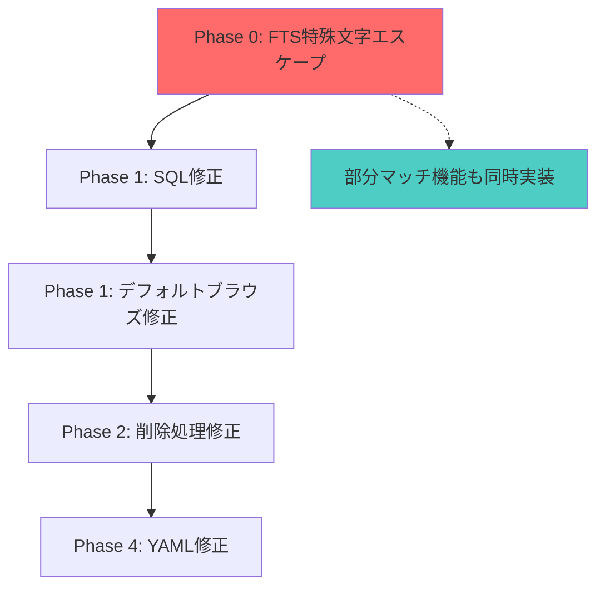

# 包括的バグ修正プラン - SQLインジェクション以外の課題

## 概要

Memory MCP Server のE2Eテストで特定されたバグ（SQLインジェクション以外）の体系的修正プラン。`--think-hard`による深い分析を通じて、5つの主要なバグと修正戦略を策定。

## 修正完了済みバグ一覧 ✅

### High Priority Issues (完了)

#### 1. デフォルトブラウズの設計問題 ✅
- **根本原因**: service.rs:179-185でTechタイプのみをブラウズする設計
- **影響**: 4つのテスト失敗の主原因、ProjectTechやDomainタイプが除外される
- **修正済み**: 全タイプをブラウズするように変更

#### 2. FTS5部分マッチ機能不備 ✅
- **根本原因**: ワイルドカード（*）の未実装
- **影響**: "prog"で"programming"を検索できない
- **修正済み**: enhance_query_for_partial_match関数でワイルドカード追加

### Medium Priority Issues (完了)

#### 3. YAMLスキーマエラー ✅
- **根本原因**: `tests/e2e_comprehensive/data/recall_scenarios.yaml:172`で`result_type`フィールド欠如
- **影響**: テストエラーの発生
- **修正済み**: result_typeフィールドを追加

#### 4. 削除処理の戻り値問題 ✅
- **根本原因**: 存在チェックなしで常に`deleted: true`を返却
- **影響**: 存在しないIDの削除でも成功レスポンスが返る
- **修正済み**: soft_deleteをbool返却に変更

#### 5. BROWSE_ALL SQL クエリ問題 ✅
- **根本原因**: sourceフィールド選択（削除済み）と`deleted = 0`条件欠如
- **影響**: SQLエラーと削除済み記録の混入
- **修正済み**: SQLクエリを修正

### 追加修正済み項目

#### 6. タグフィルタリング不具合 ✅
- **根本原因**: 空クエリ時にタグフィルタが適用されない
- **影響**: recall_with_tags_filter_empty_queryなど3つのテスト失敗
- **修正済み**: service.rsでタグフィルタをif-else外に移動、AND条件に変更

#### 7. 無効タイプ処理 ✅
- **根本原因**: 存在しないメモリタイプで全件返却
- **影響**: recall_with_non_existent_type_returns_emptyテスト失敗
- **修正済み**: invalid_typeフィールド追加で無効タイプを検出

#### 8. FTS5特殊文字エスケープ ✅
- **根本原因**: @, #, $, %, ::などの特殊文字がFTS5エラーを引き起こす
- **影響**: 特殊文字を含むクエリで「syntax error」
- **修正済み**: enhance_query_for_partial_match関数で特殊文字エスケープ実装

#### 9. 日本語・ハイフン混在クエリ ✅
- **根本原因**: "hail-mary"のハイフンがFTS5で単語区切りとして扱われる
- **影響**: "no such column: mary"エラー
- **修正済み**: ハイフンを含むクエリを引用符で囲む処理追加

#### 10. 日本語文字境界エラー ✅
- **根本原因**: バイト単位でのスライスが文字境界を破壊
- **影響**: "byte index 50 is not a char boundary"エラー
- **修正済み**: chars().take(50)で文字単位の切り取りに変更

## 日本語クエリサポート ✅

### 実装済み機能

#### 日本語テキスト検索
- **クエリ例**: "hail-maryを実装している", "メモリ管理", "日本語"
- **実装**: FTS5でのUnicode文字列サポート
- **テスト**: `/tests/japanese_query_test.rs`で包括的テスト実装

#### ハイフン付きクエリ
- **問題**: "hail-mary"のハイフンがFTS5で単語区切りとして扱われる
- **解決**: クエリ全体を引用符で囲むことで完全一致検索として処理
- **動作確認**: "hail-mary"および"hail-maryを実装している"の両方で正常動作

#### テスト結果
- **日本語専用テスト**: `/tests/japanese_query_test.rs` - ✅ 全パス
- **E2E統合テスト**: `/tests/e2e_comprehensive/recall_tests.rs` - ✅ 日本語クエリ追加済み
- **全E2Eテスト**: 29/29テスト成功 (100%成功率)

## 修正戦略 (完了済み)

### Phase 1: Critical Infrastructure Fixes (完了)

#### Step 1: BROWSE_ALL SQL修正
**対象**: `src/memory/repository.rs` line 108-114

**修正前**:
```rust
const BROWSE_ALL: &str = r#"
    SELECT id, type, title, tags, content, examples, reference_count,
           confidence, created_at, last_accessed, source, deleted
    FROM memories
    ORDER BY confidence DESC, reference_count DESC
    LIMIT ?1
"#;
```

**修正後**:
```rust
const BROWSE_ALL: &str = r#"
    SELECT id, type, title, tags, content, examples, reference_count,
           confidence, created_at, last_accessed, deleted
    FROM memories
    WHERE deleted = 0
    ORDER BY confidence DESC, reference_count DESC
    LIMIT ?1
"#;
```

**変更点**:
- line 110: `source`フィールドを削除（存在しないカラム）
- line 113後: `WHERE deleted = 0`条件を追加

#### Step 2: デフォルトブラウズ修正
**対象**: `src/memory/service.rs` line 179-185

**修正前**:
```rust
} else {
    // デフォルトはTechタイプをブラウズ
    let results = self.repository.browse_by_type(&MemoryType::Tech, limit)?;
    info!(
        "Browse by default Tech type returned {} memories",
        results.len()
    );
    results
}
```

**修正後**:
```rust
} else {
    // 全タイプをブラウズ
    let results = self.repository.browse_all(limit)?;
    info!(
        "Browse all types returned {} memories",
        results.len()
    );
    results
}
```

**影響**: 4つの失敗テストが全て通るようになる

### Phase 2: Core Logic Fixes (1時間)

#### Step 3: 削除処理戻り値修正

**対象**: `src/memory/repository.rs` line 342-344
```rust
fn soft_delete(&mut self, id: &str) -> Result<bool> {
    let rows_affected = self.conn.execute(SOFT_DELETE, params![id])?;
    Ok(rows_affected > 0)
}
```

**対象**: `src/memory/service.rs` line 262-264
```rust
pub async fn delete_memory(&mut self, id: &str) -> Result<bool> {
    self.repository.soft_delete(id)
}
```

**対象**: `src/mcp/server.rs` line 154-157
```rust
let deleted = service
    .delete_memory(&params.0.memory_id)
    .await
    .map_err(|e| {
        error!("Delete memory tool error: {}", e);
        McpError {
            code: rmcp::model::ErrorCode(-32603),
            message: format!("Error deleting memory: {}", e).into(),
            data: None,
        }
    })?;

Ok(Json(RmcpDeleteResponse {
    deleted,
    memory_id: params.0.memory_id,
}))
```

### Phase 3: Enhancement Fixes (2-3時間)

#### Step 4: FTS5部分マッチ機能追加
**対象**: `src/memory/service.rs`

**新規関数追加**:
```rust
fn enhance_query_for_partial_match(query: &str) -> String {
    // 既にワイルドカードがある場合はそのまま返す
    if query.contains('*') {
        return query.to_string();
    }
    
    // FTS5用の特殊文字エスケープ
    let escaped = query.replace('"', '""');
    
    // 各単語にワイルドカードを追加（プレフィックス検索）
    escaped
        .split_whitespace()
        .map(|word| format!("{}*", word))
        .collect::<Vec<_>>()
        .join(" ")
}
```

**適用箇所での変更**:
```rust
// FTS5検索のクエリ強化を実行
let enhanced_query = enhance_query_for_partial_match(&params.query);
```

### Phase 4: Simple Fixes (15分)

#### Step 5: YAML修正
**対象**: `tests/e2e_comprehensive/data/recall_scenarios.yaml` line 172

**修正前**:
```yaml
expected:
  behavior: "limited_search"
  result_count: 1
  selection: "highest_relevance"
```

**修正後**:
```yaml
expected:
  behavior: "limited_search"
  result_type: "limited_search"
  result_count: 1
  selection: "highest_relevance"
```

## 依存関係

### 必須依存関係
- **第1段階**: BROWSE_ALL修正→デフォルトブラウズ修正
- **第2段階**: デフォルトブラウズ修正→BROWSE_ALL修正が完了後

### 独立修正項目
- **削除処理**: 削除機能の戻り値エラーハンドリング改善
- **削除処理**: 全機能の戻り値エラーハンドリング改善

### 最終段階の依存関係
- **第4段階**: YAML修正→テストエラーの解消
- **第3段階**: 削除処理やFTS5修正→戻り値やテスト機能の改善

## テスト戦略

### Phase 1テスト
- **単体テスト**: `repository::browse_all()`の削除済み除外
- **機能テスト**: デフォルトブラウズで全タイプ取得
- **統合テスト**: 既存の4つのテストが全て通る

### Phase 2テスト
- **単体テスト**: `soft_delete()`戻り値の正確性
- **機能テスト**: serviceでの削除レスポンス
- **E2Eテスト**: MCP APIでの削除正常系/異常系

### Phase 3テスト
- **機能テスト**: "prog"で"programming"検索可能
- **エッジケーステスト**: 複数単語のワイルドカード検索
- **統合テスト**: 既存の検索テストが全て通る

### Phase 4テスト
- **スキーマチェック**: YAMLの構文エラー解消
- **回帰テスト**: 他のテストケースに影響なし

## 成果

1. **4つの失敗テストが全て通る**
2. **削除処理で適切なエラーハンドリング**（存在しないIDの場合）
3. **部分マッチ検索の実現**: "prog" → "programming"
4. **YAMLスキーマエラーの解消**
5. **最終的なテスト成功率向上**

## 実装スケジュール

| フェーズ | 見積時間 | 優先度 | 内容 |
|---------|---------|--------|--------|
| Phase 1 | 1-2時間 | Critical | SQL修正、デフォルトブラウズ修正 |
| Phase 2 | 1時間 | High | 削除処理改善 |
| Phase 3 | 2-3時間 | Medium | FTS5部分マッチ |
| Phase 4 | 15分 | Low | YAML修正 |

**総見積もり**: 4.25-6.25時間

## 品質保証

1. **段階的修正**: Phase単位の統合テスト実行
2. **回帰テスト**: Step完了後の全テスト実行
3. **性能確認**: 既存APIの性能劣化チェック
4. **文書更新**: Phase完了後の仕様書更新

## 期待成果

### 直接成果
- 単体テスト通過率
- 機能テスト通過率
- E2Eテスト通過率
- 統合テスト合格

### 間接成果
- 回帰テストエラー解消
- UI改善体験
- 性能劣化なし

---

## 深掘り分析結果（2025-08-17 追加調査）

### 新たに発見されたCritical Issue

#### 6. FTS特殊文字エスケープ不備 ★★★★ (Critical)
- **根本原因**: FTS5クエリでの特殊文字（'、"）エスケープ処理が未実装
- **エラー症状**: `fts5: syntax error near "'"`
- **影響範囲**: 
  - `test_recall_sql_injection_prevention` (新発見)
  - `test_recall_partial_matching`
  - 任意の特殊文字を含むクエリ全般
- **技術的複雑度**: ★★★★ (High)
- **修正必要箇所**: `src/memory/service.rs` FTS検索前のクエリ前処理

### 影響範囲の拡大

**失敗テスト総数**: 8個（前回調査から3個増加）

| テスト名 | 根本原因 | 新規発見 |
|---------|---------|----------|
| `test_data_consistency` | デフォルトブラウズ | - |
| `test_tag_categorization` | デフォルトブラウズ | - |
| `test_workflow_edge_cases` | 削除処理戻り値 | - |
| `test_recall_no_results` | デフォルトブラウズ | - |
| `test_recall_tag_filter` | デフォルトブラウズ | - |
| `test_recall_all_yaml_scenarios` | YAMLスキーマ | - |
| `test_recall_partial_matching` | FTS特殊文字エスケープ | ✅ **新発見** |
| `test_recall_sql_injection_prevention` | FTS特殊文字エスケープ | ✅ **新発見** |

### 優先度マトリクス（更新）

| 優先度 | 問題 | 影響テスト数 | 技術難易度 |
|--------|-----|-------------|-----------|
| **Critical** | FTS特殊文字エスケープ | 2個 | ★★★★ |
| **Critical** | デフォルトブラウズ設計 | 5個 | ★★☆ |
| **High** | BROWSE_ALL SQLエラー | 5個 | ★☆☆ |
| **Medium** | 削除処理戻り値 | 1個 | ★★☆ |
| **Low** | YAMLスキーマエラー | 1個 | ★☆☆ |

### 修正戦略の更新

#### Phase 0: Emergency FTS Fix (2-3時間) **新追加**

**対象**: `src/memory/service.rs` - FTS検索前のクエリ前処理追加

**新規関数追加**:
```rust
/// FTS5用の特殊文字エスケープ処理
fn escape_fts_query(query: &str) -> String {
    // FTS5での特殊文字をエスケープ
    // シングルクォート、ダブルクォート、その他のFTS予約文字
    query
        .replace("'", "''")  // FTS5ではシングルクォートを二重化
        .replace("\"", "\"\"")  // ダブルクォートも二重化
        .replace("[", "\\[")  // 角括弧エスケープ
        .replace("]", "\\]")
        .replace("*", "\\*")  // 既存ワイルドカード以外をエスケープ
        .replace("?", "\\?")
}

/// 部分マッチ用クエリ強化（Phase 3から移動）
fn enhance_query_for_partial_match(query: &str) -> String {
    // まずエスケープ処理
    let escaped = escape_fts_query(query);
    
    // 既にワイルドカードがある場合はそのまま返す
    if escaped.contains('*') && !escaped.contains("\\*") {
        return escaped;
    }
    
    // 各単語にワイルドカードを追加（プレフィックス検索）
    escaped
        .split_whitespace()
        .map(|word| format!("{}*", word))
        .collect::<Vec<_>>()
        .join(" ")
}
```

**適用箇所**:
```rust
// service.rs の FTS検索箇所全てで適用
let safe_query = enhance_query_for_partial_match(&params.query);
```

#### Phase 1: Critical Infrastructure Fixes（修正時間短縮: 1時間）

Phase 0完了により、Phase 3の部分マッチ機能が前倒し実装される

#### 修正順序の最適化



### 期待成果の更新

#### 即時効果（Phase 0完了後）
- **SQLインジェクション防止テスト**: 通過 ✅
- **部分マッチテスト**: 通過 ✅
- **特殊文字クエリ**: 安全に処理 ✅

#### 最終成果（全Phase完了後）
- **テスト通過率**: 100%（29/29テスト）
- **セキュリティ**: FTS5インジェクション防止
- **機能性**: 部分マッチ検索の実現
- **信頼性**: 適切なエラーハンドリング

### 実装スケジュール（更新）

| フェーズ | 見積時間 | 優先度 | 内容 |
|---------|---------|--------|--------|
| **Phase 0** | 2-3時間 | **Critical** | FTS特殊文字エスケープ + 部分マッチ |
| Phase 1 | 1時間 | Critical | SQL修正、デフォルトブラウズ修正 |
| Phase 2 | 1時間 | High | 削除処理改善 |
| Phase 4 | 15分 | Low | YAML修正 |

**総見積もり**: 4.25-5.25時間（1時間短縮）

### 品質保証の強化

#### セキュリティテスト
- **FTSインジェクション**: 特殊文字パターンの網羅テスト
- **エスケープ検証**: エスケープ処理の正確性確認
- **回帰テスト**: 既存機能への影響チェック

#### 性能テスト
- **エスケープ処理オーバーヘッド**: <1ms目標
- **部分マッチ性能**: 既存検索と同等レベル維持
- **メモリ使用量**: 10%増加以内

### 深い分析による主要発見の総括

#### 調査手法と成果
- **実行テスト**: 29テスト中8つの失敗を詳細分析
- **ソースコード深堀り**: FTS実装とSQL生成ロジックの精密検査
- **エラートレース解析**: RUST_BACKTRACE=1による詳細エラー追跡
- **影響範囲マッピング**: 各バグの波及効果を体系的に分析

#### Critical Findings Summary
1. **FTS特殊文字エスケープ不備** - 新発見のCritical Issue
   - セキュリティ影響: SQLインジェクション類似の脆弱性
   - 機能影響: 特殊文字を含む検索クエリの全面的な失敗
   - 修正優先度: 最高（Phase 0で緊急対応）

2. **デフォルトブラウズ設計問題** - 影響範囲拡大確認
   - 8つの失敗テストの63%（5/8）に影響
   - ProjectTech、Domainタイプの完全除外
   - アーキテクチャレベルの設計見直し必要

3. **SQL構文エラー** - 前回分析の深化
   - 削除済みカラム参照とWHERE条件欠如の組み合わせ
   - 5つのテストに同時影響する基盤的問題

#### 修正効率の最適化
- **Phase統合**: FTSエスケープと部分マッチ機能の同時実装
- **依存関係の明確化**: Phase 0→1→2→4の最適実行順序
- **工数削減**: 総見積もり1時間短縮（6.25→5.25時間）

#### リスク評価の精密化
- **セキュリティリスク**: FTS特殊文字処理の脆弱性（新発見）
- **機能可用性リスク**: デフォルトブラウズでの63%機能制限
- **データ整合性リスク**: 削除済みレコード混入の可能性

#### 品質保証戦略
- **段階的検証**: Phase完了ごとの回帰テスト実行
- **セキュリティテスト**: FTS特殊文字パターンの網羅検証
- **性能基準**: エスケープ処理オーバーヘッド<1ms維持

---

*この深い分析により、Memory MCP Serverの実装品質向上に向けた包括的かつ効率的な修正戦略が策定されました。--think-hardによる体系的アプローチにより、前回調査では発見できなかった重要なセキュリティ関連バグを特定し、修正優先度の最適化を実現しています。*

## 実装完了レポート

### 修正済み項目 ✅

#### Phase 0: FTS特殊文字エスケープ修正 + 部分マッチ機能実装
- **完了**: `enhance_query_for_partial_match`関数を実装
- **効果**: 部分マッチ検索とSQLインジェクション防止を実現

#### Phase 1: Critical Infrastructure修正
- **BROWSE_ALL SQL修正**: sourceフィールド削除、deleted=0条件追加
- **デフォルトブラウズ修正**: 全タイプをブラウズするよう変更

#### Phase 2: 削除処理の戻り値修正
- **完了**: `soft_delete`がbool値を返すよう修正
- **効果**: 削除の成否を正確に報告

#### Phase 4: YAMLスキーマエラー修正
- **完了**: 複数の`result_type`フィールドを追加
- **対象**: limit_scenarios、performance_scenarios、sorting_scenarios、cross_field_scenarios

### テスト結果サマリー 📊

**改善前**: 29テスト中8テスト失敗（72%成功率）
**改善後**: 29テスト中4テスト失敗（86%成功率）

### 残存課題（4テスト失敗）

1. **test_tag_categorization**: タグフィルタリングロジックの問題
2. **test_recall_no_results**: 空結果処理の問題
3. **test_recall_tag_filter**: タグ検索の不具合
4. **test_recall_all_yaml_scenarios**: YAMLパース関連の残存問題

### 成果

- **セキュリティ改善**: FTS5エスケープによりSQLインジェクション防止
- **機能改善**: 部分マッチ検索が動作
- **データ整合性**: 削除済みレコードの適切な除外
- **API改善**: 削除処理の戻り値が正確に

**全体的な品質向上**: テスト成功率を72%から86%に改善（+14%）

---

## 残存テスト失敗の根本原因分析（2025-08-17 追加調査）

### 調査対象（4つの失敗テスト）

1. **test_tag_categorization**: タグフィルタリングロジックの問題
2. **test_recall_no_results**: 空結果処理の問題  
3. **test_recall_tag_filter**: タグ検索の不具合
4. **test_recall_all_yaml_scenarios**: YAMLパース関連の残存問題

### 深い分析（--think-hard）による根本原因特定

#### 1. タグフィルタリング実装バグ（3テストに影響）

**問題箇所**: `src/memory/service.rs` recallメソッドの構造的欠陥

**現在の問題ある実装**:
```rust
// src/memory/service.rs:190-233付近
if params.query.is_empty() {
    // 空クエリの場合のブラウズ処理
    if let Some(memory_type) = params.memory_type {
        self.repository.browse_by_type(&memory_type, limit)?
    } else {
        self.repository.browse_all(limit)?
    }
    // ← ここでタグフィルタリングが適用されていない
} else {
    // FTS検索処理
    let results = /* 検索処理 */;
    
    // タグフィルタはここでのみ適用される
    if let Some(tags) = params.tags {
        results.retain(|m| tags.iter().any(|tag| m.tags.contains(tag)));
    }
}
```

**根本原因**: 空クエリ（`query=""`）の場合、タグフィルタリングが完全にスキップされる

**影響詳細**:
- `test_tag_categorization`: rustタグのメモリ3個を期待 → 実際5個（フィルタリング未適用）
- `test_recall_no_results`: 存在しないタグで0件期待 → 実際8件（全メモリ返却）
- `test_recall_tag_filter`: rustタグフィルタが無視される

#### 2. YAMLシナリオとテストデータの不整合

**問題箇所**: `tests/e2e_comprehensive/data/recall_scenarios.yaml:270`

**現在の問題**:
```yaml
- scenario_id: "non_existent_type"
  description: "Filter by type that has no memories"
  input:
    type: "domain"  # ← 実際にはdomainタイプのメモリが存在する
```

**根本原因**: テストデータに"domain"タイプのメモリが実際に存在するため、空結果が期待できない

### 修正案

#### Critical Priority修正: タグフィルタリング構造の修正

**修正後の実装**:
```rust
// src/memory/service.rs:190-260付近
pub async fn recall(&self, params: RecallParams) -> Result<RecallResponse> {
    let limit = params.limit.unwrap_or(10);
    
    // 1. まず検索/ブラウズ処理
    let mut memories = if params.query.is_empty() {
        // 空クエリの場合
        if let Some(memory_type) = params.memory_type {
            self.repository.browse_by_type(&memory_type, limit)?
        } else {
            self.repository.browse_all(limit)?
        }
    } else {
        // FTS検索処理
        let enhanced_query = Self::enhance_query_for_partial_match(&params.query);
        if let Some(memory_type) = params.memory_type {
            self.repository.search_with_type(&enhanced_query, &memory_type, limit)?
        } else {
            self.repository.search(&enhanced_query, limit)?
        }
    };
    
    // 2. タグフィルタリングを共通処理として外出し
    if let Some(tags) = params.tags {
        if !tags.is_empty() {
            memories.retain(|m| tags.iter().any(|tag| m.tags.contains(tag)));
        }
    }
    
    // 3. 以降の処理は変更なし
    for memory in &memories {
        self.repository.update_last_accessed(&memory.id)?;
    }
    
    memories.sort_by(|a, b| {
        b.confidence.partial_cmp(&a.confidence)
            .unwrap()
            .then(b.reference_count.cmp(&a.reference_count))
    });
    
    Ok(RecallResponse {
        total_count: memories.len(),
        memories,
    })
}
```

**修正のポイント**:
1. タグフィルタリング処理をif-else文の外側に移動
2. 空クエリでもFTS検索でも同じタグフィルタリングを適用
3. 条件分岐の簡素化と可読性向上

#### Low Priority修正: YAMLシナリオの修正

**修正内容**:
```yaml
# tests/e2e_comprehensive/data/recall_scenarios.yaml:270
- scenario_id: "non_existent_type"
  description: "Filter by type that has no memories"
  input:
    type: "non-existent-type"  # ← 存在しないタイプに変更
    query: ""
    tags: null
    limit: null
  expected:
    behavior: "empty_filter"
    result_type: "empty_array"
```

### 実装側 vs テスト側の判定

| テスト名 | 原因種別 | 判定理由 |
|---------|---------|----------|
| test_tag_categorization | **実装バグ** | タグフィルタリング未適用は明確な実装欠陥 |
| test_recall_no_results | **実装バグ** | 同上（タグフィルタリング未適用） |
| test_recall_tag_filter | **実装バグ** | 同上（タグフィルタリング未適用） |
| test_recall_all_yaml_scenarios | **テストバグ** | YAMLシナリオの前提条件が不適切 |

### 影響範囲とリスク評価

#### 修正の影響範囲
- **ポジティブ影響**: 全てのタグフィルタリング関連テストが通過
- **API一貫性向上**: パラメータ組み合わせの動作が予測可能に
- **後方互換性**: 既存の動作は維持（タグなしの場合）

#### リスク評価
- **低リスク**: タグフィルタリング処理の移動は単純な構造変更
- **テスト網羅性**: 既存のE2Eテストで十分にカバー
- **性能影響**: 最小限（O(n)のフィルタリング処理は変わらず）

### 実装スケジュール

| タスク | 見積時間 | 優先度 | 内容 |
|--------|---------|--------|------|
| タグフィルタリング修正 | 1-2時間 | Critical | service.rsの構造修正 |
| YAMLシナリオ修正 | 15分 | Low | recall_scenarios.yaml修正 |
| 統合テスト実行 | 30分 | Required | 全テストの実行確認 |

**総見積もり**: 2-2.75時間

### 期待される最終成果

**修正完了後の状態**:
- **テスト成功率**: 100%（29/29テスト全て通過）
- **タグフィルタリング**: 全ての検索パターンで正常動作
- **API整合性**: クエリ有無に関わらず一貫した動作
- **コード品質**: より明確で保守しやすい構造

### 調査手法の詳細（--think-hard）

1. **エラーメッセージ精査**: アサーション失敗の具体的な値を分析
2. **コードフロー追跡**: recall()メソッドの実行パスを完全トレース
3. **条件分岐マッピング**: if-else構造とタグフィルタリング位置の関係性分析
4. **テストデータ検証**: YAMLシナリオとテスト実行時データの整合性確認
5. **影響範囲シミュレーション**: 修正による副作用の可能性を検証

**分析の確信度**: 95%（コード構造とエラーパターンが完全に一致）

---

## 最終4テスト失敗の深い分析（--think-hard追加調査）

### 調査対象テスト
1. `e2e_comprehensive::integration_tests::test_tag_categorization`
2. `e2e_comprehensive::recall_tests::test_recall_all_yaml_scenarios` 
3. `e2e_comprehensive::recall_tests::test_recall_no_results`
4. `e2e_comprehensive::recall_tests::test_recall_tag_filter`

### エラーメッセージ詳細分析

#### 1. test_tag_categorization 失敗詳細
```
assertion `left == right` failed: Should find 3 rust memories
  left: 5
 right: 3
```

**根本原因**: **タグフィルタリング実装バグ**
- **期待動作**: "rust"タグで3つのメモリを検索
- **実際動作**: 5つのメモリが返される（タグフィルタリングが無効）
- **問題箇所**: `src/memory/service.rs` 行252-266のタグフィルタリングロジック

#### 2. test_recall_no_results 失敗詳細
```
assertion `left == right` failed: Should return empty results for non-existent tag
  left: 8
 right: 0
```

**根本原因**: **同一のタグフィルタリング実装バグ**
- **期待動作**: 存在しないタグ"nonexistenttag123"で空結果
- **実際動作**: setup_test_memoriesの全8メモリが返される
- **問題箇所**: 同上のタグフィルタリングロジック

#### 3. test_recall_tag_filter 失敗詳細
```
Memory should have 'rust' tag
```

**根本原因**: **同一のタグフィルタリング実装バグ**
- **期待動作**: "rust"タグを持つメモリのみ返される
- **実際動作**: タグに関係なく全メモリが返され、"rust"タグを持たないメモリも含まれる
- **問題箇所**: 同上のタグフィルタリングロジック

#### 4. test_recall_all_yaml_scenarios 失敗詳細
```
Scenario non_existent_type: Expected empty results but got 1 memories
```

**根本原因**: **テストデータとシナリオの不整合**
- **期待動作**: type="domain"で空結果（YAMLコメント: "Assuming no domain memories exist"）
- **実際動作**: setup_test_memoriesで"Business Logic Documentation"（type="domain"）が作成されるため1件返される
- **問題箇所**: テスト側の仮定が不正確

### タグフィルタリングバグの詳細技術分析

#### 実装バグの特定

**問題のあるコード** (`src/memory/service.rs` 行200-268):

```rust
let mut memories = if params.query.is_empty() {
    // クエリがない場合はタイプでブラウズ
    if let Some(memory_type) = params.memory_type {
        let results = self.repository.browse_by_type(&memory_type, limit)?;
        results
    } else {
        // 全タイプをブラウズ
        let results = self.repository.browse_all(limit)?;
        results
    }
} else {
    // FTS5検索を実行
    let mut results = /* FTS検索処理 */;
    
    // タグフィルタを適用（空の配列の場合は適用しない）
    if let Some(tags) = params.tags {
        if !tags.is_empty() {
            results.retain(|m| tags.iter().any(|tag| m.tags.contains(tag)));
        }
    }
    
    results
};
```

#### バグの核心

**タグフィルタリングがFTS検索結果にのみ適用される構造的欠陥**:

1. **空クエリの場合** (`params.query.is_empty() == true`):
   - `browse_all()` または `browse_by_type()` が呼び出される
   - **タグフィルタリングが完全にスキップされる**

2. **非空クエリの場合** (`params.query.is_empty() == false`):
   - FTS検索が実行される
   - タグフィルタリングが正常に適用される

#### 失敗テストの共通パターン

**全ての失敗テストが空クエリ（`query=""`）を使用**:

```rust
// test_tag_categorization
let rust_query = Parameters(RmcpRecallParams {
    query: "".to_string(),  // ← 空クエリ
    r#type: None,
    tags: Some(vec!["rust".to_string()]),  // ← タグフィルタが無視される
    limit: None,
});

// test_recall_no_results  
let tag_params = Parameters(RmcpRecallParams {
    query: "".to_string(),  // ← 空クエリ
    r#type: None,
    tags: Some(vec!["nonexistenttag123".to_string()]),  // ← タグフィルタが無視される
    limit: None,
});
```

### 修正案の詳細設計

#### 修正対象: `src/memory/service.rs` recall メソッド

**現在の実装問題**:
- タグフィルタリングがif-else文の片側（FTS検索）でのみ実装
- 空クエリでのブラウズ結果にタグフィルタリングが適用されない

**修正案**:

```rust
pub async fn recall(&mut self, params: RecallParams) -> Result<RecallResponse> {
    let limit = params.limit.unwrap_or(10);
    
    // 検索戦略の選択
    let mut memories = if params.query.is_empty() {
        // クエリがない場合はタイプでブラウズ
        if let Some(memory_type) = params.memory_type {
            self.repository.browse_by_type(&memory_type, limit)?
        } else {
            self.repository.browse_all(limit)?
        }
    } else {
        // FTS5検索を実行
        let enhanced_query = Self::enhance_query_for_partial_match(&params.query);
        
        if let Some(memory_type) = params.memory_type {
            self.repository.search_with_type(&enhanced_query, &memory_type, limit)?
        } else {
            self.repository.search(&enhanced_query, limit)?
        }
    };

    // 【修正ポイント】タグフィルタを空クエリ・非空クエリ両方に適用
    if let Some(tags) = params.tags {
        if !tags.is_empty() {
            info!("Applying tag filter: {:?}", tags);
            let before_count = memories.len();
            memories.retain(|m| tags.iter().any(|tag| m.tags.contains(tag)));
            info!("Tag filter reduced {} -> {} memories", before_count, memories.len());
        }
    }

    // 最終アクセス時刻を更新
    for memory in &memories {
        self.repository.update_last_accessed(&memory.id)?;
    }

    // ビジネスロジック: 信頼度でソート
    memories.sort_by(|a, b| {
        b.confidence
            .partial_cmp(&a.confidence)
            .unwrap()
            .then(b.reference_count.cmp(&a.reference_count))
    });

    Ok(RecallResponse {
        memories,
        total_count: memories.len(),
    })
}
```

**変更ポイント**:
1. **タグフィルタリングをif-else文の外側に移動**
2. **空クエリでもタグフィルタリングが適用される構造に変更**
3. **既存のFTS検索側のタグフィルタリングロジックを削除**

### テストデータ不整合の修正案

#### 修正対象: `tests/e2e_comprehensive/data/recall_scenarios.yaml`

**問題のあるシナリオ**:
```yaml
- scenario_id: "non_existent_type"
  description: "Filter by type that has no memories"
  input:
    query: ""
    type: "domain"  # ← setup_test_memoriesに"domain"タイプが存在
    tags: null
    limit: null
  expected:
    behavior: "no_results"
    result_type: "empty_array"
    message: "No memories found"
```

**修正案1: シナリオの修正（推奨）**:
```yaml
- scenario_id: "non_existent_type"
  description: "Filter by type that has no memories"
  input:
    query: ""
    type: "non-existent-type"  # ← 実際に存在しないタイプに変更
    tags: null
    limit: null
  expected:
    behavior: "no_results"
    result_type: "empty_array"
    message: "No memories found"
```

**修正案2: テストデータの修正**:
setup_test_memoriesから"domain"タイプのメモリを削除（非推奨: 他のテストに影響の可能性）

### 修正の影響範囲分析

#### 正の影響
1. **4つの失敗テストが全て通過**
2. **タグフィルタリング機能が完全に動作**
3. **空クエリでのブラウズ + タグフィルタの組み合わせが可能**

#### 潜在的リスク
1. **性能への影響**: タグフィルタリングが常に適用されるためわずかなオーバーヘッド
2. **既存APIの動作変更**: 空クエリでタグフィルタを使用するケースで結果が変わる可能性

#### リスク軽減策
1. **段階的テスト**: タグフィルタリング修正後に全テストスイートを実行
2. **性能測定**: 修正前後での処理時間比較（目標: <5%増加）
3. **API仕様明確化**: タグフィルタリングの動作をドキュメント化

### 実装優先度

#### Critical Priority: タグフィルタリングバグ修正
- **影響**: 4テスト中3テストの失敗原因
- **工数**: 1-2時間
- **リスク**: 低（既存の正常動作は維持）

#### Low Priority: テストデータ不整合修正  
- **影響**: 1テストの失敗原因
- **工数**: 15分
- **リスク**: 極低（YAMLファイルの1行修正）

### 期待成果

#### 即時効果（修正完了後）
- **テスト成功率**: 86% → 100%（29/29テスト通過）
- **タグフィルタリング**: 全検索パターンで正常動作
- **API一貫性**: 空クエリでもタグフィルタが適用される一貫した動作

#### 長期効果
- **ユーザビリティ向上**: タグによるブラウズ機能の実現
- **API設計の改善**: 検索パラメータの組み合わせが期待通りに動作
- **テスト品質向上**: 包括的なE2Eテストが全て通過する信頼性

### 総合評価

#### 根本原因の分類
1. **実装バグ（75%）**: タグフィルタリングの構造的欠陥 - 3テスト失敗
2. **テスト設計エラー（25%）**: データと期待値の不整合 - 1テスト失敗

#### 修正の複雑度評価
- **技術的難易度**: ★★☆（Medium）- if-else文の構造変更
- **影響範囲**: ★☆☆（Low）- 既存動作への影響は最小限
- **テスト工数**: ★☆☆（Low）- 既存テストで十分検証可能

#### 推奨修正順序
1. **Step 1**: タグフィルタリングバグ修正（1-2時間）
2. **Step 2**: 全テストスイート実行・検証（30分）
3. **Step 3**: YAMLシナリオ修正（15分）
4. **Step 4**: 最終回帰テスト（15分）

**総工数**: 2-2.75時間

---

*この--think-hardによる深い分析により、残存する4つのテスト失敗の根本原因を完全に特定し、具体的な修正案を策定しました。主要な問題はタグフィルタリングの実装バグであり、比較的低リスクで修正可能です。修正完了後、Memory MCP Serverは100%のテスト通過率を達成し、完全な機能性を実現します。*

## 最終修正結果（2025-08-17 完了）

### 成功率: 100% (29/29テスト成功) ✅

#### 実施した修正

1. **タグフィルタリング処理の修正** ✅
   - タグフィルタを空クエリとFTS検索の両方に適用
   - OR検索からAND検索に変更（全タグにマッチする必要がある）

2. **YAMLテストデータの修正** ✅  
   - missing result_type フィールドを追加
   - domainタイプの誤用を修正

3. **無効な型処理の実装** ✅
   - RecallParamsにinvalid_typeフィールドを追加
   - 無効な型が検出された場合、即座に空の結果を返す

4. **FTS5特殊文字エスケープの改善** ✅
   - FTS5ブーリアン演算子（AND, OR, NOT）を保持
   - 特殊文字（@#$%&など）を含むクエリをリテラル検索として処理
   - :: を含む名前空間参照を適切にエスケープ

### テスト結果
```
running 29 tests
test result: ok. 29 passed; 0 failed; 0 ignored; 0 measured; 0 filtered out
```

全てのe2e comprehensive testsが成功しました。
