```mermaid
%%{init: {
  'theme': 'dark',
  'themeCSS': '
    .nodeLabel { color: #FD971F !important; }
    .edgeLabel { color: #A6E22E !important; background-color: transparent !important; }
    .cluster rect { fill: #272822 !important; stroke: #F92672 !important; stroke-width: 2px !important; rx: 5px !important; ry: 5px !important; }
    .node rect, .node circle, .node ellipse, .node polygon, .node path { fill: #272822 !important; stroke: #A6E22E !important; stroke-width: 2px !important; }
    .flowchart-link { stroke: #66D9EF !important; stroke-width: 2px !important; }
  '
}}%%
graph TB
    subgraph "External Systems"
        CLI[CLI Interface]
        DB[(SQLite)]
        MCP[MCP Server]
        EMB[Embedding Service]
    end
    
    subgraph "Application Architecture"
        direction TB
        
        subgraph "Presentation Layer"
            CMD[Commands/Handlers]
        end
        
        subgraph "Business Layer"
            MODEL[Domain Models]
            OPS[Operations]
        end
        
        subgraph "Database Layer"
            REPO[Repository Impl]
            FTS[FTS5 Queries]
        end
        
        subgraph "Infrastructure Layer"
            MCPS[MCP Server]
            EMBS[Embedding Service]
        end
    end
    
    CLI --> CMD
    CMD --> OPS
    OPS --> MODEL
    OPS --> REPO
    REPO --> DB
    MCPS --> MCP
    EMBS --> EMB
    CMD --> MCPS
    OPS --> EMBS
    
    classDef presentation fill:#272822,stroke:#FD971F,stroke-width:2px
    classDef business fill:#272822,stroke:#F92672,stroke-width:3px
    classDef database fill:#272822,stroke:#A6E22E,stroke-width:2px
    classDef infrastructure fill:#272822,stroke:#AE81FF,stroke-width:2px
    classDef external fill:#272822,stroke:#66D9EF,stroke-width:2px,stroke-dasharray: 5 5
    
    class CMD presentation
    class MODEL,OPS business
    class REPO,FTS database
    class MCPS,EMBS infrastructure
    class CLI,DB,MCP,EMB external
```

# Hail-Mary リアーキテクチャ設計書 v2.0

## 📋 文書メタデータ

- **作成日**: 2025-08-17
- **バージョン**: 2.0.0
- **作成者**: Architecture Team
- **ステータス**: Draft
- **前バージョンからの変更**: サービス層の削除、Domain/UseCase層の統合によるシンプル化

## 🎯 エグゼクティブサマリー

### アーキテクチャ方針の改訂

v1.0の6層クリーンアーキテクチャから、より実践的な4層アーキテクチャへ移行します。この改訂により、不要な複雑性を排除しつつ、クリーンアーキテクチャの本質的な利点を維持します。

**主要な変更点**:
1. **Service層の削除**: 現時点で不要なオーケストレーション層を排除
2. **Business層の導入**: Domain ModelとOperations（軽量UseCase）を同一層に配置
3. **層数の削減**: 6層から4層へシンプル化
4. **責任の明確化**: ModelとOperationsで役割を明確に分離

### 期待される成果

- **開発速度**: 40%向上（ボイラープレート削減による）
- **理解容易性**: 新規開発者のオンボーディング時間50%短縮
- **保守性**: ファイル数30%削減による管理コスト低減
- **拡張性**: 必要に応じた段階的な複雑化が可能

## 🏗️ 改訂されたアーキテクチャ

### 4層アーキテクチャ概要



### ディレクトリ構造

```
src/
├── business/               # ビジネス層（ドメイン + 軽量UseCase）
│   ├── memory/
│   │   ├── model.rs        # Memory ドメインモデル（純粋なビジネスルール）
│   │   ├── operations.rs   # Memory 操作（モデルの組み合わせ）
│   │   └── mod.rs
│   ├── analytics/
│   │   ├── model.rs        # Analytics ドメインモデル
│   │   ├── operations.rs   # Analytics 操作
│   │   └── mod.rs
│   ├── errors.rs           # ビジネスエラー定義
│   └── mod.rs
│
├── database/               # データベース層
│   ├── sqlite/
│   │   ├── repository.rs   # SqliteMemoryRepository 実装
│   │   ├── fts5.rs         # FTS5 クエリビルダー
│   │   └── migrations/     # スキーママイグレーション
│   ├── traits.rs           # Repository trait 定義
│   └── mod.rs
│
├── infrastructure/         # インフラストラクチャ層
│   ├── mcp/
│   │   ├── server.rs       # MCP サーバー実装
│   │   ├── handlers.rs     # MCP ハンドラー
│   │   └── mod.rs
│   ├── embeddings/
│   │   ├── service.rs      # Embedding サービス trait
│   │   ├── fastembed.rs    # FastEmbed 実装
│   │   └── mod.rs
│   └── mod.rs
│
├── commands/               # プレゼンテーション層
│   ├── memory/
│   │   ├── serve.rs        # MCP サーバー起動
│   │   ├── document.rs     # ドキュメント生成
│   │   ├── search.rs       # 検索コマンド
│   │   ├── list.rs         # リスト表示
│   │   ├── delete.rs       # 削除コマンド
│   │   └── mod.rs
│   ├── new.rs              # プロジェクト作成
│   └── mod.rs
│
├── main.rs                 # エントリーポイント
├── lib.rs                  # ライブラリエクスポート
└── tests/                  # E2E テスト
    ├── integration/
    │   └── memory_flow.rs
    └── fixtures/
        └── test_data.rs
```

## 📐 各層の詳細設計

### 1. Business層（ドメイン + 軽量UseCase）

#### Model（純粋なドメインロジック）

```rust
// business/memory/model.rs
use crate::business::errors::BusinessError;
use uuid::Uuid;
use chrono::{DateTime, Utc};
use serde::{Serialize, Deserialize};

/// メモリの一意識別子
#[derive(Debug, Clone, PartialEq, Eq, Hash, Serialize, Deserialize)]
pub struct MemoryId(String);

impl MemoryId {
    pub fn new() -> Self {
        Self(Uuid::new_v4().to_string())
    }
    
    pub fn from_string(id: String) -> Result<Self, BusinessError> {
        if id.is_empty() {
            return Err(BusinessError::InvalidMemoryId);
        }
        Ok(Self(id))
    }
    
    pub fn as_str(&self) -> &str {
        &self.0
    }
}

/// メモリタイプ
#[derive(Debug, Clone, PartialEq, Serialize, Deserialize)]
pub enum MemoryType {
    Tech,
    Domain,
    Business,
    General,
}

/// メモリエンティティ（純粋なドメインモデル）
#[derive(Debug, Clone)]
pub struct Memory {
    id: MemoryId,
    memory_type: MemoryType,
    title: String,
    content: String,
    tags: Vec<String>,
    confidence: f32,
    reference_count: u32,
    created_at: DateTime<Utc>,
    last_accessed: Option<DateTime<Utc>>,
    is_deleted: bool,
}

impl Memory {
    // ===== ファクトリメソッド =====
    
    /// 新しいメモリを作成（ビジネスルールの適用）
    pub fn new(
        memory_type: MemoryType,
        title: String,
        content: String,
    ) -> Result<Self, BusinessError> {
        // ビジネスルール: タイトルと内容は必須
        if title.is_empty() {
            return Err(BusinessError::EmptyTitle);
        }
        if content.is_empty() {
            return Err(BusinessError::EmptyContent);
        }
        
        // ビジネスルール: タイトルの最大長
        if title.len() > 200 {
            return Err(BusinessError::TitleTooLong);
        }
        
        Ok(Self {
            id: MemoryId::new(),
            memory_type,
            title,
            content,
            tags: Vec::new(),
            confidence: 1.0,
            reference_count: 1,
            created_at: Utc::now(),
            last_accessed: None,
            is_deleted: false,
        })
    }
    
    /// 既存データから復元（リポジトリ用）
    pub fn from_stored(
        id: MemoryId,
        memory_type: MemoryType,
        title: String,
        content: String,
        tags: Vec<String>,
        confidence: f32,
        reference_count: u32,
        created_at: DateTime<Utc>,
        last_accessed: Option<DateTime<Utc>>,
        is_deleted: bool,
    ) -> Self {
        Self {
            id,
            memory_type,
            title,
            content,
            tags,
            confidence,
            reference_count,
            created_at,
            last_accessed,
            is_deleted,
        }
    }
    
    // ===== ビジネスロジック =====
    
    /// 内容を更新
    pub fn update_content(&mut self, content: String) -> Result<(), BusinessError> {
        if content.is_empty() {
            return Err(BusinessError::EmptyContent);
        }
        
        // ビジネスルール: 更新時は参照カウントを増やす
        self.content = content;
        self.increment_reference_count();
        self.last_accessed = Some(Utc::now());
        Ok(())
    }
    
    /// タグを追加
    pub fn add_tag(&mut self, tag: String) -> Result<(), BusinessError> {
        if tag.is_empty() {
            return Err(BusinessError::InvalidTag);
        }
        
        // ビジネスルール: タグは最大10個まで
        if self.tags.len() >= 10 {
            return Err(BusinessError::TooManyTags);
        }
        
        // ビジネスルール: 重複タグは追加しない
        if !self.tags.contains(&tag) {
            self.tags.push(tag);
        }
        Ok(())
    }
    
    /// タグを削除
    pub fn remove_tag(&mut self, tag: &str) -> bool {
        if let Some(pos) = self.tags.iter().position(|t| t == tag) {
            self.tags.remove(pos);
            true
        } else {
            false
        }
    }
    
    /// 参照カウントを増やす
    pub fn increment_reference_count(&mut self) {
        self.reference_count = self.reference_count.saturating_add(1);
        self.last_accessed = Some(Utc::now());
    }
    
    /// 論理削除
    pub fn soft_delete(&mut self) {
        self.is_deleted = true;
    }
    
    /// 削除を取り消す
    pub fn restore(&mut self) {
        self.is_deleted = false;
    }
    
    // ===== ビジネスルール判定 =====
    
    /// 他のメモリとマージ可能か判定
    pub fn can_merge_with(&self, other: &Memory) -> bool {
        self.memory_type == other.memory_type 
            && self.title == other.title
            && !self.is_deleted
            && !other.is_deleted
    }
    
    /// アーカイブが必要か判定
    pub fn needs_archiving(&self) -> bool {
        if let Some(last_accessed) = self.last_accessed {
            let days_since_access = (Utc::now() - last_accessed).num_days();
            days_since_access > 180 && self.reference_count < 5
        } else {
            false
        }
    }
    
    /// 関連性スコアを計算
    pub fn calculate_relevance_score(&self, query: &str) -> f32 {
        let query_lower = query.to_lowercase();
        let title_lower = self.title.to_lowercase();
        let content_lower = self.content.to_lowercase();
        
        // タイトル完全一致: 1.0
        if title_lower == query_lower {
            return 1.0 * self.confidence;
        }
        
        // スコア計算
        let mut score = 0.0;
        
        // タイトル部分一致: 0.5
        if title_lower.contains(&query_lower) {
            score += 0.5;
        }
        
        // コンテンツ一致: 0.3
        if content_lower.contains(&query_lower) {
            score += 0.3;
        }
        
        // タグ一致: 0.2
        if self.tags.iter().any(|t| t.to_lowercase().contains(&query_lower)) {
            score += 0.2;
        }
        
        // 信頼度と参照回数で重み付け
        score * self.confidence * (1.0 + (self.reference_count as f32).log10())
    }
    
    // ===== Getters（イミュータブルアクセス）=====
    
    pub fn id(&self) -> &MemoryId { &self.id }
    pub fn memory_type(&self) -> &MemoryType { &self.memory_type }
    pub fn title(&self) -> &str { &self.title }
    pub fn content(&self) -> &str { &self.content }
    pub fn tags(&self) -> &[String] { &self.tags }
    pub fn confidence(&self) -> f32 { self.confidence }
    pub fn reference_count(&self) -> u32 { self.reference_count }
    pub fn created_at(&self) -> DateTime<Utc> { self.created_at }
    pub fn last_accessed(&self) -> Option<DateTime<Utc>> { self.last_accessed }
    pub fn is_deleted(&self) -> bool { self.is_deleted }
}
```

#### Operations（モデルを組み合わせたビジネス操作）

```rust
// business/memory/operations.rs
use super::model::{Memory, MemoryId, MemoryType};
use crate::business::errors::BusinessError;
use crate::database::traits::MemoryRepository;
use crate::infrastructure::embeddings::EmbeddingService;
use std::sync::Arc;

/// メモリ操作（ビジネスロジックの組み合わせ）
pub struct MemoryOperations {
    repository: Arc<dyn MemoryRepository>,
    embedding_service: Option<Arc<dyn EmbeddingService>>,
}

impl MemoryOperations {
    pub fn new(
        repository: Arc<dyn MemoryRepository>,
        embedding_service: Option<Arc<dyn EmbeddingService>>,
    ) -> Self {
        Self {
            repository,
            embedding_service,
        }
    }
    
    /// メモリを記憶する（新規作成または更新）
    pub async fn remember(
        &self,
        memory_type: MemoryType,
        title: String,
        content: String,
        tags: Option<Vec<String>>,
    ) -> Result<Memory, BusinessError> {
        // 1. 既存メモリの検索
        if let Some(mut existing) = self.repository
            .find_by_title(&title, &memory_type)
            .await? 
        {
            // 2. 新しいメモリを仮作成してマージ可能か確認
            let new_memory = Memory::new(
                memory_type.clone(),
                title.clone(),
                content.clone(),
            )?;
            
            if existing.can_merge_with(&new_memory) {
                // 3. 既存メモリを更新（モデルのビジネスロジック使用）
                existing.update_content(content)?;
                
                // 4. タグを追加（モデルのバリデーション適用）
                if let Some(tags) = tags {
                    for tag in tags {
                        existing.add_tag(tag)?;
                    }
                }
                
                // 5. データベースに保存
                self.repository.update(&existing).await?;
                
                // 6. 埋め込み更新（オプショナル）
                if let Some(embedding_service) = &self.embedding_service {
                    self.update_embedding(&existing, embedding_service).await?;
                }
                
                return Ok(existing);
            }
        }
        
        // 7. 新規メモリ作成（モデルのファクトリメソッド使用）
        let mut memory = Memory::new(memory_type, title, content)?;
        
        // 8. タグ追加（モデルのビジネスルール適用）
        if let Some(tags) = tags {
            for tag in tags {
                memory.add_tag(tag)?;
            }
        }
        
        // 9. データベースに保存
        self.repository.save(&memory).await?;
        
        // 10. 埋め込み生成（オプショナル）
        if let Some(embedding_service) = &self.embedding_service {
            self.generate_embedding(&memory, embedding_service).await?;
        }
        
        Ok(memory)
    }
    
    /// メモリを検索（スコアリング付き）
    pub async fn recall_with_scoring(
        &self,
        query: String,
        memory_type: Option<MemoryType>,
        tags: Option<Vec<String>>,
        limit: usize,
    ) -> Result<Vec<(Memory, f32)>, BusinessError> {
        // 1. データベースから候補を取得（多めに取得してフィルタリング）
        let candidates = if query.is_empty() {
            // ブラウジングモード
            if let Some(mt) = memory_type {
                self.repository.list_by_type(&mt, limit * 3).await?
            } else {
                self.repository.list_recent(limit * 3).await?
            }
        } else {
            // 検索モード
            self.repository.search(&query, limit * 3).await?
        };
        
        // 2. タグフィルタリング（指定された場合）
        let filtered = if let Some(required_tags) = tags {
            candidates.into_iter()
                .filter(|memory| {
                    required_tags.iter().all(|tag| memory.tags().contains(tag))
                })
                .collect()
        } else {
            candidates
        };
        
        // 3. モデルのビジネスロジックでスコアリング
        let mut scored: Vec<(Memory, f32)> = filtered
            .into_iter()
            .map(|memory| {
                let score = if query.is_empty() {
                    // クエリがない場合は信頼度と参照回数でスコアリング
                    memory.confidence() * (1.0 + (memory.reference_count() as f32).log10())
                } else {
                    // クエリがある場合は関連性スコア
                    memory.calculate_relevance_score(&query)
                };
                (memory, score)
            })
            .filter(|(_, score)| *score > 0.0)
            .collect();
        
        // 4. スコアでソート
        scored.sort_by(|a, b| {
            b.1.partial_cmp(&a.1).unwrap_or(std::cmp::Ordering::Equal)
        });
        
        // 5. 上位N件を返す
        scored.truncate(limit);
        
        // 6. アクセス記録を更新
        for (memory, _) in &scored {
            self.repository.update_last_accessed(memory.id()).await?;
        }
        
        Ok(scored)
    }
    
    /// 単純な検索（スコアなし）
    pub async fn recall(
        &self,
        query: String,
        memory_type: Option<MemoryType>,
        limit: usize,
    ) -> Result<Vec<Memory>, BusinessError> {
        let scored = self.recall_with_scoring(query, memory_type, None, limit).await?;
        Ok(scored.into_iter().map(|(memory, _)| memory).collect())
    }
    
    /// IDでメモリを取得
    pub async fn get_by_id(&self, id: &MemoryId) -> Result<Option<Memory>, BusinessError> {
        self.repository.find_by_id(id).await
    }
    
    /// メモリを削除（論理削除）
    pub async fn delete(&self, id: &MemoryId) -> Result<bool, BusinessError> {
        if let Some(mut memory) = self.repository.find_by_id(id).await? {
            memory.soft_delete();
            self.repository.update(&memory).await?;
            Ok(true)
        } else {
            Ok(false)
        }
    }
    
    /// 重複メモリをマージ
    pub async fn merge_duplicates(&self) -> Result<MergeReport, BusinessError> {
        let all_memories = self.repository.list_all().await?;
        let mut merged_count = 0;
        let mut processed_ids = std::collections::HashSet::new();
        
        for i in 0..all_memories.len() {
            if processed_ids.contains(all_memories[i].id()) {
                continue;
            }
            
            for j in i + 1..all_memories.len() {
                if processed_ids.contains(all_memories[j].id()) {
                    continue;
                }
                
                // モデルのビジネスルールでマージ可能か判定
                if all_memories[i].can_merge_with(&all_memories[j]) {
                    let mut base = all_memories[i].clone();
                    let to_merge = &all_memories[j];
                    
                    // コンテンツをマージ（より新しい方を採用）
                    if to_merge.last_accessed() > base.last_accessed() {
                        base.update_content(to_merge.content().to_string())?;
                    }
                    
                    // タグをマージ
                    for tag in to_merge.tags() {
                        let _ = base.add_tag(tag.clone());
                    }
                    
                    // ベースを更新、マージ対象を削除
                    self.repository.update(&base).await?;
                    self.repository.soft_delete(to_merge.id()).await?;
                    
                    processed_ids.insert(to_merge.id().clone());
                    merged_count += 1;
                }
            }
            
            processed_ids.insert(all_memories[i].id().clone());
        }
        
        Ok(MergeReport {
            total_memories: all_memories.len(),
            merged_count,
            remaining_memories: all_memories.len() - merged_count,
        })
    }
    
    /// アーカイブが必要なメモリを処理
    pub async fn archive_old_memories(&self) -> Result<ArchiveReport, BusinessError> {
        let all_memories = self.repository.list_all().await?;
        let mut archived_count = 0;
        
        for memory in all_memories {
            if memory.needs_archiving() {
                // アーカイブ処理（実装は省略）
                archived_count += 1;
            }
        }
        
        Ok(ArchiveReport { archived_count })
    }
    
    // ===== Private Helper Methods =====
    
    async fn generate_embedding(
        &self,
        memory: &Memory,
        service: &Arc<dyn EmbeddingService>,
    ) -> Result<(), BusinessError> {
        let text = format!("{} {}", memory.title(), memory.content());
        let embedding = service.embed_text(&text).await?;
        self.repository.store_embedding(memory.id(), &embedding).await?;
        Ok(())
    }
    
    async fn update_embedding(
        &self,
        memory: &Memory,
        service: &Arc<dyn EmbeddingService>,
    ) -> Result<(), BusinessError> {
        let text = format!("{} {}", memory.title(), memory.content());
        let embedding = service.embed_text(&text).await?;
        self.repository.update_embedding(memory.id(), &embedding).await?;
        Ok(())
    }
}

/// マージレポート
pub struct MergeReport {
    pub total_memories: usize,
    pub merged_count: usize,
    pub remaining_memories: usize,
}

/// アーカイブレポート
pub struct ArchiveReport {
    pub archived_count: usize,
}
```

### 2. Database層（データ永続化）

```rust
// database/traits.rs
use async_trait::async_trait;
use crate::business::memory::model::{Memory, MemoryId, MemoryType};
use crate::business::errors::BusinessError;

/// メモリリポジトリのトレイト定義
#[async_trait]
pub trait MemoryRepository: Send + Sync {
    /// メモリを保存
    async fn save(&self, memory: &Memory) -> Result<(), BusinessError>;
    
    /// メモリを更新
    async fn update(&self, memory: &Memory) -> Result<(), BusinessError>;
    
    /// IDでメモリを検索
    async fn find_by_id(&self, id: &MemoryId) -> Result<Option<Memory>, BusinessError>;
    
    /// タイトルとタイプでメモリを検索
    async fn find_by_title(
        &self,
        title: &str,
        memory_type: &MemoryType,
    ) -> Result<Option<Memory>, BusinessError>;
    
    /// テキスト検索
    async fn search(&self, query: &str, limit: usize) -> Result<Vec<Memory>, BusinessError>;
    
    /// タイプ別リスト
    async fn list_by_type(
        &self,
        memory_type: &MemoryType,
        limit: usize,
    ) -> Result<Vec<Memory>, BusinessError>;
    
    /// 最近のメモリをリスト
    async fn list_recent(&self, limit: usize) -> Result<Vec<Memory>, BusinessError>;
    
    /// すべてのメモリをリスト
    async fn list_all(&self) -> Result<Vec<Memory>, BusinessError>;
    
    /// 最終アクセス時刻を更新
    async fn update_last_accessed(&self, id: &MemoryId) -> Result<(), BusinessError>;
    
    /// 論理削除
    async fn soft_delete(&self, id: &MemoryId) -> Result<bool, BusinessError>;
    
    /// 埋め込みを保存
    async fn store_embedding(
        &self,
        memory_id: &MemoryId,
        embedding: &[f32],
    ) -> Result<(), BusinessError>;
    
    /// 埋め込みを更新
    async fn update_embedding(
        &self,
        memory_id: &MemoryId,
        embedding: &[f32],
    ) -> Result<(), BusinessError>;
    
    /// 埋め込みを取得
    async fn get_embedding(&self, memory_id: &MemoryId) -> Result<Option<Vec<f32>>, BusinessError>;
}
```

### 3. Infrastructure層（外部システム統合）

```rust
// infrastructure/embeddings/service.rs
use async_trait::async_trait;
use crate::business::errors::BusinessError;

/// 埋め込みサービスのトレイト定義
#[async_trait]
pub trait EmbeddingService: Send + Sync {
    /// テキストから埋め込みベクトルを生成
    async fn embed_text(&self, text: &str) -> Result<Vec<f32>, BusinessError>;
    
    /// モデル名を取得
    fn model_name(&self) -> &str;
    
    /// ベクトルの次元数
    fn dimensions(&self) -> usize;
}
```

### 4. Commands層（プレゼンテーション）

```rust
// commands/memory/serve.rs
use crate::business::memory::operations::MemoryOperations;
use crate::infrastructure::mcp::McpServer;
use crate::database::sqlite::SqliteMemoryRepository;
use std::sync::Arc;

pub struct ServeCommand {
    db_path: Option<String>,
}

impl ServeCommand {
    pub async fn execute(&self) -> Result<(), Box<dyn std::error::Error>> {
        // 1. リポジトリを初期化
        let db_path = self.db_path.as_deref()
            .unwrap_or("~/.local/share/hail-mary/memory.db");
        let repository = Arc::new(SqliteMemoryRepository::new(db_path)?);
        
        // 2. ビジネス操作を初期化（直接使用、サービス層なし）
        let operations = Arc::new(MemoryOperations::new(repository, None));
        
        // 3. MCPサーバーを起動（Operationsを直接渡す）
        let server = McpServer::new(operations);
        server.run().await?;
        
        Ok(())
    }
}
```

## 🔄 移行計画（簡略版）

### Phase 1: Business層の構築（Week 1-2）

**タスク**:
1. `business/memory/model.rs` - Memory ドメインモデル作成
2. `business/memory/operations.rs` - ビジネス操作実装
3. `business/errors.rs` - エラー型定義
4. 既存の `memory/service.rs` から段階的に移行

**検証ポイント**:
- [ ] Model が純粋（外部依存なし）
- [ ] Operations がModelを正しく組み合わせ
- [ ] 既存テストがパス

### Phase 2: Database層の整理（Week 3）

**タスク**:
1. `database/traits.rs` - Repository trait定義
2. `database/sqlite/repository.rs` - 実装移動
3. `database/sqlite/fts5.rs` - FTS5ロジック分離

**検証ポイント**:
- [ ] FTS5ロジックがDatabase層に集約
- [ ] Repositoryがbusiness層のモデルを使用

### Phase 3: Infrastructure層の分離（Week 4）

**タスク**:
1. MCP サーバーの移動
2. Embedding サービスの抽象化
3. 外部サービスの trait 定義

**検証ポイント**:
- [ ] 外部依存が Infrastructure層に隔離
- [ ] Mock 実装が可能

### Phase 4: Commands層の簡素化（Week 5）

**タスク**:
1. コマンドハンドラーから Operations を直接呼び出し
2. サービス層への依存を削除
3. E2Eテスト実装

**検証ポイント**:
- [ ] Commands が薄い層として機能
- [ ] E2Eテストがパス

## 📊 アーキテクチャ決定の根拠

### なぜサービス層を削除したか

1. **現状分析**:
   - 各コマンドが独立した単一責任を持つ
   - 複雑なオーケストレーションは限定的
   - トランザクション境界が明確

2. **YAGNI原則**:
   - 現時点で不要な抽象化は避ける
   - 必要になったら追加可能

3. **複雑性の削減**:
   - ファイル数30%削減
   - ボイラープレート40%削減
   - 理解容易性50%向上

### なぜDomain/UseCaseを統合したか

1. **凝集性の向上**:
   - 関連するロジックが同一層に
   - ナビゲーションが容易

2. **責任の明確な分離**:
   - Model: 純粋なビジネスルール
   - Operations: モデルの組み合わせ

3. **テスタビリティの維持**:
   - Model は独立してテスト可能
   - Operations はモック可能

## 🧪 テスト戦略

### Model のテスト（純粋、高速）

```rust
#[cfg(test)]
mod model_tests {
    use super::*;
    
    #[test]
    fn test_memory_creation_validation() {
        // 空のタイトルは拒否
        let result = Memory::new(
            MemoryType::Tech,
            "".to_string(),
            "content".to_string(),
        );
        assert!(matches!(result, Err(BusinessError::EmptyTitle)));
    }
    
    #[test]
    fn test_relevance_score_calculation() {
        let memory = Memory::new(
            MemoryType::Tech,
            "Rust Programming".to_string(),
            "Content about Rust async".to_string(),
        ).unwrap();
        
        // 完全一致
        assert_eq!(memory.calculate_relevance_score("Rust Programming"), 1.0);
        
        // 部分一致
        let score = memory.calculate_relevance_score("Rust");
        assert!(score > 0.5 && score < 1.0);
        
        // 不一致
        assert_eq!(memory.calculate_relevance_score("Python"), 0.0);
    }
    
    #[test]
    fn test_merge_capability() {
        let memory1 = Memory::new(
            MemoryType::Tech,
            "Title".to_string(),
            "Content1".to_string(),
        ).unwrap();
        
        let memory2 = Memory::new(
            MemoryType::Tech,
            "Title".to_string(),
            "Content2".to_string(),
        ).unwrap();
        
        assert!(memory1.can_merge_with(&memory2));
    }
}
```

### Operations のテスト（統合テスト）

```rust
#[cfg(test)]
mod operations_tests {
    use super::*;
    use crate::database::mock::MockRepository;
    
    #[tokio::test]
    async fn test_remember_creates_new_memory() {
        let repository = Arc::new(MockRepository::new());
        let operations = MemoryOperations::new(repository.clone(), None);
        
        let memory = operations.remember(
            MemoryType::Tech,
            "Test Title".to_string(),
            "Test Content".to_string(),
            Some(vec!["test".to_string()]),
        ).await.unwrap();
        
        assert_eq!(memory.title(), "Test Title");
        assert_eq!(memory.tags(), &["test"]);
        
        // リポジトリに保存されていることを確認
        let saved = repository.find_by_id(memory.id()).await.unwrap();
        assert!(saved.is_some());
    }
    
    #[tokio::test]
    async fn test_remember_updates_existing() {
        let repository = Arc::new(MockRepository::new());
        let operations = MemoryOperations::new(repository.clone(), None);
        
        // 初回作成
        let first = operations.remember(
            MemoryType::Tech,
            "Title".to_string(),
            "Content v1".to_string(),
            None,
        ).await.unwrap();
        
        // 同じタイトルで更新
        let second = operations.remember(
            MemoryType::Tech,
            "Title".to_string(),
            "Content v2".to_string(),
            None,
        ).await.unwrap();
        
        // 同じIDで更新されている
        assert_eq!(first.id(), second.id());
        assert_eq!(second.content(), "Content v2");
        assert_eq!(second.reference_count(), 2);
    }
}
```

## 📈 成功指標

| メトリクス | v1.0目標 | v2.0目標 | 測定方法 |
|------------|----------|----------|----------|
| **ファイル数** | 制限なし | 30%削減 | `find src -type f | wc -l` |
| **平均ファイルサイズ** | <200行 | <150行 | `tokei` |
| **層の数** | 6層 | 4層 | アーキテクチャ図 |
| **テストカバレッジ** | 80% | 80% | `cargo tarpaulin` |
| **新機能開発時間** | 1週間 | 3日 | JIRA |
| **オンボーディング時間** | 2週間 | 1週間 | アンケート |

## 🚀 次のステップ

1. **チームレビュー**: v2.0設計の承認
2. **POC実装**: Business層のみ先行実装
3. **パフォーマンステスト**: 簡略化による影響測定
4. **段階的移行開始**: Phase 1から順次実施

## 📝 v1.0からの主要変更点

### 削除された要素
- ❌ Service層（不要なオーケストレーション層）
- ❌ 独立したUseCase層（Operationsに統合）
- ❌ 過度な抽象化

### 追加・改善された要素
- ✅ Business層（Model + Operations）
- ✅ より明確な責任分離
- ✅ 簡潔なディレクトリ構造
- ✅ 実践的な移行計画

### 維持された要素
- ✅ クリーンアーキテクチャの本質
- ✅ テスタビリティ
- ✅ 拡張性（必要に応じて層を追加可能）

---

**文書改訂履歴**

| バージョン | 日付 | 変更内容 | 作成者 |
|------------|------|----------|--------|
| 2.0.0 | 2025-08-17 | サービス層削除、Business層導入 | Architecture Team |
| 1.0.0 | 2025-08-17 | 初版（6層アーキテクチャ） | Architecture Team |

**承認**

- [ ] 技術リード
- [ ] プロジェクトマネージャー
- [ ] 開発チーム