# Hail-Mary リアーキテクチャ設計書 v3.0

## 📋 文書メタデータ

- **作成日**: 2025-08-17
- **バージョン**: 3.0.0
- **作成者**: Architecture Team
- **ステータス**: Final Draft
- **前バージョンからの変更**: 
  - FTS5ロジック保護戦略の導入
  - Operations層の細分化
  - 高性能DI戦略
  - 詳細エラー階層の導入

## 🎯 エグゼクティブサマリー

### v3アーキテクチャの革新

v2.0の4層アーキテクチャをベースに、レビューで特定された重要な課題を解決する最終設計です。実装の現実性と理論的な最適性のバランスを重視し、日本語テキスト処理の既存機能を完全に保護しながら、アーキテクチャの簡素化を実現します。

**主要な改善点**:
1. **FTS5ロジックの専用層への分離**: 複雑な日本語処理を`FtsQueryBuilder`に隔離
2. **Operations層の細分化**: 単一責任原則に基づく3つの専門Operations
3. **パフォーマンス重視DI**: 具象型とtrait objectsの戦略的使い分け
4. **階層的エラーシステム**: ドメイン・操作・インフラ・システムエラーの明確な分離
5. **Command/Queryパターン**: CQRS-liteによる読み書き分離

### 期待される成果

- **パフォーマンス**: Arc<dyn>削減により20-30%の応答時間改善
- **保守性**: 200行以下のモジュール化で認知負荷50%削減
- **検索品質**: FTS5ロジック完全保護により日本語検索精度100%維持
- **開発速度**: 明確な責任分離により新機能開発時間35%短縮
- **テスト効率**: 単体テスト可能性向上によりバグ発見率40%向上

## 🏗️ v3アーキテクチャ詳細

### 4層アーキテクチャ（責任分離強化版）



```mermaid
%%{init: {
  'theme': 'dark',
  'themeCSS': '
    .nodeLabel { color: #FD971F !important; }
    .edgeLabel { color: #A6E22E !important; background-color: transparent !important; }
    .cluster rect { fill: #272822 !important; stroke: #F92672 !important; stroke-width: 2px !important; rx: 5px !important; ry: 5px !important; }
    .node rect, .node circle, .node ellipse, .node polygon, .node path { fill: #272822 !important; stroke: #A6E22E !important; stroke-width: 2px !important; }
    .flowchart-link { stroke: #66D9EF !important; stroke-width: 2px !important; }
  '
}}%%
graph TB
    subgraph "External Systems"
        CLI[CLI Interface]
        DB[(SQLite + FTS5)]
        MCP[MCP Server]
        EMB[Embedding Service]
    end
    
    subgraph "Application Architecture"
        direction TB
        
        subgraph "Presentation Layer"
            CMD[Commands/Handlers]
            VAL[Input Validation]
        end
        
        subgraph "Business Layer"
            subgraph "Domain"
                MODEL[Memory Model]
                VALUE[Value Objects]
                ERR[Error Hierarchy]
            end
            
            subgraph "Operations"
                CORE[Core Operations]
                SEARCH[Search Operations]
                ANALYTICS[Analytics Operations]
            end
        end
        
        subgraph "Database Layer"
            REPO[Repository Impl]
            FTS[FTS Query Builder]
            CACHE[Query Cache]
        end
        
        subgraph "Infrastructure Layer"
            MCPS[MCP Server]
            EMBS[Embedding Service]
            PERF[Performance Monitor]
        end
    end
    
    CLI --> CMD
    CMD --> VAL
    VAL --> CORE
    VAL --> SEARCH
    VAL --> ANALYTICS
    
    CORE --> MODEL
    SEARCH --> MODEL
    ANALYTICS --> MODEL
    
    CORE --> REPO
    SEARCH --> FTS
    SEARCH --> CACHE
    ANALYTICS --> REPO
    
    FTS --> REPO
    CACHE --> REPO
    REPO --> DB
    
    MCPS --> MCP
    EMBS --> EMB
    PERF --> CORE
    PERF --> SEARCH
    PERF --> ANALYTICS
    
    classDef presentation fill:#272822,stroke:#FD971F,stroke-width:2px
    classDef business fill:#272822,stroke:#F92672,stroke-width:3px
    classDef database fill:#272822,stroke:#A6E22E,stroke-width:2px
    classDef infrastructure fill:#272822,stroke:#AE81FF,stroke-width:2px
    classDef external fill:#272822,stroke:#66D9EF,stroke-width:2px,stroke-dasharray: 5 5
    classDef highlighted fill:#AE81FF,stroke:#66D9EF,stroke-width:3px,color:#FFF
    
    class CMD,VAL presentation
    class MODEL,VALUE,ERR,CORE,SEARCH,ANALYTICS business
    class REPO,FTS,CACHE database
    class MCPS,EMBS,PERF infrastructure
    class CLI,DB,MCP,EMB external
    class FTS highlighted
```

### ディレクトリ構造（最終版）

```
src/
├── business/               # ビジネス層
│   ├── domain/             # ドメインモデルと値オブジェクト
│   │   ├── memory/
│   │   │   ├── model.rs        # Memory エンティティ（純粋ドメイン）
│   │   │   ├── value_objects.rs # MemoryId, MemoryType等
│   │   │   └── mod.rs
│   │   └── errors.rs           # 階層的エラー定義
│   │
│   └── operations/         # ビジネス操作（分割版）
│       ├── core/
│       │   ├── memory_ops.rs   # 基本CRUD操作（<150行）
│       │   └── mod.rs
│       ├── search/
│       │   ├── text_search.rs  # テキスト検索（<180行）
│       │   ├── semantic_search.rs # セマンティック検索
│       │   └── mod.rs
│       ├── analytics/
│       │   ├── clustering.rs   # クラスタリング（<200行）
│       │   ├── deduplication.rs # 重複排除
│       │   └── mod.rs
│       └── mod.rs
│
├── database/               # データベース層
│   ├── repositories/
│   │   ├── sqlite_memory.rs    # SqliteMemoryRepository
│   │   ├── traits.rs           # Repository trait定義
│   │   └── mod.rs
│   ├── query_builders/     # ⭐ FTS5ロジック保護
│   │   ├── fts_query_builder.rs # 既存FTS5ロジック完全保存
│   │   ├── query_optimizer.rs   # クエリ最適化
│   │   └── mod.rs
│   ├── cache/
│   │   ├── query_cache.rs      # クエリ結果キャッシュ
│   │   └── mod.rs
│   └── migrations/         # スキーマ管理
│
├── infrastructure/         # インフラストラクチャ層
│   ├── mcp/
│   │   ├── server.rs           # MCP サーバー実装
│   │   ├── handlers.rs         # MCP ハンドラー
│   │   └── mod.rs
│   ├── embeddings/
│   │   ├── service.rs          # Embedding サービス trait
│   │   ├── fastembed.rs        # FastEmbed 実装
│   │   ├── openai.rs           # OpenAI 実装
│   │   └── mod.rs
│   ├── monitoring/         # ⭐ 新規：パフォーマンス監視
│   │   ├── metrics.rs          # メトリクス収集
│   │   ├── tracer.rs           # 操作トレース
│   │   └── mod.rs
│   └── mod.rs
│
├── commands/               # プレゼンテーション層
│   ├── memory/
│   │   ├── serve.rs            # MCP サーバー起動
│   │   ├── search.rs           # 検索コマンド
│   │   ├── list.rs             # リスト表示
│   │   ├── delete.rs           # 削除コマンド
│   │   └── mod.rs
│   ├── validation.rs       # ⭐ 新規：入力検証
│   └── mod.rs
│
├── main.rs                 # エントリーポイント
├── lib.rs                  # ライブラリエクスポート
└── tests/                  # テスト
    ├── unit/
    │   ├── domain/
    │   ├── operations/
    │   └── database/
    ├── integration/
    │   └── end_to_end.rs
    └── performance/        # ⭐ 新規：パフォーマンステスト
        └── benchmarks.rs
```

## 📐 重要コンポーネントの詳細設計

### 1. FTS5 Query Builder（日本語処理の完全保護）

```rust
// database/query_builders/fts_query_builder.rs
use crate::business::domain::errors::{QueryBuildError, ValidationError};
use std::collections::HashMap;

/// FTS5クエリビルダー（既存ロジック完全保存）
pub struct FtsQueryBuilder {
    query: String,
    constraints: Vec<QueryConstraint>,
    options: QueryOptions,
}

impl FtsQueryBuilder {
    /// 日本語と英語の境界にスペースを挿入する（完全保存）
    /// 元: src/memory/service.rs:45-73
    pub fn normalize_content_for_fts(content: &str) -> String {
        let mut result = String::new();
        let mut prev_is_ascii = false;
        let mut prev_char: Option<char> = None;

        for ch in content.chars() {
            let curr_is_ascii = ch.is_ascii() && !ch.is_ascii_whitespace();
            let curr_is_japanese = matches!(
                ch, 
                '\u{3040}'..='\u{309F}' | // ひらがな
                '\u{30A0}'..='\u{30FF}' | // カタカナ
                '\u{4E00}'..='\u{9FAF}'   // 漢字
            );

            // 境界検出: ASCII→日本語 または 日本語→ASCII
            if let Some(prev) = prev_char {
                let prev_is_japanese = matches!(
                    prev,
                    '\u{3040}'..='\u{309F}' | 
                    '\u{30A0}'..='\u{30FF}' | 
                    '\u{4E00}'..='\u{9FAF}'
                );

                // ASCII（ハイフン含む）と日本語の境界
                if (prev_is_ascii && curr_is_japanese) || 
                   (prev_is_japanese && curr_is_ascii) {
                    // スペースがまだない場合のみ挿入
                    if !prev.is_ascii_whitespace() && !ch.is_ascii_whitespace() {
                        result.push(' ');
                    }
                }
            }

            result.push(ch);
            prev_is_ascii = curr_is_ascii;
            prev_char = Some(ch);
        }

        result
    }

    /// FTS5クエリを部分マッチ対応に強化する（完全保存）
    /// 元: src/memory/service.rs:75-166
    pub fn enhance_query_for_partial_match(query: &str) -> Result<String, QueryBuildError> {
        // 既にワイルドカードがある場合はそのまま返す
        if query.contains('*') {
            return Ok(query.to_string());
        }

        // FTS5のブーリアン演算子をチェック（AND, OR, NOT）
        if query.contains(" AND ") || query.contains(" OR ") || query.contains(" NOT ") {
            return Ok(query.to_string());
        }

        // 特殊文字が多数含まれる場合の処理
        let problematic_chars = ['@', '#', '$', '%', '&', '^', '~', '`', '|', '\\'];
        if query.chars().any(|c| problematic_chars.contains(&c)) {
            let escaped = query.replace('"', "\"\"");
            return Ok(format!("\"{}\"", escaped));
        }

        // ハイフンを含む場合の特別処理
        let has_hyphen = query.contains('-');
        let has_non_ascii = !query.is_ascii();

        // 日本語とハイフンが混在する場合
        if has_non_ascii && has_hyphen {
            let escaped = query.replace('"', "\"\"");
            return Ok(format!("\"{}\"*", escaped));
        }

        if has_hyphen {
            let escaped = query.replace('"', "\"\"");
            return Ok(format!("\"{}\"", escaped));
        }

        // :: を含む場合（名前空間やモジュール参照）の処理
        if query.contains("::") {
            let processed = query.replace("::", "_COLON_COLON_");
            let words: Vec<String> = processed
                .split_whitespace()
                .map(|word| {
                    let restored = word.replace("_COLON_COLON_", "::");
                    format!("\"{}\"", restored)
                })
                .collect();
            return Ok(words.join(" "));
        }

        // 特殊文字エスケープ
        let needs_escaping = query.contains('\'') || query.contains('"') || query.contains(';');
        if needs_escaping {
            let escaped = query.replace('"', "\"\"");
            return Ok(format!("\"{}\"", escaped));
        }

        // 日本語が含まれる場合
        if has_non_ascii {
            return Ok(query
                .split_whitespace()
                .map(|word| format!("\"{}\"", word))
                .collect::<Vec<_>>()
                .join(" "));
        }

        // 各単語にワイルドカードを追加（プレフィックス検索）
        Ok(query
            .split_whitespace()
            .map(|word| {
                let safe_word = word
                    .replace('(', "\\(")
                    .replace(')', "\\)")
                    .replace('[', "\\[")
                    .replace(']', "\\]");
                format!("{}*", safe_word)
            })
            .collect::<Vec<_>>()
            .join(" "))
    }

    /// クエリビルダーのメインメソッド
    pub fn new(query: String) -> Self {
        Self {
            query,
            constraints: Vec::new(),
            options: QueryOptions::default(),
        }
    }

    pub fn with_memory_type(mut self, memory_type: &str) -> Self {
        self.constraints.push(QueryConstraint::MemoryType(memory_type.to_string()));
        self
    }

    pub fn with_tags(mut self, tags: Vec<String>) -> Self {
        self.constraints.push(QueryConstraint::Tags(tags));
        self
    }

    pub fn with_limit(mut self, limit: usize) -> Self {
        self.options.limit = Some(limit);
        self
    }

    /// 最適化されたクエリを構築
    pub fn build(self) -> Result<OptimizedQuery, QueryBuildError> {
        // コンテンツの正規化
        let normalized_query = if self.options.normalize_japanese {
            Self::normalize_content_for_fts(&self.query)
        } else {
            self.query.clone()
        };

        // 部分マッチ強化
        let enhanced_query = Self::enhance_query_for_partial_match(&normalized_query)?;

        // クエリ複雑度の推定
        let complexity = self.estimate_complexity(&enhanced_query);

        Ok(OptimizedQuery {
            sql: self.build_sql(&enhanced_query)?,
            parameters: self.build_parameters(),
            complexity,
            cache_key: self.generate_cache_key(&enhanced_query),
        })
    }

    fn estimate_complexity(&self, query: &str) -> QueryComplexity {
        let token_count = query.split_whitespace().count();
        let has_wildcards = query.contains('*');
        let constraint_count = self.constraints.len();

        if token_count > 5 || constraint_count > 2 {
            QueryComplexity::High
        } else if has_wildcards || constraint_count > 0 {
            QueryComplexity::Medium
        } else {
            QueryComplexity::Low
        }
    }

    fn build_sql(&self, enhanced_query: &str) -> Result<String, QueryBuildError> {
        let mut sql = format!(
            "SELECT * FROM memories_fts WHERE memories_fts MATCH ?"
        );

        for constraint in &self.constraints {
            match constraint {
                QueryConstraint::MemoryType(mt) => {
                    sql.push_str(&format!(" AND memory_type = '{}'", mt));
                }
                QueryConstraint::Tags(tags) => {
                    let tag_conditions = tags.iter()
                        .map(|t| format!("tags LIKE '%{}%'", t))
                        .collect::<Vec<_>>()
                        .join(" AND ");
                    sql.push_str(&format!(" AND ({})", tag_conditions));
                }
            }
        }

        if let Some(limit) = self.options.limit {
            sql.push_str(&format!(" LIMIT {}", limit));
        }

        Ok(sql)
    }

    fn build_parameters(&self) -> HashMap<String, String> {
        let mut params = HashMap::new();
        params.insert("query".to_string(), self.query.clone());
        params
    }

    fn generate_cache_key(&self, query: &str) -> String {
        use std::collections::hash_map::DefaultHasher;
        use std::hash::{Hash, Hasher};

        let mut hasher = DefaultHasher::new();
        query.hash(&mut hasher);
        self.constraints.hash(&mut hasher);
        self.options.hash(&mut hasher);
        
        format!("fts_query_{:x}", hasher.finish())
    }
}

#[derive(Debug, Clone)]
pub enum QueryConstraint {
    MemoryType(String),
    Tags(Vec<String>),
}

#[derive(Debug, Clone, Default, Hash)]
pub struct QueryOptions {
    pub limit: Option<usize>,
    pub normalize_japanese: bool,
}

#[derive(Debug)]
pub struct OptimizedQuery {
    pub sql: String,
    pub parameters: HashMap<String, String>,
    pub complexity: QueryComplexity,
    pub cache_key: String,
}

#[derive(Debug, Clone, Copy)]
pub enum QueryComplexity {
    Low,    // < 100ms expected
    Medium, // 100-500ms expected
    High,   // > 500ms expected
}
```

### 2. 分割されたOperations層

#### Core Memory Operations（基本CRUD）

```rust
// business/operations/core/memory_ops.rs
use crate::business::domain::memory::{Memory, MemoryId, MemoryType};
use crate::business::domain::errors::OperationError;
use crate::database::repositories::traits::MemoryRepository;

/// 基本的なメモリ操作（150行以下）
pub struct CoreMemoryOperations<R: MemoryRepository> {
    repository: R,
}

impl<R: MemoryRepository> CoreMemoryOperations<R> {
    pub fn new(repository: R) -> Self {
        Self { repository }
    }

    /// メモリを作成または更新
    pub async fn upsert_memory(
        &self,
        memory_type: MemoryType,
        title: String,
        content: String,
        tags: Option<Vec<String>>,
    ) -> Result<Memory, OperationError> {
        // 既存チェック
        if let Some(mut existing) = self.repository
            .find_by_title(&title, &memory_type)
            .await
            .map_err(|e| OperationError::repository_error(e))? 
        {
            // 更新処理
            existing.update_content(content)
                .map_err(|e| OperationError::validation_error(e))?;
            
            if let Some(tags) = tags {
                for tag in tags {
                    existing.add_tag(tag)
                        .map_err(|e| OperationError::validation_error(e))?;
                }
            }
            
            self.repository.update(&existing).await
                .map_err(|e| OperationError::repository_error(e))?;
            
            return Ok(existing);
        }

        // 新規作成
        let mut memory = Memory::new(memory_type, title, content)
            .map_err(|e| OperationError::validation_error(e))?;
        
        if let Some(tags) = tags {
            for tag in tags {
                memory.add_tag(tag)
                    .map_err(|e| OperationError::validation_error(e))?;
            }
        }
        
        self.repository.save(&memory).await
            .map_err(|e| OperationError::repository_error(e))?;
        
        Ok(memory)
    }

    /// IDでメモリを取得
    pub async fn get_memory(&self, id: &MemoryId) -> Result<Option<Memory>, OperationError> {
        self.repository.find_by_id(id).await
            .map_err(|e| OperationError::repository_error(e))
    }

    /// メモリを削除（論理削除）
    pub async fn delete_memory(&self, id: &MemoryId) -> Result<bool, OperationError> {
        if let Some(mut memory) = self.get_memory(id).await? {
            memory.soft_delete();
            self.repository.update(&memory).await
                .map_err(|e| OperationError::repository_error(e))?;
            Ok(true)
        } else {
            Ok(false)
        }
    }

    /// メモリをリスト
    pub async fn list_memories(
        &self,
        memory_type: Option<MemoryType>,
        limit: usize,
    ) -> Result<Vec<Memory>, OperationError> {
        if let Some(mt) = memory_type {
            self.repository.list_by_type(&mt, limit).await
        } else {
            self.repository.list_recent(limit).await
        }
        .map_err(|e| OperationError::repository_error(e))
    }
}
```

#### Search Operations（検索特化）

```rust
// business/operations/search/text_search.rs
use crate::business::domain::memory::{Memory, MemoryType};
use crate::business::domain::errors::SearchError;
use crate::database::query_builders::FtsQueryBuilder;
use crate::database::repositories::traits::MemoryRepository;
use crate::database::cache::QueryCache;

/// テキスト検索操作（180行以下）
pub struct TextSearchOperations<R: MemoryRepository> {
    repository: R,
    cache: Option<QueryCache>,
}

impl<R: MemoryRepository> TextSearchOperations<R> {
    pub fn new(repository: R, cache: Option<QueryCache>) -> Self {
        Self { repository, cache }
    }

    /// 高度な検索（スコアリング付き）
    pub async fn search_with_scoring(
        &self,
        query: String,
        memory_type: Option<MemoryType>,
        tags: Option<Vec<String>>,
        limit: usize,
    ) -> Result<Vec<(Memory, f32)>, SearchError> {
        // クエリビルダーで最適化
        let mut builder = FtsQueryBuilder::new(query.clone())
            .with_limit(limit * 2); // オーバーフェッチして後でフィルタ

        if let Some(mt) = memory_type {
            builder = builder.with_memory_type(&mt.to_string());
        }

        if let Some(tags) = tags.clone() {
            builder = builder.with_tags(tags);
        }

        let optimized = builder.build()
            .map_err(|e| SearchError::query_build_error(e))?;

        // キャッシュチェック
        if let Some(cache) = &self.cache {
            if let Some(cached) = cache.get(&optimized.cache_key).await {
                return Ok(cached);
            }
        }

        // データベース検索
        let candidates = self.repository
            .search_fts(&optimized)
            .await
            .map_err(|e| SearchError::repository_error(e))?;

        // スコアリング
        let mut scored: Vec<(Memory, f32)> = candidates
            .into_iter()
            .map(|memory| {
                let score = if query.is_empty() {
                    memory.confidence() * (1.0 + (memory.reference_count() as f32).log10())
                } else {
                    memory.calculate_relevance_score(&query)
                };
                (memory, score)
            })
            .filter(|(_, score)| *score > 0.0)
            .collect();

        // ソートと切り詰め
        scored.sort_by(|a, b| b.1.partial_cmp(&a.1).unwrap_or(std::cmp::Ordering::Equal));
        scored.truncate(limit);

        // キャッシュ保存
        if let Some(cache) = &self.cache {
            cache.set(optimized.cache_key, scored.clone()).await;
        }

        Ok(scored)
    }

    /// シンプルな検索
    pub async fn search(
        &self,
        query: String,
        limit: usize,
    ) -> Result<Vec<Memory>, SearchError> {
        let scored = self.search_with_scoring(query, None, None, limit).await?;
        Ok(scored.into_iter().map(|(memory, _)| memory).collect())
    }

    /// タグベース検索
    pub async fn search_by_tags(
        &self,
        tags: Vec<String>,
        limit: usize,
    ) -> Result<Vec<Memory>, SearchError> {
        self.repository
            .find_by_tags(&tags, limit)
            .await
            .map_err(|e| SearchError::repository_error(e))
    }
}
```

#### Analytics Operations（分析・最適化）

```rust
// business/operations/analytics/clustering.rs
use crate::business::domain::memory::Memory;
use crate::business::domain::errors::AnalyticsError;
use crate::database::repositories::traits::MemoryRepository;

/// クラスタリングと分析操作（200行以下）
pub struct ClusteringOperations<R: MemoryRepository> {
    repository: R,
}

impl<R: MemoryRepository> ClusteringOperations<R> {
    pub fn new(repository: R) -> Self {
        Self { repository }
    }

    /// 重複メモリをマージ
    pub async fn merge_duplicates(&self) -> Result<MergeReport, AnalyticsError> {
        let all_memories = self.repository.list_all().await
            .map_err(|e| AnalyticsError::repository_error(e))?;
        
        let mut merged_count = 0;
        let mut processed_ids = std::collections::HashSet::new();

        for i in 0..all_memories.len() {
            if processed_ids.contains(all_memories[i].id()) {
                continue;
            }

            for j in i + 1..all_memories.len() {
                if processed_ids.contains(all_memories[j].id()) {
                    continue;
                }

                // ビジネスルールでマージ可能か判定
                if all_memories[i].can_merge_with(&all_memories[j]) {
                    let mut base = all_memories[i].clone();
                    let to_merge = &all_memories[j];

                    // より新しいコンテンツを採用
                    if to_merge.last_accessed() > base.last_accessed() {
                        base.update_content(to_merge.content().to_string())
                            .map_err(|e| AnalyticsError::validation_error(e))?;
                    }

                    // タグをマージ
                    for tag in to_merge.tags() {
                        let _ = base.add_tag(tag.clone());
                    }

                    // 更新と削除
                    self.repository.update(&base).await
                        .map_err(|e| AnalyticsError::repository_error(e))?;
                    self.repository.soft_delete(to_merge.id()).await
                        .map_err(|e| AnalyticsError::repository_error(e))?;

                    processed_ids.insert(to_merge.id().clone());
                    merged_count += 1;
                }
            }

            processed_ids.insert(all_memories[i].id().clone());
        }

        Ok(MergeReport {
            total_memories: all_memories.len(),
            merged_count,
            remaining_memories: all_memories.len() - merged_count,
        })
    }

    /// アーカイブが必要なメモリを処理
    pub async fn archive_old_memories(&self) -> Result<ArchiveReport, AnalyticsError> {
        let all_memories = self.repository.list_all().await
            .map_err(|e| AnalyticsError::repository_error(e))?;
        
        let mut archived_count = 0;

        for memory in all_memories {
            if memory.needs_archiving() {
                // アーカイブ処理
                self.repository.archive(memory.id()).await
                    .map_err(|e| AnalyticsError::repository_error(e))?;
                archived_count += 1;
            }
        }

        Ok(ArchiveReport { archived_count })
    }

    /// メモリクラスタリング
    pub async fn cluster_memories(
        &self,
        min_similarity: f32,
    ) -> Result<Vec<MemoryCluster>, AnalyticsError> {
        // クラスタリングロジック（実装省略）
        Ok(Vec::new())
    }
}

pub struct MergeReport {
    pub total_memories: usize,
    pub merged_count: usize,
    pub remaining_memories: usize,
}

pub struct ArchiveReport {
    pub archived_count: usize,
}

pub struct MemoryCluster {
    pub id: String,
    pub members: Vec<Memory>,
    pub centroid: Memory,
    pub similarity_score: f32,
}
```

### 3. パフォーマンス重視の依存性注入

```rust
// business/operations/mod.rs

/// パフォーマンス最適化版（具象型使用）
pub struct OptimizedOperations {
    pub core: CoreMemoryOperations<SqliteMemoryRepository>,
    pub search: TextSearchOperations<SqliteMemoryRepository>,
    pub analytics: ClusteringOperations<SqliteMemoryRepository>,
}

impl OptimizedOperations {
    pub fn new(db_path: &str) -> Result<Self, Box<dyn std::error::Error>> {
        let repository = SqliteMemoryRepository::new(db_path)?;
        let cache = QueryCache::new(1000); // 1000エントリのキャッシュ

        Ok(Self {
            core: CoreMemoryOperations::new(repository.clone()),
            search: TextSearchOperations::new(repository.clone(), Some(cache)),
            analytics: ClusteringOperations::new(repository),
        })
    }
}

/// 柔軟性重視版（trait objects使用）
pub struct FlexibleOperations {
    pub core: CoreMemoryOperations<Box<dyn MemoryRepository>>,
    pub search: TextSearchOperations<Box<dyn MemoryRepository>>,
    pub analytics: ClusteringOperations<Box<dyn MemoryRepository>>,
}

impl FlexibleOperations {
    pub fn new(repository: Box<dyn MemoryRepository>) -> Self {
        Self {
            core: CoreMemoryOperations::new(repository.clone()),
            search: TextSearchOperations::new(repository.clone(), None),
            analytics: ClusteringOperations::new(repository),
        }
    }
}

/// 実行時に選択可能
pub enum OperationsMode {
    /// 本番環境用（最高パフォーマンス）
    Production(OptimizedOperations),
    
    /// テスト環境用（モック可能）
    Testing(FlexibleOperations),
    
    /// 開発環境用（デバッグ機能付き）
    Development {
        operations: FlexibleOperations,
        monitoring: PerformanceMonitor,
    },
}

impl OperationsMode {
    pub fn for_environment() -> Self {
        match std::env::var("APP_ENV").as_deref() {
            Ok("production") => {
                let ops = OptimizedOperations::new("/var/lib/hail-mary/memory.db")
                    .expect("Failed to initialize production operations");
                Self::Production(ops)
            }
            Ok("test") => {
                let repo = Box::new(MockMemoryRepository::new());
                Self::Testing(FlexibleOperations::new(repo))
            }
            _ => {
                let repo = Box::new(SqliteMemoryRepository::new("./dev.db").unwrap());
                let monitor = PerformanceMonitor::new();
                Self::Development {
                    operations: FlexibleOperations::new(repo),
                    monitoring: monitor,
                }
            }
        }
    }
}
```

### 4. 階層的エラーシステム

```rust
// business/domain/errors.rs
use thiserror::Error;

/// ドメインエラー（ビジネスルール違反）
#[derive(Error, Debug)]
pub enum DomainError {
    #[error("Invalid memory ID: {0}")]
    InvalidMemoryId(String),
    
    #[error("Title cannot be empty")]
    EmptyTitle,
    
    #[error("Content cannot be empty")]
    EmptyContent,
    
    #[error("Title too long: {length} characters (max: {max})")]
    TitleTooLong { length: usize, max: usize },
    
    #[error("Too many tags: {count} (max: {max})")]
    TooManyTags { count: usize, max: usize },
    
    #[error("Invalid tag: {0}")]
    InvalidTag(String),
    
    #[error("Memory type not supported: {0}")]
    UnsupportedMemoryType(String),
}

/// 操作エラー（ビジネス操作の失敗）
#[derive(Error, Debug)]
pub enum OperationError {
    #[error("Memory not found: {id}")]
    MemoryNotFound { id: String },
    
    #[error("Duplicate memory exists: {title}")]
    DuplicateMemory { title: String },
    
    #[error("Merge conflict between memories: {id1} and {id2}")]
    MergeConflict { id1: String, id2: String },
    
    #[error("Bulk operation partially failed: {succeeded} succeeded, {failed} failed")]
    BulkOperationPartialFailure {
        succeeded: usize,
        failed: usize,
        failures: Vec<String>,
    },
    
    #[error("Operation timeout: {operation} took longer than {timeout_ms}ms")]
    OperationTimeout { operation: String, timeout_ms: u64 },
    
    #[error("Validation error: {0}")]
    Validation(#[from] DomainError),
    
    #[error("Repository error: {0}")]
    Repository(Box<dyn std::error::Error + Send + Sync>),
}

impl OperationError {
    pub fn repository_error<E: std::error::Error + Send + Sync + 'static>(e: E) -> Self {
        Self::Repository(Box::new(e))
    }
    
    pub fn validation_error(e: DomainError) -> Self {
        Self::Validation(e)
    }
}

/// 検索エラー
#[derive(Error, Debug)]
pub enum SearchError {
    #[error("Invalid search query: {reason}")]
    InvalidQuery { reason: String },
    
    #[error("Query too complex: estimated cost {cost} exceeds limit {limit}")]
    QueryTooComplex { cost: u64, limit: u64 },
    
    #[error("No results found for query: {query}")]
    NoResults { query: String },
    
    #[error("Search timeout: query took longer than {timeout_ms}ms")]
    SearchTimeout { timeout_ms: u64 },
    
    #[error("Query build error: {0}")]
    QueryBuild(#[from] QueryBuildError),
    
    #[error("Repository error: {0}")]
    Repository(Box<dyn std::error::Error + Send + Sync>),
}

impl SearchError {
    pub fn repository_error<E: std::error::Error + Send + Sync + 'static>(e: E) -> Self {
        Self::Repository(Box::new(e))
    }
    
    pub fn query_build_error(e: QueryBuildError) -> Self {
        Self::QueryBuild(e)
    }
}

/// クエリビルドエラー
#[derive(Error, Debug)]
pub enum QueryBuildError {
    #[error("Invalid FTS5 syntax: {0}")]
    InvalidFtsSyntax(String),
    
    #[error("Unsupported query pattern: {0}")]
    UnsupportedPattern(String),
    
    #[error("Query normalization failed: {0}")]
    NormalizationFailed(String),
}

/// 分析エラー
#[derive(Error, Debug)]
pub enum AnalyticsError {
    #[error("Insufficient data for analysis: need {required}, have {available}")]
    InsufficientData { required: usize, available: usize },
    
    #[error("Clustering failed: {reason}")]
    ClusteringFailed { reason: String },
    
    #[error("Archive operation failed: {reason}")]
    ArchiveFailed { reason: String },
    
    #[error("Validation error: {0}")]
    Validation(#[from] DomainError),
    
    #[error("Repository error: {0}")]
    Repository(Box<dyn std::error::Error + Send + Sync>),
}

impl AnalyticsError {
    pub fn repository_error<E: std::error::Error + Send + Sync + 'static>(e: E) -> Self {
        Self::Repository(Box::new(e))
    }
    
    pub fn validation_error(e: DomainError) -> Self {
        Self::Validation(e)
    }
}

/// インフラストラクチャエラー
#[derive(Error, Debug)]
pub enum InfrastructureError {
    #[error("Database connection failed: {0}")]
    DatabaseConnection(String),
    
    #[error("Embedding service unavailable: {0}")]
    EmbeddingServiceUnavailable(String),
    
    #[error("MCP server error: {0}")]
    McpServerError(String),
    
    #[error("IO error: {0}")]
    Io(#[from] std::io::Error),
}

/// 統合エラー型
#[derive(Error, Debug)]
pub enum HailMaryError {
    #[error("Domain error: {0}")]
    Domain(#[from] DomainError),
    
    #[error("Operation error: {0}")]
    Operation(#[from] OperationError),
    
    #[error("Search error: {0}")]
    Search(#[from] SearchError),
    
    #[error("Analytics error: {0}")]
    Analytics(#[from] AnalyticsError),
    
    #[error("Infrastructure error: {0}")]
    Infrastructure(#[from] InfrastructureError),
}

impl HailMaryError {
    /// エラーが回復可能かどうか判定
    pub fn is_recoverable(&self) -> bool {
        match self {
            Self::Domain(_) => false,        // ビジネスルール違反は回復不可
            Self::Operation(e) => {
                matches!(e, OperationError::OperationTimeout { .. })
            }
            Self::Search(e) => {
                matches!(e, SearchError::SearchTimeout { .. })
            }
            Self::Analytics(_) => false,
            Self::Infrastructure(_) => true, // インフラエラーはリトライ可能
        }
    }
    
    /// 推奨されるリトライ戦略
    pub fn retry_strategy(&self) -> Option<RetryStrategy> {
        if self.is_recoverable() {
            Some(RetryStrategy::ExponentialBackoff {
                initial_delay_ms: 100,
                max_retries: 3,
                max_delay_ms: 5000,
            })
        } else {
            None
        }
    }
}

#[derive(Debug, Clone)]
pub enum RetryStrategy {
    ExponentialBackoff {
        initial_delay_ms: u64,
        max_retries: usize,
        max_delay_ms: u64,
    },
    FixedDelay {
        delay_ms: u64,
        max_retries: usize,
    },
}
```

### 5. パフォーマンス監視

```rust
// infrastructure/monitoring/metrics.rs
use std::time::{Duration, Instant};
use std::collections::HashMap;

/// パフォーマンスメトリクス収集
pub struct PerformanceMonitor {
    operation_times: HashMap<String, Vec<Duration>>,
    cache_hits: u64,
    cache_misses: u64,
    error_counts: HashMap<String, u64>,
}

impl PerformanceMonitor {
    pub fn new() -> Self {
        Self {
            operation_times: HashMap::new(),
            cache_hits: 0,
            cache_misses: 0,
            error_counts: HashMap::new(),
        }
    }

    /// 操作の実行時間を記録
    pub fn record_operation<F, T, E>(
        &mut self,
        operation_name: &str,
        f: F,
    ) -> Result<T, E>
    where
        F: FnOnce() -> Result<T, E>,
        E: std::fmt::Display,
    {
        let start = Instant::now();
        let result = f();
        let duration = start.elapsed();

        self.operation_times
            .entry(operation_name.to_string())
            .or_insert_with(Vec::new)
            .push(duration);

        if let Err(ref e) = result {
            *self.error_counts
                .entry(format!("{}:{}", operation_name, e))
                .or_insert(0) += 1;
        }

        result
    }

    /// キャッシュヒットを記録
    pub fn record_cache_hit(&mut self) {
        self.cache_hits += 1;
    }

    /// キャッシュミスを記録
    pub fn record_cache_miss(&mut self) {
        self.cache_misses += 1;
    }

    /// パフォーマンスレポートを生成
    pub fn generate_report(&self) -> PerformanceReport {
        let mut operation_stats = HashMap::new();

        for (name, times) in &self.operation_times {
            if times.is_empty() {
                continue;
            }

            let mut sorted_times = times.clone();
            sorted_times.sort();

            let p50_idx = times.len() / 2;
            let p95_idx = (times.len() as f64 * 0.95) as usize;
            let p99_idx = (times.len() as f64 * 0.99) as usize;

            operation_stats.insert(
                name.clone(),
                OperationStats {
                    count: times.len(),
                    p50: sorted_times[p50_idx],
                    p95: sorted_times.get(p95_idx).copied().unwrap_or(sorted_times[p50_idx]),
                    p99: sorted_times.get(p99_idx).copied().unwrap_or(sorted_times[p95_idx]),
                    total: times.iter().sum(),
                },
            );
        }

        PerformanceReport {
            operation_stats,
            cache_hit_rate: if self.cache_hits + self.cache_misses > 0 {
                self.cache_hits as f64 / (self.cache_hits + self.cache_misses) as f64
            } else {
                0.0
            },
            error_counts: self.error_counts.clone(),
        }
    }
}

#[derive(Debug)]
pub struct PerformanceReport {
    pub operation_stats: HashMap<String, OperationStats>,
    pub cache_hit_rate: f64,
    pub error_counts: HashMap<String, u64>,
}

#[derive(Debug)]
pub struct OperationStats {
    pub count: usize,
    pub p50: Duration,
    pub p95: Duration,
    pub p99: Duration,
    pub total: Duration,
}
```

## 🔄 移行計画（v3専用）

### Phase 1: FTS5ロジック保護（Week 1）⭐ 最優先

**タスク**:
1. `database/query_builders/fts_query_builder.rs` 作成
2. 既存の `normalize_content_for_fts()` と `enhance_query_for_partial_match()` を完全移植
3. 包括的な日本語テキストテストスイート作成
4. パフォーマンスベンチマーク実施

**検証ポイント**:
- [ ] 既存の検索クエリが100%互換性維持
- [ ] 日本語テキスト処理が正確
- [ ] パフォーマンス劣化なし（±5%以内）

### Phase 2: エラー階層構築（Week 2）

**タスク**:
1. `business/domain/errors.rs` に階層的エラー定義
2. リトライ戦略とエラー回復ロジック実装
3. 既存エラーからの移行マッピング作成

**検証ポイント**:
- [ ] すべてのエラーケースがカバーされている
- [ ] エラーコンテキストが保持されている
- [ ] 回復可能性が正しく判定される

### Phase 3: Operations層分割（Week 3-4）

**タスク**:
1. `CoreMemoryOperations` 実装（基本CRUD）
2. `TextSearchOperations` 実装（検索特化）
3. `ClusteringOperations` 実装（分析系）
4. 既存サービスからの段階的移行

**検証ポイント**:
- [ ] 各Operations が200行以下
- [ ] 単一責任原則の遵守
- [ ] インターフェース互換性維持

### Phase 4: パフォーマンス最適化DI（Week 5）

**タスク**:
1. `OptimizedOperations` 実装（具象型使用）
2. `FlexibleOperations` 実装（trait objects）
3. 環境別の自動選択ロジック
4. パフォーマンス計測とチューニング

**検証ポイント**:
- [ ] Arc<dyn>オーバーヘッド削減（20%以上）
- [ ] テスト環境でのモック可能性
- [ ] 本番環境での最適パフォーマンス

### Phase 5: 監視とキャッシュ（Week 6）

**タスク**:
1. `PerformanceMonitor` 実装
2. `QueryCache` 実装
3. メトリクス収集パイプライン構築
4. パフォーマンスダッシュボード作成

**検証ポイント**:
- [ ] P50/P95/P99レイテンシ追跡
- [ ] キャッシュヒット率70%以上
- [ ] エラー率モニタリング

### Phase 6: 統合テストと最適化（Week 7-8）

**タスク**:
1. E2Eテストスイート完成
2. パフォーマンステスト実施
3. 負荷テストとボトルネック解析
4. 最終調整と最適化

**検証ポイント**:
- [ ] 全機能のE2Eテストパス
- [ ] パフォーマンス目標達成
- [ ] メモリリークなし

## 📊 成功指標（v3固有）

| メトリクス | v2目標 | v3目標 | 測定方法 |
|------------|--------|--------|----------|
| **検索レスポンス** | <300ms | <200ms | P95レイテンシ |
| **キャッシュヒット率** | なし | >70% | モニタリング |
| **エラー回復率** | なし | >80% | リトライ成功率 |
| **メモリ使用量** | ベースライン | -20% | プロファイリング |
| **コード行数/モジュール** | <150行 | <200行 | tokei |
| **テストカバレッジ** | 80% | 90% | cargo tarpaulin |
| **ビルド時間** | 60秒 | <45秒 | CI/CD |
| **新機能開発時間** | 3日 | 2日 | JIRA |

## 🚀 リスク管理

### 技術的リスク

| リスク | 影響 | 確率 | 対策 |
|--------|------|------|------|
| FTS5ロジック破損 | 致命的 | 低 | 完全なテストカバレッジ、段階的移行 |
| パフォーマンス劣化 | 高 | 中 | 継続的ベンチマーク、プロファイリング |
| 移行中のデータ損失 | 致命的 | 低 | バックアップ、ロールバック計画 |
| チーム学習曲線 | 中 | 高 | 詳細ドキュメント、ペアプログラミング |

### ロールバック計画

```yaml
rollback_triggers:
  - performance_degradation: "> 20%"
  - error_rate_increase: "> 5%"
  - data_corruption: "any"
  - team_velocity_drop: "> 50%"

rollback_procedure:
  1. feature_flag_disable: "v3_architecture"
  2. git_revert: "v3 branch"
  3. database_restore: "from backup"
  4. monitoring_alert: "team + stakeholders"
```

## 📝 v2からv3への主要改善点

### 新規追加要素
- ✅ **FtsQueryBuilder**: 日本語処理ロジックの保護と最適化
- ✅ **分割Operations**: 単一責任原則に基づく3つの専門Operations
- ✅ **階層的エラー**: ドメイン・操作・インフラ・システムの明確な分離
- ✅ **パフォーマンスDI**: 具象型とtrait objectsの戦略的使い分け
- ✅ **監視システム**: リアルタイムメトリクスとパフォーマンス追跡
- ✅ **クエリキャッシュ**: インテリジェントな結果キャッシング

### 改善された要素
- ✅ **検索パフォーマンス**: 200ms以下のP95レイテンシ
- ✅ **エラーハンドリング**: 回復可能性判定とリトライ戦略
- ✅ **テスタビリティ**: 90%以上のカバレッジ目標
- ✅ **保守性**: 200行以下のモジュール制限

### 維持された要素
- ✅ **4層アーキテクチャ**: v2の簡素化哲学を継承
- ✅ **ドメインモデル**: 純粋なビジネスルール実装
- ✅ **Repositoryパターン**: データアクセス抽象化
- ✅ **MCPサーバー統合**: 既存機能の完全サポート

---

**文書改訂履歴**

| バージョン | 日付 | 変更内容 | 作成者 |
|------------|------|----------|--------|
| 3.0.0 | 2025-08-17 | レビュー指摘事項を完全反映した最終設計 | Architecture Team |
| 2.0.0 | 2025-08-17 | サービス層削除、Business層導入 | Architecture Team |
| 1.0.0 | 2025-08-17 | 初版（6層アーキテクチャ） | Architecture Team |

**承認**

- [ ] 技術リード
- [ ] プロジェクトマネージャー
- [ ] 開発チーム
- [ ] QAチーム