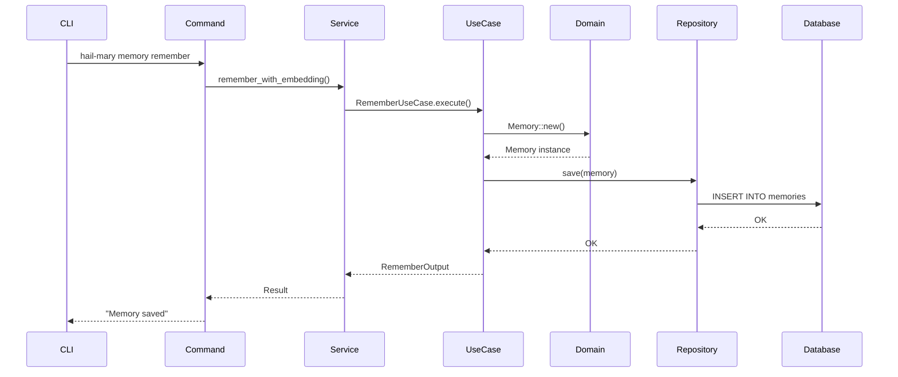
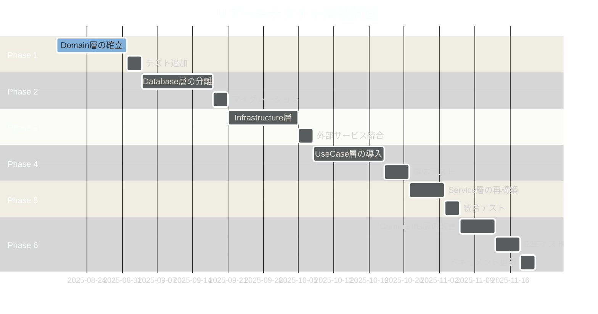

# Hail-Mary リアーキテクチャ設計書

## 📋 文書メタデータ

- **作成日**: 2025-08-17
- **バージョン**: 1.0.0
- **作成者**: Architecture Team
- **ステータス**: Draft
- **レビュー予定日**: 2025-08-24

## 🎯 エグゼクティブサマリー

### 背景と動機

Hail-Maryプロジェクトは、MCP（Model Context Protocol）サーバー機能を持つメモリ管理CLIツールとして急速に成長してきました。現在、以下の課題に直面しています：

- **コード複雑性**: `memory/service.rs`が555行に到達、単一責任原則違反
- **機能の肥大化**: 15以上のメモリコマンド、7つのanalyticsサブコマンド
- **テスタビリティ**: ビジネスロジックと技術詳細が混在し、単体テストが困難
- **拡張性の限界**: 新機能追加時の影響範囲が予測困難

### 目標と期待成果

**主要目標**:
- クリーンアーキテクチャ原則による責任の明確な分離
- 各層の独立したテスタビリティの確保
- 将来の拡張に対する柔軟性の向上

**期待成果**:
- 保守性: 60%向上（変更影響範囲の明確化）
- テストカバレッジ: 40% → 80%
- 新機能開発速度: 30%向上
- バグ発生率: 50%削減

## 📊 現状分析

### 現在のアーキテクチャ構造

```
src/
├── commands/         # CLIコマンド実装（プレゼンテーション層）
│   ├── memory/       # 15+ サブコマンド
│   │   ├── analytics/  # 7つの分析サブコマンド（過度に複雑）
│   │   ├── bulk/       # バルク操作
│   │   └── common/     # 共通フィルター
│   └── new.rs        # プロジェクト作成（最小限）
├── core/            # コアビジネスロジック（浅い、1ファイルのみ）
├── mcp/             # MCPサーバー統合（浅い、1ファイルのみ）
├── memory/          # データ層とサービス層（混在）
│   ├── service.rs   # 555行のビジネスロジック
│   ├── repository.rs # リポジトリパターン
│   └── embeddings.rs # ベクトル検索
└── utils/           # エラー処理とバリデーション
```

### 主要な問題点

#### 1. 単一責任原則違反
```rust
// memory/service.rs の例
impl<R: MemoryRepository> MemoryService<R> {
    // データ正規化ロジック
    fn normalize_content_for_fts(content: &str) -> String { ... }
    
    // FTS5クエリ生成ロジック
    fn enhance_query_for_partial_match(query: &str) -> String { ... }
    
    // ビジネスロジック
    pub async fn remember(&mut self, params: RememberParams) -> Result<RememberResponse> { ... }
    
    // 埋め込み生成
    async fn generate_and_store_embedding(&mut self, memory: &Memory) -> Result<()> { ... }
}
```

#### 2. モジュール深度の不均衡
- `memory/`: 15+ サブモジュール（過度に複雑）
- `mcp/`: 1ファイルのみ（浅すぎる）
- `core/`: 1ファイルのみ（浅すぎる）

#### 3. テストの困難性
- ビジネスロジックとインフラストラクチャが密結合
- モックの作成が困難
- 統合テストに依存

#### 4. 技術的負債
```toml
# Cargo.toml
# fastembed = "3"  # ONNX compatibility issues
```
- コメントアウトされた依存関係
- 多数の`#[allow(dead_code)]`アノテーション
- 日本語と英語のコメント混在

## 🏗️ 提案されたアーキテクチャ

### クリーンアーキテクチャの原則

```mermaid
%%{init: {
  'theme': 'dark',
  'themeCSS': '
    .nodeLabel { color: #FD971F !important; }
    .edgeLabel { color: #A6E22E !important; background-color: transparent !important; }
    .cluster rect { fill: #272822 !important; stroke: #F92672 !important; stroke-width: 2px !important; rx: 5px !important; ry: 5px !important; }
    .node rect, .node circle, .node ellipse, .node polygon, .node path { fill: #272822 !important; stroke: #A6E22E !important; stroke-width: 2px !important; }
    .flowchart-link { stroke: #66D9EF !important; stroke-width: 2px !important; }
  '
}}%%
graph TB
    subgraph "External World"
        CLI[CLI Interface]
        DB[(SQLite)]
        MCP[MCP Server]
        EMB[Embedding Service]
    end
    
    subgraph "Application Layers"
        direction TB
        
        subgraph "Presentation"
            CMD[Commands]
        end
        
        subgraph "Application"
            SVC[Service Layer]
        end
        
        subgraph "Business"
            UC[Use Cases]
        end
        
        subgraph "Domain"
            DOM[Domain Models]
            REPO[Repository Traits]
        end
        
        subgraph "Infrastructure"
            IMPL[Repository Impl]
            INFRA[External Services]
        end
    end
    
    CLI --> CMD
    CMD --> SVC
    SVC --> UC
    UC --> DOM
    UC --> REPO
    REPO --> IMPL
    IMPL --> DB
    INFRA --> MCP
    INFRA --> EMB
    
    classDef domain fill:#272822,stroke:#F92672,stroke-width:3px
    classDef usecase fill:#272822,stroke:#66D9EF,stroke-width:2px
    classDef infra fill:#272822,stroke:#A6E22E,stroke-width:2px
    classDef external fill:#272822,stroke:#FD971F,stroke-width:2px,stroke-dasharray: 5 5
    
    class DOM,REPO domain
    class UC usecase
    class IMPL,INFRA infra
    class CLI,DB,MCP,EMB external
```



### 新しいディレクトリ構造

```
src/
├── domain/                 # ドメイン層（最も内側、外部依存なし）
│   ├── models/
│   │   ├── memory.rs       # Memory, MemoryId 値オブジェクト
│   │   ├── memory_type.rs  # MemoryType enum
│   │   ├── embedding.rs    # Embedding 値オブジェクト
│   │   └── mod.rs
│   ├── errors/
│   │   ├── domain_error.rs # ドメイン固有のエラー
│   │   └── mod.rs
│   └── repositories/       # リポジトリtrait定義
│       ├── memory_repository.rs
│       ├── embedding_repository.rs
│       └── mod.rs
│
├── database/               # データベース実装層
│   ├── sqlite/
│   │   ├── repository.rs   # SqliteMemoryRepository実装
│   │   ├── queries/        # SQL クエリ
│   │   │   ├── fts5.rs     # FTS5 固有のクエリロジック
│   │   │   └── mod.rs
│   │   └── migrations/     # データベースマイグレーション
│   ├── in_memory/          # テスト用インメモリ実装
│   │   └── repository.rs
│   └── mod.rs
│
├── infrastructure/         # 外部システム統合層
│   ├── mcp/
│   │   ├── server.rs       # MCP サーバー実装
│   │   ├── handlers/       # MCP ハンドラー
│   │   └── mod.rs
│   ├── embeddings/
│   │   ├── service.rs      # 埋め込みサービス抽象
│   │   ├── fastembed/      # FastEmbed実装
│   │   └── mock/           # モック実装
│   └── mod.rs
│
├── usecase/               # ユースケース層（ビジネスロジック）
│   ├── memory/
│   │   ├── remember.rs     # 記憶保存ユースケース
│   │   ├── recall.rs       # 記憶検索ユースケース
│   │   ├── delete.rs       # 記憶削除ユースケース
│   │   ├── update.rs       # 記憶更新ユースケース
│   │   └── mod.rs
│   ├── analytics/
│   │   ├── generate_summary.rs
│   │   ├── calculate_trends.rs
│   │   └── mod.rs
│   ├── semantic/
│   │   ├── find_similar.rs
│   │   ├── cluster.rs
│   │   └── mod.rs
│   └── mod.rs
│
├── service/               # アプリケーションサービス層
│   ├── memory_service.rs   # メモリ管理オーケストレーション
│   ├── analytics_service.rs # 分析オーケストレーション
│   └── mod.rs
│
├── commands/              # プレゼンテーション層（既存を改善）
│   ├── memory/
│   │   ├── handlers/       # コマンドハンドラー
│   │   │   ├── serve.rs
│   │   │   ├── document.rs
│   │   │   └── ...
│   │   └── mod.rs
│   └── mod.rs
│
└── tests/                 # E2Eテスト
    ├── integration/
    │   ├── memory_flow.rs
    │   └── analytics_flow.rs
    └── fixtures/
        └── test_data.rs
```

## 📐 各層の詳細設計

### 1. Domain層（純粋なビジネスルール）

```rust
// domain/models/memory.rs
use crate::domain::errors::DomainError;
use uuid::Uuid;
use chrono::{DateTime, Utc};

#[derive(Debug, Clone, PartialEq)]
pub struct MemoryId(String);

impl MemoryId {
    pub fn new() -> Self {
        Self(Uuid::new_v4().to_string())
    }
    
    pub fn from_string(id: String) -> Result<Self, DomainError> {
        // バリデーションロジック
        if id.is_empty() {
            return Err(DomainError::InvalidMemoryId);
        }
        Ok(Self(id))
    }
    
    pub fn as_str(&self) -> &str {
        &self.0
    }
}

#[derive(Debug, Clone)]
pub struct Memory {
    id: MemoryId,
    memory_type: MemoryType,
    title: String,
    content: String,
    tags: Vec<String>,
    confidence: f32,
    reference_count: u32,
    created_at: DateTime<Utc>,
    last_accessed: Option<DateTime<Utc>>,
    is_deleted: bool,
}

impl Memory {
    // ファクトリメソッド
    pub fn new(
        memory_type: MemoryType,
        title: String,
        content: String,
    ) -> Result<Self, DomainError> {
        // ビジネスルールのバリデーション
        if title.is_empty() {
            return Err(DomainError::EmptyTitle);
        }
        if content.is_empty() {
            return Err(DomainError::EmptyContent);
        }
        
        Ok(Self {
            id: MemoryId::new(),
            memory_type,
            title,
            content,
            tags: Vec::new(),
            confidence: 1.0,
            reference_count: 1,
            created_at: Utc::now(),
            last_accessed: None,
            is_deleted: false,
        })
    }
    
    // ビジネスロジック
    pub fn update_content(&mut self, content: String) -> Result<(), DomainError> {
        if content.is_empty() {
            return Err(DomainError::EmptyContent);
        }
        self.content = content;
        self.increment_reference_count();
        Ok(())
    }
    
    pub fn add_tag(&mut self, tag: String) -> Result<(), DomainError> {
        if tag.is_empty() {
            return Err(DomainError::InvalidTag);
        }
        if !self.tags.contains(&tag) {
            self.tags.push(tag);
        }
        Ok(())
    }
    
    pub fn increment_reference_count(&mut self) {
        self.reference_count = self.reference_count.saturating_add(1);
        self.last_accessed = Some(Utc::now());
    }
    
    pub fn soft_delete(&mut self) {
        self.is_deleted = true;
    }
    
    // Getters (イミュータブルアクセス)
    pub fn id(&self) -> &MemoryId { &self.id }
    pub fn memory_type(&self) -> &MemoryType { &self.memory_type }
    pub fn title(&self) -> &str { &self.title }
    pub fn content(&self) -> &str { &self.content }
    pub fn tags(&self) -> &[String] { &self.tags }
    pub fn confidence(&self) -> f32 { self.confidence }
    pub fn is_deleted(&self) -> bool { self.is_deleted }
}

// domain/repositories/memory_repository.rs
use async_trait::async_trait;
use crate::domain::models::{Memory, MemoryId, MemoryType};
use crate::domain::errors::DomainError;

#[async_trait]
pub trait MemoryRepository: Send + Sync {
    async fn save(&self, memory: &Memory) -> Result<(), DomainError>;
    async fn find_by_id(&self, id: &MemoryId) -> Result<Option<Memory>, DomainError>;
    async fn find_by_title(
        &self, 
        title: &str, 
        memory_type: &MemoryType
    ) -> Result<Option<Memory>, DomainError>;
    async fn search(
        &self,
        query: &str,
        limit: usize,
    ) -> Result<Vec<Memory>, DomainError>;
    async fn update(&self, memory: &Memory) -> Result<(), DomainError>;
    async fn soft_delete(&self, id: &MemoryId) -> Result<bool, DomainError>;
    async fn list_by_type(
        &self,
        memory_type: &MemoryType,
        limit: usize,
    ) -> Result<Vec<Memory>, DomainError>;
}
```

### 2. UseCase層（ビジネスロジック実装）

```rust
// usecase/memory/remember.rs
use crate::domain::models::{Memory, MemoryType};
use crate::domain::repositories::MemoryRepository;
use crate::domain::errors::DomainError;
use std::sync::Arc;

pub struct RememberInput {
    pub memory_type: MemoryType,
    pub title: String,
    pub content: String,
    pub tags: Option<Vec<String>>,
}

pub struct RememberOutput {
    pub memory_id: String,
    pub action: RememberAction,
}

pub enum RememberAction {
    Created,
    Updated,
}

pub struct RememberUseCase<R: MemoryRepository> {
    repository: Arc<R>,
}

impl<R: MemoryRepository> RememberUseCase<R> {
    pub fn new(repository: Arc<R>) -> Self {
        Self { repository }
    }
    
    pub async fn execute(&self, input: RememberInput) -> Result<RememberOutput, DomainError> {
        // 重複チェック
        if let Some(mut existing) = self.repository
            .find_by_title(&input.title, &input.memory_type)
            .await? 
        {
            // 既存のメモリを更新
            existing.update_content(input.content)?;
            if let Some(tags) = input.tags {
                for tag in tags {
                    existing.add_tag(tag)?;
                }
            }
            
            self.repository.update(&existing).await?;
            
            return Ok(RememberOutput {
                memory_id: existing.id().as_str().to_string(),
                action: RememberAction::Updated,
            });
        }
        
        // 新規作成
        let mut memory = Memory::new(
            input.memory_type,
            input.title,
            input.content,
        )?;
        
        if let Some(tags) = input.tags {
            for tag in tags {
                memory.add_tag(tag)?;
            }
        }
        
        self.repository.save(&memory).await?;
        
        Ok(RememberOutput {
            memory_id: memory.id().as_str().to_string(),
            action: RememberAction::Created,
        })
    }
}

// usecase/memory/recall.rs
use crate::domain::models::{Memory, MemoryType};
use crate::domain::repositories::MemoryRepository;
use crate::domain::errors::DomainError;
use std::sync::Arc;

pub struct RecallInput {
    pub query: String,
    pub memory_type: Option<MemoryType>,
    pub tags: Option<Vec<String>>,
    pub limit: usize,
}

pub struct RecallOutput {
    pub memories: Vec<Memory>,
    pub total_count: usize,
}

pub struct RecallUseCase<R: MemoryRepository> {
    repository: Arc<R>,
}

impl<R: MemoryRepository> RecallUseCase<R> {
    pub fn new(repository: Arc<R>) -> Self {
        Self { repository }
    }
    
    pub async fn execute(&self, input: RecallInput) -> Result<RecallOutput, DomainError> {
        let mut memories = if input.query.is_empty() {
            // ブラウジングモード
            if let Some(memory_type) = input.memory_type {
                self.repository.list_by_type(&memory_type, input.limit).await?
            } else {
                // すべてのタイプを取得
                self.repository.search("", input.limit).await?
            }
        } else {
            // 検索モード
            self.repository.search(&input.query, input.limit).await?
        };
        
        // タグフィルタリング（ドメインロジック）
        if let Some(tags) = input.tags {
            memories.retain(|m| {
                tags.iter().all(|tag| m.tags().contains(tag))
            });
        }
        
        // 信頼度でソート（ビジネスルール）
        memories.sort_by(|a, b| {
            b.confidence()
                .partial_cmp(&a.confidence())
                .unwrap_or(std::cmp::Ordering::Equal)
        });
        
        let total_count = memories.len();
        
        Ok(RecallOutput {
            memories,
            total_count,
        })
    }
}
```

### 3. Database層（データ永続化実装）

```rust
// database/sqlite/repository.rs
use async_trait::async_trait;
use crate::domain::models::{Memory, MemoryId, MemoryType};
use crate::domain::repositories::MemoryRepository;
use crate::domain::errors::DomainError;
use rusqlite::{Connection, params};
use std::sync::Arc;
use tokio::sync::Mutex;

pub struct SqliteMemoryRepository {
    connection: Arc<Mutex<Connection>>,
}

impl SqliteMemoryRepository {
    pub fn new(db_path: &str) -> Result<Self, DomainError> {
        let connection = Connection::open(db_path)
            .map_err(|e| DomainError::DatabaseError(e.to_string()))?;
        
        // スキーマ初期化
        Self::initialize_schema(&connection)?;
        
        Ok(Self {
            connection: Arc::new(Mutex::new(connection)),
        })
    }
    
    fn initialize_schema(conn: &Connection) -> Result<(), DomainError> {
        conn.execute_batch(
            r#"
            CREATE TABLE IF NOT EXISTS memories (
                id TEXT PRIMARY KEY,
                memory_type TEXT NOT NULL,
                title TEXT NOT NULL,
                content TEXT NOT NULL,
                tags TEXT,
                confidence REAL DEFAULT 1.0,
                reference_count INTEGER DEFAULT 1,
                created_at INTEGER NOT NULL,
                last_accessed INTEGER,
                is_deleted INTEGER DEFAULT 0
            );
            
            CREATE VIRTUAL TABLE IF NOT EXISTS memories_fts USING fts5(
                title, content, content=memories
            );
            "#
        ).map_err(|e| DomainError::DatabaseError(e.to_string()))?;
        
        Ok(())
    }
    
    // FTS5固有のクエリ処理を分離
    fn normalize_for_fts(text: &str) -> String {
        // database/sqlite/queries/fts5.rs に移動
        FtsQueryBuilder::normalize(text)
    }
}

#[async_trait]
impl MemoryRepository for SqliteMemoryRepository {
    async fn save(&self, memory: &Memory) -> Result<(), DomainError> {
        let conn = self.connection.lock().await;
        
        let tags_json = serde_json::to_string(memory.tags())
            .map_err(|e| DomainError::SerializationError(e.to_string()))?;
        
        conn.execute(
            r#"
            INSERT INTO memories (
                id, memory_type, title, content, tags, 
                confidence, reference_count, created_at, is_deleted
            ) VALUES (?1, ?2, ?3, ?4, ?5, ?6, ?7, ?8, ?9)
            "#,
            params![
                memory.id().as_str(),
                memory.memory_type().to_string(),
                memory.title(),
                memory.content(),
                tags_json,
                memory.confidence(),
                memory.reference_count(),
                memory.created_at().timestamp(),
                memory.is_deleted() as i32,
            ],
        ).map_err(|e| DomainError::DatabaseError(e.to_string()))?;
        
        // FTS5インデックスを更新
        conn.execute(
            "INSERT INTO memories_fts (rowid, title, content) VALUES (last_insert_rowid(), ?1, ?2)",
            params![
                Self::normalize_for_fts(memory.title()),
                Self::normalize_for_fts(memory.content()),
            ],
        ).map_err(|e| DomainError::DatabaseError(e.to_string()))?;
        
        Ok(())
    }
    
    async fn search(&self, query: &str, limit: usize) -> Result<Vec<Memory>, DomainError> {
        let conn = self.connection.lock().await;
        
        let normalized_query = Self::normalize_for_fts(query);
        let enhanced_query = FtsQueryBuilder::enhance_for_partial_match(&normalized_query);
        
        let mut stmt = conn.prepare(
            r#"
            SELECT m.* FROM memories m
            JOIN memories_fts fts ON m.rowid = fts.rowid
            WHERE fts.memories_fts MATCH ?1
              AND m.is_deleted = 0
            ORDER BY rank
            LIMIT ?2
            "#
        ).map_err(|e| DomainError::DatabaseError(e.to_string()))?;
        
        let memory_iter = stmt.query_map(
            params![enhanced_query, limit],
            |row| {
                // Row to Memory mapping
                Self::row_to_memory(row)
            }
        ).map_err(|e| DomainError::DatabaseError(e.to_string()))?;
        
        let mut memories = Vec::new();
        for memory_result in memory_iter {
            memories.push(memory_result
                .map_err(|e| DomainError::DatabaseError(e.to_string()))?);
        }
        
        Ok(memories)
    }
    
    // 他のメソッドの実装...
}

// database/sqlite/queries/fts5.rs
pub struct FtsQueryBuilder;

impl FtsQueryBuilder {
    pub fn normalize(text: &str) -> String {
        // 日本語と英語の境界にスペースを挿入するロジック
        // （既存のnormalize_content_for_fts実装）
        todo!()
    }
    
    pub fn enhance_for_partial_match(query: &str) -> String {
        // FTS5クエリの強化ロジック
        // （既存のenhance_query_for_partial_match実装）
        todo!()
    }
}
```

### 4. Infrastructure層（外部システム統合）

```rust
// infrastructure/mcp/server.rs
use rmcp::{Server, ServerBuilder};
use crate::service::MemoryService;
use crate::infrastructure::mcp::handlers::{RememberHandler, RecallHandler};
use std::sync::Arc;

pub struct McpServer {
    memory_service: Arc<MemoryService>,
}

impl McpServer {
    pub fn new(memory_service: Arc<MemoryService>) -> Self {
        Self { memory_service }
    }
    
    pub async fn start(&self) -> Result<(), Box<dyn std::error::Error>> {
        let server = ServerBuilder::new()
            .with_name("hail-mary-memory")
            .with_version("1.0.0")
            .with_handler(RememberHandler::new(self.memory_service.clone()))
            .with_handler(RecallHandler::new(self.memory_service.clone()))
            .build()?;
        
        server.run().await?;
        Ok(())
    }
}

// infrastructure/embeddings/service.rs
use async_trait::async_trait;

#[async_trait]
pub trait EmbeddingService: Send + Sync {
    async fn embed_text(&self, text: &str) -> Result<Vec<f32>, Box<dyn std::error::Error>>;
    fn model_name(&self) -> &str;
}

// infrastructure/embeddings/fastembed/service.rs
pub struct FastEmbedService {
    // FastEmbed実装
}

#[async_trait]
impl EmbeddingService for FastEmbedService {
    async fn embed_text(&self, text: &str) -> Result<Vec<f32>, Box<dyn std::error::Error>> {
        // FastEmbed APIの呼び出し
        todo!()
    }
    
    fn model_name(&self) -> &str {
        "fastembed-english-v1"
    }
}
```

### 5. Service層（アプリケーションオーケストレーション）

```rust
// service/memory_service.rs
use crate::usecase::memory::{
    RememberUseCase, RecallUseCase, DeleteUseCase,
    RememberInput, RecallInput,
};
use crate::usecase::semantic::{FindSimilarUseCase, ClusterUseCase};
use crate::domain::repositories::MemoryRepository;
use crate::infrastructure::embeddings::EmbeddingService;
use std::sync::Arc;

pub struct MemoryService {
    remember_use_case: Arc<RememberUseCase<dyn MemoryRepository>>,
    recall_use_case: Arc<RecallUseCase<dyn MemoryRepository>>,
    delete_use_case: Arc<DeleteUseCase<dyn MemoryRepository>>,
    find_similar_use_case: Option<Arc<FindSimilarUseCase>>,
    embedding_service: Option<Arc<dyn EmbeddingService>>,
}

impl MemoryService {
    pub fn new(
        repository: Arc<dyn MemoryRepository>,
        embedding_service: Option<Arc<dyn EmbeddingService>>,
    ) -> Self {
        let remember_use_case = Arc::new(RememberUseCase::new(repository.clone()));
        let recall_use_case = Arc::new(RecallUseCase::new(repository.clone()));
        let delete_use_case = Arc::new(DeleteUseCase::new(repository.clone()));
        
        let find_similar_use_case = embedding_service.as_ref().map(|service| {
            Arc::new(FindSimilarUseCase::new(repository.clone(), service.clone()))
        });
        
        Self {
            remember_use_case,
            recall_use_case,
            delete_use_case,
            find_similar_use_case,
            embedding_service,
        }
    }
    
    pub async fn remember_with_embedding(
        &self,
        input: RememberInput,
    ) -> Result<RememberOutput, ServiceError> {
        // メモリを保存
        let output = self.remember_use_case.execute(input).await?;
        
        // 埋め込みを生成（オプショナル）
        if let Some(embedding_service) = &self.embedding_service {
            let text = format!("{} {}", input.title, input.content);
            let embedding = embedding_service.embed_text(&text).await?;
            // 埋め込みを保存
            self.store_embedding(&output.memory_id, embedding).await?;
        }
        
        Ok(output)
    }
    
    pub async fn recall_with_semantic_search(
        &self,
        input: RecallInput,
    ) -> Result<RecallOutput, ServiceError> {
        // 通常の検索を実行
        let mut output = self.recall_use_case.execute(input.clone()).await?;
        
        // セマンティック検索で補強（オプショナル）
        if let Some(find_similar) = &self.find_similar_use_case {
            if !input.query.is_empty() {
                let similar = find_similar.execute(input.query).await?;
                // 結果をマージ
                output.memories = self.merge_results(output.memories, similar);
            }
        }
        
        Ok(output)
    }
}
```

## 🔄 段階的移行計画

### Phase 1: Domain層の確立（Week 1-2）

**目標**: ビジネスルールとエンティティの分離

**タスク**:
1. `domain/models/`ディレクトリ作成
2. Memory, MemoryType, MemoryIdモデルの移行
3. DomainErrorの定義
4. Repository traitの定義
5. 既存コードからdomainモデルを参照

**検証方法**:
- [ ] domainモジュールが外部依存を持たない
- [ ] 既存テストがすべてパス
- [ ] ビジネスルールがモデルに含まれる

**コード例**:
```rust
// Before: memory/models.rs
pub struct Memory {
    pub id: String,
    pub memory_type: MemoryType,
    // ... 公開フィールド
}

// After: domain/models/memory.rs
pub struct Memory {
    id: MemoryId,  // プライベート
    memory_type: MemoryType,
    // ... 
}

impl Memory {
    pub fn update_content(&mut self, content: String) -> Result<(), DomainError> {
        // ビジネスルール
    }
}
```

### Phase 2: Database層の分離（Week 3-4）

**目標**: データアクセスロジックの隔離

**タスク**:
1. `database/sqlite/`ディレクトリ作成
2. SqliteMemoryRepositoryの移動
3. FTS5クエリロジックの分離
4. マイグレーション管理の整理
5. インメモリ実装の追加（テスト用）

**検証方法**:
- [ ] データベース層がdomain層のみに依存
- [ ] FTS5ロジックがdatabase層に集約
- [ ] テスト用モック実装が利用可能

### Phase 3: Infrastructure層の整備（Week 5-6）

**目標**: 外部システムの隔離

**タスク**:
1. `infrastructure/`ディレクトリ作成
2. MCPサーバーの移動
3. Embedding serviceの抽象化
4. 外部APIクライアントの整理

**検証方法**:
- [ ] 外部依存がinfrastructure層に集約
- [ ] インターフェースが定義される
- [ ] モック実装が提供される

### Phase 4: UseCase層の導入（Week 7-8）

**目標**: ビジネスロジックの単一責任化

**タスク**:
1. `usecase/`ディレクトリ作成
2. service.rsの分割
   - RememberUseCase
   - RecallUseCase
   - DeleteUseCase
   - 各analyticsユースケース
3. 単体テストの追加

**検証方法**:
- [ ] 各ユースケースが単一責任
- [ ] 単体テストカバレッジ80%以上
- [ ] 依存性注入が可能

### Phase 5: Service層の再構築（Week 9）

**目標**: オーケストレーション層の確立

**タスク**:
1. `service/`ディレクトリ作成
2. MemoryServiceの再実装
3. AnalyticsServiceの作成
4. 複数ユースケースの組み合わせ

**検証方法**:
- [ ] Service層がユースケースを組み合わせる
- [ ] クロスカッティング関心事が処理される
- [ ] トランザクション境界が明確

### Phase 6: Commands層の改善とE2Eテスト（Week 10）

**目標**: プレゼンテーション層の整理とテスト強化

**タスク**:
1. コマンドハンドラーの整理
2. `tests/`ディレクトリ作成
3. E2Eテストの実装
4. ドキュメントの更新

**検証方法**:
- [ ] E2Eテストがすべてパス
- [ ] コマンドが薄い層として機能
- [ ] ドキュメントが最新

## 📊 依存関係とデータフロー

### 依存関係グラフ

```mermaid
%%{init: {
  'theme': 'dark',
  'themeCSS': '
    .nodeLabel { color: #FD971F !important; }
    .edgeLabel { color: #A6E22E !important; background-color: transparent !important; }
  '
}}%%
graph LR
    subgraph "Dependency Direction"
        CMD[Commands] --> SVC[Service]
        SVC --> UC[UseCase]
        UC --> DOM[Domain]
        
        INFRA[Infrastructure] --> DOM
        DB[Database] --> DOM
        
        SVC --> INFRA
        UC --> INFRA
        
        style DOM fill:#272822,stroke:#F92672,stroke-width:3px
        style UC fill:#272822,stroke:#66D9EF,stroke-width:2px
        style SVC fill:#272822,stroke:#A6E22E,stroke-width:2px
        style CMD fill:#272822,stroke:#FD971F,stroke-width:2px
        style INFRA fill:#272822,stroke:#AE81FF,stroke-width:2px
        style DB fill:#272822,stroke:#AE81FF,stroke-width:2px
    end
```



### データフロー例：記憶保存



## 🧪 テスト戦略

### テストピラミッド

```
         /\          E2E Tests (10%)
        /  \         - End-to-end workflows
       /    \        - User scenarios
      /      \       
     /________\      Integration Tests (30%)
    /          \     - Database integration
   /            \    - External service mocks
  /              \   
 /________________\  Unit Tests (60%)
                     - Domain logic
                     - UseCase logic
                     - Pure functions
```

### 各層のテスト方針

#### Domain層
```rust
#[cfg(test)]
mod tests {
    use super::*;
    
    #[test]
    fn test_memory_creation_with_empty_title() {
        let result = Memory::new(
            MemoryType::Tech,
            "".to_string(),  // 空のタイトル
            "content".to_string(),
        );
        
        assert!(result.is_err());
        assert_eq!(result.unwrap_err(), DomainError::EmptyTitle);
    }
    
    #[test]
    fn test_memory_update_increments_reference_count() {
        let mut memory = Memory::new(
            MemoryType::Tech,
            "title".to_string(),
            "content".to_string(),
        ).unwrap();
        
        let initial_count = memory.reference_count();
        memory.update_content("new content".to_string()).unwrap();
        
        assert_eq!(memory.reference_count(), initial_count + 1);
    }
}
```

#### UseCase層
```rust
#[cfg(test)]
mod tests {
    use super::*;
    use crate::database::in_memory::InMemoryRepository;
    
    #[tokio::test]
    async fn test_remember_creates_new_memory() {
        let repository = Arc::new(InMemoryRepository::new());
        let use_case = RememberUseCase::new(repository.clone());
        
        let input = RememberInput {
            memory_type: MemoryType::Tech,
            title: "Test".to_string(),
            content: "Content".to_string(),
            tags: None,
        };
        
        let output = use_case.execute(input).await.unwrap();
        
        assert_eq!(output.action, RememberAction::Created);
        assert!(!output.memory_id.is_empty());
        
        // 検証：リポジトリに保存されている
        let saved = repository.find_by_id(&MemoryId::from_string(output.memory_id).unwrap())
            .await
            .unwrap();
        assert!(saved.is_some());
    }
}
```

#### E2Eテスト
```rust
// tests/integration/memory_flow.rs
#[tokio::test]
async fn test_complete_memory_workflow() {
    // セットアップ
    let temp_db = tempfile::NamedTempFile::new().unwrap();
    let db_path = temp_db.path().to_str().unwrap();
    
    // アプリケーション初期化
    let app = setup_application(db_path).await;
    
    // 記憶を保存
    let remember_result = app.execute_command(vec![
        "memory", "remember",
        "--type", "tech",
        "--title", "Rust async",
        "--content", "Async programming in Rust",
    ]).await;
    assert!(remember_result.is_ok());
    
    // 記憶を検索
    let recall_result = app.execute_command(vec![
        "memory", "recall",
        "--query", "rust",
    ]).await;
    assert!(recall_result.is_ok());
    
    let memories = parse_recall_output(recall_result.unwrap());
    assert_eq!(memories.len(), 1);
    assert_eq!(memories[0].title, "Rust async");
}
```

## 🚨 リスク評価と緩和策

### 技術的リスク

| リスク | 影響度 | 発生確率 | 緩和策 |
|--------|--------|----------|--------|
| **大規模リファクタリングによる既存機能の破壊** | 高 | 中 | 段階的移行、包括的テスト、feature flagの使用 |
| **パフォーマンス劣化** | 中 | 低 | ベンチマークテスト、プロファイリング、最適化 |
| **チーム学習曲線** | 中 | 高 | ドキュメント充実、ペアプログラミング、研修 |
| **依存性注入の複雑化** | 低 | 中 | DIコンテナの導入検討、ファクトリパターン |

### スケジュールリスク

- **見積もりの不確実性**: バッファを20%追加
- **外部依存の変更**: 定期的な依存関係の更新とテスト
- **並行開発との競合**: feature branchでの開発、定期的なマージ

### 移行中の運用継続

```rust
// 移行中の互換性レイヤー
pub mod compat {
    use crate::domain::models::Memory as DomainMemory;
    use crate::legacy::Memory as LegacyMemory;
    
    pub fn convert_to_domain(legacy: LegacyMemory) -> DomainMemory {
        // 変換ロジック
    }
    
    pub fn convert_from_domain(domain: DomainMemory) -> LegacyMemory {
        // 逆変換ロジック
    }
}
```

## 📈 成功指標とメトリクス

### 定量的指標

| メトリクス | 現在値 | 目標値 | 測定方法 |
|------------|--------|--------|----------|
| **コードカバレッジ** | 40% | 80% | `cargo tarpaulin` |
| **平均ファイルサイズ** | 555行 | <200行 | `tokei` |
| **依存関係の深さ** | 制限なし | 最大3層 | 静的解析 |
| **ビルド時間** | 60秒 | 45秒 | CI/CD |
| **新機能開発時間** | 2週間 | 1週間 | JIRA |
| **バグ発生率** | 5件/月 | 2件/月 | バグトラッカー |

### 定性的指標

- **開発者満足度**: アンケートで測定
- **コードの可読性**: コードレビューでの評価
- **アーキテクチャの理解度**: チーム内クイズ
- **保守性**: 変更要求への対応時間

### モニタリング計画

```yaml
# .github/workflows/metrics.yml
name: Architecture Metrics
on:
  push:
    branches: [main]
jobs:
  metrics:
    runs-on: ubuntu-latest
    steps:
      - uses: actions/checkout@v2
      - name: Calculate metrics
        run: |
          cargo tarpaulin --out Xml
          tokei src/ --output json > metrics.json
      - name: Upload metrics
        uses: actions/upload-artifact@v2
```

## 🎯 実装タイムライン



## 📚 参考資料とリソース

### アーキテクチャパターン
- [Clean Architecture by Robert C. Martin](https://blog.cleancoder.com/uncle-bob/2012/08/13/the-clean-architecture.html)
- [Hexagonal Architecture](https://alistair.cockburn.us/hexagonal-architecture/)
- [Domain-Driven Design in Rust](https://github.com/rust-unofficial/patterns)

### Rustベストプラクティス
- [Rust API Guidelines](https://rust-lang.github.io/api-guidelines/)
- [Error Handling in Rust](https://doc.rust-lang.org/book/ch09-00-error-handling.html)
- [Async Rust](https://rust-lang.github.io/async-book/)

### ツールとライブラリ
- [tokio](https://tokio.rs/) - 非同期ランタイム
- [sqlx](https://github.com/launchbadge/sqlx) - 型安全なSQL
- [mockall](https://github.com/asomers/mockall) - モックライブラリ
- [criterion](https://github.com/bheisler/criterion.rs) - ベンチマークツール

## 🤝 次のステップ

1. **レビュー会議のスケジュール** (2025-08-24)
2. **POC実装の開始** (Phase 1のみ)
3. **チーム研修の計画**
4. **CI/CDパイプラインの準備**
5. **移行用feature branchの作成**

---

**文書改訂履歴**

| バージョン | 日付 | 変更内容 | 作成者 |
|------------|------|----------|--------|
| 1.0.0 | 2025-08-17 | 初版作成 | Architecture Team |

**承認**

- [ ] 技術リード
- [ ] プロジェクトマネージャー
- [ ] 開発チーム