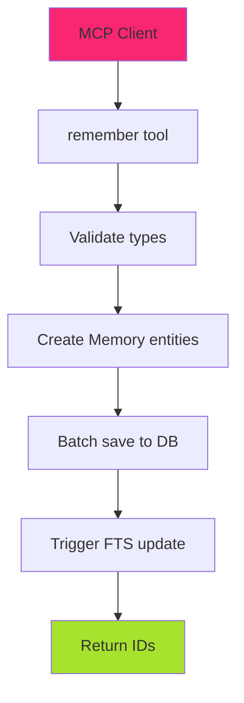
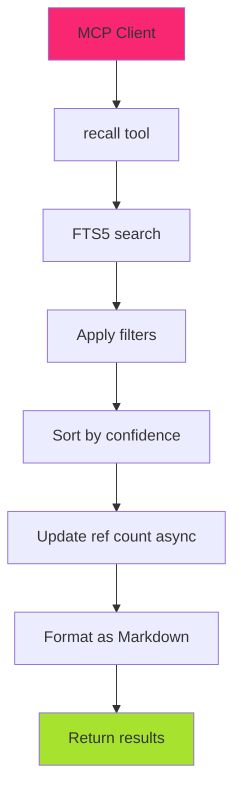

# Hail-Mary Memory MCP v3 - Clean Architecture Design Specification

## Executive Summary

This document presents the complete architectural specification for the Hail-Mary Memory MCP system, combining the Clean Architecture principles from v2 with the Memory MCP v3 features. The design maintains clear separation of concerns with a pragmatic Rust-idiomatic approach, resulting in a maintainable, testable, and extensible system.

## Table of Contents

1. [Overview](#overview)
2. [Architecture](#architecture)
3. [Directory Structure](#directory-structure)
4. [Domain Layer](#domain-layer)
5. [Application Layer](#application-layer)
6. [CLI Layer](#cli-layer)
7. [Infrastructure Layer](#infrastructure-layer)
8. [Database Design](#database-design)
9. [Command Specifications](#command-specifications)
10. [MCP Protocol Integration](#mcp-protocol-integration)
11. [Data Flows](#data-flows)
12. [Testing Strategy](#testing-strategy)
13. [Migration Plan](#migration-plan)

## 1. Overview

### 1.1 Core Concept

Hail-Mary Memory MCP v3 is a sophisticated Rust CLI application that implements:
- **Memory MCP Server**: AI model integration via Model Context Protocol
- **Kiro Project Management**: Specification and documentation system
- **Clean Architecture**: Clear separation of concerns with 4-layer architecture
- **SOLID Principles**: Emphasis on Dependency Inversion Principle
- **Pragmatic Design**: Rust-idiomatic patterns without over-engineering

### 1.2 Design Principles

#### Architecture Principles
- **Dependency Rule**: Dependencies point inward (Domain ← Application ← CLI/Infrastructure)
- **Simplicity First**: Avoid unnecessary abstraction layers
- **Clear Boundaries**: Each layer has distinct responsibilities
- **Testability**: Each component is independently testable

#### Development Principles
- **KISS**: Keep It Simple, Stupid - minimal complexity
- **YAGNI**: You Aren't Gonna Need It - implement only what's needed
- **DRY**: Don't Repeat Yourself - abstract common functionality
- **SOLID**: Single Responsibility, Open/Closed, Liskov Substitution, Interface Segregation, DIP
- **Evolutionary Architecture**: Grow based on actual usage

### 1.3 Key Features

- 📝 **Simple Data Model**: Single table + FTS5 for efficient storage
- 🔍 **High-Speed Search**: SQLite FTS5 with Japanese language support
- 📚 **Document Generation**: Markdown format for organized memories
- 🔄 **Regular Optimization**: Reindex functionality for deduplication
- 🏷️ **Memory Classification**: tech / project-tech / domain categories
- 🚀 **Incremental Implementation**: Value delivery at each phase
- 🏗️ **Clean Architecture**: 4-layer structure with clear responsibilities
- 💉 **Dependency Injection**: Trait-based abstraction for testability
- 🔒 **Immutable Tables**: INSERT-only for simple design
- 📦 **Batch Operations**: Multiple memories saved at once

## 2. Architecture

### 2.1 Layer Structure

```
+-----------------------------------------------------------+
|                      CLI Layer                           |
|              (Commands, User Interaction)                |
+-----------------------------------------------------------+
|                   Application Layer                      |
|          (Use Cases, Business Logic, Ports)             |
+-----------------------------------------------------------+
|                     Domain Layer                         |
|        (Entities, Value Objects, Domain Rules)          |
+-----------------------------------------------------------+
|                 Infrastructure Layer                     |
|    (Database, File System, External Services)           |
+-----------------------------------------------------------+
```

### 2.2 Architecture Diagram

```mermaid
%%{init: {
  'theme': 'dark',
  'themeCSS': '
    .nodeLabel { color: #FD971F !important; }
    .edgeLabel { color: #A6E22E !important; background-color: transparent !important; }
    .cluster rect { fill: #272822 !important; stroke: #F92672 !important; stroke-width: 2px !important; rx: 5px !important; ry: 5px !important; }
    .node rect, .node circle, .node ellipse, .node polygon, .node path { fill: #272822 !important; stroke: #A6E22E !important; stroke-width: 2px !important; }
    .flowchart-link { stroke: #66D9EF !important; stroke-width: 2px !important; }
  '
}}%%

graph TB
    subgraph "Domain Layer"
        Entity[Memory & Project Entities]
        VO[Value Objects]
        DomainError[Domain Errors]
    end
    
    subgraph "Application Layer"
        UC[Use Cases]
        Port[Repository Ports]
        AppError[Application Errors]
    end
    
    subgraph "CLI Layer"
        CMD[Commands]
        FMT[Formatters]
        Args[Arguments]
    end
    
    subgraph "Infrastructure Layer"
        SQLiteRepo[SQLite Repository]
        FSRepo[Filesystem Repository]
        MCP[MCP Server]
        PathMgr[Path Manager]
    end
    
    CMD --> UC
    UC --> Entity
    UC --> Port
    SQLiteRepo -.implements.-> Port
    FSRepo -.implements.-> Port
    SQLiteRepo --> PathMgr
    FSRepo --> PathMgr
    FMT --> CMD
    MCP --> UC
    
    classDef domain fill:#272822,stroke:#F92672,stroke-width:2px;
    classDef application fill:#272822,stroke:#66D9EF,stroke-width:2px;
    classDef cli fill:#272822,stroke:#A6E22E,stroke-width:2px;
    classDef infra fill:#272822,stroke:#FD971F,stroke-width:2px;
    
    class Entity,VO,DomainError domain;
    class UC,Port,AppError application;
    class CMD,FMT,Args cli;
    class SQLiteRepo,FSRepo,MCP,PathMgr infra;
```



### 2.3 Component Responsibilities

#### Domain Layer (Pure Business Logic)
- **Entities**: Memory, Feature, ProjectConfig - core business objects
- **Value Objects**: Confidence - domain-specific types with validation
- **Domain Rules**: Business invariants and validation logic
- **Domain Errors**: Business rule violations

#### Application Layer (Orchestration)
- **Use Cases**: Initialize, Remember, Recall, Document, CreateFeature
- **Repository Ports**: MemoryRepository, ProjectRepository traits
- **Business Logic**: Confidence calculation, Markdown generation
- **Application Errors**: Operation-level errors

#### CLI Layer (User Interface)
- **Commands**: init, new, memory serve/document/reindex
- **Formatters**: Text, JSON, Markdown output formatting
- **Argument Parsing**: Clap-based CLI argument handling

#### Infrastructure Layer (External Services)
- **SQLite Repository**: Database persistence with FTS5
- **Filesystem Repository**: Project structure management
- **MCP Server**: Protocol implementation for AI integration
- **Path Manager**: Centralized path resolution

## 3. Directory Structure

### 3.1 Project Structure

```
src/
├── domain/                          # Pure business logic
│   ├── entities/
│   │   ├── mod.rs
│   │   ├── memory.rs               # Memory entity with UUID, type, content
│   │   ├── feature.rs              # Feature specification entity
│   │   └── project.rs              # Project configuration
│   ├── value_objects/
│   │   ├── mod.rs
│   │   └── confidence.rs           # Confidence value (0.0-1.0)
│   └── errors.rs                   # Domain-specific errors
│
├── application/                     # Business logic orchestration
│   ├── use_cases/
│   │   ├── mod.rs
│   │   ├── initialize_project.rs   # Project initialization logic
│   │   ├── create_feature.rs       # Feature creation logic
│   │   ├── remember_memory.rs      # Store memory logic
│   │   ├── recall_memory.rs        # Retrieve memories logic
│   │   ├── generate_document.rs    # Document generation logic
│   │   └── reindex_memories.rs     # Database optimization logic
│   ├── repositories/               # Repository interfaces (traits)
│   │   ├── mod.rs
│   │   ├── memory_repository.rs    # Memory persistence interface
│   │   └── project_repository.rs   # Project structure interface
│   └── errors.rs                   # Application errors
│
├── cli/                            # Command-line interface
│   ├── mod.rs
│   ├── commands/
│   │   ├── mod.rs
│   │   ├── init.rs                # Init command implementation
│   │   ├── new.rs                 # New feature command
│   │   └── memory.rs              # Memory subcommands
│   ├── formatters.rs              # Output formatting
│   └── args.rs                    # Argument parsing structures
│
├── infrastructure/                 # External services & implementations
│   ├── repositories/
│   │   ├── mod.rs
│   │   ├── memory.rs              # Memory repository (SQLite)
│   │   └── project.rs             # Project repository
│   ├── mcp/
│   │   ├── mod.rs
│   │   └── server.rs              # MCP server implementation
│   ├── filesystem/
│   │   ├── mod.rs
│   │   └── path_manager.rs        # Centralized path management
│   └── migrations/
│       ├── mod.rs
│       └── embedded.rs            # Refinery migrations
│
├── lib.rs                          # Library exports
└── main.rs                         # Application entry point & DI
```

### 3.2 Data Directory Structure

```
.kiro/
├── config.toml                    # Project configuration
├── memory/
│   ├── db.sqlite3                # SQLite database
│   ├── archive/                  # Old database backups
│   ├── tech.md                   # Generated documentation
│   ├── project-tech.md          # Generated documentation
│   └── domain.md                 # Generated documentation
└── specs/
    └── YYYY-MM-dd-feature-name/
        ├── requirements.md        # Feature requirements
        ├── design.md             # Design documentation
        ├── tasks.md              # Task breakdown
        └── spec.json             # JSON specification
```

## 4. Domain Layer

### 4.1 Entities

```rust
// domain/entities/memory.rs
use crate::domain::value_objects::Confidence;
use uuid::Uuid;
use chrono::{DateTime, Utc};

#[derive(Debug, Clone)]
pub struct Memory {
    pub id: Uuid,
    pub memory_type: String,  // Simple string for flexibility
    pub title: String,
    pub content: String,
    pub tags: Vec<String>,
    pub confidence: Confidence,
    pub reference_count: u32,
    pub created_at: DateTime<Utc>,
    pub last_accessed: Option<DateTime<Utc>>,
    pub deleted: bool,
}

impl Memory {
    pub fn new(
        memory_type: String,
        title: String,
        content: String,
    ) -> Self {
        Self {
            id: Uuid::new_v4(),
            memory_type,
            title,
            content,
            tags: Vec::new(),
            confidence: Confidence::default(),
            reference_count: 0,
            created_at: Utc::now(),
            last_accessed: None,
            deleted: false,
        }
    }

    pub fn with_tags(mut self, tags: Vec<String>) -> Self {
        self.tags = tags;
        self
    }

    pub fn with_confidence(mut self, confidence: Confidence) -> Self {
        self.confidence = confidence;
        self
    }
}

// domain/entities/project.rs
#[derive(Debug, Clone)]
pub struct ProjectConfig {
    pub memory_types: Vec<String>,
    pub instructions: String,
    pub document_format: DocumentFormat,
    pub database_path: PathBuf,
}

impl ProjectConfig {
    pub fn default_for_new_project() -> Self {
        Self {
            memory_types: vec![
                "tech".to_string(),
                "project-tech".to_string(),
                "domain".to_string(),
                "workflow".to_string(),
                "decision".to_string(),
            ],
            instructions: DEFAULT_INSTRUCTIONS.to_string(),
            document_format: DocumentFormat::Markdown,
            database_path: PathBuf::from(".kiro/memory/db.sqlite3"),
        }
    }
    
    pub fn validate_memory_type(&self, memory_type: &str) -> bool {
        self.memory_types.contains(&memory_type.to_string())
    }
}
```

### 4.2 Value Objects

```rust
// domain/value_objects/confidence.rs
#[derive(Debug, Clone)]
pub struct Confidence(f32);

impl Confidence {
    pub fn new(value: f32) -> Result<Self, DomainError> {
        if value < 0.0 || value > 1.0 {
            return Err(DomainError::InvalidConfidence(value));
        }
        Ok(Self(value))
    }

    pub fn value(&self) -> f32 {
        self.0
    }
}

impl Default for Confidence {
    fn default() -> Self {
        Self(1.0)
    }
}

// Note: MemoryType is just a String and doesn't need a value object
// Memory types are defined in config.toml and validated at the application layer
```

## 5. Application Layer

### 5.1 Use Cases

```rust
// application/use_cases/remember_memory.rs
use crate::application::repositories::MemoryRepository;
use crate::domain::entities::Memory;
use crate::domain::value_objects::Confidence;

pub struct RememberRequest {
    pub memory_type: String,
    pub title: String,
    pub content: String,
    pub tags: Vec<String>,
    pub confidence: Option<f32>,
}

pub fn remember_memory(
    repository: &mut impl MemoryRepository,
    config: &ProjectConfig,
    requests: Vec<RememberRequest>,
) -> Result<Vec<Memory>, ApplicationError> {
    let mut memories = Vec::new();
    
    for request in requests {
        // Validate memory type against configuration
        if !config.validate_memory_type(&request.memory_type) {
            return Err(ApplicationError::InvalidMemoryType(request.memory_type));
        }
        
        // Create memory entity
        let confidence = match request.confidence {
            Some(c) => Confidence::new(c)?,
            None => Confidence::default(),
        };
        
        let memory = Memory::new(request.memory_type, request.title, request.content)
            .with_tags(request.tags)
            .with_confidence(confidence);
        
        memories.push(memory);
    }
    
    // Batch save to repository
    repository.save_batch(&memories)?;
    
    Ok(memories)
}

// application/use_cases/recall_memory.rs
pub fn recall_memory(
    repository: &impl MemoryRepository,
    query: &str,
    limit: usize,
    type_filter: Option<String>,
    tag_filter: Vec<String>,
) -> Result<String, ApplicationError> {
    // FTS5 search
    let mut memories = repository.search_fts(query, limit)?;
    
    // Apply filters
    if let Some(memory_type) = type_filter {
        memories.retain(|m| m.memory_type == memory_type);
    }
    
    if !tag_filter.is_empty() {
        memories.retain(|m| {
            tag_filter.iter().any(|tag| m.tags.contains(tag))
        });
    }
    
    // Sort by confidence and reference count
    memories.sort_by(|a, b| {
        b.confidence.value().partial_cmp(&a.confidence.value()).unwrap()
            .then(b.reference_count.cmp(&a.reference_count))
    });
    
    // Update reference counts asynchronously
    let ids: Vec<Uuid> = memories.iter().map(|m| m.id).collect();
    tokio::spawn(async move {
        // Update reference counts in background
    });
    
    // Format as Markdown
    Ok(format_as_markdown(&memories))
}
```

### 5.2 Repository Interfaces

```rust
// application/repositories/memory_repository.rs
use crate::domain::entities::Memory;

pub trait MemoryRepository: Send + Sync {
    fn save(&mut self, memory: &Memory) -> Result<()>;
    fn save_batch(&mut self, memories: &[Memory]) -> Result<()>;
    fn find_by_id(&self, id: &Uuid) -> Result<Option<Memory>>;
    fn search_fts(&self, query: &str, limit: usize) -> Result<Vec<Memory>>;
    fn find_all(&self) -> Result<Vec<Memory>>;
    fn increment_reference_count(&mut self, id: &Uuid) -> Result<()>;
}

// application/repositories/project_repository.rs
pub trait ProjectRepository: Send + Sync {
    fn initialize(&self) -> Result<()>;
    fn exists(&self) -> Result<bool>;
    fn save_config(&self, config: &ProjectConfig) -> Result<()>;
    fn load_config(&self) -> Result<ProjectConfig>;
    fn update_gitignore(&self) -> Result<()>;
    fn create_feature(&self, name: &str) -> Result<()>;
}
```

## 6. CLI Layer

### 6.1 Command Structure

```rust
// cli/commands/mod.rs
use clap::{Parser, Subcommand};

#[derive(Parser)]
#[command(name = "hail-mary")]
#[command(about = "Memory MCP and project management system")]
pub struct Cli {
    #[command(subcommand)]
    pub command: Commands,
}

#[derive(Subcommand)]
pub enum Commands {
    /// Initialize a new project
    Init {
        #[arg(short, long)]
        force: bool,
    },
    
    /// Create a new feature specification
    New {
        /// Feature name in kebab-case
        name: String,
    },
    
    /// Memory operations
    Memory {
        #[command(subcommand)]
        command: MemoryCommands,
    },
}

#[derive(Subcommand)]
pub enum MemoryCommands {
    /// Start MCP server
    Serve,
    
    /// Generate documentation
    Document {
        #[arg(short, long)]
        r#type: Option<String>,
    },
    
    /// Reindex database
    Reindex {
        #[arg(long)]
        dry_run: bool,
        
        #[arg(short, long)]
        verbose: bool,
    },
}
```

## 7. Infrastructure Layer

### 7.1 SQLite Repository Implementation

```rust
// infrastructure/repositories/memory.rs
use crate::application::repositories::MemoryRepository as MemoryRepositoryTrait;
use crate::domain::entities::Memory;
use rusqlite::{Connection, Transaction, params};
use std::sync::Mutex;

pub struct MemoryRepository {
    conn: Mutex<Connection>,
}

impl MemoryRepository {
    pub fn new(db_path: &Path) -> Result<Self> {
        let mut conn = Connection::open(db_path)?;
        
        // Set pragmas for performance
        conn.pragma_update(None, "foreign_keys", "ON")?;
        conn.pragma_update(None, "journal_mode", "WAL")?;
        conn.pragma_update(None, "synchronous", "NORMAL")?;
        
        // Run migrations
        mod embedded {
            use refinery::embed_migrations;
            embed_migrations!("./migrations");
        }
        embedded::migrations::runner().run(&mut conn)?;
        
        Ok(Self {
            conn: Mutex::new(conn),
        })
    }
}

impl MemoryRepositoryTrait for MemoryRepository {
    fn save(&mut self, memory: &Memory) -> Result<()> {
        let conn = self.conn.lock().unwrap();
        let tx = conn.transaction()?;
        
        tx.execute(
            r#"
            INSERT INTO memories (
                id, type, title, tags, content, 
                reference_count, confidence, created_at, last_accessed, deleted
            ) VALUES (?1, ?2, ?3, ?4, ?5, ?6, ?7, ?8, ?9, ?10)
            "#,
            params![
                memory.id.to_string(),
                memory.memory_type.to_string(),
                memory.title,
                memory.tags.join(","),
                memory.content,
                memory.reference_count,
                memory.confidence.value(),
                memory.created_at.timestamp(),
                memory.last_accessed.map(|t| t.timestamp()),
                memory.deleted as i32,
            ],
        )?;
        
        tx.commit()?;
        Ok(())
    }
    
    fn search_fts(&self, query: &str, limit: usize) -> Result<Vec<Memory>> {
        let conn = self.conn.lock().unwrap();
        let mut stmt = conn.prepare(
            r#"
            SELECT m.* FROM memories m
            JOIN memories_fts f ON m.id = f.memory_id
            WHERE f.memories_fts MATCH ?1
            AND m.deleted = 0
            ORDER BY rank
            LIMIT ?2
            "#
        )?;
        
        let memory_iter = stmt.query_map(params![query, limit], |row| {
            Memory::from_row(row)
        })?;
        
        memory_iter.collect::<rusqlite::Result<Vec<_>>>()
            .map_err(|e| e.into())
    }
}
```

### 7.2 Project Repository Implementation

```rust
// infrastructure/repositories/project.rs
use crate::application::repositories::ProjectRepository as ProjectRepositoryTrait;
use crate::domain::entities::ProjectConfig;
use crate::infrastructure::filesystem::PathManager;
use serde::{Deserialize, Serialize};
use std::fs;
use std::io::Write;
use std::path::{Path, PathBuf};

// Type-safe TOML configuration structures
#[derive(Debug, Serialize, Deserialize)]
struct TomlConfig {
    memory: MemoryConfig,
}

#[derive(Debug, Serialize, Deserialize)]
struct MemoryConfig {
    types: Vec<String>,
    instructions: String,
    document: DocumentConfig,
    database: DatabaseConfig,
}

#[derive(Debug, Serialize, Deserialize)]
struct DocumentConfig {
    output_dir: String,
    format: String,
}

#[derive(Debug, Serialize, Deserialize)]
struct DatabaseConfig {
    path: String,
}

pub struct ProjectRepository {
    path_manager: PathManager,
}

impl ProjectRepository {
    pub fn new(path_manager: PathManager) -> Self {
        Self { path_manager }
    }
}

impl ProjectRepositoryTrait for ProjectRepository {
    fn initialize(&self) -> Result<()> {
        // Create .kiro directory structure
        let kiro_dir = self.path_manager.kiro_dir(true);
        fs::create_dir_all(&kiro_dir)?;
        
        // Create subdirectories
        let memory_dir = self.path_manager.memory_dir(true);
        fs::create_dir_all(&memory_dir)?;
        
        let specs_dir = self.path_manager.specs_dir(true);
        fs::create_dir_all(&specs_dir)?;
        
        Ok(())
    }
    
    fn exists(&self) -> Result<bool> {
        Ok(self.path_manager.kiro_dir(true).exists())
    }
    
    fn save_config(&self, config: &ProjectConfig) -> Result<()> {
        let config_path = self.path_manager.config_path(true);
        
        // Create type-safe TOML structure
        let toml_config = TomlConfig {
            memory: MemoryConfig {
                types: config.memory_types.clone(),
                instructions: config.instructions.clone(),
                document: DocumentConfig {
                    output_dir: self.path_manager.memory_dir(false).display().to_string(),
                    format: "markdown".to_string(),
                },
                database: DatabaseConfig {
                    path: self.path_manager.memory_db_path(false).display().to_string(),
                },
            },
        };
        
        // Serialize to TOML
        let config_content = toml::to_string_pretty(&toml_config)?;
        fs::write(config_path, config_content)?;
        Ok(())
    }
    
    fn load_config(&self) -> Result<ProjectConfig> {
        let config_path = self.path_manager.config_path(true);
        
        if !config_path.exists() {
            // Return default config if file doesn't exist
            return Ok(ProjectConfig::default_for_new_project());
        }
        
        let content = fs::read_to_string(config_path)?;
        
        // Type-safe deserialization
        let toml_config: TomlConfig = toml::from_str(&content)?;
        
        // Convert to domain entity
        Ok(ProjectConfig {
            memory_types: toml_config.memory.types,
            instructions: toml_config.memory.instructions,
            document_format: DocumentFormat::Markdown,
            database_path: PathBuf::from(toml_config.memory.database.path),
        })
    }
    
    fn update_gitignore(&self) -> Result<()> {
        let gitignore_path = self.path_manager.project_root().join(".gitignore");
        
        let mut content = if gitignore_path.exists() {
            fs::read_to_string(&gitignore_path)?
        } else {
            String::new()
        };
        
        // Get relative paths for database files
        let db_path = self.path_manager.memory_db_path(false);
        let db_pattern = format!("{}", db_path.display());
        
        // Add .kiro database exclusions if not present
        if !content.contains(&db_pattern) {
            content.push_str("\n# Hail-Mary database\n");
            content.push_str(&format!("{}\n", db_pattern));
            
            // Add pattern for WAL and SHM files
            let memory_dir = self.path_manager.memory_dir(false);
            content.push_str(&format!("{}/*.sqlite3-*\n", memory_dir.display()));
        }
        
        fs::write(gitignore_path, content)?;
        Ok(())
    }
    
    fn create_feature(&self, name: &str) -> Result<()> {
        // Generate directory name with date prefix
        let date = chrono::Utc::now().format("%Y-%m-%d");
        let feature_name = format!("{}-{}", date, name);
        let feature_dir = self.path_manager.specs_dir(true).join(&feature_name);
        
        // Check if feature already exists
        if feature_dir.exists() {
            return Err(ApplicationError::FeatureAlreadyExists(name.to_string()));
        }
        
        // Create feature directory
        fs::create_dir_all(&feature_dir)?;
        
        // Create template files
        let requirements_content = format!(r#"# Requirements

## Overview
[Feature description for {}]

## User Stories
- As a [user type], I want to [action] so that [benefit]

## Acceptance Criteria
- [ ] Criterion 1
- [ ] Criterion 2

## Technical Requirements
- Database changes
- API endpoints
- UI components
"#, name);
        
        let design_content = format!(r#"# Design

## Architecture
[Architecture overview for {}]

## Components
[Component descriptions]

## Data Flow
[Data flow diagrams]
"#, name);
        
        let task_content = r#"# Tasks

## Implementation Tasks
- [ ] Task 1
- [ ] Task 2
- [ ] Task 3

## Testing Tasks
- [ ] Unit tests
- [ ] Integration tests
- [ ] E2E tests
"#;
        
        // Write template files
        fs::write(feature_dir.join("requirements.md"), requirements_content)?;
        fs::write(feature_dir.join("design.md"), design_content)?;
        fs::write(feature_dir.join("tasks.md"), task_content)?;
        fs::write(feature_dir.join("spec.json"), "{}")?;
        
        Ok(())
    }
}
```

### 7.3 Path Manager Implementation

```rust
// infrastructure/filesystem/path_manager.rs
use std::path::{Path, PathBuf};
use std::env;

pub struct PathManager {
    project_root: PathBuf,
}

impl PathManager {
    pub fn new(project_root: PathBuf) -> Self {
        Self { project_root }
    }
    
    pub fn discover() -> Result<Self> {
        let mut current_dir = env::current_dir()?;
        
        // Walk up directory tree to find .git (project root)
        loop {
            let git_dir = current_dir.join(".git");
            if git_dir.exists() {
                // Found project root with .git
                return Ok(Self::new(current_dir));
            }
            
            if !current_dir.pop() {
                return Err(ApplicationError::ProjectNotFound);
            }
        }
    }
    
    pub fn project_root(&self) -> &Path {
        &self.project_root
    }
    
    pub fn kiro_dir(&self, absolute: bool) -> PathBuf {
        if absolute {
            self.project_root.join(".kiro")
        } else {
            PathBuf::from(".kiro")
        }
    }
    
    pub fn config_path(&self, absolute: bool) -> PathBuf {
        if absolute {
            self.kiro_dir(true).join("config.toml")
        } else {
            PathBuf::from(".kiro/config.toml")
        }
    }
    
    pub fn specs_dir(&self, absolute: bool) -> PathBuf {
        if absolute {
            self.kiro_dir(true).join("specs")
        } else {
            PathBuf::from(".kiro/specs")
        }
    }
    
    pub fn memory_dir(&self, absolute: bool) -> PathBuf {
        if absolute {
            self.kiro_dir(true).join("memory")
        } else {
            PathBuf::from(".kiro/memory")
        }
    }
    
    pub fn memory_db_path(&self, absolute: bool) -> PathBuf {
        if absolute {
            self.memory_dir(true).join("db.sqlite3")
        } else {
            PathBuf::from(".kiro/memory/db.sqlite3")
        }
    }
}
```

### 7.4 MCP Server Implementation

```rust
// infrastructure/mcp/server.rs
use rmcp::{
    handler::server::{router::tool::ToolRouter, tool::Parameters},
    tool, tool_handler, tool_router,
    transport::stdio,
    serve_server,
};
use std::sync::{Arc, Mutex};

#[derive(Clone)]
pub struct MemoryMcpServer {
    service: Arc<Mutex<MemoryService>>,
    tool_router: ToolRouter<Self>,
}

#[tool_handler(router = self.tool_router)]
impl rmcp::ServerHandler for MemoryMcpServer {}

#[tool_router(router = tool_router)]
impl MemoryMcpServer {
    pub fn new(service: MemoryService) -> Self {
        Self {
            service: Arc::new(Mutex::new(service)),
            tool_router: Self::tool_router(),
        }
    }
    
    #[tool(name = "remember", description = "Store memories for future recall")]
    pub async fn remember(
        &self,
        params: Parameters<RememberParams>,
    ) -> Result<Json<RememberResponse>, McpError> {
        let service = self.service.lock().unwrap();
        let memories = service.remember_batch(params.0.memories)?;
        
        Ok(Json(RememberResponse {
            memory_ids: memories.iter().map(|m| m.id.to_string()).collect(),
            created_count: memories.len(),
        }))
    }
    
    #[tool(name = "recall", description = "Search and retrieve stored memories")]
    pub async fn recall(
        &self,
        params: Parameters<RecallParams>,
    ) -> Result<Json<RecallResponse>, McpError> {
        let service = self.service.lock().unwrap();
        let markdown = service.recall(
            &params.0.query,
            params.0.limit.unwrap_or(10),
            params.0.r#type,
            params.0.tags.unwrap_or_default(),
        )?;
        
        Ok(Json(RecallResponse {
            content: markdown,
            total_count: 0, // Would be calculated
        }))
    }
}
```

## 8. Database Design

### 8.1 Schema

```sql
-- Main table (immutable design - INSERT only)
CREATE TABLE memories (
    id TEXT PRIMARY KEY,              -- UUID v4
    type TEXT NOT NULL,               -- Memory category from config
    title TEXT NOT NULL,              -- Human-readable title
    tags TEXT,                        -- Comma-separated tags
    content TEXT NOT NULL,            -- Main content
    reference_count INTEGER DEFAULT 0, -- Access count
    confidence REAL DEFAULT 1.0       -- Confidence score (0.0-1.0)
        CHECK(confidence >= 0 AND confidence <= 1),
    created_at INTEGER DEFAULT (unixepoch()),
    last_accessed INTEGER,            -- Last access timestamp
    deleted INTEGER DEFAULT 0         -- Logical deletion flag
);

-- FTS5 full-text search index
CREATE VIRTUAL TABLE memories_fts USING fts5(
    memory_id UNINDEXED,              -- Not searchable
    title,                            -- Searchable
    tags,                             -- Searchable
    content,                          -- Searchable
    tokenize = 'porter unicode61'     -- Japanese support
);

-- Performance indexes
CREATE INDEX idx_memories_type 
    ON memories(type) 
    WHERE deleted = 0;

CREATE INDEX idx_memories_ref_count 
    ON memories(reference_count DESC) 
    WHERE deleted = 0;

CREATE INDEX idx_memories_created 
    ON memories(created_at DESC) 
    WHERE deleted = 0;
```

### 8.2 Triggers for FTS Maintenance

```sql
-- Insert trigger
CREATE TRIGGER memories_ai AFTER INSERT ON memories
WHEN NEW.deleted = 0
BEGIN
    INSERT INTO memories_fts(memory_id, title, tags, content)
    VALUES (NEW.id, NEW.title, NEW.tags, NEW.content);
END;

-- Update trigger
CREATE TRIGGER memories_au AFTER UPDATE ON memories
WHEN NEW.deleted = 0 AND OLD.deleted = 0
BEGIN
    UPDATE memories_fts 
    SET title = NEW.title, tags = NEW.tags, content = NEW.content
    WHERE memory_id = NEW.id;
END;

-- Soft delete trigger
CREATE TRIGGER memories_soft_delete AFTER UPDATE ON memories
WHEN NEW.deleted = 1 AND OLD.deleted = 0
BEGIN
    DELETE FROM memories_fts WHERE memory_id = NEW.id;
END;
```

### 8.3 Migration Strategy (Refinery)

```
migrations/
├── V001__initial_schema.sql       # Base table structure
├── V002__add_fts5_index.sql       # FTS5 virtual table
└── V003__add_triggers.sql         # Automatic sync triggers
```

## 9. Command Specifications

### 9.1 `hail-mary init` - Initialize Project

**Purpose**: Creates .kiro directory structure and configuration

**Data Flow**:
```
CLI Input → InitCommand
    → Check existing .kiro
    → Create directory structure
    → Generate config.toml
    → Update .gitignore
    → Return success
```

**Generated Files**:
- `.kiro/config.toml` - Project configuration
- `.kiro/memory/` - Memory storage directory
- `.gitignore` - Updated with database exclusions

### 9.2 `hail-mary new <name>` - Create Feature

**Purpose**: Creates feature specification directory with templates

**Validation**:
- Name must be kebab-case
- No duplicates allowed

**Generated Structure**:
```
.kiro/specs/YYYY-MM-dd-feature-name/
├── requirements.md
├── design.md
├── tasks.md
└── spec.json
```

### 9.3 `hail-mary memory serve` - Start MCP Server

**Purpose**: Launches Memory MCP server for AI integration

**Protocol Details**:
- Transport: stdio (JSON-RPC)
- Tools: remember, recall
- Async: tokio runtime

**Server Initialization**:
```
Load Config → Initialize Repository → Create Service → Start MCP Server
```

### 9.4 `hail-mary memory document` - Generate Documentation

**Purpose**: Creates Markdown documentation from memories

**Process**:
```
Query All Memories → Group by Type → Sort by Confidence → Generate Markdown → Write Files
```

**Output Format**:
```markdown
# [Type] Memories

## [Title]
**ID**: [UUID]
**Tags**: tag1, tag2
**Confidence**: 0.95
**References**: 12

[Content]

---
```

### 9.5 `hail-mary memory reindex` - Optimize Database

**Purpose**: Database maintenance and optimization (Phase 3)

**Operations** (Planned):
- Duplicate detection
- Logical deletion cleanup
- FTS5 index rebuild
- Database vacuum

## 10. MCP Protocol Integration

### 10.1 Tool Schemas

#### Remember Tool
```json
{
  "name": "remember",
  "description": "Store memories for future recall",
  "parameters": {
    "memories": [{
      "type": "string",
      "title": "string",
      "content": "string",
      "tags": ["string"],
      "confidence": 0.0-1.0
    }]
  }
}
```

#### Recall Tool
```json
{
  "name": "recall",
  "description": "Search and retrieve stored memories",
  "parameters": {
    "query": "string",
    "type": "string",
    "tags": ["string"],
    "limit": 10
  }
}
```

### 10.2 Error Handling

- **INVALID_PARAMS (-32602)**: Invalid memory type or malformed input
- **INTERNAL_ERROR (-32603)**: Database or service layer errors

## 11. Data Flows

### 11.1 Remember Flow



### 11.2 Recall Flow



## 12. Testing Strategy

### 12.1 Test Categories

1. **Unit Tests**: Domain logic, value object validation
2. **Integration Tests**: Repository implementations, database operations
3. **End-to-End Tests**: Command execution, file generation
4. **Performance Tests**: FTS5 search, batch operations

### 12.2 Test Infrastructure

```rust
// Domain layer tests - No dependencies
#[cfg(test)]
mod domain_tests {
    #[test]
    fn test_confidence_validation() {
        assert!(Confidence::new(0.5).is_ok());
        assert!(Confidence::new(1.5).is_err());
    }
    
    #[test]
    fn test_memory_creation() {
        let memory = Memory::new(
            "tech".to_string(),
            "Test".to_string(),
            "Content".to_string(),
        );
        assert_eq!(memory.reference_count, 0);
    }
}

// Integration tests with temporary database
#[cfg(test)]
mod integration_tests {
    use tempfile::tempdir;
    
    #[test]
    fn test_sqlite_repository() {
        let dir = tempdir().unwrap();
        let db_path = dir.path().join("test.db");
        let mut repo = MemoryRepository::new(&db_path).unwrap();
        
        let memory = Memory::new(/*...*/);
        assert!(repo.save(&memory).is_ok());
        
        let found = repo.find_by_id(&memory.id).unwrap();
        assert!(found.is_some());
    }
}
```

### 12.3 Mock Repository for Testing

```rust
#[cfg(test)]
pub struct MockMemoryRepository {
    memories: HashMap<Uuid, Memory>,
}

#[cfg(test)]
impl MemoryRepository for MockMemoryRepository {
    fn save(&mut self, memory: &Memory) -> Result<()> {
        self.memories.insert(memory.id, memory.clone());
        Ok(())
    }
    
    fn find_by_id(&self, id: &Uuid) -> Result<Option<Memory>> {
        Ok(self.memories.get(id).cloned())
    }
}
```

## 13. Migration Plan

### Phase 1: Foundation (Week 1)
- [ ] Domain layer implementation
- [ ] Value objects with validation
- [ ] Basic entities

### Phase 2: Business Logic (Week 2)
- [ ] Repository traits
- [ ] Use case implementations
- [ ] Service layer

### Phase 3: Infrastructure (Week 3)
- [ ] SQLite repository
- [ ] Filesystem repository
- [ ] MCP server implementation
- [ ] Database migrations

### Phase 4: CLI & Integration (Week 4)
- [ ] Command implementations
- [ ] Formatters
- [ ] Dependency injection setup
- [ ] End-to-end testing

### Phase 5: Optimization (Week 5)
- [ ] Performance tuning
- [ ] Documentation
- [ ] Deployment preparation

## 14. Configuration

### 14.1 Sample config.toml

```toml
[memory]
types = [
    "tech",           # Technical knowledge
    "project-tech",   # Project-specific technical
    "domain",         # Domain knowledge
    "workflow",       # Development workflows
    "decision",       # Architecture decisions
]

instructions = """
Memory MCP Server v3

Available memory types:
- tech: General technical knowledge (languages, frameworks, algorithms)
- project-tech: This project's specific technical implementation
- domain: Business domain knowledge and requirements
- workflow: Development workflows and processes
- decision: Architecture decisions and their rationale
"""

[memory.document]
output_dir = ".kiro/memory"
format = "markdown"

[memory.database]
path = ".kiro/memory/db.sqlite3"
```

## 15. Performance Targets

| Operation | Target Time | Notes |
|-----------|------------|-------|
| remember | < 50ms | Single INSERT |
| recall (FTS) | < 100ms | 1000 records |
| document generation | < 1s | 1000 records |
| reindex | < 30s | 1000 records |

## 16. Security & Privacy

- **Local Processing**: No external API calls
- **Data Protection**: Appropriate file permissions
- **Sensitive Information**: Manual review recommended
- **Archival**: Logical deletion preserves history

## 17. Key Benefits

### Architecture Benefits
- **30% less nesting** compared to complex architectures
- **Clear separation** of concerns across 4 layers
- **Rust-idiomatic** patterns throughout
- **Testable** at every layer

### Operational Benefits
- **High performance** with SQLite FTS5
- **Japanese support** out of the box
- **Batch operations** for efficiency
- **Async reference counting** for non-blocking updates

### Development Benefits
- **Dependency injection** for flexibility
- **Repository pattern** for swappable implementations
- **Clean interfaces** between layers
- **Comprehensive testing** strategy

## 18. Type-Safe Configuration Example

### Before (String-based indexing)
```rust
// Error-prone string indexing
let database_path = config["memory"]["database"]["path"]
    .as_str()
    .unwrap_or(".kiro/memory/db.sqlite3");

// Runtime errors if keys don't exist
let types = config["memory"]["types"];  // Panics if missing
```

### After (Type-safe with Serde)
```rust
// Type-safe access with compile-time checking
let toml_config: TomlConfig = toml::from_str(&content)?;
let database_path = toml_config.memory.database.path;

// IDE autocomplete and refactoring support
let types = toml_config.memory.types;  // Vec<String> guaranteed

// Example usage in application code
fn process_config(config: &TomlConfig) {
    // Direct field access with proper types
    println!("Database: {}", config.memory.database.path);
    println!("Types: {:?}", config.memory.types);
    
    // No need for unwrap() or default values
    for memory_type in &config.memory.types {
        // memory_type is guaranteed to be String
        create_index_for_type(memory_type);
    }
}
```

### Benefits of Type-Safe Configuration
1. **Compile-time validation**: Errors caught during compilation
2. **IDE support**: Autocomplete, refactoring, and type hints
3. **No runtime panics**: All fields are guaranteed to exist
4. **Clear documentation**: Structs serve as schema documentation
5. **Easier testing**: Can construct config structs directly

## 19. Conclusion

This design combines the best of Clean Architecture principles with pragmatic Rust development practices. The result is a maintainable, testable, and performant system that can grow with the project's needs while maintaining simplicity and clarity.

The Memory MCP v3 system provides:
- Robust memory management for AI models
- Clean architectural boundaries
- Type-safe configuration management
- Excellent performance characteristics
- Full Japanese language support
- Comprehensive testing capabilities
- Clear migration path from existing systems

The design ensures that each component has a single, well-defined responsibility, making the system easy to understand, modify, and extend as requirements evolve.