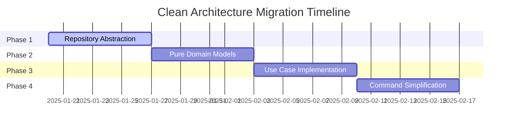

# Clean Architecture Redesign for Hail-Mary

## Executive Summary

This document outlines the comprehensive architectural redesign of the Hail-Mary project to achieve full Clean Architecture compliance. The current codebase exhibits several architectural violations including domain layer contamination with infrastructure concerns, business logic scattered across presentation layers, and unclear boundaries between layers. This redesign establishes clear separation of concerns, improves testability, and ensures long-term maintainability.

## Table of Contents

1. [Current Architecture Analysis](#current-architecture-analysis)
2. [Target Architecture](#target-architecture)
3. [Layer Responsibilities](#layer-responsibilities)
4. [Implementation Strategy](#implementation-strategy)
5. [Detailed Design](#detailed-design)
6. [Migration Plan](#migration-plan)
7. [Testing Strategy](#testing-strategy)
8. [Risk Assessment](#risk-assessment)

## Current Architecture Analysis

### Identified Problems

#### 1. Domain Layer Contamination
The domain models contain infrastructure concerns, violating the core principle of Clean Architecture:

```rust
// VIOLATION: Domain model with file system dependency
pub struct KiroConfig {
    pub root_dir: PathBuf,  // Infrastructure concern
    pub memory: MemoryConfig,  // Contains database config with path
}
```

#### 2. Business Logic in Presentation Layer
Commands contain business logic instead of focusing on input validation:

```rust
// VIOLATION: Command layer performing file operations
impl InitCommand {
    pub fn execute(&self) -> Result<()> {
        fs::create_dir_all(kiro_dir)?;  // Should be in repository
        fs::write(&config_path, config_template)?;  // Should be in repository
        // ... more business logic
    }
}
```

#### 3. Scattered File System Operations
`.kiro` directory operations are distributed across 13 different files without centralized abstraction:
- `commands/init.rs`: Direct directory creation
- `core/project.rs`: Direct file operations
- `models/kiro.rs`: Path management mixed with domain logic

#### 4. Unclear Service Layer Boundaries
Services mix multiple use cases in single files rather than following single responsibility:
- `MemoryService`: Contains `remember_batch`, `recall`, and `generate_documents`
- No clear action-based separation

## Target Architecture

### Architectural Principles

1. **Dependency Rule**: Dependencies point inward. Inner layers know nothing about outer layers.
2. **Abstraction Rule**: Business rules depend on abstractions, not implementations.
3. **Single Responsibility**: Each module has one reason to change.
4. **Testability First**: Each layer is independently testable.

### Layer Structure

```
+-----------------------------------------------------------+
|                   Infrastructure Layer                   |
|  (SQLite, File System, MCP Server, External Services)   |
+-----------------------------------------------------------+
|                 Interface Adapters Layer                 |
|     (CLI Commands, Presenters, Repository Impls)        |
+-----------------------------------------------------------+
|                   Application Layer                      |
|          (Use Cases, Business Logic, Ports)             |
+-----------------------------------------------------------+
|                     Domain Layer                         |
|        (Entities, Value Objects, Domain Rules)          |
+-----------------------------------------------------------+
```

### Architecture Overview Diagram

```mermaid
%%{init: {
  'theme': 'dark',
  'themeCSS': '
    .nodeLabel { color: #FD971F !important; }
    .edgeLabel { color: #A6E22E !important; background-color: transparent !important; }
    .cluster rect { fill: #272822 !important; stroke: #F92672 !important; stroke-width: 2px !important; rx: 5px !important; ry: 5px !important; }
    .node rect, .node circle, .node ellipse, .node polygon, .node path { fill: #272822 !important; stroke: #A6E22E !important; stroke-width: 2px !important; }
    .flowchart-link { stroke: #66D9EF !important; stroke-width: 2px !important; }
  '
}}%%

graph TB
    subgraph "Domain Layer"
        Entity[Memory Entity]
        VO[Value Objects]
        DS[Domain Services]
    end
    
    subgraph "Application Layer"
        UC[Use Cases]
        Port[Repository Ports]
    end
    
    subgraph "Interface Adapters"
        CMD[CLI Commands]
        Presenter[Presenters]
        Gateway[Repository Impl]
    end
    
    subgraph "Infrastructure"
        DB[SQLite]
        FS[File System]
        MCP[MCP Server]
    end
    
    CMD --> UC
    UC --> Entity
    UC --> Port
    Gateway -.implements.-> Port
    Gateway --> DB
    Gateway --> FS
    Presenter --> CMD
    MCP --> UC
    
    classDef domain fill:#272822,stroke:#F92672,stroke-width:2px;
    classDef application fill:#272822,stroke:#66D9EF,stroke-width:2px;
    classDef adapter fill:#272822,stroke:#A6E22E,stroke-width:2px;
    classDef infra fill:#272822,stroke:#FD971F,stroke-width:2px;
    
    class Entity,VO,DS domain;
    class UC,Port application;
    class CMD,Presenter,Gateway adapter;
    class DB,FS,MCP infra;
```



## Layer Responsibilities

### Domain Layer (innermost)
**Purpose**: Pure business entities and rules with zero external dependencies

**Responsibilities**:
- Define core business entities
- Enforce business invariants
- Contain domain-specific logic

**Restrictions**:
- NO framework dependencies
- NO database/file system references
- NO external library imports

### Application Layer
**Purpose**: Orchestrate use cases and implement business logic

**Responsibilities**:
- Implement use cases
- Orchestrate domain entities
- Define repository interfaces (ports)
- Transaction boundaries

**Dependencies**:
- Domain layer entities
- Repository interfaces (not implementations)

### Interface Adapters Layer
**Purpose**: Convert between external format and internal format

**Responsibilities**:
- Handle user input validation
- Format output for presentation
- Implement repository interfaces
- Route requests to use cases

**Dependencies**:
- Application layer use cases
- Domain layer entities

### Infrastructure Layer (outermost)
**Purpose**: Implement technical details

**Responsibilities**:
- Database operations
- File system operations
- External service integration
- Framework-specific code

**Dependencies**:
- All inner layers

## Implementation Strategy

### Migration Flow Diagram

```mermaid
%%{init: {
  'theme': 'dark',
  'themeCSS': '
    .nodeLabel { color: #FD971F !important; }
    .edgeLabel { color: #A6E22E !important; background-color: transparent !important; }
    .cluster rect { fill: #272822 !important; stroke: #F92672 !important; stroke-width: 2px !important; rx: 5px !important; ry: 5px !important; }
    .node rect, .node circle, .node ellipse, .node polygon, .node path { fill: #272822 !important; stroke: #A6E22E !important; stroke-width: 2px !important; }
    .flowchart-link { stroke: #66D9EF !important; stroke-width: 2px !important; }
  '
}}%%

graph LR
    subgraph "Phase 1"
        P1[KiroRepository<br/>Abstraction]
    end
    
    subgraph "Phase 2"
        P2[Pure Domain<br/>Models]
    end
    
    subgraph "Phase 3"
        P3[Use Case<br/>Implementation]
    end
    
    subgraph "Phase 4"
        P4[Command<br/>Simplification]
    end
    
    P1 --> P2
    P2 --> P3
    P3 --> P4
    
    classDef phase1 fill:#272822,stroke:#A6E22E,stroke-width:2px;
    classDef phase2 fill:#272822,stroke:#66D9EF,stroke-width:2px;
    classDef phase3 fill:#272822,stroke:#F92672,stroke-width:2px;
    classDef phase4 fill:#272822,stroke:#FD971F,stroke-width:2px;
    
    class P1 phase1;
    class P2 phase2;
    class P3 phase3;
    class P4 phase4;
```



## Detailed Design

### Directory Structure

```
src/
├── domain/                          # Pure Domain Models
│   ├── entities/
│   │   ├── memory.rs               # Memory entity (no PathBuf)
│   │   ├── feature.rs              # Feature entity
│   │   └── project_settings.rs     # Settings without paths
│   ├── value_objects/
│   │   ├── memory_type.rs          # MemoryType enum
│   │   ├── confidence.rs           # Confidence value object
│   │   └── document_format.rs      # Format enumeration
│   └── errors/
│       └── domain_error.rs         # Domain-specific errors
│
├── application/                     # Business Logic
│   ├── use_cases/
│   │   ├── initialize_project.rs   # Project initialization logic
│   │   ├── create_feature.rs       # Feature creation logic
│   │   ├── remember_memory.rs      # Memory storage logic
│   │   ├── recall_memory.rs        # Memory retrieval logic
│   │   └── generate_document.rs    # Document generation logic
│   ├── ports/                      # Repository Interfaces
│   │   ├── memory_repository.rs    # Memory data access interface
│   │   ├── kiro_repository.rs      # Project structure interface
│   │   └── feature_repository.rs   # Feature data access interface
│   └── errors/
│       └── application_error.rs    # Application-specific errors
│
├── adapters/                        # Interface Adapters
│   ├── cli/
│   │   ├── commands/               # CLI command handlers
│   │   │   ├── init.rs            # Input validation only
│   │   │   ├── new.rs             # Input validation only
│   │   │   └── memory/
│   │   │       ├── serve.rs       # MCP server setup
│   │   │       ├── document.rs    # Document command
│   │   │       └── recall.rs      # Recall command
│   │   └── presenters/            # Output formatting
│   │       ├── console_presenter.rs
│   │       └── markdown_presenter.rs
│   └── dto/                       # Data Transfer Objects
│       └── memory_dto.rs
│
└── infrastructure/                 # External Services
    ├── persistence/
    │   ├── sqlite_memory_repository.rs  # SQLite implementation
    │   ├── fs_kiro_repository.rs       # File system implementation
    │   └── fs_feature_repository.rs    # Feature file operations
    ├── configuration/
    │   └── path_manager.rs             # Centralized path management
    └── external/
        └── mcp_server.rs               # MCP protocol implementation
```

### Directory Structure Diagram

```mermaid
%%{init: {
  'theme': 'dark',
  'themeCSS': '
    .nodeLabel { color: #FD971F !important; }
    .edgeLabel { color: #A6E22E !important; background-color: transparent !important; }
    .cluster rect { fill: #272822 !important; stroke: #F92672 !important; stroke-width: 2px !important; rx: 5px !important; ry: 5px !important; }
    .node rect, .node circle, .node ellipse, .node polygon, .node path { fill: #272822 !important; stroke: #A6E22E !important; stroke-width: 2px !important; }
    .flowchart-link { stroke: #66D9EF !important; stroke-width: 2px !important; }
  '
}}%%

graph TD
    subgraph "src/"
        subgraph "domain/"
            E[entities/]
            VO[value_objects/]
            DE[errors/]
        end
        
        subgraph "application/"
            UC[use_cases/]
            P[ports/]
            AE[errors/]
        end
        
        subgraph "adapters/"
            CLI[cli/]
            DTO[dto/]
        end
        
        subgraph "infrastructure/"
            PERS[persistence/]
            CONF[configuration/]
            EXT[external/]
        end
    end
    
    E --> UC
    P --> UC
    UC --> CLI
    CLI --> PERS
    PERS --> P
    
    classDef domain fill:#272822,stroke:#F92672,stroke-width:2px;
    classDef application fill:#272822,stroke:#66D9EF,stroke-width:2px;
    classDef adapter fill:#272822,stroke:#A6E22E,stroke-width:2px;
    classDef infra fill:#272822,stroke:#FD971F,stroke-width:2px;
    
    class E,VO,DE domain;
    class UC,P,AE application;
    class CLI,DTO adapter;
    class PERS,CONF,EXT infra;
```



### Key Interfaces

#### Domain Entities

```rust
// domain/entities/project_settings.rs
#[derive(Debug, Clone)]
pub struct ProjectSettings {
    pub memory_types: Vec<String>,
    pub instructions: String,
    pub document_format: DocumentFormat,
    // Note: No PathBuf or file system references
}

// domain/entities/memory.rs
pub struct Memory {
    pub id: MemoryId,
    pub memory_type: MemoryType,
    pub title: String,
    pub content: String,
    pub tags: Vec<Tag>,
    pub confidence: Confidence,
    pub reference_count: u32,
    pub created_at: Timestamp,
    pub last_accessed: Option<Timestamp>,
    // Note: No database-specific fields
}
```

#### Application Ports

```rust
// application/ports/kiro_repository.rs
#[async_trait]
pub trait KiroRepository: Send + Sync {
    async fn initialize_project_structure(&self) -> Result<()>;
    async fn load_project_settings(&self) -> Result<ProjectSettings>;
    async fn save_project_settings(&self, settings: &ProjectSettings) -> Result<()>;
    async fn create_feature_directory(&self, name: &str) -> Result<()>;
    async fn update_gitignore(&self) -> Result<()>;
    async fn project_exists(&self) -> Result<bool>;
}

// application/ports/memory_repository.rs
#[async_trait]
pub trait MemoryRepository: Send + Sync {
    async fn save(&self, memory: &Memory) -> Result<()>;
    async fn save_batch(&self, memories: &[Memory]) -> Result<()>;
    async fn find_by_id(&self, id: &MemoryId) -> Result<Option<Memory>>;
    async fn search(&self, query: &SearchQuery) -> Result<Vec<Memory>>;
    async fn find_all(&self) -> Result<Vec<Memory>>;
    async fn increment_reference_count(&self, id: &MemoryId) -> Result<()>;
}
```

#### Use Cases

```rust
// application/use_cases/initialize_project.rs
pub struct InitializeProjectUseCase<R: KiroRepository> {
    repository: Arc<R>,
}

impl<R: KiroRepository> InitializeProjectUseCase<R> {
    pub async fn execute(&self, request: InitializeProjectRequest) -> Result<ProjectSettings> {
        // Check if project already exists
        if self.repository.project_exists().await? && !request.force {
            return Err(ApplicationError::ProjectAlreadyExists);
        }
        
        // Create default settings (pure domain logic)
        let settings = ProjectSettings::default_for_new_project();
        
        // Delegate infrastructure operations to repository
        self.repository.initialize_project_structure().await?;
        self.repository.save_project_settings(&settings).await?;
        self.repository.update_gitignore().await?;
        
        Ok(settings)
    }
}

// application/use_cases/remember_memory.rs
pub struct RememberMemoryUseCase<R: MemoryRepository> {
    repository: Arc<R>,
}

impl<R: MemoryRepository> RememberMemoryUseCase<R> {
    pub async fn execute(&self, request: RememberMemoryRequest) -> Result<Memory> {
        // Validate business rules
        let memory = Memory::new(
            request.memory_type,
            request.title,
            request.content,
        )
        .with_tags(request.tags)
        .with_confidence(request.confidence)?; // Domain validation
        
        // Persist through repository
        self.repository.save(&memory).await?;
        
        Ok(memory)
    }
}
```

#### Simplified Commands

```rust
// adapters/cli/commands/init.rs
pub struct InitCommand {
    force: bool,
}

impl InitCommand {
    pub async fn execute(
        &self,
        use_case: Arc<InitializeProjectUseCase>,
        presenter: Arc<dyn Presenter>,
    ) -> Result<()> {
        // Input validation only
        let request = InitializeProjectRequest {
            force: self.force,
        };
        
        // Delegate to use case
        let settings = use_case.execute(request).await?;
        
        // Present output
        presenter.present_project_initialized(&settings);
        
        Ok(())
    }
}
```

## Migration Plan

### Phase 1: Repository Abstraction (Week 1)

**Objective**: Centralize all file system operations

**Tasks**:
1. Create `application/ports/kiro_repository.rs` trait
2. Implement `infrastructure/persistence/fs_kiro_repository.rs`
3. Create `infrastructure/configuration/path_manager.rs`
4. Refactor all `.kiro` directory operations to use new repository

**Validation**:
- All direct `fs::` calls removed from commands
- All `PathBuf` usage centralized in infrastructure layer

### Phase 2: Pure Domain Models (Week 2)

**Objective**: Remove infrastructure concerns from domain

**Tasks**:
1. Create `domain/entities/` with pure models
2. Create mapping layer in infrastructure for database conversion
3. Update all references to use new domain models
4. Archive old `models/` directory

**Validation**:
- No `PathBuf` in domain layer
- No database dependencies in domain layer
- Domain models compile without external crates

### Phase 3: Use Case Implementation (Week 3)

**Objective**: Extract business logic into use cases

**Tasks**:
1. Create use case for each command
2. Move business logic from commands to use cases
3. Implement dependency injection in `main.rs`
4. Update tests to use use cases directly

**Validation**:
- Each use case has single responsibility
- Commands contain only validation and delegation
- Use cases are fully testable with mocks

### Phase 4: Command Layer Simplification (Week 4)

**Objective**: Reduce commands to pure presentation layer

**Tasks**:
1. Remove all business logic from commands
2. Implement presenter pattern for output
3. Standardize error handling across commands
4. Update integration tests

**Validation**:
- Commands < 50 lines each
- No business logic in commands
- Consistent error handling

### Migration Timeline



## Testing Strategy

### Domain Layer Testing
- **Approach**: Pure unit tests with no mocks
- **Coverage Target**: 100%
- **Focus**: Business rule validation, entity invariants

### Application Layer Testing
- **Approach**: Unit tests with mocked repositories
- **Coverage Target**: 95%
- **Focus**: Use case orchestration, business logic

### Infrastructure Layer Testing
- **Approach**: Integration tests with real resources
- **Coverage Target**: 80%
- **Focus**: Database operations, file system operations

### End-to-End Testing
- **Approach**: Full stack tests through CLI
- **Coverage Target**: Critical paths only
- **Focus**: User workflows, error scenarios

### Testing Pyramid

```mermaid
%%{init: {
  'theme': 'dark',
  'themeCSS': '
    .nodeLabel { color: #FD971F !important; }
    .edgeLabel { color: #A6E22E !important; background-color: transparent !important; }
    .cluster rect { fill: #272822 !important; stroke: #F92672 !important; stroke-width: 2px !important; rx: 5px !important; ry: 5px !important; }
    .node rect, .node circle, .node ellipse, .node polygon, .node path { fill: #272822 !important; stroke: #A6E22E !important; stroke-width: 2px !important; }
    .flowchart-link { stroke: #66D9EF !important; stroke-width: 2px !important; }
  '
}}%%

graph BT
    subgraph "E2E Tests"
        E2E[10% - Critical Paths]
    end
    
    subgraph "Integration Tests"
        INT[20% - Infrastructure]
    end
    
    subgraph "Unit Tests"
        UNIT[70% - Domain & Application]
    end
    
    UNIT --> INT
    INT --> E2E
    
    classDef e2e fill:#272822,stroke:#F92672,stroke-width:2px;
    classDef int fill:#272822,stroke:#FD971F,stroke-width:2px;
    classDef unit fill:#272822,stroke:#A6E22E,stroke-width:2px;
    
    class E2E e2e;
    class INT int;
    class UNIT unit;
```



## Risk Assessment

### Technical Risks

| Risk | Impact | Probability | Mitigation |
|------|--------|-------------|------------|
| Breaking changes during migration | High | Medium | Parallel implementation with feature flags |
| Performance degradation from abstraction | Medium | Low | Benchmark critical paths, optimize hot spots |
| Increased complexity | Medium | Medium | Comprehensive documentation and examples |
| Test suite disruption | Medium | High | Migrate tests incrementally with each phase |

### Schedule Risks

| Risk | Impact | Probability | Mitigation |
|------|--------|-------------|------------|
| Underestimated effort | High | Medium | Conservative estimates with buffers |
| Dependencies between phases | Medium | Low | Design phases to be independent |
| Team learning curve | Medium | Medium | Pair programming and knowledge sharing |

### Risk Matrix

```mermaid
%%{init: {
  'theme': 'dark',
  'themeCSS': '
    .nodeLabel { color: #FD971F !important; }
    .edgeLabel { color: #A6E22E !important; background-color: transparent !important; }
    .cluster rect { fill: #272822 !important; stroke: #F92672 !important; stroke-width: 2px !important; rx: 5px !important; ry: 5px !important; }
    .node rect, .node circle, .node ellipse, .node polygon, .node path { fill: #272822 !important; stroke: #A6E22E !important; stroke-width: 2px !important; }
    .flowchart-link { stroke: #66D9EF !important; stroke-width: 2px !important; }
  '
}}%%

graph LR
    subgraph "High Impact"
        BC[Breaking Changes]
        UE[Underestimated Effort]
    end
    
    subgraph "Medium Impact"
        PD[Performance Degradation]
        IC[Increased Complexity]
        TS[Test Suite Disruption]
        DP[Dependencies]
        TL[Team Learning]
    end
    
    subgraph "Low Impact"
        NONE[ ]
    end
    
    classDef high fill:#272822,stroke:#F92672,stroke-width:2px;
    classDef medium fill:#272822,stroke:#FD971F,stroke-width:2px;
    classDef low fill:#272822,stroke:#A6E22E,stroke-width:2px;
    
    class BC,UE high;
    class PD,IC,TS,DP,TL medium;
    class NONE low;
```



### Mitigation Strategies

1. **Feature Flags**: Implement new architecture behind feature flags
2. **Parallel Run**: Keep old code operational during migration
3. **Incremental Migration**: Migrate one component at a time
4. **Comprehensive Testing**: Maintain test coverage throughout
5. **Documentation**: Update documentation with each change
6. **Regular Reviews**: Conduct architecture reviews at phase boundaries

## Success Criteria

1. **Architecture Compliance**
   - Zero domain layer external dependencies
   - All business logic in application layer
   - Commands contain only validation and delegation

2. **Code Quality**
   - Test coverage > 85%
   - No circular dependencies
   - Consistent error handling

3. **Performance**
   - No degradation in response times
   - Memory usage within 10% of current

4. **Maintainability**
   - New features implementable without touching multiple layers
   - Clear separation of concerns
   - Comprehensive documentation

## Conclusion

This architectural redesign transforms Hail-Mary into a truly clean architecture, ensuring long-term maintainability, testability, and extensibility. The phased approach minimizes risk while delivering incremental value. Each phase builds upon the previous, creating a solid foundation for future development.

The investment in this refactoring will pay dividends through:
- Reduced coupling between components
- Improved testability and test execution speed
- Clear boundaries and responsibilities
- Easier onboarding for new developers
- Simplified feature development

The architecture will serve as a robust foundation for the project's continued growth and evolution.