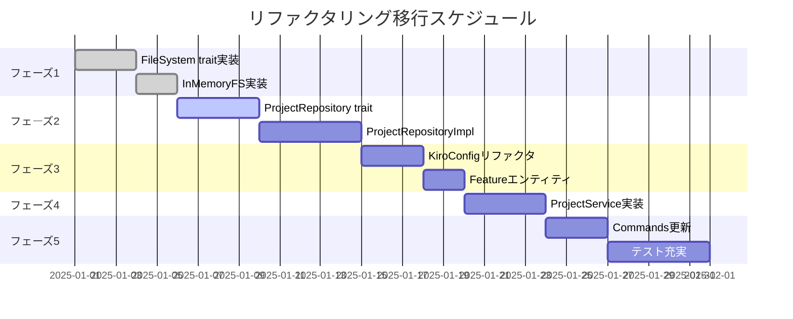

# Clean Architecture リファクタリング設計仕様書 V2

## 概要

hail-maryプロジェクトを Clean Architecture / ヘキサゴナルアーキテクチャに準拠させるためのリファクタリング設計仕様書 V2です。前回の設計を踏まえ、2層Repository構造と明確な責務分離を採用した改訂版です。

### 現在の問題点

1. **責務の混在**
   - `src/core/project.rs`がファイルシステム操作とビジネスロジックを混在
   - `src/models/kiro.rs`が設定データとファイル操作を混在
   - `src/commands/`が直接`std::fs`を使用

2. **テスタビリティの問題**
   - 実際のファイルシステムに依存するため、ユニットテストが困難
   - モックやインメモリテストが実装できない

3. **SOLID原則違反**
   - 単一責任原則（SRP）違反：複数の責務を一つのクラスが担当
   - 依存性逆転原則（DIP）違反：上位層が下位層の具象に依存

## Clean Architecture設計 V2

### アーキテクチャ層の設計

```mermaid
%%{init: {
  'theme': 'dark',
  'themeCSS': '
    .nodeLabel { color: #FD971F !important; }
    .edgeLabel { color: #A6E22E !important; background-color: transparent !important; }
    .cluster rect { fill: #272822 !important; stroke: #F92672 !important; stroke-width: 2px !important; rx: 5px !important; ry: 5px !important; }
    .node rect, .node circle, .node ellipse, .node polygon, .node path { fill: #272822 !important; stroke: #A6E22E !important; stroke-width: 2px !important; }
    .flowchart-link { stroke: #66D9EF !important; stroke-width: 2px !important; }
  '
}}%%

graph TB
    subgraph "Interface Layer"
        CMD[Commands<br/>init.rs, new.rs]
    end
    
    subgraph "Application Layer"
        SVC[ProjectService<br/>ユースケース実装]
    end
    
    subgraph "Domain Layer"
        KIRO[KiroConfig<br/>設定データモデル]
        FEAT[KiroFeature<br/>エンティティ]
        DOM_SVC[KiroProjectService<br/>ドメインサービス]
    end
    
    subgraph "Infrastructure Layer"
        PROJ_REPO[ProjectRepository<br/>ドメイン特化永続化]
        FS_TRAIT[FileSystem<br/>低レベルI/O]
        FS_IMPL[std::fs<br/>実装]
    end
    
    CMD --> SVC
    SVC --> DOM_SVC
    SVC --> PROJ_REPO
    DOM_SVC --> KIRO
    DOM_SVC --> FEAT
    PROJ_REPO --> FS_TRAIT
    FS_TRAIT --> FS_IMPL
    
    classDef interface fill:#272822,stroke:#F92672,stroke-width:2px;
    classDef application fill:#272822,stroke:#66D9EF,stroke-width:2px;
    classDef domain fill:#272822,stroke:#A6E22E,stroke-width:2px;
    classDef infrastructure fill:#272822,stroke:#AE81FF,stroke-width:2px;
    
    class CMD interface;
    class SVC application;
    class KIRO,FEAT,DOM_SVC domain;
    class PROJ_REPO,FS_TRAIT,FS_IMPL infrastructure;
```



### 責務の明確な分離

```mermaid
%%{init: {
  'theme': 'dark',
  'themeCSS': '
    .nodeLabel { color: #FD971F !important; }
    .edgeLabel { color: #A6E22E !important; background-color: transparent !important; }
    .cluster rect { fill: #272822 !important; stroke: #F92672 !important; stroke-width: 2px !important; rx: 5px !important; ry: 5px !important; }
    .node rect, .node circle, .node ellipse, .node polygon, .node path { fill: #272822 !important; stroke: #A6E22E !important; stroke-width: 2px !important; }
    .flowchart-link { stroke: #66D9EF !important; stroke-width: 2px !important; }
  '
}}%%

graph TB
    subgraph "責務分離"
        CONFIG[KiroConfig<br/>「設定データは何か」<br/>設定値の保持・検証]
        ENTITY[KiroFeature<br/>「エンティティは何か」<br/>概念の表現・自己検証]
        DOMAIN[KiroProjectService<br/>「何が正しいか」<br/>複雑なビジネスルール]
        FLOW[ProjectService<br/>「どのように実行するか」<br/>ユースケース制御]
        STORE[ProjectRepository<br/>「どこに保存するか」<br/>永続化の隠蔽]
        IO[FileSystem<br/>「どう読み書きするか」<br/>I/O抽象化]
    end
    
    FLOW --> DOMAIN
    FLOW --> STORE
    DOMAIN --> CONFIG
    DOMAIN --> ENTITY
    STORE --> IO
    
    classDef config fill:#272822,stroke:#A6E22E,stroke-width:2px;
    classDef entity fill:#272822,stroke:#A6E22E,stroke-width:2px;
    classDef domain fill:#272822,stroke:#A6E22E,stroke-width:2px;
    classDef flow fill:#272822,stroke:#66D9EF,stroke-width:2px;
    classDef store fill:#272822,stroke:#AE81FF,stroke-width:2px;
    classDef io fill:#272822,stroke:#FD971F,stroke-width:2px;
    
    class CONFIG config;
    class ENTITY entity;
    class DOMAIN domain;
    class FLOW flow;
    class STORE store;
    class IO io;
```



## 詳細設計

### 1. Domain Layer - DDDによるビジネス知識の表現

#### 1.1 KiroConfig - 設定データモデル

```rust
// src/models/kiro_config.rs (V2)
use serde::Deserialize;
use std::path::PathBuf;

#[derive(Debug, Clone, Deserialize)]
pub struct KiroConfig {
    pub root_dir: PathBuf,
    pub memory: MemoryConfig,
}

impl KiroConfig {
    /// デフォルト設定を生成
    pub fn default() -> Self {
        Self {
            root_dir: PathBuf::from(".kiro"),
            memory: MemoryConfig {
                types: vec![
                    "tech".to_string(), 
                    "project-tech".to_string(), 
                    "domain".to_string()
                ],
                instructions: "Default memory types for hail-mary".to_string(),
                document: DocumentConfig {
                    output_dir: PathBuf::from(".kiro/memory"),
                    format: "markdown".to_string(),
                },
                database: DatabaseConfig {
                    path: PathBuf::from(".kiro/memory/db.sqlite3"),
                },
            },
        }
    }
    
    /// 自己の妥当性検証：メモリタイプの妥当性
    pub fn validate_memory_type(&self, memory_type: &str) -> bool {
        self.memory.types.contains(&memory_type.to_string())
    }
    
    /// 設定値の取得：メモリドキュメントディレクトリ
    pub fn memory_docs_dir(&self) -> PathBuf {
        self.memory.document.output_dir.clone()
    }
    
    /// 設定値の取得：データベースパス
    pub fn memory_database_path(&self) -> PathBuf {
        self.memory.database.path.clone()
    }
    
    /// ルートディレクトリを設定（イミュータブル更新）
    pub fn with_root_dir(mut self, root_dir: PathBuf) -> Self {
        self.root_dir = root_dir;
        self
    }
    
    /// 設定の妥当性検証
    pub fn is_valid(&self) -> bool {
        !self.root_dir.as_os_str().is_empty() 
        && !self.memory.types.is_empty()
        && !self.memory.database.path.as_os_str().is_empty()
    }
}

#[derive(Debug, Clone, Deserialize)]
pub struct MemoryConfig {
    pub types: Vec<String>,
    pub instructions: String,
    pub document: DocumentConfig,
    pub database: DatabaseConfig,
}

#[derive(Debug, Clone, Deserialize)]
pub struct DocumentConfig {
    pub output_dir: PathBuf,
    pub format: String,
}

#[derive(Debug, Clone, Deserialize)]
pub struct DatabaseConfig {
    pub path: PathBuf,
}
```

#### 1.2 KiroFeature - エンティティ

```rust
// src/models/kiro_feature.rs (新規)
use chrono::{DateTime, Utc};
use std::path::PathBuf;

#[derive(Debug, Clone, PartialEq)]
pub struct KiroFeature {
    pub id: Option<String>,     // エンティティの識別子
    pub name: String,           // 機能名
    pub created_at: DateTime<Utc>,
    pub path: Option<PathBuf>,  // 作成後に設定される
}

impl KiroFeature {
    /// 新しいKiroFeatureを作成
    pub fn new(name: String) -> Self {
        Self {
            id: Some(uuid::Uuid::new_v4().to_string()),
            name,
            created_at: Utc::now(),
            path: None,
        }
    }
    
    /// 既存のKiroFeatureを復元（永続化からの読み込み時）
    pub fn restore(id: String, name: String, created_at: DateTime<Utc>) -> Self {
        Self {
            id: Some(id),
            name,
            created_at,
            path: None,
        }
    }
    
    /// パスを設定（作成時に呼び出し）
    pub fn with_path(mut self, path: PathBuf) -> Self {
        self.path = Some(path);
        self
    }
    
    /// 自己の妥当性検証：機能名のバリデーション
    pub fn is_valid_name(&self) -> bool {
        !self.name.is_empty() 
        && self.name.len() <= 50
        && self.name.chars().all(|c| c.is_alphanumeric() || c == '-' || c == '_')
        && !self.name.starts_with('-')
        && !self.name.ends_with('-')
    }
    
    /// エンティティの妥当性検証
    pub fn is_valid(&self) -> bool {
        self.is_valid_name() && self.id.is_some()
    }
    
    /// エンティティの一意性判定
    pub fn same_identity(&self, other: &Self) -> bool {
        match (&self.id, &other.id) {
            (Some(id1), Some(id2)) => id1 == id2,
            _ => false,
        }
    }
}
```

#### 1.3 KiroProjectService - ドメインサービス

```rust
// src/domain/services/kiro_project_service.rs (新規)
use crate::models::{KiroConfig, KiroFeature};
use chrono::Utc;
use std::path::PathBuf;

/// Kiroプロジェクト固有の複雑なビジネスロジックを集約
/// 複数のドメインモデルにまたがる処理や状態を持たないビジネスルール
pub struct KiroProjectService;

impl KiroProjectService {
    /// ビジネスルール：機能ディレクトリの命名規則
    pub fn generate_feature_directory_name(&self, name: &str) -> String {
        format!("{}-{}", Utc::now().format("%Y-%m-%d"), name)
    }
    
    /// ビジネスルール：デフォルトの機能ファイル構成
    pub fn get_default_feature_files(&self) -> Vec<String> {
        vec![
            "requirements.md".to_string(),
            "design.md".to_string(),
            "tasks.md".to_string(),
            "spec.json".to_string(),
        ]
    }
    
    /// ビジネスルール：プロジェクトに必要なディレクトリ構造
    pub fn get_required_project_directories(&self, config: &KiroConfig) -> Vec<PathBuf> {
        vec![
            config.root_dir.clone(),
            config.root_dir.join("memory"),
            config.root_dir.join("specs"),
        ]
    }
    
    /// ビジネスルール：.gitignoreに追加すべきエントリ
    pub fn get_default_gitignore_entries(&self) -> Vec<String> {
        vec![
            "# hail-mary memory database".to_string(),
            ".kiro/memory/db.sqlite3".to_string(),
            ".kiro/memory/*.sqlite3-*".to_string(),
        ]
    }
    
    /// 機能作成仕様の生成（複雑なビジネスロジック）
    pub fn create_feature_specification(
        &self,
        feature: &KiroFeature,
        config: &KiroConfig,
    ) -> FeatureSpecification {
        FeatureSpecification {
            feature_id: feature.id.clone().unwrap_or_default(),
            feature_name: feature.name.clone(),
            directory_name: self.generate_feature_directory_name(&feature.name),
            base_path: config.root_dir.join("specs"),
            required_files: self.get_default_feature_files(),
            created_at: feature.created_at,
        }
    }
    
    /// プロジェクト初期化仕様の生成（複雑なビジネスロジック）
    pub fn create_initialization_specification(
        &self,
        config: &KiroConfig,
    ) -> InitializationSpecification {
        InitializationSpecification {
            directories: self.get_required_project_directories(config),
            config_template: self.generate_config_template(),
            gitignore_entries: self.get_default_gitignore_entries(),
            root_dir: config.root_dir.clone(),
        }
    }
    
    /// 機能の重複確認（ビジネスルール）
    pub fn can_create_feature(
        &self,
        feature: &KiroFeature,
        existing_features: &[KiroFeature],
    ) -> bool {
        // ビジネスルール：同じ名前の機能は作成できない
        !existing_features.iter().any(|f| f.name == feature.name)
    }
    
    /// 設定テンプレートの生成
    fn generate_config_template(&self) -> String {
        r#"# .kiro/config.toml
# hail-mary Memory MCP project configuration

[memory]
# Memory types for categorization (customize for your project)
types = [
    "tech",           # General technical knowledge
    "project-tech",   # Project-specific technical details
    "domain",         # Business domain knowledge
    "workflow",       # Development workflows and processes
    "decision",       # Architecture decisions and rationale
]

# Instructions for MCP server
instructions = """
Available memory types:
- tech: General technical knowledge (languages, frameworks, algorithms)
- project-tech: This project's specific technical implementation
- domain: Business domain knowledge and requirements
- workflow: Development workflows and processes
- decision: Architecture decisions and their rationale
"""

# Document generation settings
[memory.document]
output_dir = ".kiro/memory"
format = "markdown"

# Database configuration
[memory.database]
path = ".kiro/memory/db.sqlite3"
"#.to_string()
    }
}

/// 機能作成の仕様オブジェクト
#[derive(Debug, Clone)]
pub struct FeatureSpecification {
    pub feature_id: String,
    pub feature_name: String,
    pub directory_name: String,
    pub base_path: PathBuf,
    pub required_files: Vec<String>,
    pub created_at: chrono::DateTime<chrono::Utc>,
}

impl FeatureSpecification {
    /// 機能ディレクトリの完全パス
    pub fn full_path(&self) -> PathBuf {
        self.base_path.join(&self.directory_name)
    }
    
    /// 必要ファイルの完全パス一覧
    pub fn file_paths(&self) -> Vec<PathBuf> {
        let base = self.full_path();
        self.required_files.iter()
            .map(|file| base.join(file))
            .collect()
    }
}

/// プロジェクト初期化の仕様オブジェクト
#[derive(Debug, Clone)]
pub struct InitializationSpecification {
    pub directories: Vec<PathBuf>,
    pub config_template: String,
    pub gitignore_entries: Vec<String>,
    pub root_dir: PathBuf,
}
```

### 2. Infrastructure Layer - 永続化の抽象化

#### 2.1 FileSystem - 低レベルI/O抽象化

```rust
// src/repositories/filesystem.rs (V2)
use std::path::{Path, PathBuf};
use std::io;

/// 低レベルファイルシステム操作の抽象化
/// テスタビリティを目的とした薄い抽象層
pub trait FileSystem {
    fn write(&self, path: &Path, content: &[u8]) -> io::Result<()>;
    fn read(&self, path: &Path) -> io::Result<Vec<u8>>;
    fn exists(&self, path: &Path) -> bool;
    fn is_dir(&self, path: &Path) -> bool;
    fn create_dir_all(&self, path: &Path) -> io::Result<()>;
    fn read_dir(&self, path: &Path) -> io::Result<Vec<PathBuf>>;
    fn append(&self, path: &Path, content: &[u8]) -> io::Result<()>;
}

/// 標準ファイルシステム実装
pub struct StdFileSystem;

impl FileSystem for StdFileSystem {
    fn write(&self, path: &Path, content: &[u8]) -> io::Result<()> {
        std::fs::write(path, content)
    }
    
    fn read(&self, path: &Path) -> io::Result<Vec<u8>> {
        std::fs::read(path)
    }
    
    fn exists(&self, path: &Path) -> bool {
        path.exists()
    }
    
    fn is_dir(&self, path: &Path) -> bool {
        path.is_dir()
    }
    
    fn create_dir_all(&self, path: &Path) -> io::Result<()> {
        std::fs::create_dir_all(path)
    }
    
    fn read_dir(&self, path: &Path) -> io::Result<Vec<PathBuf>> {
        std::fs::read_dir(path)?
            .map(|entry| entry.map(|e| e.path()))
            .collect()
    }
    
    fn append(&self, path: &Path, content: &[u8]) -> io::Result<()> {
        use std::fs::OpenOptions;
        use std::io::Write;
        
        let mut file = OpenOptions::new().create(true).append(true).open(path)?;
        file.write_all(content)
    }
}

/// インメモリファイルシステム実装（テスト用）
use std::collections::HashMap;
use std::sync::{Arc, Mutex};

pub struct InMemoryFileSystem {
    files: Arc<Mutex<HashMap<PathBuf, Vec<u8>>>>,
    dirs: Arc<Mutex<std::collections::HashSet<PathBuf>>>,
}

impl InMemoryFileSystem {
    pub fn new() -> Self {
        Self {
            files: Arc::new(Mutex::new(HashMap::new())),
            dirs: Arc::new(Mutex::new(std::collections::HashSet::new())),
        }
    }
}

impl FileSystem for InMemoryFileSystem {
    fn write(&self, path: &Path, content: &[u8]) -> io::Result<()> {
        let mut files = self.files.lock().unwrap();
        files.insert(path.to_path_buf(), content.to_vec());
        
        // 親ディレクトリも作成
        if let Some(parent) = path.parent() {
            let mut dirs = self.dirs.lock().unwrap();
            dirs.insert(parent.to_path_buf());
        }
        
        Ok(())
    }
    
    fn read(&self, path: &Path) -> io::Result<Vec<u8>> {
        let files = self.files.lock().unwrap();
        files.get(path)
            .cloned()
            .ok_or_else(|| io::Error::new(io::ErrorKind::NotFound, "File not found"))
    }
    
    fn exists(&self, path: &Path) -> bool {
        let files = self.files.lock().unwrap();
        let dirs = self.dirs.lock().unwrap();
        files.contains_key(path) || dirs.contains(path)
    }
    
    fn is_dir(&self, path: &Path) -> bool {
        let dirs = self.dirs.lock().unwrap();
        dirs.contains(path)
    }
    
    fn create_dir_all(&self, path: &Path) -> io::Result<()> {
        let mut dirs = self.dirs.lock().unwrap();
        dirs.insert(path.to_path_buf());
        
        // 親ディレクトリも追加
        let mut current = path;
        while let Some(parent) = current.parent() {
            dirs.insert(parent.to_path_buf());
            current = parent;
        }
        
        Ok(())
    }
    
    fn read_dir(&self, path: &Path) -> io::Result<Vec<PathBuf>> {
        let files = self.files.lock().unwrap();
        let dirs = self.dirs.lock().unwrap();
        
        let mut entries = Vec::new();
        
        // ファイルをチェック
        for file_path in files.keys() {
            if let Some(parent) = file_path.parent() {
                if parent == path {
                    entries.push(file_path.clone());
                }
            }
        }
        
        // ディレクトリをチェック
        for dir_path in dirs.iter() {
            if let Some(parent) = dir_path.parent() {
                if parent == path {
                    entries.push(dir_path.clone());
                }
            }
        }
        
        Ok(entries)
    }
    
    fn append(&self, path: &Path, content: &[u8]) -> io::Result<()> {
        let mut files = self.files.lock().unwrap();
        let existing = files.get(path).cloned().unwrap_or_default();
        let mut new_content = existing;
        new_content.extend_from_slice(content);
        files.insert(path.to_path_buf(), new_content);
        Ok(())
    }
}
```

#### 2.2 ProjectRepository - ドメイン特化永続化

```rust
// src/repositories/project.rs (V2)
use crate::models::{KiroConfig, KiroFeature};
use crate::domain::services::{FeatureSpecification, InitializationSpecification};
use crate::models::error::{Result, MemoryError};
use crate::repositories::filesystem::FileSystem;
use std::path::{Path, PathBuf};

/// プロジェクト関連の永続化を抽象化
/// Specificationオブジェクトベースの永続化（ドメイン知識の分離）
pub trait ProjectRepository {
    // 初期化関連
    fn initialize_from_specification(&self, spec: &InitializationSpecification) -> Result<()>;
    
    // 機能関連
    fn save_feature_from_specification(&self, spec: &FeatureSpecification) -> Result<PathBuf>;
    fn find_feature_by_name(&self, name: &str) -> Result<Option<KiroFeature>>;
    fn list_all_features(&self) -> Result<Vec<KiroFeature>>;
    fn feature_exists(&self, name: &str) -> Result<bool>;
    
    // 設定関連
    fn save_config(&self, config: &KiroConfig) -> Result<()>;
    fn load_config(&self) -> Result<KiroConfig>;
    fn find_kiro_root(&self) -> Result<PathBuf>;
    
    // その他
    fn update_gitignore(&self, entries: &[String]) -> Result<()>;
}

/// ProjectRepositoryの実装
pub struct ProjectRepositoryImpl<FS: FileSystem> {
    filesystem: FS,
}

impl<FS: FileSystem> ProjectRepositoryImpl<FS> {
    pub fn new(filesystem: FS) -> Self {
        Self { filesystem }
    }
}

impl<FS: FileSystem> ProjectRepository for ProjectRepositoryImpl<FS> {
    /// 初期化仕様に基づいてプロジェクトを初期化
    fn initialize_from_specification(&self, spec: &InitializationSpecification) -> Result<()> {
        // 1. 必要ディレクトリを作成
        for dir in &spec.directories {
            self.filesystem.create_dir_all(dir)
                .map_err(MemoryError::Io)?
        }
        
        // 2. 設定ファイルを作成
        let config_path = spec.root_dir.join("config.toml");
        self.filesystem.write(&config_path, spec.config_template.as_bytes())
            .map_err(MemoryError::Io)?
        
        // 3. .gitignoreを更新
        self.update_gitignore(&spec.gitignore_entries)?
        
        Ok(())
    }
    
    /// 機能仕様に基づいてKiroFeatureを永続化
    fn save_feature_from_specification(&self, spec: &FeatureSpecification) -> Result<PathBuf> {
        let feature_path = spec.full_path();
        
        // ディレクトリ作成
        self.filesystem.create_dir_all(&feature_path)
            .map_err(MemoryError::Io)?
        
        // 必要ファイルを作成
        for file_path in spec.file_paths() {
            let content = match file_path.extension().and_then(|ext| ext.to_str()) {
                Some("json") => b"{}",
                Some("md") => b"",
                _ => b"",
            };
            self.filesystem.write(&file_path, content)
                .map_err(MemoryError::Io)?
        }
        
        // spec.jsonに機能情報を保存
        let spec_file = feature_path.join("spec.json");
        let spec_content = format!(r#"{{
    "id": "{}",
    "name": "{}",
    "created_at": "{}",
    "directory": "{}"
}}"#, 
            spec.feature_id, 
            spec.feature_name, 
            spec.created_at.to_rfc3339(),
            spec.directory_name
        );
        self.filesystem.write(&spec_file, spec_content.as_bytes())
            .map_err(MemoryError::Io)?
        
        Ok(feature_path)
    }
    
    /// 名前でKiroFeatureを検索
    fn find_feature_by_name(&self, name: &str) -> Result<Option<KiroFeature>> {
        let features = self.list_all_features()?;
        Ok(features.into_iter().find(|f| f.name == name))
    }
    
    /// 全KiroFeatureを取得
    fn list_all_features(&self) -> Result<Vec<KiroFeature>> {
        let specs_dir = Path::new(".kiro/specs");
        
        if !self.filesystem.exists(specs_dir) {
            return Ok(vec![]);
        }
        
        let entries = self.filesystem.read_dir(specs_dir)
            .map_err(MemoryError::Io)?;
        
        let mut features = Vec::new();
        
        for entry in entries {
            if self.filesystem.is_dir(&entry) {
                if let Some(dir_name) = entry.file_name().and_then(|n| n.to_str()) {
                    // spec.jsonから機能情報を読み込み
                    let spec_file = entry.join("spec.json");
                    if self.filesystem.exists(&spec_file) {
                        if let Ok(feature) = self.parse_feature_from_spec(&spec_file) {
                            features.push(feature.with_path(entry));
                        }
                    } else {
                        // フォールバック: ディレクトリ名から機能名を抽出
                        if let Some(feature_name) = self.extract_feature_name(dir_name) {
                            let feature = KiroFeature::new(feature_name).with_path(entry);
                            features.push(feature);
                        }
                    }
                }
            }
        }
        
        features.sort_by(|a, b| a.name.cmp(&b.name));
        Ok(features)
    }
    
    /// 機能が存在するかチェック
    fn feature_exists(&self, name: &str) -> Result<bool> {
        Ok(self.find_feature_by_name(name)?.is_some())
    }
    
    /// 設定ファイルを保存
    fn save_config(&self, config: &KiroConfig) -> Result<()> {
        let config_path = config.root_dir.join("config.toml");
        
        // TOML形式でシリアライズ
        let config_content = self.create_config_toml_content(config);
        
        self.filesystem.write(&config_path, config_content.as_bytes())
            .map_err(MemoryError::Io)?;
        
        Ok(())
    }
    
    /// 設定ファイルを読み込み
    fn load_config(&self) -> Result<KiroConfig> {
        let kiro_root = self.find_kiro_root()?;
        let config_path = kiro_root.join("config.toml");
        
        let config = if self.filesystem.exists(&config_path) {
            let content = self.filesystem.read(&config_path)
                .map_err(MemoryError::Io)?;
            let content_str = String::from_utf8(content)
                .map_err(|e| MemoryError::InvalidInput(format!("Invalid UTF-8: {}", e)))?;
            
            // TOML解析してKiroConfigを構築
            self.parse_config_toml(&content_str, kiro_root)?
        } else {
            KiroConfig::default().with_root_dir(kiro_root)
        };
        
        Ok(config)
    }
    
    /// .kiroルートディレクトリを検索
    fn find_kiro_root(&self) -> Result<PathBuf> {
        let mut current_dir = std::env::current_dir()
            .map_err(MemoryError::Io)?;
        
        loop {
            let kiro_dir = current_dir.join(".kiro");
            if self.filesystem.exists(&kiro_dir) && self.filesystem.is_dir(&kiro_dir) {
                return Ok(kiro_dir);
            }
            
            if let Some(parent) = current_dir.parent() {
                current_dir = parent.to_path_buf();
            } else {
                return Err(MemoryError::NotFound(
                    ".kiro directory not found".to_string()
                ));
            }
        }
    }
    
    /// .gitignoreを更新
    fn update_gitignore(&self) -> Result<()> {
        let gitignore_path = Path::new(".gitignore");
        
        if self.filesystem.exists(gitignore_path) {
            // 既存の.gitignoreを読み取り、必要に応じて追加
            let content = self.filesystem.read(gitignore_path)
                .map_err(MemoryError::Io)?;
            let content_str = String::from_utf8_lossy(&content);
            
            if !content_str.contains(".kiro/memory/db.sqlite3") {
                let entries = KiroConfig::default_gitignore_entries();
                let addition = format!("\n{}\n", entries.join("\n"));
                self.filesystem.append(gitignore_path, addition.as_bytes())
                    .map_err(MemoryError::Io)?;
            }
        } else {
            // 新しい.gitignoreを作成
            let entries = KiroConfig::default_gitignore_entries();
            let content = format!("{}\n", entries.join("\n"));
            self.filesystem.write(gitignore_path, content.as_bytes())
                .map_err(MemoryError::Io)?;
        }
        
        Ok(())
    }
}

// プライベートヘルパーメソッド
impl<FS: FileSystem> ProjectRepositoryImpl<FS> {
    /// ディレクトリ名からFeature名を抽出（YYYY-MM-dd-[feature-name]形式）
    fn extract_feature_name(&self, dir_name: &str) -> Option<String> {
        let parts: Vec<&str> = dir_name.split('-').collect();
        if parts.len() >= 4 {
            Some(parts[3..].join("-"))
        } else {
            None
        }
    }
    
    /// TOML設定コンテンツを生成
    fn create_config_toml_content(&self, config: &KiroConfig) -> String {
        // TOMLフォーマットで設定を出力
        format!(r#"# .kiro/config.toml
# hail-mary Memory MCP project configuration

[memory]
# Memory types for categorization (customize for your project)
types = [
    "tech",           # General technical knowledge
    "project-tech",   # Project-specific technical details
    "domain",         # Business domain knowledge
    "workflow",       # Development workflows and processes
    "decision",       # Architecture decisions and rationale
]

# Instructions for MCP server
instructions = """
Available memory types:
- tech: General technical knowledge (languages, frameworks, algorithms)
- project-tech: This project's specific technical implementation
- domain: Business domain knowledge and requirements
- workflow: Development workflows and processes
- decision: Architecture decisions and their rationale
"""

# Document generation settings
[memory.document]
output_dir = ".kiro/memory"
format = "markdown"

# Database configuration
[memory.database]
path = ".kiro/memory/db.sqlite3"
"#)
    }
    
    /// TOML設定を解析
    fn parse_config_toml(&self, content: &str, root_dir: PathBuf) -> Result<KiroConfig> {
        // 簡略化：実際にはtomlクレートを使用
        // ここでは概念的な実装を示す
        Ok(KiroConfig::default().with_root_dir(root_dir))
    }
}
```

### 3. Application Layer - ユースケースの実装

#### 3.1 ProjectService - ワークフローの制御

```rust
// src/services/project.rs (V2)
use crate::models::kiro::KiroConfig;
use crate::models::feature::Feature;
use crate::repositories::project::ProjectRepository;
use crate::utils::validator::validate_kebab_case;
use crate::models::error::{Result, MemoryError};
use std::path::PathBuf;

/// プロジェクト関連のユースケースを実装
/// 「どのように実行するか」を制御
pub struct ProjectService<R: ProjectRepository> {
    repository: R,
}

impl<R: ProjectRepository> ProjectService<R> {
    pub fn new(repository: R) -> Self {
        Self { repository }
    }
    
    /// プロジェクト初期化のユースケース
    pub fn initialize_project(&self, force: bool) -> Result<()> {
        let config = KiroConfig::default();
        
        // 1. 存在チェック（ビジネスロジック）
        if !force {
            if let Ok(_) = self.repository.find_kiro_root() {
                return self.handle_existing_project();
            }
        }
        
        // 2. ディレクトリ構造作成（永続化層に委譲）
        self.repository.initialize_kiro_structure(&config)?;
        
        // 3. 設定ファイル作成（永続化層に委譲）
        self.repository.save_config(&config)?;
        
        // 4. .gitignore更新（永続化層に委譲）
        self.repository.update_gitignore()?;
        
        // 5. 初期化完了イベント（ビジネスロジック）
        self.notify_initialization_complete(&config)?;
        
        Ok(())
    }
    
    /// 新機能作成のユースケース
    pub fn create_new_feature(&self, name: &str) -> Result<PathBuf> {
        // 1. ビジネスルールの適用
        validate_kebab_case(name)
            .map_err(|_| MemoryError::InvalidInput(format!("Invalid feature name: {}", name)))?;
        
        // 2. 重複チェック（ビジネスロジック）
        if self.repository.find_feature(name)?.is_some() {
            return Err(MemoryError::InvalidInput(format!(
                "Feature '{}' already exists", name
            )));
        }
        
        // 3. Featureエンティティの構築（ドメインロジック）
        let feature = Feature::new(name.to_string());
        
        // 4. 永続化の委譲
        let feature_path = self.repository.save_feature(&feature)?;
        
        // 5. 作成完了イベント（ビジネスロジック）
        self.notify_feature_created(&feature, &feature_path)?;
        
        Ok(feature_path)
    }
    
    /// 機能一覧取得のユースケース
    pub fn list_features(&self) -> Result<Vec<Feature>> {
        // 永続化層に委譲し、結果を返す
        self.repository.list_features()
    }
    
    /// 設定読み込みのユースケース
    pub fn load_configuration(&self) -> Result<KiroConfig> {
        // 永続化層に委譲し、結果を返す
        self.repository.load_config()
    }
}

// プライベートヘルパーメソッド（ビジネスロジック）
impl<R: ProjectRepository> ProjectService<R> {
    /// 既存プロジェクトの処理
    fn handle_existing_project(&self) -> Result<()> {
        // ユーザー確認のロジックをここに実装
        // 実際の実装では、適切なエラーまたは確認プロンプトを返す
        Err(MemoryError::InvalidInput(
            ".kiro directory already exists. Use --force to overwrite.".to_string()
        ))
    }
    
    /// 初期化完了通知
    fn notify_initialization_complete(&self, config: &KiroConfig) -> Result<()> {
        // ログ出力、メトリクス送信、その他の副作用をここに実装
        // この例では何もしない
        Ok(())
    }
    
    /// 機能作成完了通知
    fn notify_feature_created(&self, feature: &Feature, path: &PathBuf) -> Result<()> {
        // ログ出力、メトリクス送信、その他の副作用をここに実装
        // この例では何もしない
        Ok(())
    }
}
```

### 4. Interface Layer - CLIコマンド

#### 4.1 Commands層の更新

```rust
// src/commands/init.rs (V2)
use crate::services::project::ProjectService;
use crate::repositories::project::ProjectRepositoryImpl;
use crate::repositories::filesystem::StdFileSystem;
use anyhow::Result;
use clap::Args;

#[derive(Args)]
pub struct InitCommand {
    /// Force overwrite existing configuration
    #[arg(long)]
    pub force: bool,
}

impl InitCommand {
    pub fn execute(&self) -> Result<()> {
        // 依存性の構築（DI）
        let filesystem = StdFileSystem;
        let repository = ProjectRepositoryImpl::new(filesystem);
        let service = ProjectService::new(repository);
        
        // ユースケースの実行
        service.initialize_project(self.force)?;
        
        // 成功メッセージの出力（UI層の責務）
        println!("✅ Initialized .kiro directory structure:");
        println!("  - Created .kiro/");
        println!("  - Created .kiro/config.toml (configuration template)");
        println!("  - Created .kiro/memory/");
        println!("  - Updated .gitignore");
        println!();
        println!("You can now customize .kiro/config.toml for your project needs.");
        
        Ok(())
    }
}
```

```rust
// src/commands/new.rs (V2)
use crate::services::project::ProjectService;
use crate::repositories::project::ProjectRepositoryImpl;
use crate::repositories::filesystem::StdFileSystem;
use crate::utils::error::Result;
use clap::Args;

#[derive(Args)]
pub struct NewCommand {
    /// Name of the new feature (must be in kebab-case)
    pub feature_name: String,
}

impl NewCommand {
    pub fn execute(&self) -> Result<()> {
        // 依存性の構築（DI）
        let filesystem = StdFileSystem;
        let repository = ProjectRepositoryImpl::new(filesystem);
        let service = ProjectService::new(repository);
        
        // ユースケースの実行
        let feature_path = service.create_new_feature(&self.feature_name)?;
        
        // 成功メッセージの出力（UI層の責務）
        println!("✅ Feature '{}' created successfully!", self.feature_name);
        println!("📁 Location: {}", feature_path.display());
        println!("📝 Files created:");
        println!("   - requirements.md");
        println!("   - design.md");
        println!("   - tasks.md");
        println!("   - spec.json");
        
        Ok(())
    }
}
```

## SOLID原則の適用

### 1. 単一責任原則（SRP）

| クラス | 責務 | 変更理由 |
|--------|------|----------|
| **KiroConfig** | ビジネスルール定義 | ルール変更時のみ |
| **Feature** | エンティティの表現 | エンティティ変更時のみ |
| **ProjectService** | ユースケース実装 | ワークフロー変更時のみ |
| **ProjectRepository** | 永続化の抽象化 | ストレージ戦略変更時のみ |
| **FileSystem** | I/O操作の抽象化 | テスト戦略変更時のみ |
| **Commands** | CLIインターフェース | UI要件変更時のみ |

### 2. オープン/クローズド原則（OCP）

```rust
// 新しいストレージバックエンドの追加例
pub struct CloudProjectRepository {
    cloud_client: CloudStorageClient,
}

impl ProjectRepository for CloudProjectRepository {
    // 既存コードを変更することなく、新しい実装を追加
    fn save_feature(&self, feature: &Feature) -> Result<PathBuf> {
        // クラウドストレージへの保存実装
    }
}
```

### 3. リスコフ置換原則（LSP）

```rust
// 任意のFileSystem実装が置換可能
fn test_with_different_filesystems() {
    let std_fs = StdFileSystem;
    let memory_fs = InMemoryFileSystem::new();
    
    // どちらも同じインターフェースで使用可能
    test_project_operations(std_fs);
    test_project_operations(memory_fs);
}

fn test_project_operations<FS: FileSystem>(fs: FS) {
    let repo = ProjectRepositoryImpl::new(fs);
    let service = ProjectService::new(repo);
    // テスト実行
}
```

### 4. インターフェース分離原則（ISP）

```rust
// 各トレイトは最小限の責務のみを定義
trait FileSystem { /* I/O操作のみ */ }
trait ProjectRepository { /* プロジェクト永続化のみ */ }

// クライアントは必要な機能のみに依存
impl<R: ProjectRepository> ProjectService<R> {
    // ProjectRepositoryのみに依存、FileSystemには直接依存しない
}
```

### 5. 依存性逆転原則（DIP）

```rust
// 上位層（ProjectService）が抽象（ProjectRepository）に依存
// 下位層（ProjectRepositoryImpl）が抽象（FileSystem）に依存

ProjectService<ProjectRepository>  // 抽象に依存
    ↓
ProjectRepositoryImpl<FileSystem>  // 抽象に依存
    ↓
StdFileSystem / InMemoryFileSystem  // 具象実装
```

## Stupid Helper回避の設計

### ❌ Stupid Helper（回避済み）

```rust
// このような薄いラッパーは回避
trait BadFileRepository {
    fn write(&self, path: &Path, content: &str) -> Result<()> {
        std::fs::write(path, content)  // 価値なし
    }
}
```

### ✅ 価値のある抽象化

```rust
// ドメイン知識を活用した価値ある操作
impl ProjectRepository {
    fn save_feature(&self, feature: &Feature) -> Result<PathBuf> {
        // 1. ドメインロジック：ディレクトリ構造の知識
        let feature_path = self.build_feature_path(&feature);
        
        // 2. ドメインロジック：必要ファイルの知識
        let files = KiroConfig::default_feature_files();
        
        // 3. トランザクション的操作：複数ファイルの一括作成
        self.create_feature_structure(&feature_path, files)?;
        
        // 4. ドメインロジック：spec.jsonの初期化
        self.initialize_spec_file(&feature_path)?;
        
        Ok(feature_path)
    }
}
```

## テスト戦略

### 1. ユニットテスト - ドメイン層

```rust
#[cfg(test)]
mod kiro_config_tests {
    use super::*;
    
    #[test]
    fn test_feature_dir_format() {
        let name = "my-feature";
        let dir_name = KiroConfig::feature_dir_format(name);
        
        assert!(dir_name.ends_with("-my-feature"));
        assert!(dir_name.len() >= 21); // YYYY-MM-dd-my-feature
    }
    
    #[test]
    fn test_validate_memory_type() {
        let config = KiroConfig::default();
        
        assert!(config.validate_memory_type("tech"));
        assert!(config.validate_memory_type("project-tech"));
        assert!(!config.validate_memory_type("invalid"));
    }
}
```

### 2. ユニットテスト - アプリケーション層

```rust
#[cfg(test)]
mod project_service_tests {
    use super::*;
    use crate::repositories::project::MockProjectRepository;
    
    #[test]
    fn test_create_new_feature_success() {
        // Arrange
        let mut mock_repo = MockProjectRepository::new();
        mock_repo.expect_find_feature()
            .with(eq("test-feature"))
            .returning(|_| Ok(None));
        mock_repo.expect_save_feature()
            .returning(|_| Ok(PathBuf::from("/test/path")));
        
        let service = ProjectService::new(mock_repo);
        
        // Act
        let result = service.create_new_feature("test-feature");
        
        // Assert
        assert!(result.is_ok());
    }
    
    #[test]
    fn test_create_duplicate_feature() {
        // Arrange
        let mut mock_repo = MockProjectRepository::new();
        mock_repo.expect_find_feature()
            .returning(|_| Ok(Some(Feature::new("existing".to_string()))));
        
        let service = ProjectService::new(mock_repo);
        
        // Act & Assert
        let result = service.create_new_feature("existing");
        assert!(result.is_err());
    }
}
```

### 3. 統合テスト - インフラ層

```rust
#[cfg(test)]
mod integration_tests {
    use super::*;
    use crate::repositories::filesystem::InMemoryFileSystem;
    use tempfile::TempDir;
    
    #[test]
    fn test_project_repository_with_memory_fs() {
        // Arrange
        let fs = InMemoryFileSystem::new();
        let repo = ProjectRepositoryImpl::new(fs);
        let feature = Feature::new("test-feature".to_string());
        
        // Act
        let result = repo.save_feature(&feature);
        
        // Assert
        assert!(result.is_ok());
        let saved_feature = repo.find_feature("test-feature").unwrap();
        assert!(saved_feature.is_some());
    }
    
    #[test]
    fn test_project_repository_with_std_fs() {
        // Arrange
        let temp_dir = TempDir::new().unwrap();
        std::env::set_current_dir(temp_dir.path()).unwrap();
        
        let fs = StdFileSystem;
        let repo = ProjectRepositoryImpl::new(fs);
        let config = KiroConfig::default();
        
        // Act
        let result = repo.initialize_kiro_structure(&config);
        
        // Assert
        assert!(result.is_ok());
        assert!(temp_dir.path().join(".kiro").exists());
        assert!(temp_dir.path().join(".kiro/memory").exists());
    }
}
```

### 4. E2Eテスト - 全層結合

```rust
#[cfg(test)]
mod e2e_tests {
    use super::*;
    use tempfile::TempDir;
    
    #[test]
    fn test_full_workflow() {
        // Arrange
        let temp_dir = TempDir::new().unwrap();
        std::env::set_current_dir(temp_dir.path()).unwrap();
        
        let fs = StdFileSystem;
        let repo = ProjectRepositoryImpl::new(fs);
        let service = ProjectService::new(repo);
        
        // Act & Assert - 初期化
        let init_result = service.initialize_project(false);
        assert!(init_result.is_ok());
        
        // Act & Assert - 機能作成
        let feature_result = service.create_new_feature("test-feature");
        assert!(feature_result.is_ok());
        
        // Act & Assert - 機能一覧
        let features = service.list_features().unwrap();
        assert_eq!(features.len(), 1);
        assert_eq!(features[0].name, "test-feature");
        
        // Act & Assert - 重複作成失敗
        let duplicate_result = service.create_new_feature("test-feature");
        assert!(duplicate_result.is_err());
    }
}
```

## 実装順序

### フェーズ1: インフラ層の基盤構築
1. **FileSystem trait**の実装
   - trait定義とStdFileSystem実装
   - InMemoryFileSystem実装とテスト
   
2. **ProjectRepository trait**の実装
   - trait定義
   - ProjectRepositoryImpl実装

### フェーズ2: ドメイン層の整理
1. **KiroConfig**のリファクタリング
   - ファイル操作ロジックの削除
   - ビジネスルールメソッドの追加
   
2. **Feature**エンティティの新規作成
   - エンティティ定義
   - ドメインロジックの実装

### フェーズ3: アプリケーション層の実装
1. **ProjectService**の実装
   - ユースケースメソッドの実装
   - 依存性注入の設計

### フェーズ4: インターフェース層の更新
1. **Commands**の更新
   - init/newコマンドの更新
   - 依存性注入の適用

### フェーズ5: テストの充実
1. **ユニットテスト**の追加
   - 各層のテスト
   - モックを使用したテスト
   
2. **統合テスト**の追加
   - InMemoryFileSystemを使用
   - 実ファイルシステムでの検証

## 期待される効果

### 1. テスタビリティの飛躍的向上
- **高速テスト**: InMemoryFileSystemで実ファイルI/Oを排除
- **並列テスト**: ファイルシステムの競合状態を回避
- **モック容易性**: 各層が独立してテスト可能

### 2. 保守性の向上
- **責務の明確化**: 各クラスが単一の明確な責務を持つ
- **変更の局所化**: ビジネスルール変更がKiroConfigのみに影響
- **デバッグ容易性**: 問題の原因特定が層単位で可能

### 3. 拡張性の向上
- **新ストレージ対応**: CloudStorageRepositoryを追加で対応
- **新機能追加**: 既存コードを変更せずに機能拡張
- **プラットフォーム対応**: WebAssembly等への移植が容易

### 4. 品質向上
- **SOLID原則完全準拠**: 持続可能な設計
- **Stupid Helper回避**: 各抽象化が明確な価値を提供
- **エラーハンドリング統一**: 各層で適切なエラー処理

## 移行戦略

### 1. 段階的移行アプローチ


### 2. リスク軽減策
1. **テスト駆動**: 既存機能のテストを先に作成
2. **下位互換維持**: CLIインターフェースは変更しない
3. **漸進的置換**: 一度に全てを変更せず、モジュール単位で移行
4. **フィーチャーフラグ**: 新旧実装を並行運用し、段階的に切り替え

### 3. 品質保証
1. **CI/CDパイプライン**: 全てのテストが自動実行される
2. **コードレビュー**: アーキテクチャ遵守をレビューで確認
3. **メトリクス監視**: テストカバレッジ、複雑度等を継続監視
4. **パフォーマンステスト**: 新アーキテクチャでの性能確認

## まとめ

この設計により、hail-maryプロジェクトは以下を実現します：

1. **Clean Architecture完全準拠**: 持続可能で拡張しやすい設計
2. **SOLID原則の徹底適用**: 保守しやすく変更に強い構造
3. **Stupid Helper完全回避**: 各抽象化が明確な価値を提供
4. **テスタビリティの最大化**: 高速で信頼性の高いテスト
5. **将来の拡張への備え**: 新機能・新技術への対応力

この2層Repository構造と明確な責務分離により、技術的負債を解消し、長期的に持続可能なソフトウェアアーキテクチャを獲得できます。