# Clean Architecture リファクタリング設計仕様書

## 概要

hail-maryプロジェクトを Clean Architecture / ヘキサゴナルアーキテクチャに準拠させるためのリファクタリング設計仕様書です。

### 現在の問題点

1. **責務の混在**
   - `src/core/project.rs`がファイルシステム操作とビジネスロジックを混在
   - `src/models/kiro.rs`が設定データとファイル操作を混在
   - `src/commands/`が直接`std::fs`を使用

2. **テスタビリティの問題**
   - 実際のファイルシステムに依存するため、ユニットテストが困難
   - モックやインメモリテストが実装できない

3. **SOLID原則違反**
   - 単一責任原則（SRP）違反：複数の責務を一つのクラスが担当
   - 依存性逆転原則（DIP）違反：上位層が下位層の具象に依存

## Clean Architecture設計

### アーキテクチャ層の設計

```mermaid
%%{init: {
  'theme': 'dark',
  'themeCSS': '
    .nodeLabel { color: #FD971F !important; }
    .edgeLabel { color: #A6E22E !important; background-color: transparent !important; }
    .cluster rect { fill: #272822 !important; stroke: #F92672 !important; stroke-width: 2px !important; rx: 5px !important; ry: 5px !important; }
    .node rect, .node circle, .node ellipse, .node polygon, .node path { fill: #272822 !important; stroke: #A6E22E !important; stroke-width: 2px !important; }
    .flowchart-link { stroke: #66D9EF !important; stroke-width: 2px !important; }
  '
}}%%

graph TB
    subgraph "Interface Layer"
        CMD[Commands<br/>init.rs, new.rs]
    end
    
    subgraph "Application Layer"
        SVC[Services<br/>project.rs]
    end
    
    subgraph "Domain Layer"
        DOM[Models<br/>kiro.rs]
    end
    
    subgraph "Infrastructure Layer"
        REPO[Repositories<br/>filesystem.rs]
        FS[File System<br/>std::fs]
    end
    
    CMD --> SVC
    SVC --> DOM
    SVC --> REPO
    REPO --> FS
    
    classDef interface fill:#272822,stroke:#F92672,stroke-width:2px;
    classDef application fill:#272822,stroke:#66D9EF,stroke-width:2px;
    classDef domain fill:#272822,stroke:#A6E22E,stroke-width:2px;
    classDef infrastructure fill:#272822,stroke:#AE81FF,stroke-width:2px;
    
    class CMD interface;
    class SVC application;
    class DOM domain;
    class REPO,FS infrastructure;
```



### 依存性の方向

```mermaid
%%{init: {
  'theme': 'dark',
  'themeCSS': '
    .nodeLabel { color: #FD971F !important; }
    .edgeLabel { color: #A6E22E !important; background-color: transparent !important; }
    .cluster rect { fill: #272822 !important; stroke: #F92672 !important; stroke-width: 2px !important; rx: 5px !important; ry: 5px !important; }
    .node rect, .node circle, .node ellipse, .node polygon, .node path { fill: #272822 !important; stroke: #A6E22E !important; stroke-width: 2px !important; }
    .flowchart-link { stroke: #66D9EF !important; stroke-width: 2px !important; }
  '
}}%%

graph LR
    Commands --> Services
    Services --> DomainModels[Domain Models]
    Services --> RepositoryTrait[Repository Trait]
    RepositoryImpl[Repository Impl] --> RepositoryTrait
    RepositoryImpl --> FileSystem[File System]
    
    classDef stable fill:#272822,stroke:#A6E22E,stroke-width:2px;
    classDef unstable fill:#272822,stroke:#F92672,stroke-width:2px;
    
    class DomainModels,RepositoryTrait stable;
    class Commands,Services,RepositoryImpl,FileSystem unstable;
```



## 詳細設計

### 1. FileSystemRepository（インフラ層）

#### 1.1 Repository Trait

```rust
// src/repositories/filesystem.rs
use std::path::{Path, PathBuf};
use crate::models::error::Result;

pub trait FileSystemRepository {
    fn create_dir_all(&self, path: &Path) -> Result<()>;
    fn write_file(&self, path: &Path, content: &str) -> Result<()>;
    fn read_file(&self, path: &Path) -> Result<String>;
    fn exists(&self, path: &Path) -> bool;
    fn is_dir(&self, path: &Path) -> bool;
    fn read_dir(&self, path: &Path) -> Result<Vec<PathBuf>>;
    fn append_to_file(&self, path: &Path, content: &str) -> Result<()>;
}
```

#### 1.2 標準ファイルシステム実装

```rust
pub struct StdFileSystemRepository;

impl FileSystemRepository for StdFileSystemRepository {
    fn create_dir_all(&self, path: &Path) -> Result<()> {
        std::fs::create_dir_all(path).map_err(MemoryError::Io)
    }
    
    fn write_file(&self, path: &Path, content: &str) -> Result<()> {
        std::fs::write(path, content).map_err(MemoryError::Io)
    }
    
    // 他のメソッドも同様に実装
}
```

#### 1.3 インメモリテスト実装

```rust
use std::collections::HashMap;
use std::sync::{Arc, Mutex};

pub struct InMemoryFileSystemRepository {
    files: Arc<Mutex<HashMap<PathBuf, String>>>,
    dirs: Arc<Mutex<HashSet<PathBuf>>>,
}

impl FileSystemRepository for InMemoryFileSystemRepository {
    // テスト用のインメモリ実装
}
```

### 2. KiroConfig（ドメイン層）のリファクタリング

#### 2.1 責務の分離

**Before (現在):**
- 設定データ + ファイル操作 + ディレクトリ探索

**After (リファクタリング後):**
- 純粋な設定データとドメインロジックのみ

#### 2.2 リファクタリング内容

```rust
// src/models/kiro.rs (リファクタリング後)
#[derive(Debug, Clone, Deserialize)]
pub struct KiroConfig {
    pub root_dir: PathBuf,
    pub memory: MemoryConfig,
}

impl KiroConfig {
    // ドメインロジックのみ保持
    pub fn default() -> Self { /* ... */ }
    
    pub fn validate_memory_type(&self, memory_type: &str) -> bool {
        self.memory.types.contains(&memory_type.to_string())
    }
    
    pub fn memory_docs_dir(&self) -> PathBuf {
        self.memory.document.output_dir.clone()
    }
    
    pub fn with_root_dir(mut self, root_dir: PathBuf) -> Self {
        self.root_dir = root_dir;
        self
    }
    
    // 削除する機能：
    // - load()
    // - load_from_root()
    // - find_kiro_root()
    // - find_kiro_root_from()
}
```

### 3. ProjectService（アプリケーション層）

#### 3.1 責務と設計

- **入力**: Commands層からのリクエスト
- **処理**: KiroConfigとFileSystemRepositoryを使ったオーケストレーション
- **出力**: 処理結果

#### 3.2 実装設計

```rust
// src/services/project.rs
use crate::models::kiro::KiroConfig;
use crate::repositories::filesystem::FileSystemRepository;
use crate::models::error::Result;
use std::path::{Path, PathBuf};

pub struct ProjectService<F: FileSystemRepository> {
    filesystem: F,
}

impl<F: FileSystemRepository> ProjectService<F> {
    pub fn new(filesystem: F) -> Self {
        Self { filesystem }
    }
    
    // init コマンドのビジネスロジック
    pub fn initialize_project(&self, force: bool) -> Result<()> {
        let kiro_dir = Path::new(".kiro");
        let config = KiroConfig::default();
        
        // 存在チェック
        if self.filesystem.exists(kiro_dir) && !force {
            // ユーザー確認のロジック
        }
        
        // ディレクトリ作成
        self.create_kiro_structure(&config)?;
        
        // 設定ファイル作成
        self.create_config_file(&config)?;
        
        // .gitignore更新
        self.update_gitignore()?;
        
        Ok(())
    }
    
    // new コマンドのビジネスロジック
    pub fn create_feature(&self, feature_name: &str) -> Result<PathBuf> {
        // 設定ロード
        let config = self.load_kiro_config()?;
        
        // feature名検証
        self.validate_feature_name(feature_name)?;
        
        // 重複チェック
        if self.feature_exists(&config, feature_name)? {
            return Err(/* ... */);
        }
        
        // feature作成
        self.create_feature_files(&config, feature_name)
    }
    
    // 設定ファイルのロード（ファイル操作を含む）
    pub fn load_kiro_config(&self) -> Result<KiroConfig> {
        let kiro_root = self.find_kiro_root()?;
        let config_path = kiro_root.join("config.toml");
        
        let config = if self.filesystem.exists(&config_path) {
            let content = self.filesystem.read_file(&config_path)?;
            // TOML解析してKiroConfigを構築
            // ...
        } else {
            KiroConfig::default().with_root_dir(kiro_root)
        };
        
        Ok(config)
    }
    
    // .kiroディレクトリ探索（ファイル操作を含む）
    fn find_kiro_root(&self) -> Result<PathBuf> {
        let mut current_dir = std::env::current_dir().map_err(MemoryError::Io)?;
        
        loop {
            let kiro_dir = current_dir.join(".kiro");
            if self.filesystem.exists(&kiro_dir) && self.filesystem.is_dir(&kiro_dir) {
                return Ok(kiro_dir);
            }
            
            if let Some(parent) = current_dir.parent() {
                current_dir = parent.to_path_buf();
            } else {
                return Err(MemoryError::NotFound(".kiro directory not found".to_string()));
            }
        }
    }
    
    // その他のプライベートメソッド...
}
```

### 4. Commands層の更新

#### 4.1 依存性注入パターン

```rust
// src/commands/init.rs (更新後)
use crate::services::project::ProjectService;
use crate::repositories::filesystem::StdFileSystemRepository;

impl InitCommand {
    pub fn execute(&self) -> Result<()> {
        let filesystem = StdFileSystemRepository;
        let service = ProjectService::new(filesystem);
        
        service.initialize_project(self.force)?;
        
        // 成功メッセージの出力
        println!("✅ Initialized .kiro directory structure:");
        // ...
        
        Ok(())
    }
}
```

```rust
// src/commands/new.rs (更新後)
impl NewCommand {
    pub fn execute(&self) -> Result<()> {
        let filesystem = StdFileSystemRepository;
        let service = ProjectService::new(filesystem);
        
        let feature_path = service.create_feature(&self.feature_name)?;
        
        // 成功メッセージの出力
        println!("✅ Feature '{}' created successfully!", self.feature_name);
        // ...
        
        Ok(())
    }
}
```

## SOLID原則の適用

### 1. 単一責任原則（SRP）

- **FileSystemRepository**: ファイル操作のみ
- **KiroConfig**: 設定データとドメインロジックのみ
- **ProjectService**: init/newのオーケストレーションのみ
- **Commands**: CLIインターフェースのみ

### 2. オープン/クローズド原則（OCP）

- 新しいストレージバックエンド（Cloud Storage等）を追加する際、既存コードを変更せずに`FileSystemRepository`の実装を追加

### 3. リスコフ置換原則（LSP）

- `StdFileSystemRepository`と`InMemoryFileSystemRepository`は完全に置換可能

### 4. インターフェース分離原則（ISP）

- `FileSystemRepository`は必要最小限のメソッドのみを定義

### 5. 依存性逆転原則（DIP）

- `ProjectService`は`FileSystemRepository` traitに依存（具象ではない）
- 上位層が下位層の抽象に依存

## テスト戦略

### 1. ユニットテスト

```rust
#[cfg(test)]
mod tests {
    use super::*;
    use crate::repositories::filesystem::InMemoryFileSystemRepository;
    
    #[test]
    fn test_initialize_project() {
        let filesystem = InMemoryFileSystemRepository::new();
        let service = ProjectService::new(filesystem);
        
        let result = service.initialize_project(false);
        assert!(result.is_ok());
        
        // ディレクトリ作成の確認
        // 設定ファイル作成の確認
        // etc...
    }
}
```

### 2. 統合テスト

- 実際のファイルシステムを使用した統合テスト
- `StdFileSystemRepository`を使用

## 実装順序

1. **FileSystemRepository**の実装
   - trait定義
   - StdFileSystemRepository実装
   - InMemoryFileSystemRepository実装

2. **KiroConfig**のリファクタリング
   - ファイル操作ロジックの削除
   - ドメインロジックの整理

3. **ProjectService**の実装
   - init/newのビジネスロジック移転
   - ファイル操作とKiroConfigの統合

4. **Commands**の更新
   - ProjectServiceの使用
   - 直接的なファイル操作の削除

5. **テスト**の更新
   - 新しいアーキテクチャに対応
   - InMemoryテストの追加

## 期待される効果

### 1. テスタビリティの向上
- インメモリテストでの高速テスト実行
- 外部依存性（ファイルシステム）からの分離

### 2. 保守性の向上
- 責務の明確な分離
- 変更の影響範囲の限定

### 3. 拡張性の向上
- 新しいストレージバックエンドの追加が容易
- 新しい機能の追加時の設計指針明確化

### 4. 品質向上
- SOLID原則の遵守
- Clean Architectureによる持続可能な設計

## 移行戦略

1. **段階的移行**: 一度にすべてを変更せず、モジュール単位で段階的に移行
2. **テスト駆動**: 新しい実装前に既存機能のテストを確保
3. **下位互換**: 既存のCLIインターフェースは維持
4. **リファクタリング**: 既存機能を保持しながら内部構造を改善

この設計により、hail-maryプロジェクトは持続可能で拡張しやすいアーキテクチャを獲得できます。