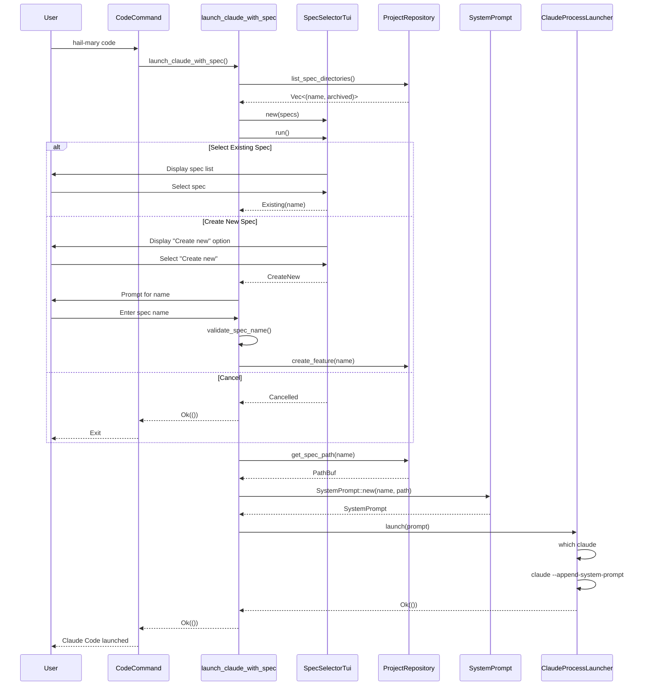

# Design: hail-mary code Command

## Overview

The `hail-mary code` command provides an integrated workflow for launching Claude Code with Kiro specification context. It allows users to select an existing specification or create a new one, then launches Claude Code with a system prompt containing all relevant specification file paths and their roles.

## Architecture

Following the Clean Architecture pattern established in ARCHITECTURE.md and the project's **1 command = 1 use case** principle:

```mermaid
%%{init: {
  'theme': 'dark',
  'themeCSS': '
    .nodeLabel { color: #FD971F !important; }
    .edgeLabel { color: #A6E22E !important; background-color: transparent !important; }
    .cluster rect { fill: #272822 !important; stroke: #F92672 !important; stroke-width: 2px !important; rx: 5px !important; ry: 5px !important; }
    .node rect, .node circle, .node ellipse, .node polygon, .node path { fill: #272822 !important; stroke: #A6E22E !important; stroke-width: 2px !important; }
    .flowchart-link { stroke: #66D9EF !important; stroke-width: 2px !important; }
  '
}}%%

flowchart TB
    subgraph CLI ["🖥️ CLI Layer"]
        CodeCmd["CodeCommand<br/>Command execution & orchestration"]
    end
    
    subgraph APP ["📋 Application Layer"]
        LaunchUC["launch_claude_with_spec<br/>Single use case for entire workflow"]
    end
    
    subgraph DOMAIN ["🎯 Domain Layer"]
        PromptVO["SystemPrompt<br/>Value object with template"]
    end
    
    subgraph INFRA ["🔧 Infrastructure Layer"]
        TuiSvc["SpecSelectorTui<br/>TUI for spec selection"]
        ProcLauncher["ClaudeProcessLauncher<br/>Process execution"]
        ProjRepo["ProjectRepository<br/>Spec directory access"]
    end
    
    CodeCmd --> LaunchUC
    LaunchUC --> PromptVO
    LaunchUC --> TuiSvc
    LaunchUC --> ProcLauncher
    LaunchUC --> ProjRepo
    
    TuiSvc --> ProjRepo
    
    classDef cli fill:#272822,stroke:#66D9EF,stroke-width:2px;
    classDef app fill:#272822,stroke:#A6E22E,stroke-width:2px;
    classDef domain fill:#272822,stroke:#F92672,stroke-width:2px;
    classDef infra fill:#272822,stroke:#FD971F,stroke-width:2px;
    
    class CodeCmd cli;
    class LaunchUC app;
    class PromptVO domain;
    class TuiSvc,ProcLauncher,ProjRepo infra;
```



## Layer Specifications

### 1. CLI Layer (`crates/hail-mary/src/cli/`)

#### `commands/code.rs`
```rust
use anyhow::Result;
use crate::application::use_cases::launch_claude_with_spec;
use crate::infrastructure::filesystem::path_manager::PathManager;
use crate::infrastructure::repositories::project::ProjectRepository;

pub struct CodeCommand;

impl CodeCommand {
    pub fn new() -> Self {
        Self
    }
    
    pub fn execute(&self) -> Result<()> {
        // Discover project root
        let path_manager = match PathManager::discover() {
            Ok(pm) => pm,
            Err(_) => {
                println!("{}", format_error("Not in a project directory. Run 'hail-mary init' first."));
                return Err(anyhow::anyhow!("Project not found"));
            }
        };
        
        // Create repository
        let project_repo = ProjectRepository::new(path_manager);
        
        // Execute single use case
        launch_claude_with_spec(&project_repo)
    }
}
```

#### `args.rs` (Addition)
```rust
#[derive(Parser)]
pub enum Commands {
    // ... existing commands ...
    
    /// Launch Claude Code with Kiro specification context
    Code(CodeCommand),
}
```

### 2. Application Layer (`crates/hail-mary/src/application/`)

#### `use_cases/launch_claude_with_spec.rs`
```rust
use anyhow::Result;
use crate::application::errors::ApplicationError;
use crate::application::repositories::ProjectRepository;
use crate::domain::value_objects::system_prompt::SystemPrompt;
use crate::infrastructure::tui::spec_selector::{SpecSelectorTui, SpecSelectionResult};
use crate::infrastructure::process::claude_launcher::ClaudeProcessLauncher;

pub fn launch_claude_with_spec(
    project_repo: &dyn ProjectRepository,
) -> Result<(), ApplicationError> {
    // 1. Get list of specifications
    let specs = project_repo.list_spec_directories()?;
    
    // 2. Run TUI for spec selection (includes new spec option)
    let mut tui = SpecSelectorTui::new(specs);
    let selection_result = tui.run()?;
    
    let spec_name = match selection_result {
        SpecSelectionResult::Existing(name) => name,
        SpecSelectionResult::CreateNew => {
            // Prompt for name and create new spec
            let name = prompt_for_spec_name()?;
            validate_spec_name(&name)?;
            project_repo.create_feature(&name)?;
            name
        }
        SpecSelectionResult::Cancelled => {
            return Ok(()); // User cancelled, exit gracefully
        }
    };
    
    // 3. Generate system prompt
    let spec_path = project_repo.get_spec_path(&spec_name)?;
    let system_prompt = SystemPrompt::new(&spec_name, &spec_path);
    
    // 4. Launch Claude with system prompt
    let launcher = ClaudeProcessLauncher::new();
    launcher.launch(system_prompt.as_str())?;
    
    Ok(())
}

fn prompt_for_spec_name() -> Result<String, ApplicationError> {
    // Simple stdin prompt for spec name
    use std::io::{self, Write};
    
    print!("Enter specification name: ");
    io::stdout().flush()?;
    
    let mut name = String::new();
    io::stdin().read_line(&mut name)?;
    
    Ok(name.trim().to_string())
}

fn validate_spec_name(name: &str) -> Result<(), ApplicationError> {
    // Validation logic (same as create_feature use case)
    let regex = regex::Regex::new(r"^[a-z0-9]+(-[a-z0-9]+)*$").unwrap();
    if !regex.is_match(name) {
        return Err(ApplicationError::InvalidFeatureName(name.to_string()));
    }
    Ok(())
}
```

### 3. Domain Layer (`crates/hail-mary/src/domain/`)

#### `value_objects/system_prompt.rs`
```rust
use std::path::Path;

#[derive(Debug, Clone)]
pub struct SystemPrompt {
    content: String,
}

impl SystemPrompt {
    pub fn new(spec_name: &str, spec_path: &Path) -> Self {
        // Based on Anthropic's best practices for system prompts
        let content = format!(
            r#"# Kiro Specification Context

You are working on a Kiro project specification. Your task is to implement the requirements defined in the specification files below.

## Current Specification

Name: {}
Path: {}

## Specification Files

<kiro_spec_name>{}</kiro_spec_name>
<kiro_spec_path>{}</kiro_spec_path>
<kiro_requirements_path>{}/requirements.md</kiro_requirements_path>
<kiro_design_path>{}/design.md</kiro_design_path>
<kiro_tasks_path>{}/tasks.md</kiro_tasks_path>
<kiro_memo_path>{}/memo.md</kiro_memo_path>

## File Descriptions

- **requirements.md**: Comprehensive requirements including user stories, acceptance criteria, and functional requirements
- **design.md**: Technical design with architecture decisions and implementation approach
- **tasks.md**: Implementation tasks with priorities and dependencies
- **memo.md**: Additional notes and context from the user

## Instructions

1. Read the requirements in <kiro_requirements_path/> to understand what needs to be built
2. Follow the technical approach in <kiro_design_path/>
3. Track your progress against tasks in <kiro_tasks_path/>
4. Consider any additional context in <kiro_memo_path/>

When you need to reference these files, use the XML tag paths provided above."#,
            spec_name,
            spec_path.display(),
            spec_name,
            spec_path.display(),
            spec_path.display(),
            spec_path.display(),
            spec_path.display(),
            spec_path.display()
        );
        
        Self { content }
    }
    
    pub fn as_str(&self) -> &str {
        &self.content
    }
}
```

### 4. Infrastructure Layer (`crates/hail-mary/src/infrastructure/`)

#### `tui/spec_selector.rs`
```rust
use anyhow::Result;
use crossterm::{
    event::{self, Event, KeyCode, KeyEventKind},
    execute,
    terminal::{EnterAlternateScreen, LeaveAlternateScreen, disable_raw_mode, enable_raw_mode},
};
use ratatui::{
    Frame, Terminal,
    backend::CrosstermBackend,
    layout::{Constraint, Direction, Layout},
    style::{Color, Modifier, Style},
    widgets::{Block, Borders, List, ListItem, ListState, Paragraph},
};
use std::io;

pub struct SpecSelectorTui {
    specs: Vec<String>,
    has_new_option: bool,
}

impl SpecSelectorTui {
    pub fn new(specs: Vec<(String, bool)>) -> Self {
        // Filter out archived specs and extract names
        let active_specs: Vec<String> = specs
            .into_iter()
            .filter(|(_, is_archived)| !is_archived)
            .map(|(name, _)| name)
            .collect();
        
        Self {
            specs: active_specs,
            has_new_option: true,
        }
    }
    
    pub fn run(&mut self) -> Result<SpecSelectionResult> {
        // Terminal initialization
        enable_raw_mode()?;
        let mut stdout = io::stdout();
        execute!(stdout, EnterAlternateScreen)?;
        let backend = CrosstermBackend::new(stdout);
        let mut terminal = Terminal::new(backend)?;
        
        let mut list_state = ListState::default();
        list_state.select(Some(0));
        
        let result = loop {
            terminal.draw(|f| self.draw_ui(f, &mut list_state))?;
            
            if let Event::Key(key) = event::read()? {
                if key.kind == KeyEventKind::Press {
                    match key.code {
                        KeyCode::Char('q') | KeyCode::Esc => {
                            break Ok(SpecSelectionResult::Cancelled);
                        }
                        KeyCode::Enter => {
                            if let Some(selected) = list_state.selected() {
                                if self.has_new_option && selected == 0 {
                                    break Ok(SpecSelectionResult::CreateNew);
                                } else {
                                    let index = if self.has_new_option { selected - 1 } else { selected };
                                    if index < self.specs.len() {
                                        break Ok(SpecSelectionResult::Existing(
                                            self.specs[index].clone()
                                        ));
                                    }
                                }
                            }
                        }
                        KeyCode::Up | KeyCode::Char('k') => {
                            self.move_cursor_up(&mut list_state);
                        }
                        KeyCode::Down | KeyCode::Char('j') => {
                            self.move_cursor_down(&mut list_state);
                        }
                        _ => {}
                    }
                }
            }
        };
        
        // Terminal cleanup
        disable_raw_mode()?;
        execute!(terminal.backend_mut(), LeaveAlternateScreen)?;
        
        result
    }
    
    fn draw_ui(&self, frame: &mut Frame, list_state: &mut ListState) {
        let chunks = Layout::default()
            .direction(Direction::Vertical)
            .constraints([
                Constraint::Length(3),
                Constraint::Min(5),
                Constraint::Length(3),
            ])
            .split(frame.area());
        
        // Title
        let title = Paragraph::new("Select a specification to work on")
            .block(Block::default().borders(Borders::ALL).title("Kiro Specifications"));
        frame.render_widget(title, chunks[0]);
        
        // List items
        let mut items: Vec<ListItem> = Vec::new();
        
        if self.has_new_option {
            items.push(ListItem::new("📝 Create new specification")
                .style(Style::default().fg(Color::Green)));
        }
        
        for spec in &self.specs {
            items.push(ListItem::new(format!("  {}", spec)));
        }
        
        let list = List::new(items)
            .block(Block::default().borders(Borders::ALL))
            .highlight_style(Style::default().add_modifier(Modifier::BOLD).bg(Color::DarkGray))
            .highlight_symbol("> ");
        
        frame.render_stateful_widget(list, chunks[1], list_state);
        
        // Instructions
        let instructions = Paragraph::new("↑/↓/j/k: Navigate | Enter: Select | q/Esc: Cancel")
            .block(Block::default().borders(Borders::ALL));
        frame.render_widget(instructions, chunks[2]);
    }
    
    fn move_cursor_up(&self, list_state: &mut ListState) {
        let total_items = self.specs.len() + if self.has_new_option { 1 } else { 0 };
        let i = match list_state.selected() {
            Some(i) => {
                if i == 0 {
                    total_items - 1
                } else {
                    i - 1
                }
            }
            None => 0,
        };
        list_state.select(Some(i));
    }
    
    fn move_cursor_down(&self, list_state: &mut ListState) {
        let total_items = self.specs.len() + if self.has_new_option { 1 } else { 0 };
        let i = match list_state.selected() {
            Some(i) => {
                if i >= total_items - 1 {
                    0
                } else {
                    i + 1
                }
            }
            None => 0,
        };
        list_state.select(Some(i));
    }
}

pub enum SpecSelectionResult {
    Existing(String),
    CreateNew,
    Cancelled,
}
```

#### `process/claude_launcher.rs`
```rust
use anyhow::Result;
use std::process::Command;

pub struct ClaudeProcessLauncher;

impl ClaudeProcessLauncher {
    pub fn new() -> Self {
        Self
    }
    
    pub fn launch(&self, system_prompt: &str) -> Result<()> {
        // Check if claude command exists
        let claude_exists = Command::new("which")
            .arg("claude")
            .output()
            .map(|output| output.status.success())
            .unwrap_or(false);
        
        if !claude_exists {
            return Err(anyhow::anyhow!(
                "Claude Code CLI not found. Please install it first: https://claude.ai/code"
            ));
        }
        
        // Launch claude with system prompt
        let status = Command::new("claude")
            .arg("--append-system-prompt")
            .arg(system_prompt)
            .spawn()?
            .wait()?;
        
        if !status.success() {
            return Err(anyhow::anyhow!("Failed to launch Claude Code"));
        }
        
        Ok(())
    }
}
```

## Data Flow



## Implementation Details

### File Structure
```
crates/hail-mary/src/
├── cli/
│   ├── commands/
│   │   ├── code.rs              # New: CodeCommand implementation
│   │   └── mod.rs               # Modified: Add code module
│   └── args.rs                  # Modified: Add Code variant
├── application/
│   └── use_cases/
│       └── launch_claude_with_spec.rs  # New: Single use case
├── domain/
│   └── value_objects/
│       └── system_prompt.rs     # New: SystemPrompt value object
├── infrastructure/
│   ├── tui/
│   │   ├── mod.rs              # New: Module declaration
│   │   └── spec_selector.rs    # New: TUI implementation
│   └── process/
│       ├── mod.rs              # New: Module declaration
│       └── claude_launcher.rs  # New: Process launcher
└── main.rs                     # Modified: Add Code command handling
```

### Key Design Decisions

1. **Single Use Case**: Following the project pattern of 1 command = 1 use case, all logic is consolidated in `launch_claude_with_spec`

2. **No SpecSelection Entity**: Since we only need a string name and path, creating a domain entity would be over-engineering

3. **Process Launcher in Infrastructure**: Process launching is an infrastructure concern, not a repository responsibility

4. **Simplified System Prompt**: Based on Anthropic's best practices, using clear structure with task context, file descriptions, and instructions

5. **TUI Reuse**: Leveraging patterns from CompleteCommand but simplified for single selection

## Testing Strategy

### Unit Tests

1. **Domain Layer**:
   - `SystemPrompt`: Template generation with proper XML tags

2. **Application Layer**:
   - Mock ProjectRepository for use case testing
   - Spec name validation
   - System prompt generation verification

### Integration Tests

1. **TUI Testing**:
   - Mock terminal for interaction testing
   - State transitions validation

2. **Process Launching**:
   - Mock process launcher for testing without actual Claude
   - Command construction validation

### Manual Testing Checklist

- [ ] Select existing spec and launch Claude
- [ ] Create new spec and launch Claude  
- [ ] Cancel selection (Esc/q)
- [ ] Handle Claude not installed scenario
- [ ] Verify system prompt content in Claude

## Error Scenarios

1. **Claude CLI Not Found**:
   ```
   Error: Claude Code CLI not found. Please install it first: https://claude.ai/code
   ```

2. **No Project Initialized**:
   ```
   Error: Not in a project directory. Run 'hail-mary init' first.
   ```

3. **Invalid Spec Name**:
   ```
   Error: Invalid feature name 'BadName'. Use kebab-case (lowercase letters, numbers, and hyphens only).
   ```

4. **Process Launch Failed**:
   ```
   Error: Failed to launch Claude Code
   ```

## Future Enhancements

1. **Session Management**:
   - Save Claude session context
   - Resume previous sessions
   - Session history tracking

2. **Context Enhancement**:
   - Include memory database context
   - Add related specs references
   - Include git status/branch info

3. **Workflow Integration**:
   - Auto-update tasks.md from Claude session
   - Sync completed tasks back to Kiro
   - Generate session summaries