# Design: hail-mary code Command

## Overview

The `hail-mary code` command provides an integrated workflow for launching Claude Code with Kiro specification context. It allows users to select an existing specification or create a new one, then launches Claude Code with a system prompt containing all relevant specification file paths and their roles.

## Architecture

Following the Clean Architecture pattern established in ARCHITECTURE.md, the implementation consists of 4 layers:


## Layer Specifications

### 1. CLI Layer (`crates/hail-mary/src/cli/`)

#### `commands/code.rs`
```rust
pub struct CodeCommand;

impl CodeCommand {
    pub fn new() -> Self;
    
    pub fn execute(&self) -> Result<()> {
        // 1. Initialize path manager
        // 2. Run spec selector TUI
        // 3. Generate system prompt
        // 4. Launch Claude process
    }
    
    fn run_spec_selector(&self) -> Result<SpecSelection>;
    fn generate_system_prompt(&self, spec: &SpecSelection) -> SystemPrompt;
    fn launch_claude(&self, prompt: &SystemPrompt) -> Result<()>;
}
```

#### `args.rs` (Addition)
```rust
#[derive(Parser)]
pub enum Commands {
    // ... existing commands ...
    
    /// Launch Claude Code with Kiro specification context
    Code(CodeCommand),
}
```

### 2. Application Layer (`crates/hail-mary/src/application/`)

#### `use_cases/launch_claude.rs`
```rust
pub fn launch_claude_with_spec(
    spec_name: &str,
    project_repo: &dyn ProjectRepository,
    process_launcher: &dyn ProcessLauncher,
) -> Result<()> {
    // 1. Validate spec exists
    // 2. Build system prompt from spec
    // 3. Launch Claude with prompt
}
```

#### `use_cases/select_spec.rs`
```rust
pub fn select_specification(
    project_repo: &dyn ProjectRepository,
) -> Result<SpecSelection> {
    // 1. List available specs
    // 2. Add "Create new spec" option
    // 3. Return selection
}
```

#### `use_cases/create_spec_inline.rs`
```rust
pub fn create_spec_inline(
    name: String,
    project_repo: &dyn ProjectRepository,
) -> Result<SpecSelection> {
    // 1. Validate name
    // 2. Create spec directory and files
    // 3. Return new spec selection
}
```

### 3. Domain Layer (`crates/hail-mary/src/domain/`)

#### `entities/spec_selection.rs`
```rust
#[derive(Debug, Clone)]
pub struct SpecSelection {
    pub name: String,
    pub path: PathBuf,
    pub mode: SpecSelectionMode,
}

#[derive(Debug, Clone, PartialEq)]
pub enum SpecSelectionMode {
    Existing,
    NewlyCreated,
}

impl SpecSelection {
    pub fn new(name: String, path: PathBuf, mode: SpecSelectionMode) -> Self;
    pub fn requirements_path(&self) -> PathBuf;
    pub fn design_path(&self) -> PathBuf;
    pub fn tasks_path(&self) -> PathBuf;
    pub fn memo_path(&self) -> PathBuf;
}
```

#### `value_objects/system_prompt.rs`
```rust
#[derive(Debug, Clone)]
pub struct SystemPrompt {
    content: String,
}

impl SystemPrompt {
    pub fn new(spec: &SpecSelection) -> Self {
        let content = format!(
            r#"# Kiro Specification Context

You are working on a Kiro project specification. Focus on implementing the requirements defined in the following specification files.

## Current Specification: {}

<kiro_spec_name>{}</kiro_spec_name>
<kiro_spec_path>{}</kiro_spec_path>
<kiro_requirements_path>{}</kiro_requirements_path>
<kiro_design_path>{}</kiro_design_path>
<kiro_tasks_path>{}</kiro_tasks_path>
<kiro_memo_path>{}</kiro_memo_path>

## File Descriptions

- **requirements.md**: Comprehensive requirements for the specification. Contains user stories, acceptance criteria, functional requirements, and non-functional requirements.
- **design.md**: Technical design document including architecture decisions, implementation approach, API design, data models, and technical considerations.
- **tasks.md**: Implementation tasks broken down into actionable items with priorities, dependencies, and completion status.
- **memo.md**: User notes, ideas, references, and additional context that may inform the implementation.

## Working Instructions

1. **Primary Focus**: Implement the specification defined in `<kiro_requirements_path/>`
2. **Technical Approach**: Follow the design outlined in `<kiro_design_path/>`
3. **Task Tracking**: Complete tasks listed in `<kiro_tasks_path/>`
4. **Additional Context**: Consider notes in `<kiro_memo_path/>`

When referencing these files in commands or discussions, use the XML tag paths provided above."#,
            spec.name,
            spec.name,
            spec.path.display(),
            spec.requirements_path().display(),
            spec.design_path().display(),
            spec.tasks_path().display(),
            spec.memo_path().display()
        );
        
        Self { content }
    }
    
    pub fn as_str(&self) -> &str {
        &self.content
    }
}
```

### 4. Infrastructure Layer (`crates/hail-mary/src/infrastructure/`)

#### `tui/spec_selector.rs`
```rust
pub struct SpecSelectorTui {
    specs: Vec<(String, bool)>,
    selected_specs: HashSet<String>,
}

impl SpecSelectorTui {
    pub fn new(specs: Vec<(String, bool)>) -> Self;
    
    pub fn run(&mut self) -> Result<SpecSelectionResult> {
        // TUI implementation similar to CompleteCommand
        // Returns either:
        // - SpecSelectionResult::Existing(name)
        // - SpecSelectionResult::CreateNew
        // - SpecSelectionResult::Cancelled
    }
    
    fn draw_ui(&self, frame: &mut Frame, list_state: &mut ListState);
    fn handle_input(&mut self, key: KeyCode) -> Option<SpecSelectionResult>;
}

pub enum SpecSelectionResult {
    Existing(String),
    CreateNew,
    Cancelled,
}
```

#### `process/claude_launcher.rs`
```rust
use std::process::Command;

pub trait ProcessLauncher: Send {
    fn launch_claude(&self, system_prompt: &str) -> Result<()>;
}

pub struct ClaudeProcessLauncher;

impl ProcessLauncher for ClaudeProcessLauncher {
    fn launch_claude(&self, system_prompt: &str) -> Result<()> {
        // Check if claude command exists
        let claude_exists = Command::new("which")
            .arg("claude")
            .output()
            .map(|output| output.status.success())
            .unwrap_or(false);
            
        if !claude_exists {
            return Err(anyhow::anyhow!(
                "Claude Code CLI not found. Please install it first: https://claude.ai/code"
            ));
        }
        
        // Launch claude with system prompt
        let status = Command::new("claude")
            .arg("--append-system-prompt")
            .arg(system_prompt)
            .spawn()?
            .wait()?;
            
        if !status.success() {
            return Err(anyhow::anyhow!("Failed to launch Claude Code"));
        }
        
        Ok(())
    }
}
```

## Data Flow

### Main Execution Flow


### TUI State Machine

```mermaid
%%{init: {
  'theme': 'dark'
}}%%

stateDiagram-v2
    [*] --> SpecList: Initialize
    
    SpecList --> SpecList: Navigate (↑/↓)
    SpecList --> Selected: Select (Enter)
    SpecList --> CreateNew: Select "Create new"
    SpecList --> Exit: Quit (q/Esc)
    
    CreateNew --> NameInput: Show prompt
    NameInput --> Creating: Enter name
    Creating --> Selected: Success
    Creating --> Error: Failure
    
    Selected --> [*]: Return selection
    Exit --> [*]: Return cancelled
    Error --> SpecList: Show error
```



## Implementation Details

### File Structure
```
crates/hail-mary/src/
├── cli/
│   ├── commands/
│   │   ├── code.rs              # New: CodeCommand implementation
│   │   └── mod.rs               # Modified: Add code module
│   └── args.rs                  # Modified: Add Code variant
├── application/
│   ├── use_cases/
│   │   ├── launch_claude.rs     # New: Claude launching logic
│   │   ├── select_spec.rs       # New: Spec selection logic
│   │   └── create_spec_inline.rs # New: Inline spec creation
│   └── repositories/
│       └── process_repository.rs # New: Process launcher trait
├── domain/
│   ├── entities/
│   │   └── spec_selection.rs    # New: SpecSelection entity
│   └── value_objects/
│       └── system_prompt.rs     # New: SystemPrompt value object
├── infrastructure/
│   ├── tui/
│   │   └── spec_selector.rs     # New: TUI implementation
│   └── process/
│       └── claude_launcher.rs   # New: Process launcher
└── main.rs                      # Modified: Add Code command handling
```

### Key Implementation Considerations

1. **TUI Reuse**: Leverage existing TUI patterns from `CompleteCommand` but adapt for spec selection with "Create new" option

2. **Process Safety**: Use `which` command to verify Claude CLI availability before attempting launch

3. **Error Handling**:
   - Claude not installed → Clear error message with installation link
   - Spec creation failure → Rollback and show error
   - Process launch failure → Capture and display error

4. **System Prompt Template**: 
   - Use XML tags for structured data
   - Include all file paths with clear descriptions
   - Maintain consistency with Claude Code conventions

5. **Name Input for New Spec**:
   - Validate against existing specs
   - Follow existing naming conventions
   - Create all required files (requirements.md, design.md, tasks.md, memo.md)

6. **Cross-platform Compatibility**:
   - Handle different shell environments
   - Use `std::process::Command` for portable execution

## Testing Strategy

### Unit Tests

1. **Domain Layer**:
   - `SpecSelection`: Path generation methods
   - `SystemPrompt`: Template generation with proper XML tags

2. **Application Layer**:
   - Mock repositories for use case testing
   - Spec selection logic validation
   - System prompt generation verification

### Integration Tests

1. **TUI Testing**:
   - Mock terminal for interaction testing
   - State transitions validation
   - Input handling verification

2. **Process Launching**:
   - Mock process launcher for testing without actual Claude
   - Command construction validation
   - Error scenario testing

### Manual Testing Checklist

- [ ] Select existing spec and launch Claude
- [ ] Create new spec and launch Claude
- [ ] Cancel selection (Esc/q)
- [ ] Handle Claude not installed scenario
- [ ] Verify system prompt content in Claude
- [ ] Test on different operating systems

## Error Scenarios

1. **Claude CLI Not Found**:
   ```
   Error: Claude Code CLI not found. Please install it first: https://claude.ai/code
   ```

2. **No Project Initialized**:
   ```
   Error: Not in a project directory. Run 'hail-mary init' first.
   ```

3. **Spec Creation Failed**:
   ```
   Error: Failed to create specification: [specific error]
   ```

4. **Process Launch Failed**:
   ```
   Error: Failed to launch Claude Code: [specific error]
   ```

## Future Enhancements

1. **Configuration Options**:
   - Custom Claude model selection
   - Additional Claude CLI flags support
   - Template customization

2. **Context Enhancement**:
   - Include memory database context
   - Add project configuration details
   - Include recent command history

3. **Workflow Integration**:
   - Auto-update tasks.md from Claude session
   - Sync completed tasks back to Kiro
   - Generate session summaries

4. **Multi-spec Support**:
   - Work on multiple specs simultaneously
   - Cross-reference between specs
   - Dependency management