# Hail-Mary Project Architecture

## Overview

Hail-Mary is a sophisticated Rust CLI application that implements a Memory MCP (Model Context Protocol) server and Kiro project specification management system. The project demonstrates modern Rust architecture patterns with a focus on performance, reliability, and maintainability.

**Primary Purpose**: CLI tool for Memory MCP server and Rust project specification management
**Key Features**: Memory database with FTS search, MCP protocol implementation, configuration management
**Target Use Cases**: AI model context management, technical knowledge storage, project documentation

## 🏗️ System Architecture

### Architectural Patterns
- **Hexagonal Architecture**: Clear separation between domain logic and infrastructure
- **Repository Pattern**: Abstracted data access with multiple implementations
- **Service Layer**: Business logic encapsulation with validation
- **Command Pattern**: CLI commands with structured execution
- **Builder Pattern**: Fluent configuration and object construction

### Core Components

```mermaid
%%{init: {
  'theme': 'dark',
  'themeCSS': '
    .nodeLabel { color: #FD971F !important; }
    .edgeLabel { color: #A6E22E !important; background-color: transparent !important; }
    .cluster rect { fill: #272822 !important; stroke: #F92672 !important; stroke-width: 2px !important; rx: 5px !important; ry: 5px !important; }
    .node rect, .node circle, .node ellipse, .node polygon, .node path { fill: #272822 !important; stroke: #A6E22E !important; stroke-width: 2px !important; }
    .flowchart-link { stroke: #66D9EF !important; stroke-width: 2px !important; }
  '
}}%%

flowchart TB
    subgraph CLI ["🖥️ CLI Interface Layer"]
        Main["main.rs<br/>Command routing & argument parsing"]
    end
    
    subgraph CMD ["⚡ Command Layer"]
        Init["InitCommand<br/>Project setup"]
        New["NewCommand<br/>Spec creation"]
        Code["CodeCommand<br/>Claude Code integration"]
        Memory["MemoryCommands<br/>MCP operations"]
    end
    
    subgraph SVC ["🔧 Service Layer"]
        MemSvc["MemoryService<br/>Business logic & validation"]
        McpSvc["MemoryMcpService<br/>MCP protocol implementation"]
    end
    
    subgraph REPO ["📦 Repository Layer"]
        RepoTrait["MemoryRepository<br/>(trait interface)"]
        SqliteRepo["SqliteMemoryRepository<br/>(production)"]
        InMemRepo["InMemoryRepository<br/>(testing)"]
    end
    
    subgraph DATA ["🗄️ Data Layer"]
        DB["SQLite Database<br/>with FTS5 search"]
        Migration["Migration System<br/>(Refinery)"]
        Config["TOML Configuration<br/>Files"]
    end
    
    Main --> Init
    Main --> New
    Main --> Code
    Main --> Memory
    
    Init --> MemSvc
    New --> MemSvc
    Code --> MemSvc
    Memory --> MemSvc
    Memory --> McpSvc
    
    MemSvc --> RepoTrait
    McpSvc --> RepoTrait
    
    RepoTrait -.-> SqliteRepo
    RepoTrait -.-> InMemRepo
    
    SqliteRepo --> DB
    SqliteRepo --> Migration
    MemSvc --> Config
    
    classDef cli fill:#272822,stroke:#66D9EF,stroke-width:2px;
    classDef command fill:#272822,stroke:#A6E22E,stroke-width:2px;
    classDef service fill:#272822,stroke:#F92672,stroke-width:2px;
    classDef repo fill:#272822,stroke:#AE81FF,stroke-width:2px;
    classDef data fill:#272822,stroke:#FD971F,stroke-width:2px;
    classDef interface fill:#272822,stroke:#66D9EF,stroke-width:2px,stroke-dasharray: 5 5;
    
    class Main cli;
    class Init,New,Code,Memory command;
    class MemSvc,McpSvc service;
    class RepoTrait interface;
    class SqliteRepo,InMemRepo repo;
    class DB,Migration,Config data;
```



## 📁 Directory Structure

### Workspace Organization
The project uses a Cargo workspace structure for better modularity and future extensibility.

```
.
├── Cargo.toml                    # Workspace root configuration
├── crates/
│   ├── hail-mary/                    # Main application crate
│   │   ├── Cargo.toml                # Application package configuration  
│   │   └── src/                      # Source code
│   │       ├── main.rs               # CLI entry point and command routing
│   │       ├── lib.rs                # Library exports for integration tests
│   │       ├── domain/               # Pure business logic
│   │       │   ├── entities/        # Core domain objects
│   │       │   │   ├── memory.rs    # Memory entity with business rules
│   │       │   │   └── project.rs   # Project configuration entity
│   │       │   ├── value_objects/   # Domain-specific types
│   │       │   │   └── confidence.rs # Confidence value (0.0-1.0)
│   │       │   └── errors.rs        # Domain errors
│   │       ├── application/          # Business logic orchestration
│   │       │   ├── use_cases/       # Application services
│   │       │   │   ├── initialize_project.rs
│   │       │   │   ├── create_feature.rs
│   │       │   │   ├── remember_memory.rs
│   │       │   │   └── recall_memory.rs
│   │       │   ├── repositories/    # Repository trait definitions
│   │       │   │   ├── memory_repository.rs
│   │       │   │   └── project_repository.rs
│   │       │   └── errors.rs        # Application errors
│   │       ├── cli/                 # Command-line interface
│   │       │   ├── commands/        # Command implementations
│   │       │   │   ├── init.rs     # Project initialization
│   │       │   │   ├── new.rs      # Feature creation
│   │       │   │   ├── complete.rs # Complete features with TUI
│   │       │   │   └── memory.rs   # Memory subcommands
│   │       │   ├── formatters.rs   # Output formatting
│   │       │   └── args.rs         # CLI argument parsing
│   │       └── infrastructure/      # External services
│   │           ├── repositories/    # Repository implementations
│   │           │   ├── memory.rs   # SQLite memory repository
│   │           │   └── project.rs  # Filesystem project repository
│   │           ├── mcp/            # MCP protocol
│   │           │   └── server.rs   # MCP server implementation
│   │           ├── filesystem/      # File system operations
│   │           │   └── path_manager.rs
│   │           └── migrations/      # Database migrations
│   │               └── embedded.rs  # Embedded migration system
│   └── anthropic-client/             # Anthropic API OAuth client
│       ├── Cargo.toml                # OAuth client dependencies
│       ├── src/
│       │   └── lib.rs               # OAuth implementation & API client
│       └── examples/
│           └── basic_chat.rs        # Example usage with Claude API
```

### External Organization
```
migrations/               # Database schema management
├── V001__initial_schema.sql    # Core tables and indexes
├── V002__add_fts5_index.sql   # Full-text search setup
└── V003__add_triggers.sql     # Automatic FTS maintenance

tests/                   # Integration tests
├── common/             # Shared test utilities
├── integration/        # Cross-module integration tests
├── new_command.rs      # Command testing
└── integration_repository_test.rs  # Database integration tests

.claude/                 # Claude Code integration
└── commands/           # Custom slash commands for Claude Code
    └── hm/             # Hail-mary specific commands
        ├── steering.md          # Main steering management command
        ├── steering-remember.md  # Draft capture command
        └── steering-merge.md     # Merge steering drafts command
```

## 🔧 Core Components Detail

### CLI Interface (`main.rs`)
**Purpose**: Command routing and argument parsing with clap
**Key Features**:
- Structured command hierarchy with subcommands
- Type-safe argument parsing using derive macros
- Async runtime support with Tokio
- Comprehensive error handling

**Command Structure**:
```rust
Commands::Init(InitCommand)        // Project initialization
Commands::New(NewCommand)          // Specification creation
Commands::Code(CodeCommand)        // Claude Code integration
Commands::Memory {
    MemoryCommands::Serve          // Start MCP server
    MemoryCommands::Document       // Generate documentation
    MemoryCommands::Reindex        // Database optimization
}
```

### Memory Domain Model (`models/memory.rs`)
**Core Entity**: `Memory` struct with rich metadata
**Memory Types**: Tech, ProjectTech, Domain (extensible enum)
**Key Features**:
- UUID-based identification
- Builder pattern for fluent construction
- SQLite integration with custom row mapping
- Confidence scoring and reference tracking
- Logical deletion support

**Data Structure**:
```rust
pub struct Memory {
    pub id: String,                    // UUID v4
    pub memory_type: MemoryType,       // Categorization
    pub title: String,                 // Human-readable title
    pub tags: Vec<String>,             // Searchable metadata
    pub content: String,               // Main content
    pub reference_count: u32,          // Usage tracking
    pub confidence: f32,               // Quality score (0.0-1.0)
    pub created_at: i64,              // Creation timestamp
    pub last_accessed: Option<i64>,   // Access tracking
    pub deleted: bool,                // Logical deletion
}
```

### Configuration System (`models/kiro.rs`)
**Purpose**: Project configuration management with TOML
**Key Features**:
- Hierarchical configuration with defaults
- Project root discovery (.kiro directory)
- Memory type validation
- Document output configuration
- Database path management

**Configuration Hierarchy**:
```toml
[memory]
types = ["tech", "project-tech", "domain"]
instructions = "Memory type descriptions"

[memory.document]
output_dir = ".kiro/memory"
format = "markdown"

[memory.database]
path = ".kiro/memory/db.sqlite3"
```

### Kiro Specification Management (`commands/new.rs`)
**Purpose**: Create and manage project specifications with structured documentation
**Key Components**:
- **Specification Templates**: Auto-generated markdown files for comprehensive project documentation
- **Date-based Naming**: Automatic prefixing with creation date for chronological organization
- **Validation**: Kebab-case naming enforcement for consistency

**Specification Files Created**:
- **requirements.md**: User stories, acceptance criteria, and functional requirements
- **design.md**: Technical architecture decisions and implementation approach
- **tasks.md**: Implementation tasks with priorities and dependencies
- **memo.md**: Additional notes and context from the user
- **investigation.md**: Research findings, key discoveries, and technical considerations
- **spec.json**: Metadata for specification tracking

### Claude Code Integration (`commands/code.rs`)
**Purpose**: Launch Claude Code with Kiro specification context
**Key Components**:
- **TUI Specification Selector**: Interactive selection of existing specs or creation of new ones
- **System Prompt Generation**: XML-tagged context for structured file references
- **Process Management**: TTY-aware Claude Code launching with proper backgrounding support

**Architecture Flow**:
1. **Specification Discovery**: List available specs via ProjectRepository
2. **Interactive Selection**: TUI for spec choice with "Create new" option
3. **Context Generation**: SystemPrompt value object with XML-tagged file paths
4. **Process Launch**: ClaudeProcessLauncher with exec replacement for TTY preservation

**System Prompt Template**:
```xml
<kiro_spec_name>{name}</kiro_spec_name>
<kiro_spec_path>{path}</kiro_spec_path>
<kiro_requirements_path>{path}/requirements.md</kiro_requirements_path>
<kiro_design_path>{path}/design.md</kiro_design_path>
<kiro_tasks_path>{path}/tasks.md</kiro_tasks_path>
<kiro_memo_path>{path}/memo.md</kiro_memo_path>
<kiro_investigation_path>{path}/investigation.md</kiro_investigation_path>
```

**TTY Management Strategy**:
- **Process Replacement**: Uses `exec()` on Unix systems to replace hail-mary process with Claude Code
- **TTY Preservation**: Maintains terminal control for proper Ink (React CLI) operation
- **Background Support**: Enables `ctrl+z` job control through proper process ownership

### Repository Layer (`repositories/memory.rs`)
**Pattern**: Repository pattern with trait-based abstraction
**Implementations**:
- `SqliteMemoryRepository`: Production persistence with FTS5
- `InMemoryRepository`: Testing implementation with HashMap

**Core Operations**:
```rust
pub trait MemoryRepository: Send {
    fn save(&mut self, memory: &Memory) -> Result<()>;
    fn save_batch(&mut self, memories: &[Memory]) -> Result<()>;
    fn find_by_id(&self, id: &str) -> Result<Option<Memory>>;
    fn search_fts(&self, query: &str, limit: usize) -> Result<Vec<Memory>>;
    fn find_all(&self) -> Result<Vec<Memory>>;
    fn increment_reference_count(&mut self, id: &str) -> Result<()>;
}
```

### Service Layer (`services/memory.rs`)
**Purpose**: Business logic and validation with async support
**Key Features**:
- Input validation against configuration
- Batch operations with transaction support
- Search with filtering and sorting
- Asynchronous reference count updates
- Markdown document generation

**Business Logic Flow**:
1. **Input Validation**: Memory type, required fields, confidence range
2. **Memory Creation**: UUID generation, defaults, builder pattern
3. **Persistence**: Repository delegation with error handling
4. **Search Logic**: FTS queries with business rule filtering
5. **Reference Tracking**: Async updates without blocking

## 🗄️ Database Architecture

### Schema Design
**Primary Table**: `memories` with comprehensive metadata
**Search Index**: `memories_fts` using SQLite FTS5
**Performance Indexes**: Type, reference count, creation time
**Data Integrity**: Constraints, foreign keys, check constraints

### Migration Strategy
**Tool**: Refinery for versioned migrations
**Approach**: Forward-only migrations with embedded SQL
**Versioning**: V001, V002, V003 prefix convention

**Migration Sequence**:
1. **V001**: Core schema with tables and basic indexes
2. **V002**: FTS5 virtual table with Japanese tokenization support
3. **V003**: Automatic triggers for FTS index maintenance

### FTS5 Search Implementation
**Tokenizer**: `porter unicode61` for multilingual support
**Features**: Japanese text search, phrase queries, ranking
**Maintenance**: Automatic via triggers (INSERT, UPDATE, DELETE)
**Performance**: Indexed search with relevance ranking

**Trigger System**:
```sql
-- Automatic FTS index maintenance
CREATE TRIGGER memories_ai AFTER INSERT ON memories    -- Add to FTS
CREATE TRIGGER memories_au AFTER UPDATE ON memories    -- Update FTS
CREATE TRIGGER memories_ad AFTER DELETE ON memories    -- Remove from FTS
CREATE TRIGGER memories_soft_delete AFTER UPDATE       -- Handle logical deletion
```

## 🧪 Testing Architecture

### Testing Strategy
**Levels**: Unit, Integration, Repository, Service
**Tools**: `rstest`, `pretty_assertions`, `tempfile`
**Approach**: Comprehensive coverage with realistic scenarios

### Test Organization
**Unit Tests**: Embedded in source files (`#[cfg(test)]`)
**Integration Tests**: Separate `tests/` directory
**Test Utilities**: Shared infrastructure in `tests/common/`
**Database Tests**: Temporary SQLite databases

### Key Testing Patterns
**Repository Testing**:
- Abstract trait testing for both implementations
- Transaction behavior validation
- FTS search functionality including Japanese
- Trigger system verification

**Service Testing**:
- Business logic validation
- Error condition handling
- Async operation testing
- Configuration validation

**Integration Testing**:
- End-to-end workflows
- Real database operations
- Multi-language content
- Performance characteristics

## 🚀 Concurrency & Performance

### Async Design
**Runtime**: Tokio with full feature set
**Patterns**: Async/await throughout service layer
**Concurrency**: Non-blocking reference count updates
**Resource Management**: Connection pooling with Arc<Mutex<>>

### Performance Optimizations
**Database**: SQLite WAL mode, optimized pragmas
**Indexing**: Strategic indexes for common queries
**Caching**: In-memory repository for testing performance
**Batch Operations**: Transaction-based bulk operations

### Resource Management
**Memory**: Efficient string handling, minimal cloning
**Database**: Connection reuse, prepared statements
**Threading**: Safe sharing with Arc<Mutex<>> patterns
**Error Handling**: Zero-cost error propagation

## 🔗 Infrastructure Layer Extensions

### Process Management (`infrastructure/process/`)
**Purpose**: External process integration with proper TTY handling
**Key Features**:
- **Claude Code Integration**: Launch Claude with system prompts
- **TTY Management**: Process replacement (`exec()`) for terminal control preservation
- **Cross-platform Support**: Unix/Windows compatibility with fallback mechanisms
- **Error Handling**: Comprehensive process launch error management

### TUI Components (`infrastructure/tui/`)
**Purpose**: Terminal user interface for interactive workflows
**Key Features**:
- **Specification Selector**: Interactive TUI for spec selection and creation
- **Keyboard Navigation**: Standard keybindings (↑/↓/j/k/Enter/q/Esc)
- **Visual Design**: Consistent styling with existing CLI patterns
- **State Management**: Proper terminal setup and cleanup

## 🔒 Error Handling Strategy

### Error Architecture
**Primary**: `anyhow::Result` for application errors
**Custom**: `thiserror` for domain-specific errors
**Propagation**: `?` operator for clean error flow
**Context**: Rich error messages with context

**Error Types**:
```rust
pub enum MemoryError {
    NotFound(String),           // Resource not found
    InvalidInput(String),       // Validation failures
    DatabaseError(String),      // Persistence issues
    ConfigurationError(String), // Config problems
    Io(std::io::Error),        // File system errors
}
```

### Error Handling Patterns
**Validation**: Early validation with descriptive messages
**Recovery**: Graceful degradation where possible
**Logging**: Structured logging with tracing
**Propagation**: Context preservation through error chain

## 🔧 Dependencies & External Libraries

### Core Dependencies
**CLI Framework**: `clap` v4.5 with derive features
**Async Runtime**: `tokio` v1 with full features
**Database**: `rusqlite` v0.31 with bundled SQLite
**Migrations**: `refinery` v0.8 for schema management
**Serialization**: `serde` v1 with derive features

### Development Dependencies
**Testing**: `rstest` v0.23 for parameterized tests
**Assertions**: `pretty_assertions` v1 for readable output
**Temporary Files**: `tempfile` v3 for test isolation

### Protocol Dependencies
**MCP Protocol**: `rmcp` v0.5.0 for server implementation
**JSON Schema**: `schemars` v1 for API documentation
**JSON Processing**: `serde_json` v1 for message handling

## 🎯 Quality Attributes

### Maintainability
**Modularity**: Clear separation of concerns
**Documentation**: Comprehensive inline documentation
**Testing**: High test coverage with realistic scenarios
**Code Style**: Consistent formatting and naming

### Reliability
**Error Handling**: Comprehensive error coverage
**Data Integrity**: Database constraints and validation
**Transaction Safety**: ACID compliance for batch operations
**Testing**: Thorough edge case coverage

### Performance
**Database**: Optimized queries with proper indexing
**Memory**: Efficient data structures and minimal copying
**Concurrency**: Non-blocking operations where beneficial
**Caching**: Strategic use of in-memory storage

### Security
**Input Validation**: Comprehensive validation at boundaries
**SQL Injection**: Parameterized queries throughout
**Path Safety**: Secure file system operations
**Error Information**: No sensitive data in error messages

## 🔮 Extension Points

### Architectural Flexibility
**Repository Pattern**: Easy to add new storage backends
**Service Layer**: Business logic changes isolated from infrastructure
**Command Pattern**: Simple to add new CLI commands
**Configuration**: TOML-based extensible configuration

### Planned Extensions
**Memory Types**: Additional categorization schemes
**Search Features**: Advanced query syntax and filters
**Export Formats**: Multiple output formats beyond Markdown
**MCP Features**: Extended protocol capability implementation

## 🔌 External Integrations

### Anthropic Client (`crates/anthropic-client`)
**Purpose**: OAuth authentication and API client for Anthropic's Claude API
**Key Features**:
- OAuth token management with automatic refresh
- Secure authentication from `~/.local/share/opencode/auth.json`
- Non-streaming API calls to Claude models
- Cloudflare bot detection mitigation

**Architecture Highlights**:
- **Token Management**: Automatic refresh when expired with persistent storage
- **HTTP Client**: Configured with `rustls-tls-native-roots` for proper TLS behavior
- **Error Handling**: Comprehensive error handling with `anyhow::Result`
- **Security**: OAuth2 flow with secure token storage and refresh

**Usage Example**:
```rust
use anthropic_client::{load_auth, complete};

let mut auth = load_auth().await?;
let response = complete("claude-3-5-sonnet", "Hello?", &mut auth).await?;
```

### Claude Code Integration & Steering System

**Purpose**: File-based context management system complementing the SQLite Memory MCP, designed for version-controllable project knowledge.

#### Steering System Architecture
**Storage Location**: `.kiro/steering/` directory with markdown-based context files
**Configuration**: `.kiro/config.toml` with `[[steering.types]]` sections for type definitions

**Core Steering Files** (Always Included in Claude Code sessions):
- `product.md`: Product overview and value proposition
- `tech.md`: Technology stack and development environment
- `structure.md`: Code organization and architectural patterns

#### Custom Claude Code Commands
**Location**: `.claude/commands/hm/` directory

**Available Slash Commands**:
- `/hm:steering`: Main steering management command - processes drafts and updates steering files intelligently
- `/hm:steering-remember [title]`: Capture learning and insights to `.kiro/steering/draft/` for later processing
- `/hm:steering-merge`: Advanced merging of steering content with conflict resolution capabilities

#### Domain Integration
**Steering Entities** (`domain/entities/steering.rs`):
- `SteeringType`: Enum for steering categories (Product, Tech, Structure)
- `Criterion`: Structured criteria for content categorization and validation
- `SteeringConfig`: Configuration management with type validation

**Repository Integration**:
- `ProjectRepository` handles all steering file operations with proper error handling
- Automatic backup creation before any steering file modifications
- Smart configuration updates that preserve existing settings

#### Key Benefits
- **Version Controllable**: All steering files are git-trackable for team collaboration
- **Transparency**: Clear visibility into project context evolution and decision history
- **Team Collaboration**: Shared context without database synchronization requirements
- **Complementary Design**: Works alongside Memory MCP for different knowledge management patterns
- **Always Available**: Core steering files loaded in every Claude Code session for consistent context

#### Workflow Integration
1. **Capture Phase**: Use `/hm:steering-remember` during development to save insights
2. **Processing Phase**: Run `/hm:steering` to intelligently categorize and organize drafts
3. **Version Control**: Commit steering changes to share context with team members
4. **Context Loading**: Steering files automatically provide persistent context for development sessions

---

*This architecture documentation reflects the current implementation and design decisions. The system demonstrates solid architectural principles with room for growth and adaptation.*
