# Hail-Mary Project Architecture

## Overview

Hail-Mary is a sophisticated Rust CLI application focused on Kiro project specification management and file-based context steering. The project demonstrates clean Rust architecture patterns with emphasis on developer experience and AI integration.

**Primary Purpose**: CLI tool for specification-driven development and project context management
**Key Features**: Interactive specification management, steering system, Claude Code integration, TUI interfaces
**Target Use Cases**: Spec-driven development workflows, project context management, AI-assisted development

## 🏗️ System Architecture

### Architectural Patterns
- **Clean Architecture**: Clear separation between domain logic and infrastructure
- **Repository Pattern**: Abstracted file system operations through trait interfaces
- **Use Case Pattern**: Business logic encapsulation with validation
- **Command Pattern**: CLI commands with structured execution
- **Value Objects**: Domain-specific types for configuration and system prompts

### Core Components

```mermaid
%%{init: {
  'theme': 'dark',
  'themeCSS': '
    .nodeLabel { color: #FD971F !important; }
    .edgeLabel { color: #A6E22E !important; background-color: transparent !important; }
    .cluster rect { fill: #272822 !important; stroke: #F92672 !important; stroke-width: 2px !important; rx: 5px !important; ry: 5px !important; }
    .node rect, .node circle, .node ellipse, .node polygon, .node path { fill: #272822 !important; stroke: #A6E22E !important; stroke-width: 2px !important; }
    .flowchart-link { stroke: #66D9EF !important; stroke-width: 2px !important; }
  '
}}%%

flowchart TB
    subgraph CLI ["🖥️ CLI Interface Layer"]
        Main["main.rs<br/>Command routing & argument parsing"]
    end
    
    subgraph CMD ["⚡ Command Layer"]
        Init["InitCommand<br/>Project setup"]
        New["NewCommand<br/>Spec creation"]
        Code["CodeCommand<br/>Claude Code integration"]
        Complete["CompleteCommand<br/>Spec archival"]
        Shell["CompletionCommand<br/>Shell completions"]
    end
    
    subgraph UC ["🔧 Use Case Layer"]
        InitUC["initialize_project<br/>Project initialization"]
        CreateUC["create_feature<br/>Feature specification"]
        CompleteUC["complete_features<br/>Spec archival"]
        LaunchUC["launch_claude_with_spec<br/>Claude Code integration"]
    end
    
    subgraph REPO ["📦 Repository Layer"]
        ProjectRepo["ProjectRepository<br/>(trait interface)"]
        FsRepo["FilesystemProjectRepository<br/>(implementation)"]
    end
    
    subgraph INFRA ["🗄️ Infrastructure Layer"]
        PathMgr["PathManager<br/>Path resolution"]
        ProcessLauncher["ClaudeProcessLauncher<br/>TTY management"]
        TUI["SpecSelector<br/>Interactive interface"]
        Config["TOML Configuration<br/>Steering system"]
    end
    
    Main --> Init
    Main --> New
    Main --> Code
    Main --> Complete
    Main --> Shell
    
    Init --> InitUC
    New --> CreateUC
    Code --> LaunchUC
    Complete --> CompleteUC
    
    InitUC --> ProjectRepo
    CreateUC --> ProjectRepo
    LaunchUC --> ProjectRepo
    CompleteUC --> ProjectRepo
    
    ProjectRepo -.-> FsRepo
    
    FsRepo --> PathMgr
    FsRepo --> Config
    LaunchUC --> ProcessLauncher
    LaunchUC --> TUI
    
    classDef cli fill:#272822,stroke:#66D9EF,stroke-width:2px;
    classDef command fill:#272822,stroke:#A6E22E,stroke-width:2px;
    classDef usecase fill:#272822,stroke:#F92672,stroke-width:2px;
    classDef repo fill:#272822,stroke:#AE81FF,stroke-width:2px;
    classDef infra fill:#272822,stroke:#FD971F,stroke-width:2px;
    classDef interface fill:#272822,stroke:#66D9EF,stroke-width:2px,stroke-dasharray: 5 5;
    
    class Main cli;
    class Init,New,Code,Complete,Shell command;
    class InitUC,CreateUC,CompleteUC,LaunchUC usecase;
    class ProjectRepo interface;
    class FsRepo repo;
    class PathMgr,ProcessLauncher,TUI,Config infra;
```



## 📁 Directory Structure

### Workspace Organization
The project uses a Cargo workspace structure for better modularity and future extensibility.

```
.
├── Cargo.toml                    # Workspace root configuration
├── crates/
│   ├── hail-mary/                    # Main application crate
│   │   ├── Cargo.toml                # Application package configuration  
│   │   └── src/                      # Source code
│   │       ├── main.rs               # CLI entry point and command routing
│   │       ├── lib.rs                # Library exports for integration tests
│   │       ├── domain/               # Pure business logic
│   │       │   ├── entities/        # Core domain objects
│   │       │   │   ├── project.rs   # Project configuration entity
│   │       │   │   └── steering.rs  # Steering system entities
│   │       │   ├── value_objects/   # Domain-specific types
│   │       │   │   └── system_prompt.rs # System prompt for Claude Code
│   │       │   └── errors.rs        # Domain errors
│   │       ├── application/          # Business logic orchestration
│   │       │   ├── use_cases/       # Application services
│   │       │   │   ├── initialize_project.rs
│   │       │   │   ├── create_feature.rs
│   │       │   │   ├── complete_features.rs
│   │       │   │   └── launch_claude_with_spec.rs
│   │       │   ├── repositories/    # Repository trait definitions
│   │       │   │   └── project_repository.rs
│   │       │   ├── test_helpers/    # Testing utilities
│   │       │   └── errors.rs        # Application errors
│   │       ├── cli/                 # Command-line interface
│   │       │   ├── commands/        # Command implementations
│   │       │   │   ├── init.rs     # Project initialization
│   │       │   │   ├── new.rs      # Feature creation
│   │       │   │   ├── complete.rs # Complete features with TUI
│   │       │   │   ├── completion.rs # Shell completion generation
│   │       │   │   └── code.rs     # Claude Code integration
│   │       │   ├── formatters.rs   # Output formatting
│   │       │   └── args.rs         # CLI argument parsing
│   │       └── infrastructure/      # External services
│   │           ├── repositories/    # Repository implementations
│   │           │   └── project.rs  # Filesystem project repository
│   │           ├── filesystem/      # File system operations
│   │           │   └── path_manager.rs
│   │           ├── process/         # Process management
│   │           │   └── claude_launcher.rs # Claude Code launcher
│   │           └── tui/            # Terminal user interface
│   │               └── spec_selector.rs # Specification selector
│   └── anthropic-client/             # Anthropic API OAuth client
│       ├── Cargo.toml                # OAuth client dependencies
│       ├── src/
│       │   └── lib.rs               # OAuth implementation & API client
│       └── examples/
│           └── basic_chat.rs        # Example usage with Claude API
```

### External Organization
```
tests/                   # Integration tests
├── common/             # Shared test utilities
├── integration/        # Cross-module integration tests
└── new_command.rs      # Command testing

.claude/                 # Claude Code integration
└── commands/           # Custom slash commands for Claude Code
    └── hm/             # Hail-mary specific commands
        ├── steering.md          # Main steering management command
        ├── steering-remember.md  # Draft capture command
        └── steering-merge.md     # Merge steering drafts command

.kiro/                  # Project specification management
├── steering/           # Steering system files
├── specs/              # Feature specifications
├── archive/            # Archived completed specs
└── config.toml         # Project configuration
```

## 🔧 Core Components Detail

### CLI Interface (`main.rs`)
**Purpose**: Command routing and argument parsing with clap
**Key Features**:
- Structured command hierarchy with subcommands
- Type-safe argument parsing using derive macros
- Async runtime support with Tokio
- Comprehensive error handling

**Command Structure**:
```rust
Commands::Init                     // Project initialization
Commands::New { name }             // Specification creation
Commands::Code { no_danger }       // Claude Code integration
Commands::Complete                 // Mark specifications as complete
Commands::Completion { shell }     // Generate shell completions
```

### Project Domain Model (`domain/entities/project.rs`)
**Core Entity**: Project configuration and specification management
**Steering Types**: Product, Tech, Structure (file-based context system)
**Key Features**:
- TOML-based configuration management
- Specification template generation
- Steering system integration
- Path management and validation

**Configuration Structure**:
```rust
pub struct ProjectConfig {
    pub steering: SteeringConfig,      // Steering system configuration
}

pub struct SteeringConfig {
    pub types: Vec<SteeringType>,      // Configured steering types
}

pub enum SteeringType {
    Product,                           // Product overview
    Tech,                             // Technology stack
    Structure,                        // Code organization
}
```

### Configuration System (`.kiro/config.toml`)
**Purpose**: Project configuration management with TOML
**Key Features**:
- Hierarchical steering configuration
- Project root discovery (.kiro directory)
- Steering type validation
- Criteria-based content organization
- Path management for specifications

**Configuration Hierarchy**:
```toml
[[steering.types]]
name = "product"
purpose = "Product overview and value proposition"
criteria = [
    "Product Overview: Brief description of what the product is",
    "Core Features: Bulleted list of main capabilities",
    "Target Use Case: Specific scenarios the product addresses",
    "Key Value Proposition: Unique benefits and differentiators",
]

[[steering.types]]
name = "tech"
purpose = "Technical stack and development environment"
# ... additional criteria
```

### Kiro Specification Management (`commands/new.rs`)
**Purpose**: Create and manage project specifications with structured documentation
**Key Components**:
- **Specification Templates**: Auto-generated markdown files for comprehensive project documentation
- **Date-based Naming**: Automatic prefixing with creation date for chronological organization
- **Validation**: Kebab-case naming enforcement for consistency

**Specification Files Created**:
- **requirements.md**: User stories, acceptance criteria, and functional requirements
- **design.md**: Technical architecture decisions and implementation approach
- **tasks.md**: Implementation tasks with priorities and dependencies
- **memo.md**: Additional notes and context from the user
- **investigation.md**: Research findings, key discoveries, and technical considerations
- **spec.json**: Metadata for specification tracking

### Claude Code Integration (`commands/code.rs`)
**Purpose**: Launch Claude Code with Kiro specification context
**Key Components**:
- **TUI Specification Selector**: Interactive selection of existing specs or creation of new ones
- **System Prompt Generation**: XML-tagged context for structured file references
- **Process Management**: TTY-aware Claude Code launching with proper backgrounding support

**Architecture Flow**:
1. **Specification Discovery**: List available specs via ProjectRepository
2. **Interactive Selection**: TUI for spec choice with "Create new" option
3. **Context Generation**: SystemPrompt value object with XML-tagged file paths
4. **Process Launch**: ClaudeProcessLauncher with exec replacement for TTY preservation

**System Prompt Template**:
```xml
<kiro_spec_name>{name}</kiro_spec_name>
<kiro_spec_path>{path}</kiro_spec_path>
<kiro_requirements_path>{path}/requirements.md</kiro_requirements_path>
<kiro_design_path>{path}/design.md</kiro_design_path>
<kiro_tasks_path>{path}/tasks.md</kiro_tasks_path>
<kiro_memo_path>{path}/memo.md</kiro_memo_path>
<kiro_investigation_path>{path}/investigation.md</kiro_investigation_path>
```

**TTY Management Strategy**:
- **Process Replacement**: Uses `exec()` on Unix systems to replace hail-mary process with Claude Code
- **TTY Preservation**: Maintains terminal control for proper Ink (React CLI) operation
- **Background Support**: Enables `ctrl+z` job control through proper process ownership

### Repository Layer (`repositories/memory.rs`)
**Pattern**: Repository pattern with trait-based abstraction
**Implementations**:
- `SqliteMemoryRepository`: Production persistence with FTS5
- `InMemoryRepository`: Testing implementation with HashMap

**Core Operations**:
```rust
pub trait MemoryRepository: Send {
    fn save(&mut self, memory: &Memory) -> Result<()>;
    fn save_batch(&mut self, memories: &[Memory]) -> Result<()>;
    fn find_by_id(&self, id: &str) -> Result<Option<Memory>>;
    fn search_fts(&self, query: &str, limit: usize) -> Result<Vec<Memory>>;
    fn find_all(&self) -> Result<Vec<Memory>>;
    fn increment_reference_count(&mut self, id: &str) -> Result<()>;
}
```

### Service Layer (`services/memory.rs`)
**Purpose**: Business logic and validation with async support
**Key Features**:
- Input validation against configuration
- Batch operations with transaction support
- Search with filtering and sorting
- Asynchronous reference count updates
- Markdown document generation

**Business Logic Flow**:
1. **Input Validation**: Memory type, required fields, confidence range
2. **Memory Creation**: UUID generation, defaults, builder pattern
3. **Persistence**: Repository delegation with error handling
4. **Search Logic**: FTS queries with business rule filtering
5. **Reference Tracking**: Async updates without blocking

## 📁 File System Architecture

### Steering System Design
**Primary Storage**: Markdown files in `.kiro/steering/` directory
**Configuration**: TOML-based type definitions and criteria
**Versioning**: Git-trackable files for team collaboration
**Structure**: Hierarchical organization with clear naming conventions

### File Organization Strategy
**Core Files**: `product.md`, `tech.md`, `structure.md` - always included in Claude Code sessions
**Custom Files**: Additional domain-specific steering files based on project needs
**Backup System**: Automatic backup creation before modifications
**Template System**: Structured content generation based on configured criteria

### Path Management
**PathManager**: Centralized path resolution for project discovery
**Root Discovery**: Automatic `.kiro` directory detection
**Safe Operations**: Validation and error handling for all file system operations
**Cross-Platform**: Compatible path handling for Unix and Windows systems

## 🧪 Testing Architecture

### Testing Strategy
**Levels**: Unit, Integration, Repository, Service
**Tools**: `rstest`, `pretty_assertions`, `tempfile`
**Approach**: Comprehensive coverage with realistic scenarios

### Test Organization
**Unit Tests**: Embedded in source files (`#[cfg(test)]`)
**Integration Tests**: Separate `tests/` directory
**Test Utilities**: Shared infrastructure in `tests/common/`
**Filesystem Tests**: Temporary directories with proper cleanup

### Key Testing Patterns
**Repository Testing**:
- Trait-based testing for filesystem operations
- File creation and modification validation
- Configuration parsing and validation
- Path management and project discovery

**Use Case Testing**:
- Business logic validation
- Error condition handling
- File system operation testing
- Configuration management validation

**Integration Testing**:
- End-to-end command workflows
- Real filesystem operations
- TUI interaction testing
- Process management validation

## 🚀 Concurrency & Performance

### Async Design
**Runtime**: Tokio with full feature set for future extensibility
**Patterns**: Async-ready architecture in use case layer
**Concurrency**: Process management for Claude Code integration
**Resource Management**: Safe file system operations with proper error handling

### Performance Optimizations
**File System**: Efficient path resolution and caching
**Template Generation**: Minimal string allocations in content generation
**Process Management**: TTY-aware process launching without blocking
**Configuration**: TOML parsing with caching for repeated access

### Resource Management
**Memory**: Efficient string handling, minimal cloning
**File System**: Proper file handle management and cleanup
**Process**: Safe process spawning and TTY management
**Error Handling**: Zero-cost error propagation with anyhow

## 🔗 Infrastructure Layer Extensions

### Process Management (`infrastructure/process/`)
**Purpose**: External process integration with proper TTY handling
**Key Features**:
- **Claude Code Integration**: Launch Claude with system prompts
- **TTY Management**: Process replacement (`exec()`) for terminal control preservation
- **Cross-platform Support**: Unix/Windows compatibility with fallback mechanisms
- **Error Handling**: Comprehensive process launch error management

### TUI Components (`infrastructure/tui/`)
**Purpose**: Terminal user interface for interactive workflows
**Key Features**:
- **Specification Selector**: Interactive TUI for spec selection and creation
- **Keyboard Navigation**: Standard keybindings (↑/↓/j/k/Enter/q/Esc)
- **Visual Design**: Consistent styling with existing CLI patterns
- **State Management**: Proper terminal setup and cleanup

## 🔒 Error Handling Strategy

### Error Architecture
**Primary**: `anyhow::Result` for application errors
**Custom**: `thiserror` for domain-specific errors
**Propagation**: `?` operator for clean error flow
**Context**: Rich error messages with context

**Error Types**:
```rust
pub enum MemoryError {
    NotFound(String),           // Resource not found
    InvalidInput(String),       // Validation failures
    DatabaseError(String),      // Persistence issues
    ConfigurationError(String), // Config problems
    Io(std::io::Error),        // File system errors
}
```

### Error Handling Patterns
**Validation**: Early validation with descriptive messages
**Recovery**: Graceful degradation where possible
**Logging**: Structured logging with tracing
**Propagation**: Context preservation through error chain

## 🔧 Dependencies & External Libraries

### Core Dependencies
**CLI Framework**: `clap` v4.5 with derive features
**Async Runtime**: `tokio` v1 with full features
**Database**: `rusqlite` v0.31 with bundled SQLite
**Migrations**: `refinery` v0.8 for schema management
**Serialization**: `serde` v1 with derive features

### Development Dependencies
**Testing**: `rstest` v0.23 for parameterized tests
**Assertions**: `pretty_assertions` v1 for readable output
**Temporary Files**: `tempfile` v3 for test isolation

### Protocol Dependencies
**MCP Protocol**: `rmcp` v0.5.0 for server implementation
**JSON Schema**: `schemars` v1 for API documentation
**JSON Processing**: `serde_json` v1 for message handling

## 🎯 Quality Attributes

### Maintainability
**Modularity**: Clear separation of concerns
**Documentation**: Comprehensive inline documentation
**Testing**: High test coverage with realistic scenarios
**Code Style**: Consistent formatting and naming

### Reliability
**Error Handling**: Comprehensive error coverage
**Data Integrity**: Database constraints and validation
**Transaction Safety**: ACID compliance for batch operations
**Testing**: Thorough edge case coverage

### Performance
**Database**: Optimized queries with proper indexing
**Memory**: Efficient data structures and minimal copying
**Concurrency**: Non-blocking operations where beneficial
**Caching**: Strategic use of in-memory storage

### Security
**Input Validation**: Comprehensive validation at boundaries
**SQL Injection**: Parameterized queries throughout
**Path Safety**: Secure file system operations
**Error Information**: No sensitive data in error messages

## 🔮 Extension Points

### Architectural Flexibility
**Repository Pattern**: Easy to add new storage backends
**Service Layer**: Business logic changes isolated from infrastructure
**Command Pattern**: Simple to add new CLI commands
**Configuration**: TOML-based extensible configuration

### Planned Extensions
**Memory Types**: Additional categorization schemes
**Search Features**: Advanced query syntax and filters
**Export Formats**: Multiple output formats beyond Markdown
**MCP Features**: Extended protocol capability implementation

## 🔌 External Integrations

### Anthropic Client (`crates/anthropic-client`)
**Purpose**: OAuth authentication and API client for Anthropic's Claude API
**Key Features**:
- OAuth token management with automatic refresh
- Secure authentication from `~/.local/share/opencode/auth.json`
- Non-streaming API calls to Claude models
- Cloudflare bot detection mitigation

**Architecture Highlights**:
- **Token Management**: Automatic refresh when expired with persistent storage
- **HTTP Client**: Configured with `rustls-tls-native-roots` for proper TLS behavior
- **Error Handling**: Comprehensive error handling with `anyhow::Result`
- **Security**: OAuth2 flow with secure token storage and refresh

**Usage Example**:
```rust
use anthropic_client::{load_auth, complete};

let mut auth = load_auth().await?;
let response = complete("claude-3-5-sonnet", "Hello?", &mut auth).await?;
```

### Claude Code Integration & Steering System

**Purpose**: File-based context management system complementing the SQLite Memory MCP, designed for version-controllable project knowledge.

#### Steering System Architecture
**Storage Location**: `.kiro/steering/` directory with markdown-based context files
**Configuration**: `.kiro/config.toml` with `[[steering.types]]` sections for type definitions

**Core Steering Files** (Always Included in Claude Code sessions):
- `product.md`: Product overview and value proposition
- `tech.md`: Technology stack and development environment
- `structure.md`: Code organization and architectural patterns

#### Custom Claude Code Commands
**Location**: `.claude/commands/hm/` directory

**Available Slash Commands**:
- `/hm:steering`: Main steering management command - processes drafts and updates steering files intelligently
- `/hm:steering-remember [title]`: Capture learning and insights to `.kiro/steering/draft/` for later processing
- `/hm:steering-merge`: Advanced merging of steering content with conflict resolution capabilities

#### Domain Integration
**Steering Entities** (`domain/entities/steering.rs`):
- `SteeringType`: Enum for steering categories (Product, Tech, Structure)
- `Criterion`: Structured criteria for content categorization and validation
- `SteeringConfig`: Configuration management with type validation

**Repository Integration**:
- `ProjectRepository` handles all steering file operations with proper error handling
- Automatic backup creation before any steering file modifications
- Smart configuration updates that preserve existing settings

#### Key Benefits
- **Version Controllable**: All steering files are git-trackable for team collaboration
- **Transparency**: Clear visibility into project context evolution and decision history
- **Team Collaboration**: Shared context without database synchronization requirements
- **Complementary Design**: Works alongside Memory MCP for different knowledge management patterns
- **Always Available**: Core steering files loaded in every Claude Code session for consistent context

#### Workflow Integration
1. **Capture Phase**: Use `/hm:steering-remember` during development to save insights
2. **Processing Phase**: Run `/hm:steering` to intelligently categorize and organize drafts
3. **Version Control**: Commit steering changes to share context with team members
4. **Context Loading**: Steering files automatically provide persistent context for development sessions

---

*This architecture documentation reflects the current implementation and design decisions. The system demonstrates solid architectural principles with room for growth and adaptation.*
