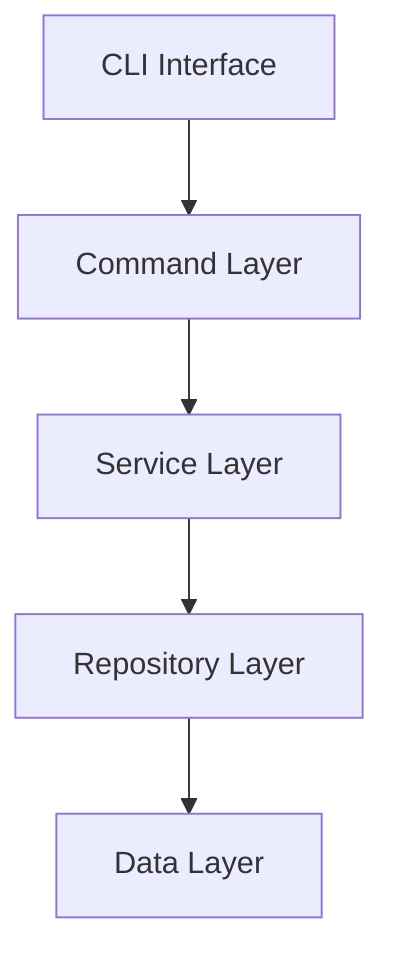

# 🚀 Hail-Mary

[](https://www.rust-lang.org/)
[](https://opensource.org/licenses/MIT)
[](https://github.com/ashigirl96/hail-mary/actions)

**A sophisticated Rust CLI application for Memory MCP (Model Context Protocol) server and Kiro project specification management.**

Hail-Mary provides intelligent memory management for AI models with full-text search capabilities, multilingual support, and a comprehensive CLI interface for technical knowledge storage and retrieval.

## ✨ Features

### 🧠 Memory Management System
- **Intelligent Storage**: Store and categorize technical knowledge with confidence scoring
- **Full-Text Search**: SQLite FTS5 with Japanese tokenization support
- **Memory Types**: Tech, ProjectTech, Domain (extensible categorization)
- **Smart Filtering**: Search by type, tags, confidence levels, and content
- **Reference Tracking**: Automatic usage statistics and access patterns

### 🌐 MCP Protocol Integration
- **MCP Server**: Model Context Protocol server for AI model integration
- **Async Architecture**: High-performance async/await with Tokio runtime
- **Real-time Updates**: Live memory updates with automatic index maintenance
- **Protocol Compliance**: Full rmcp v0.5.0 implementation

### 🎯 Project Specification Management
- **Kiro System**: Structured project specification management
- **Template Generation**: Automatic creation of requirements, design, and task files
- **Spec Archiving**: Interactive TUI for marking completed specs with archive management
- **Configuration Management**: TOML-based hierarchical configuration
- **Document Generation**: Markdown output with organized memory exports

### 🚄 Performance & Reliability
- **SQLite Backend**: High-performance database with WAL mode
- **Automatic Migrations**: Versioned schema management with Refinery
- **Batch Operations**: Efficient bulk operations with transaction support
- **Comprehensive Testing**: Unit, integration, and repository-level tests
- **Shell Completion**: Auto-completion support for all major shells

### 🖥️ Terminal User Interface (TUI)
- **Interactive Selection**: Checkbox-based multi-selection interface
- **Keyboard Navigation**: Intuitive keyboard shortcuts (arrows, j/k, Space, Enter)
- **Visual Feedback**: Real-time selection count and highlighting
- **Built with Ratatui**: Modern TUI framework for Rust applications

## 🚀 Quick Start

### Prerequisites

- **Rust**: Latest stable version ([Install Rust](https://rustup.rs/))
- **Just**: Command runner ([Install Just](https://just.systems/))

### Installation

```bash
# Clone the repository
git clone https://github.com/ashigirl96/hail-mary.git
cd hail-mary

# Setup development environment
just setup

# Build the project
just build

# Initialize a new project
cargo run -- init

# Start the Memory MCP server
cargo run -- memory serve --verbose
```

## 📋 Usage Examples

### Project Initialization

```bash
# Initialize new Kiro project with .kiro directory structure
hail-mary init

# Initialize with force overwrite (if .kiro already exists)
hail-mary init --force
```

### MCP Server Operations

```bash
# Start Memory MCP server (connects with Claude Code)
hail-mary memory serve

# The server provides two tools to AI models:
# - remember: Store technical knowledge with categorization
# - recall: Search and retrieve stored memories
```

### Memory Document Generation

```bash
# Generate Markdown documentation from all memories
hail-mary memory document

# Generate documentation for specific memory type
hail-mary memory document --type tech
hail-mary memory document --type project-tech
hail-mary memory document --type domain
```

### Feature Specification Management

```bash
# Create new feature specification
hail-mary new user-authentication-system

# Create feature with custom name validation
hail-mary new api-rate-limiting-v2

# Mark completed specifications as done (interactive TUI)
hail-mary complete
# - Use arrow keys or j/k to navigate
# - Press Space to select specifications
# - Press Enter to archive selected specs
# - Press q or Esc to quit
```

### Database Management

```bash
# Reindex and optimize database (Phase 3 feature - placeholder)
hail-mary memory reindex --dry-run
hail-mary memory reindex --verbose
```

### Shell Completions

```bash
# Generate bash completions
hail-mary completion bash > /etc/bash_completion.d/hail-mary

# Generate zsh completions
hail-mary completion zsh > ~/.zsh/completions/_hail-mary

# Generate fish completions
hail-mary completion fish > ~/.config/fish/completions/hail-mary.fish

# Generate PowerShell completions
hail-mary completion power-shell > hail-mary.ps1

# Generate Elvish completions
hail-mary completion elvish > hail-mary.elv
```

## ⚙️ Configuration

### Project Configuration (`.kiro/config.toml`)

```toml
[memory]
types = ["tech", "project-tech", "domain"]
instructions = "Technical knowledge management for AI systems"

[memory.document]
output_dir = ".kiro/memory"
format = "markdown"

[memory.database]
path = ".kiro/memory/db.sqlite3"
```

### Memory Types

- **`tech`**: General technical knowledge and programming concepts
- **`project-tech`**: Project-specific technical implementation details  
- **`domain`**: Business domain knowledge and requirements

### Database Schema

The system uses SQLite with the following key tables:
- `memories`: Main storage with metadata and content  
- `memories_fts`: FTS5 virtual table for full-text search
- Automatic triggers for index maintenance

## 🔌 MCP Client Configuration

### Claude Code Integration

To use hail-mary with Claude Code, add this configuration to your Claude Code settings:

```json
{
  "mcpServers": {
    "hail-mary": {
      "command": "hail-mary",
      "args": ["memory", "serve"],
      "env": {
        "RUST_LOG": "info"
      }
    }
  }
}
```

### MCP Tools Available

**remember Tool**: Store technical knowledge
```json
{
  "memories": [
    {
      "type": "tech",
      "title": "Rust async programming patterns",
      "content": "Detailed explanation of async/await...",
      "tags": ["rust", "async", "tokio"],
      "confidence": 0.9
    }
  ]
}
```

**recall Tool**: Search stored memories
```json
{
  "query": "async programming",
  "type": "tech",
  "tags": ["rust"],
  "limit": 10
}
```

## 🏗️ Architecture

Hail-Mary follows hexagonal architecture principles with clear separation of concerns:



For detailed architectural documentation, see [ARCHITECTURE.md](./ARCHITECTURE.md).

### Key Components

- **CLI Interface**: Clap-based command routing with structured arguments
- **Service Layer**: Business logic with validation and async operations
- **Repository Pattern**: Abstracted data access with SQLite and in-memory implementations
- **Memory Model**: Rich domain model with builder patterns and metadata

## 🛠️ Development

### Available Commands

```bash
# View all available tasks
just

# Core development workflow
just build          # Build the project
just test           # Run all tests
just fmt            # Format code
just lint           # Run clippy linter
just dev            # Watch and rebuild on changes
just ci             # Run all CI checks locally
```

### Testing

```bash
# Run comprehensive test suite
just test

# Run tests with output
just test-verbose

# Watch and run tests on changes
just test-watch

# Run integration tests
cargo test --test integration_repository_test
```

### Database Migrations

```bash
# Migrations are automatically applied on startup
# Manual migration testing:
cargo test test_migration_creates_tables
```

## 📚 Documentation

- **[ARCHITECTURE.md](./ARCHITECTURE.md)**: Detailed system architecture and design patterns
- **[COMMANDS.md](./COMMANDS.md)**: Comprehensive CLI command reference (Japanese)
- **API Documentation**: Run `just doc` to generate and open Rust documentation

### Memory Management Workflow

1. **Initialize**: Set up `.kiro` directory and configuration
2. **Store**: Add memories with categorization and metadata
3. **Search**: Use full-text search with filters and ranking
4. **Analyze**: Perform clustering, deduplication, and analytics
5. **Export**: Generate documentation and export data

### Specification Management Workflow

1. **Create**: Generate new feature specifications with `hail-mary new`
2. **Develop**: Work on features in `.kiro/specs` directory
3. **Complete**: Use interactive TUI with `hail-mary complete` to mark as done
4. **Archive**: Completed specs are moved to `.kiro/archive` for reference

## 🔒 Security

- **Input Validation**: Comprehensive validation at all boundaries
- **SQL Injection Protection**: Parameterized queries throughout
- **Path Safety**: Secure file system operations
- **Error Handling**: No sensitive data exposure in error messages

```bash
# Run security audit
just audit
```

## 🌐 Multilingual Support

The system supports multilingual content with special optimizations for Japanese text:

- **FTS5 Tokenization**: Porter Unicode61 tokenizer for proper text segmentation
- **Japanese Content**: Native support for Japanese technical documentation
- **Search Accuracy**: Optimized search algorithms for CJK text

## 📊 Performance

- **Async Architecture**: Non-blocking operations with Tokio
- **Optimized Queries**: Strategic indexing for common search patterns
- **Batch Operations**: Efficient bulk operations with transaction support
- **Memory Efficiency**: Minimal allocations and smart caching

### Benchmarks

- **Search Performance**: Sub-50ms for typical queries on 10K+ memories
- **Batch Insert**: 1000+ memories/second with transaction batching
- **FTS Index**: Real-time updates via SQLite triggers

## 🤝 Contributing

1. **Fork** the repository
2. **Create** a feature branch (`git checkout -b feature/amazing-feature`)
3. **Commit** your changes (`git commit -m 'Add amazing feature'`)
4. **Test** your changes (`just ci`)
5. **Push** to the branch (`git push origin feature/amazing-feature`)
6. **Open** a Pull Request

### Development Setup

```bash
# Install dependencies and setup environment
just setup

# Run full CI pipeline locally
just ci

# Format and lint code
just fmt && just lint
```

## 📋 Roadmap

- [ ] **Web Interface**: Browser-based memory management UI
- [ ] **Plugin System**: Extensible memory processors and analyzers
- [ ] **Distributed Storage**: Multi-node memory synchronization
- [ ] **Advanced Analytics**: ML-powered memory insights and recommendations
- [ ] **Export Formats**: Additional output formats (PDF, EPUB, etc.)

## 📄 License

This project is licensed under the MIT License - see the [LICENSE](LICENSE) file for details.

## 🙏 Acknowledgments

- **Rust Community**: For excellent tooling and libraries
- **SQLite Team**: For the robust FTS5 implementation
- **MCP Protocol**: For standardized model context management
- **Tokio**: For the async runtime foundation

---

**Built with ❤️ in Rust** | **[Documentation](./ARCHITECTURE.md)** | **[Commands Reference](./COMMANDS.md)** | **[Issues](https://github.com/ashigirl96/hail-mary/issues)**