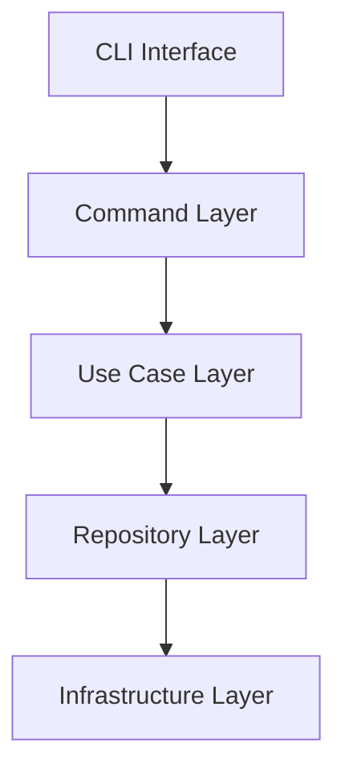

# 🚀 Hail-Mary

[](https://www.rust-lang.org/)
[](https://opensource.org/licenses/MIT)
[](https://github.com/ashigirl96/hail-mary/actions)

**A sophisticated Rust CLI application for specification-driven development with Kiro project management and file-based context steering.**

Hail-Mary provides intelligent project specification management through the Kiro system, designed for spec-driven development workflows. It bridges AI model interactions and persistent project knowledge through a file-based steering system with comprehensive Claude Code integration.

## ✨ Features

### 🎯 Kiro Specification Management
- **Structured Specifications**: Complete project specification lifecycle with requirements, design, tasks, and investigation phases
- **Template Generation**: Automatic creation of comprehensive specification templates
- **Interactive Archiving**: TUI-based interface for marking completed specs with archive management
- **Date-based Organization**: Chronological specification organization with automatic naming
- **Validation**: Kebab-case naming enforcement and specification completeness checking

### 📄 File-based Steering System
- **Version-Controllable Context**: Git-trackable steering files for transparent project knowledge management
- **Core Steering Types**: Product overview, technology stack, and project structure documentation
- **Smart Content Organization**: Criteria-based categorization and intelligent content updates
- **Backup Protection**: Automatic backup creation before modifications
- **Team Collaboration**: Shared context through version control without database synchronization

### 🔗 Claude Code Integration
- **Seamless Launch**: TTY-aware Claude Code launching with proper job control
- **Structured Context**: XML-tagged system prompts for easy file reference
- **Specification Context**: Automatic loading of relevant specification files
- **Interactive Selection**: TUI for choosing existing specs or creating new ones
- **Process Management**: Proper backgrounding and terminal control preservation

### 🖥️ Terminal User Interface (TUI)
- **Interactive Selection**: Specification selector with checkbox-based multi-selection
- **Keyboard Navigation**: Intuitive shortcuts (arrows, j/k, Space, Enter, q/Esc)
- **Visual Design**: Clean interface with real-time feedback and highlighting
- **Built with Ratatui**: Modern terminal UI framework for responsive interfaces

### 🔧 Developer Experience
- **Shell Completions**: Auto-completion support for bash, zsh, fish, PowerShell, and elvish
- **Clean Architecture**: Well-structured Rust implementation with clear separation of concerns
- **Comprehensive Testing**: Unit and integration tests with proper filesystem isolation
- **Error Handling**: Detailed error messages with proper context and recovery guidance
- **Configuration Management**: TOML-based hierarchical configuration system

### 🤖 Anthropic API Client (Separate Crate)
- **OAuth Authentication**: Secure OAuth2 flow with automatic token refresh
- **Claude API Client**: Non-streaming API calls to Claude models
- **Cloudflare Protection**: Configured to bypass bot detection mechanisms
- **Example Implementation**: Ready-to-use example for chat interactions

## 🚀 Quick Start

### Prerequisites

- **Rust**: Latest stable version ([Install Rust](https://rustup.rs/))
- **Just**: Command runner ([Install Just](https://just.systems/))

### Installation

```bash
# Clone the repository
git clone https://github.com/ashigirl96/hail-mary.git
cd hail-mary

# Setup development environment
just setup

# Build the project (builds entire workspace)
just build

# Build specific package
just build-package hail-mary

# Initialize a new project (idempotent - safe to run multiple times)
cargo run --package hail-mary -- init

# Create a new feature specification
cargo run --package hail-mary -- new my-feature

# Launch Claude Code with Kiro context
cargo run --package hail-mary -- code
```

### Project Structure

The project uses a Cargo workspace structure for better modularity:

```
.
├── Cargo.toml                  # Workspace root configuration
└── crates/
    ├── hail-mary/              # Main application crate
    │   ├── Cargo.toml          # Application dependencies
    │   └── src/                # Source code (4-layer Clean Architecture)
    └── anthropic-client/       # Anthropic API OAuth client
        ├── Cargo.toml          # OAuth client dependencies
        ├── src/
        │   └── lib.rs          # OAuth implementation
        └── examples/
            └── basic_chat.rs   # Example usage
```

## 📋 Usage Examples

### Project Initialization

```bash
# Initialize new Kiro project with .kiro directory structure
# This command is idempotent - safe to run multiple times
# Creates steering system, config, and directory structure
hail-mary init
```

### Claude Code Integration

```bash
# Launch Claude Code with Kiro specification context
# Provides interactive TUI for spec selection
hail-mary code

# Skip dangerous permissions flag for certain environments
hail-mary code --no-danger
```

### Feature Specification Management

```bash
# Create new feature specification
hail-mary new user-authentication-system

# Create feature with custom name validation
hail-mary new api-rate-limiting-v2

# Mark completed specifications as done (interactive TUI)
hail-mary complete
# - Use arrow keys or j/k to navigate
# - Press Space to select specifications
# - Press Enter to archive selected specs
# - Press q or Esc to quit
```

### Anthropic API Client

```bash
# Run the OAuth client example
cargo run --example basic_chat -- "Hello, how are you?"

# The client automatically handles OAuth token refresh
# Requires authentication file at ~/.local/share/opencode/auth.json
```

### Shell Completions

```bash
# Generate bash completions
hail-mary shell-completions bash > /etc/bash_completion.d/hail-mary

# Generate zsh completions
hail-mary shell-completions zsh > ~/.zsh/completions/_hail-mary

# Generate fish completions
hail-mary shell-completions fish > ~/.config/fish/completions/hail-mary.fish

# Generate PowerShell completions
hail-mary shell-completions power-shell > hail-mary.ps1

# Generate Elvish completions
hail-mary shell-completions elvish > hail-mary.elv
```

## ⚙️ Configuration

### Project Configuration (`.kiro/config.toml`)

```toml
[[steering.types]]
name = "product"
purpose = "Product overview and value proposition"
criteria = [
    "Product Overview: Brief description of what the product is",
    "Core Features: Bulleted list of main capabilities",
    "Target Use Case: Specific scenarios the product addresses",
    "Key Value Proposition: Unique benefits and differentiators",
]
allowed_operations = ["refresh", "discover"]  # Default for core types

[[steering.types]]
name = "tech"
purpose = "Technical stack and development environment"
criteria = [
    "Architecture: High-level system design",
    "Development Environment: Required tools and setup",
    "Common Commands: Frequently used development commands",
]
allowed_operations = ["refresh", "discover"]  # Default for core types

[[steering.types]]
name = "structure"
purpose = "Code organization and project structure patterns"
criteria = [
    "Root Directory Organization: Top-level structure",
    "Code Organization Patterns: How code is structured",
    "Key Architectural Principles: Core design decisions",
]
allowed_operations = ["refresh", "discover"]  # Default for core types

[[steering.types]]
name = "principles"
purpose = "Core project principles"
criteria = [
    "Design Principles: Fundamental design decisions",
    "Development Guidelines: Code quality standards",
]
allowed_operations = []  # Manual updates only
```

### Steering System Types

- **`product`**: Product overview, features, and value proposition documentation
- **`tech`**: Technology stack, development environment, and command reference
- **`structure`**: Code organization, architectural patterns, and structural decisions

### Update Strategy Control

Each steering type includes an `allowed_operations` property that controls automatic updates:

- **`["refresh", "discover"]`** - Update existing info and add new discoveries (default for product, tech, structure)
- **`["refresh"]`** - Only update existing information
- **`["discover"]`** - Only add new discoveries
- **`[]`** - Manual updates only via `/hm:steering-remember`

### File System Organization

The steering system uses git-trackable markdown files:
- `.kiro/steering/product.md`: Product context (always loaded)
- `.kiro/steering/tech.md`: Technical context (always loaded)
- `.kiro/steering/structure.md`: Structural context (always loaded)

## 🔌 Claude Code Integration

### System Prompt Integration

Hail-mary integrates with Claude Code through structured system prompts that provide specification context:

```xml
<kiro_spec_name>my-feature</kiro_spec_name>
<kiro_spec_path>.kiro/specs/2024-03-15-my-feature/</kiro_spec_path>
<kiro_requirements>.kiro/specs/2024-03-15-my-feature/requirements.md</kiro_requirements>
<kiro_design>.kiro/specs/2024-03-15-my-feature/design.md</kiro_design>
<kiro_tasks>.kiro/specs/2024-03-15-my-feature/tasks.md</kiro_tasks>
<kiro_memo>.kiro/specs/2024-03-15-my-feature/memo.md</kiro_memo>
<kiro_investigation>.kiro/specs/2024-03-15-my-feature/investigation.md</kiro_investigation>
```

### Custom Slash Commands

Hail-mary provides custom Claude Code slash commands in `.claude/commands/hm/`:

- `/hm:steering`: Main steering management command - updates and maintains steering files
- `/hm:steering-remember [title]`: Capture learning and insights directly to steering files  
- `/hm:steering-merge`: Advanced merging of steering content with conflict resolution

### Steering System Context

The steering system provides always-available context to Claude Code sessions:
- **product.md**: Loaded automatically for business context in all sessions
- **tech.md**: Loaded automatically for technical stack awareness
- **structure.md**: Loaded automatically for architectural pattern consistency

## 🏗️ Architecture

Hail-Mary follows clean architecture principles with clear separation of concerns:



For detailed architectural documentation, see [ARCHITECTURE.md](.kiro/steering/structure.md).

### Key Components

- **CLI Interface**: Clap-based command routing with structured arguments and shell completions
- **Use Case Layer**: Business logic with validation for project and specification management
- **Repository Pattern**: Abstracted file system operations through trait interfaces
- **Domain Model**: Rich domain entities for project configuration and steering system
- **Infrastructure Layer**: File system operations, process management, and TUI components

## 🛠️ Development

### Available Commands

```bash
# View all available tasks
just

# Core development workflow
just build          # Build the project
just test           # Run all tests
just fmt            # Format code
just lint           # Run clippy linter
just dev            # Watch and rebuild on changes
just ci             # Run all CI checks locally
```

### Testing

```bash
# Run comprehensive test suite
just test

# Run tests with output
just test-verbose

# Watch and run tests on changes
just test-watch

# Run integration tests
cargo test --test integration_repository_test
```

## 📚 Documentation

- **[ARCHITECTURE.md](.kiro/steering/structure.md)**: Detailed system architecture and design patterns
- **API Documentation**: Run `just doc` to generate and open Rust documentation
- **Steering Files**: `.kiro/steering/` contains project context documentation

### Specification Management Workflow

1. **Initialize**: Set up `.kiro` directory and steering system with `hail-mary init`
2. **Create**: Generate new feature specifications with `hail-mary new <feature-name>`
3. **Develop**: Work on features in `.kiro/specs/<date-feature-name>/` directories
4. **Integrate**: Use `hail-mary code` to launch Claude Code with specification context
5. **Complete**: Use interactive TUI with `hail-mary complete` to mark specs as done
6. **Archive**: Completed specs are moved to `.kiro/archive/` for reference

### Steering System Workflow

1. **Capture**: Use `/hm:steering-remember` during Claude Code sessions to save insights (ignores `allowed_operations`)
2. **Maintain**: Run `/hm:steering` to update and refresh steering files (respects `allowed_operations` settings)
3. **Configure**: Edit `allowed_operations` in config.toml to control which files can be automatically updated
4. **Version Control**: Commit steering changes to share context with team members
5. **Context Loading**: Steering files automatically provide persistent context for development

## 🔒 Security

- **Input Validation**: Comprehensive validation at all boundaries
- **Path Safety**: Secure file system operations with proper validation
- **File System Security**: Safe file operations with permission checks
- **Error Handling**: No sensitive data exposure in error messages

```bash
# Run security audit
just audit
```

## 📊 Performance

- **File System Efficiency**: Optimized path resolution and file operations
- **Process Management**: TTY-aware process launching with minimal overhead
- **Template Generation**: Efficient string handling and minimal allocations
- **Configuration Caching**: TOML parsing optimization for repeated access

## 🤝 Contributing

1. **Fork** the repository
2. **Create** a feature branch (`git checkout -b feature/amazing-feature`)
3. **Commit** your changes (`git commit -m 'Add amazing feature'`)
4. **Test** your changes (`just ci`)
5. **Push** to the branch (`git push origin feature/amazing-feature`)
6. **Open** a Pull Request

### Development Setup

```bash
# Install dependencies and setup environment
just setup

# Run full CI pipeline locally
just ci

# Format and lint code
just fmt && just lint
```

## 📋 Roadmap

- [ ] **Web Interface**: Browser-based memory management UI
- [ ] **Plugin System**: Extensible memory processors and analyzers
- [ ] **Distributed Storage**: Multi-node memory synchronization
- [ ] **Advanced Analytics**: ML-powered memory insights and recommendations
- [ ] **Export Formats**: Additional output formats (PDF, EPUB, etc.)

## 📄 License

This project is licensed under the MIT License - see the [LICENSE](LICENSE) file for details.

## 🙏 Acknowledgments

- **Rust Community**: For excellent tooling and libraries
- **Ratatui Community**: For the excellent terminal UI framework
- **Clap**: For the robust CLI framework foundation
- **Tokio**: For the async runtime foundation
- **SuperClaude Framework**: For prompt engineering concepts and command structure patterns ([MIT License](https://github.com/SuperClaude-Org/SuperClaude_Framework/blob/main/LICENSE))

---

**Built with ❤️ in Rust** | **[Documentation](.kiro/steering/structure.md)** | **[Commands Reference](./COMMANDS.md)** | **[Issues](https://github.com/ashigirl96/hail-mary/issues)**