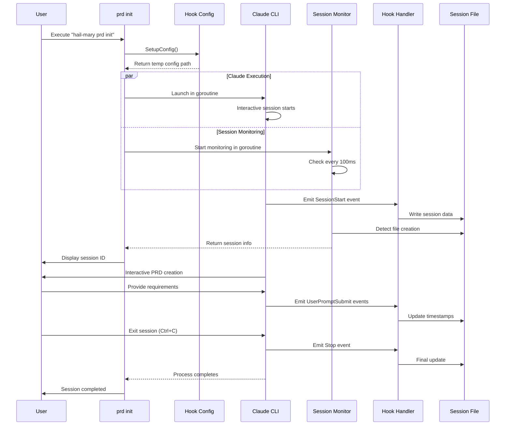
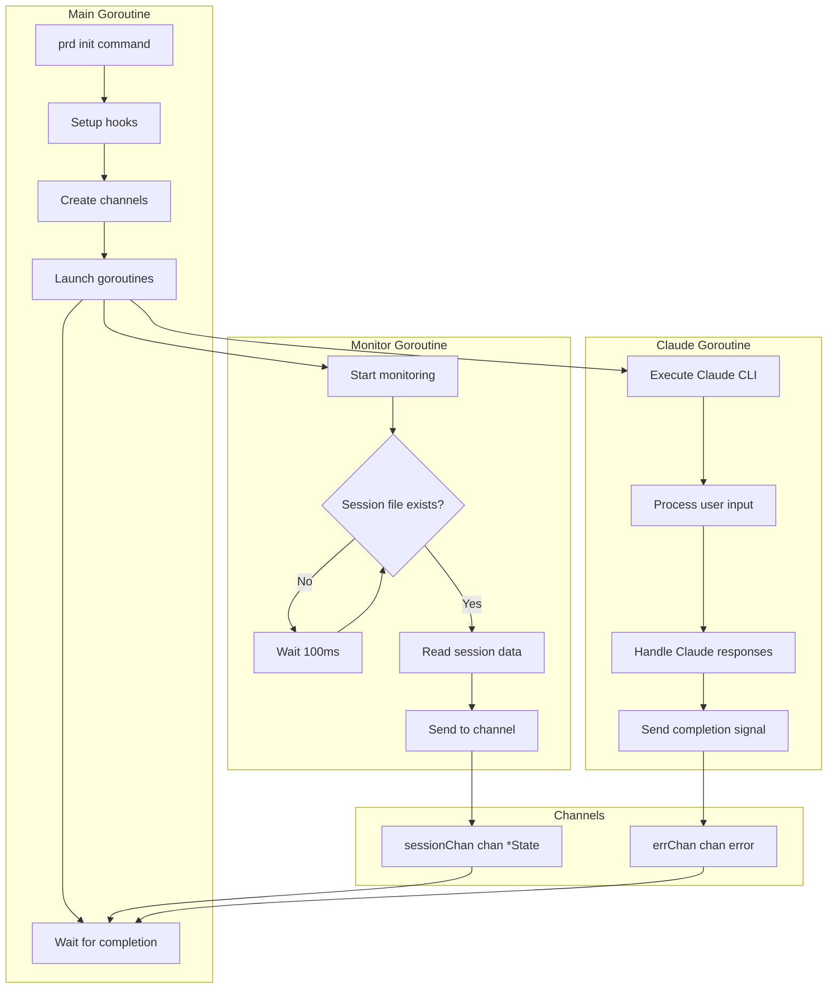
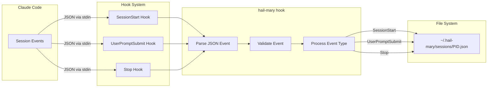

# PRD Init Command Architecture

## Overview

The `prd init` command creates an interactive Product Requirements Document (PRD) session using Claude CLI with automatic session tracking through a hook-based system.

## Architecture Components

### 1. Hook System Configuration
The hook system integrates with Claude Code's hook mechanism to capture session events:
- **SessionStart**: Captures session ID and metadata when Claude starts
- **UserPromptSubmit**: Tracks user interactions during the session
- **Stop**: Updates session state when the session ends

### 2. Session Management
Session information is stored in `~/.hail-mary/sessions/{PID}.json` files:
- Process ID as the key for session tracking
- Atomic file operations ensure data consistency
- Mutex protection for concurrent access

### 3. Claude Executor
Wrapper around the Claude CLI that:
- Launches Claude in interactive mode with initial prompt
- Connects stdin/stdout/stderr to the terminal
- Supports various permission modes (plan, acceptEdits, etc.)

## Execution Flow



## Goroutine Coordination



## Hook Event Flow



## Data Structures

### Session State
```go
type State struct {
    SessionID      string    // Unique session identifier
    StartedAt      time.Time // Session start timestamp
    LastUpdated    time.Time // Last activity timestamp
    TranscriptPath string    // Path to conversation transcript
    ProjectDir     string    // Working directory
}
```

### Hook Configuration
```json
{
  "hooks": {
    "SessionStart": [{
      "hooks": [{
        "type": "command",
        "command": "HAIL_MARY_PARENT_PID={PID} /path/to/hail-mary hook",
        "timeout": 5
      }]
    }],
    "UserPromptSubmit": [{...}],
    "Stop": [{...}]
  }
}
```

## Implementation Details

### 1. Hook Configuration Setup (`hooks/config.go`)
- Creates temporary settings file merging existing `.claude/settings.json` with hail-mary hooks
- Injects parent process ID as environment variable for session tracking
- Returns cleanup function to remove temporary files

### 2. Claude Executor (`claude/executor.go`)
- Validates prompts and session IDs for security
- Builds command arguments based on configuration
- Executes Claude CLI with proper environment and I/O connections

### 3. Session Monitoring (`cmd/prd/init.go:172-197`)
- Polls for session file creation every 100ms
- Uses process ID as key to identify the correct session
- Returns session state once file is detected

### 4. Hook Handler (`cmd/hook/root.go`)
- Reads JSON events from stdin
- Dispatches to appropriate handler based on event type
- Manages session file lifecycle (create, update, but not delete)

### 5. Session Manager (`session/state.go`)
- Thread-safe session state persistence
- Atomic file operations using temp file + rename pattern
- Supports listing all sessions and cleaning up stale ones

## Error Handling

1. **Setup Failures**: Returns error if hook configuration cannot be created
2. **Execution Failures**: Captures and returns Claude CLI errors
3. **Monitoring Timeout**: Continues without session ID after 30 seconds
4. **File System Errors**: Gracefully handles missing or corrupted session files

## Security Considerations

1. **Input Validation**: All prompts and session IDs are validated
2. **File Permissions**: Session files created with 0644 permissions
3. **Atomic Operations**: Prevents partial writes or corruption
4. **Process Isolation**: Each process has its own session file

## Usage Example

```bash
$ hail-mary prd init
Using merged settings: /tmp/hail-mary-settings-12345.json
Launching Claude interactive shell for PRD creation...
Press Ctrl+C to exit the Claude shell.

Session ID: abc12345

# Claude interactive session begins here
```

The command automatically:
1. Sets up the hook system
2. Launches Claude in plan mode
3. Tracks the session ID
4. Preserves session information for future reference