# Memory MCP リファレンス

## 概要

Memory MCPは、Model Context Protocol (MCP) を利用した永続的なメモリシステムの実装です。AIアシスタントが過去の会話や情報を記憶・検索できるようにする重要なツールとして位置づけられています。

### Model Context Protocol (MCP) とは

MCPは、Anthropicが開発したオープンスタンダードで、AIアシスタント（LLM）を外部のデータソースやツールに接続するための標準化されたプロトコルです。「AIアプリケーションのUSB-Cポート」のように、様々な周辺機器に接続するための標準化された方法を提供します。

### MCPの主要コンポーネント

1. **Resources（リソース）**: 内部または外部データベースからの情報取得。データを返すが、実行可能な計算は行わない
2. **Tools（ツール）**: 計算を実行したり、APIリクエストを通じてデータを取得するなどの副作用を実行できる情報交換
3. **Prompts（プロンプト）**: LLMとサーバー通信のための再利用可能なテンプレートとワークフロー

### Memory MCPサーバーの特徴

- **エンティティベースの記憶**: 組織、人物、重要なイベントのエンティティを作成し、関係性を使って接続
- **ナレッジグラフベース**: 関係性を持つ情報の構造化された保存
- **JSONファイル形式**: デフォルトで内部的にJSONファイルにデータを保存
- **TypeScript実装**: @modelcontextprotocol/sdkを使用した完全な仕様実装

## 現在の実装における課題

### 1. 重複データの問題

**課題の本質**:
- 新しい記憶が毎回別ファイルに保存される設計では、同じ情報が複数箇所に散在
- 時系列で情報が分散し、統合的な視点が失われる
- ストレージの無駄遣いと検索効率の低下

### 2. コンテキストウィンドウの圧迫

**課題の本質**:
- ファイルサイズが大きくなると、全体読み込みが非現実的
- 関連性の低い情報まで読み込んでしまう
- LLMのトークン制限を無駄に消費

### 3. データの可変性問題

**課題の本質**:
- ファイルの直接上書きによるデータ損失リスク
- 変更履歴の追跡不可能
- 誤った更新からの復旧困難

## 改善アーキテクチャの提案

### 全体アーキテクチャ

```mermaid
%%{init: {
  'theme': 'dark',
  'themeCSS': '
    .nodeLabel { color: #FD971F !important; }
    .edgeLabel { color: #A6E22E !important; background-color: transparent !important; }
    .cluster rect { fill: #272822 !important; stroke: #F92672 !important; stroke-width: 2px !important; rx: 5px !important; ry: 5px !important; }
    .node rect, .node circle, .node ellipse, .node polygon, .node path { fill: #272822 !important; stroke: #A6E22E !important; stroke-width: 2px !important; }
    .flowchart-link { stroke: #66D9EF !important; stroke-width: 2px !important; }
  '
}}%%
graph TB
    subgraph "Memory MCP Server"
        A[MCPクライアント] -->|新規情報| B[Memory Manager]
        B --> C{重複チェック}
        C -->|新規| D[Event Logger]
        C -->|既存更新| E[Merge Handler]
        
        D --> F[Event Store]
        E --> F
        
        F --> G[Indexer]
        G --> H[Vector DB]
        G --> I[Graph DB]
        
        A -->|検索クエリ| J[Query Processor]
        J --> K[Semantic Search]
        K --> H
        K --> I
        K --> L[Ranker]
        L -->|関連情報のみ| A
    end
    
    subgraph "Storage Layer"
        F -.-> M[(Event Log)]
        H -.-> N[(Embeddings)]
        I -.-> O[(Knowledge Graph)]
    end

    classDef type1 fill:#272822,stroke:#A6E22E,stroke-width:2px;
    classDef type2 fill:#272822,stroke:#66D9EF,stroke-width:2px;
    classDef type3 fill:#272822,stroke:#F92672,stroke-width:2px;
    classDef highlighted fill:#AE81FF,stroke:#66D9EF,stroke-width:3px,color:#FFF;
    
    class A,J type1;
    class B,C,E,K,L type2;
    class D,F,G type3;
    class H,I,M,N,O highlighted;
```



### 主要コンポーネント

#### 1. Memory Manager
新規情報の受付と処理の振り分けを担当

#### 2. Event Logger/Store
イミュータブルなイベントログの管理

```typescript
interface MemoryEvent {
  id: string;
  type: 'CREATE' | 'UPDATE' | 'DELETE' | 'MERGE';
  entityId: string;
  timestamp: Date;
  data: any;
  metadata: {
    source: string;
    confidence: number;
    reason?: string;
  };
}
```

#### 3. Merge Handler
重複情報の統合処理

#### 4. Indexer
Event Storeの生データを検索可能な形式に変換する中核コンポーネント

**主要な役割**:
- ベクトル埋め込みの生成
- グラフ構造の構築
- インデックスの最適化
- データの正規化と濃縮

#### 5. Semantic Search
ベクトル検索による関連情報の効率的な取得

#### 6. Ranker
重要度と関連性に基づく情報のフィルタリング

### ストレージ層

1. **Event Log**: イベントソーシングによる完全な変更履歴
2. **Embeddings**: ベクトルDBによる高速類似検索
3. **Knowledge Graph**: グラフDBによる関係性管理

## 情報の鮮度管理と更新戦略

### 時系列メタデータによる鮮度判断

```typescript
interface KnowledgeNode {
  id: string;
  content: any;
  metadata: {
    createdAt: Date;
    lastUpdatedAt: Date;
    lastValidatedAt: Date;
    confidence: number;  // 時間経過で減衰
    version: number;
    supersededBy?: string;  // 新しい情報のID
  };
  history: VersionHistory[];  // 過去のバージョンを保持
}
```

### コンフリクト解決戦略

1. **時系列優先**: 最新情報を正とする（高信頼度の場合）
2. **バージョン管理**: 両方の情報を保持（情報の進化を検出）
3. **マージ**: 部分更新（補完的な情報）
4. **共存**: コンテキスト依存の情報として両立

### 実例：チームのコーディングスタイル変更

```typescript
// Knowledge Graphでの表現
class CodingStyleNode {
  current: {
    rule: 'var許可、レガシーコード対応のため',
    validFrom: '2025-01-15',
    confidence: 0.95
  };
  
  history: [
    {
      rule: 'var禁止、const/let使用',
      validFrom: '2024-01-01',
      validUntil: '2025-01-15',
      deprecationReason: 'レガシーコード対応の必要性'
    }
  ];
  
  // コンテキスト依存の情報も保持
  contextual: {
    'new-projects': 'var禁止を推奨',
    'legacy-maintenance': 'var許可'
  };
}
```

## 実装戦略と優先順位

### Phase 1: 重複排除（最優先）
- エンティティIDによる同一性判定
- マージロジックの実装
- 既存データの整合性確保

### Phase 2: スマート検索
- ベクトル埋め込みの導入
- 関連性ベースの取得
- 効率的な情報アクセス

### Phase 3: イミュータブル化
- イベントソーシングの実装
- 監査ログとロールバック機能
- データの完全性と追跡可能性

## 技術スタック

- **TypeScript SDK**: @modelcontextprotocol/sdk
- **Vector DB**: 埋め込み保存と類似検索
- **Graph DB**: エンティティと関係性の管理
- **Event Store**: append-onlyのイベントログ
- **トランスポート**: stdio、HTTP+SSE

## 期待される効果

1. **効率性**: 重複排除とインデックス化により検索速度が大幅向上
2. **信頼性**: イベントソーシングにより完全な履歴追跡が可能
3. **スケーラビリティ**: ベクトル検索により大規模データにも対応
4. **柔軟性**: コンテキスト依存の情報管理により複雑な要件に対応
5. **保守性**: 時系列管理により情報の鮮度と履歴の両立

## まとめ

提案された改善アーキテクチャは、現在のMemory MCP実装の重要な課題を体系的に解決します。イベントソーシング、ベクトル検索、ナレッジグラフを組み合わせた3層構造により、効率的で信頼性が高く、スケーラブルな永続的メモリシステムを実現できます。段階的な実装アプローチにより、リスクを最小化しながら着実に改善を進めることが可能です。