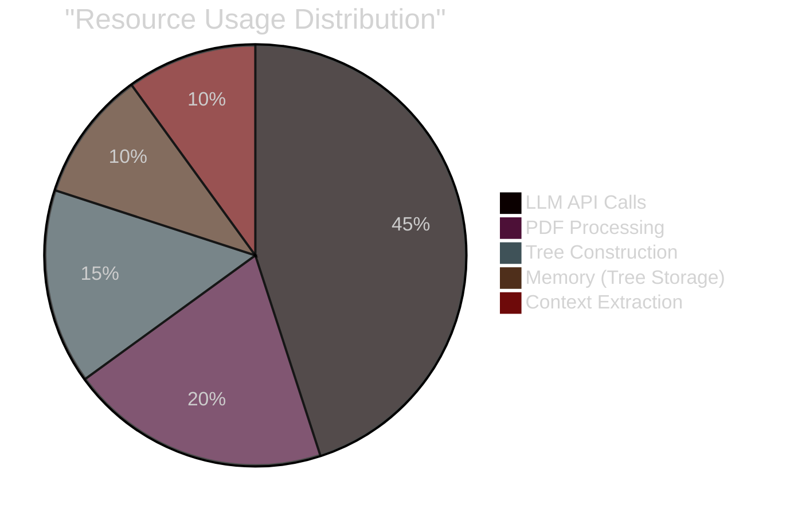
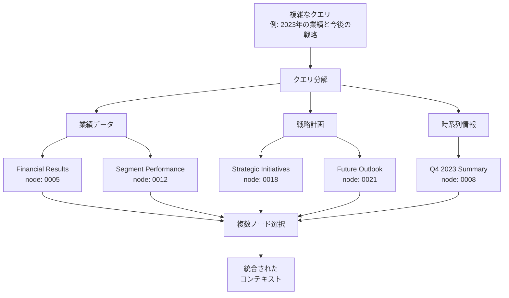

# PageIndex Investigation Report

## Executive Summary

PageIndexは、Vectify AI社が開発した革新的な**推論ベースRAG（Retrieval-Augmented Generation）**システムです。従来のベクトルデータベース型RAGの「類似性検索」を「推論ベース検索」に置き換えることで、専門文書の検索精度を大幅に向上させました（FinanceBenchで98.7%の精度を達成）。

## Core Innovation: 「類似性 ≠ 関連性」

PageIndexの核心的な洞察は、**セマンティック類似性と真の関連性は異なる**ということです。従来のベクトルRAGは類似性に依存しますが、PageIndexは推論を通じて関連性を判断します。

## System Architecture

```mermaid
%%{init: {
  'theme': 'dark',
  'themeCSS': '
    .nodeLabel { color: #FD971F !important; }
    .edgeLabel { color: #A6E22E !important; background-color: transparent !important; }
    .cluster rect { fill: #272822 !important; stroke: #F92672 !important; stroke-width: 2px !important; rx: 5px !important; ry: 5px !important; }
    .node rect, .node circle, .node ellipse, .node polygon, .node path { fill: #272822 !important; stroke: #A6E22E !important; stroke-width: 2px !important; }
    .flowchart-link { stroke: #66D9EF !important; stroke-width: 2px !important; }
  '
}}%%

graph TB
    subgraph Input["📄 Document Input"]
        PDF[PDF Document]
        MD[Markdown Document]
    end
    
    subgraph Stage1["🌳 Stage 1: Tree Generation"]
        TOC[TOC Detection]
        Extract[Text Extraction]
        Boundary[Section Boundary Detection]
        Tree[Hierarchical Tree Building]
        Summary[Node Summarization]
        
        PDF --> TOC
        MD --> Extract
        TOC --> Extract
        Extract --> Boundary
        Boundary --> Tree
        Tree --> Summary
    end
    
    subgraph Stage2["🔍 Stage 2: Reasoning-Based Retrieval"]
        Query[User Query]
        TreeSearch[LLM Tree Search]
        Reasoning[Reasoning Process]
        NodeSelect[Node Selection]
        
        Query --> TreeSearch
        Summary --> TreeSearch
        TreeSearch --> Reasoning
        Reasoning --> NodeSelect
    end
    
    subgraph Output["💡 Answer Generation"]
        Context[Context Extraction]
        Answer[Answer Synthesis]
        
        NodeSelect --> Context
        Context --> Answer
    end

    classDef inputClass fill:#272822,stroke:#FD971F,stroke-width:2px;
    classDef stage1Class fill:#272822,stroke:#A6E22E,stroke-width:2px;
    classDef stage2Class fill:#272822,stroke:#66D9EF,stroke-width:2px;
    classDef outputClass fill:#272822,stroke:#F92672,stroke-width:2px;
    
    class PDF,MD inputClass;
    class TOC,Extract,Boundary,Tree,Summary stage1Class;
    class Query,TreeSearch,Reasoning,NodeSelect stage2Class;
    class Context,Answer outputClass;
```



## Detailed Algorithm Analysis

### 1. Tree Generation Algorithm

#### 1.1 PDF Processing Pipeline

```mermaid
%%{init: {
  'theme': 'dark',
  'themeCSS': '
    .nodeLabel { color: #FD971F !important; }
    .edgeLabel { color: #A6E22E !important; background-color: transparent !important; }
  '
}}%%

flowchart LR
    subgraph PDFProcessing["PDF Processing"]
        PDF[PDF Input]
        TOCCheck{TOC Exists?}
        ParseTOC[Parse TOC Structure]
        ExtractPages[Extract All Pages]
        
        PDF --> TOCCheck
        TOCCheck -->|Yes| ParseTOC
        TOCCheck -->|No| ExtractPages
        ParseTOC --> ExtractPages
    end
    
    subgraph SectionDetection["Section Detection"]
        TitleDetect[Title Detection via GPT-4]
        BoundaryFind[Find Section Boundaries]
        Validate[Validate with Page Text]
        
        ExtractPages --> TitleDetect
        TitleDetect --> BoundaryFind
        BoundaryFind --> Validate
    end
    
    subgraph TreeBuilding["Tree Building"]
        Hierarchy[Build Hierarchy]
        NodeID[Assign Node IDs]
        PageIndex[Map Page Indices]
        
        Validate --> Hierarchy
        Hierarchy --> NodeID
        NodeID --> PageIndex
    end

    classDef processClass fill:#272822,stroke:#A6E22E,stroke-width:2px;
    classDef detectClass fill:#272822,stroke:#66D9EF,stroke-width:2px;
    classDef buildClass fill:#272822,stroke:#F92672,stroke-width:2px;
```



#### 1.2 Key Functions Implementation

```python
# Core title detection algorithm (simplified)
async def check_title_appearance(item, page_list, model="gpt-4"):
    """
    GPT-4を使用してページ内のセクションタイトルを検出
    ファジーマッチングで空白の不一致を無視
    """
    prompt = f"""
    Check if section "{title}" appears in page_text.
    Do fuzzy matching, ignore space inconsistency.
    
    Reply format:
    {{
        "thinking": <reasoning>,
        "answer": "yes/no"
    }}
    """
    response = await ChatGPT_API(prompt)
    return extract_json(response)

# Hierarchical tree construction
def build_tree_structure(sections, page_boundaries):
    """
    階層的ツリー構造の構築
    - 各ノードには一意のIDを割り当て
    - ページ境界を保持
    - 親子関係を維持
    """
    tree = []
    for section in sections:
        node = {
            "title": section.title,
            "node_id": generate_node_id(),
            "start_index": section.start_page,
            "end_index": section.end_page,
            "summary": generate_summary(section.content),
            "nodes": []  # Child nodes
        }
        tree.append(node)
    return tree
```

### 2. Tree Search Algorithm

#### 2.1 LLM-Based Tree Search

```mermaid
%%{init: {
  'theme': 'dark',
  'themeCSS': '
    .nodeLabel { color: #FD971F !important; }
    .edgeLabel { color: #A6E22E !important; }
  '
}}%%

graph TD
    Query[User Query]
    TreeStruct[Tree Structure]
    
    subgraph SearchProcess["LLM Tree Search Process"]
        Analyze[Analyze Query Intent]
        Traverse[Traverse Tree Nodes]
        Evaluate[Evaluate Node Relevance]
        Reason[Generate Reasoning Chain]
        Select[Select Relevant Nodes]
    end
    
    Query --> Analyze
    TreeStruct --> Traverse
    Analyze --> Traverse
    Traverse --> Evaluate
    Evaluate --> Reason
    Reason --> Select
    
    Select --> NodeList[Selected Node IDs]
    
    classDef inputClass fill:#272822,stroke:#FD971F,stroke-width:2px;
    classDef processClass fill:#272822,stroke:#66D9EF,stroke-width:2px;
    classDef outputClass fill:#272822,stroke:#F92672,stroke-width:2px;
    
    class Query,TreeStruct inputClass;
    class Analyze,Traverse,Evaluate,Reason,Select processClass;
    class NodeList outputClass;
```



#### 2.2 Tree Search Implementation

```python
# Basic LLM tree search
async def tree_search(query, tree_structure, model="gpt-4"):
    """
    推論ベースのツリー探索
    LLMが文書構造を理解し、関連ノードを特定
    """
    prompt = f"""
    Given query and document tree structure,
    find nodes likely to contain the answer.
    
    Query: {query}
    Tree: {json.dumps(tree_structure)}
    
    Reply:
    {{
        "thinking": <reasoning process>,
        "node_list": [node_ids]
    }}
    """
    
    result = await LLM_API(prompt)
    return json.loads(result)

# Advanced: Monte Carlo Tree Search (commercial version)
class MCTSTreeSearch:
    """
    商用版で使用されるMCTS実装（概念）
    AlphaGoに着想を得た探索アルゴリズム
    """
    def search(self, query, tree):
        # Selection: UCB1アルゴリズムでノード選択
        # Expansion: 有望なノードを展開
        # Simulation: ロールアウトで価値を評価
        # Backpropagation: 結果を伝播
        pass
```

### 3. Data Structures

#### 3.1 Tree Node Structure

```json
{
  "title": "Financial Stability",
  "node_id": "0006",
  "start_index": 21,
  "end_index": 22,
  "summary": "The Federal Reserve monitors financial system vulnerabilities...",
  "nodes": [
    {
      "title": "Monitoring Financial Vulnerabilities",
      "node_id": "0007",
      "start_index": 22,
      "end_index": 28,
      "summary": "The Federal Reserve's monitoring framework...",
      "nodes": []
    }
  ]
}
```

#### 3.2 Configuration Parameters

```yaml
# pageindex/config.yaml
model: gpt-4o-2024-11-20
toc_check_pages: 20          # TOC検索ページ数
max_pages_per_node: 10       # ノードあたり最大ページ数
max_tokens_per_node: 20000   # ノードあたり最大トークン数
if_add_node_id: yes          # ノードID追加フラグ
if_add_node_summary: yes     # サマリー追加フラグ
```

## Performance Characteristics

### Computational Complexity

| Operation | Complexity | Notes |
|-----------|------------|-------|
| Tree Generation | O(n × m) | n=pages, m=sections |
| LLM Tree Search | O(log d × h) | d=degree, h=height |
| MCTS (commercial) | O(b^d) | b=branching factor |
| Context Extraction | O(k) | k=selected nodes |

### Resource Requirements



## Comparison with Vector RAG

### Traditional Vector RAG vs PageIndex

```mermaid
%%{init: {
  'theme': 'dark',
  'themeCSS': '
    .nodeLabel { color: #FD971F !important; }
  '
}}%%

graph LR
    subgraph VectorRAG["Traditional Vector RAG"]
        VDoc[Document]
        VChunk[Chunking]
        VEmbed[Embedding]
        VStore[Vector DB]
        VSim[Similarity Search]
        VTop[Top-K Results]
        
        VDoc --> VChunk
        VChunk --> VEmbed
        VEmbed --> VStore
        VStore --> VSim
        VSim --> VTop
    end
    
    subgraph PageIndex["PageIndex RAG"]
        PDoc[Document]
        PTree[Tree Structure]
        PReason[Reasoning]
        PSelect[Node Selection]
        PContext[Relevant Context]
        
        PDoc --> PTree
        PTree --> PReason
        PReason --> PSelect
        PSelect --> PContext
    end
    
    classDef vectorClass fill:#272822,stroke:#F92672,stroke-width:2px,stroke-dasharray: 5 5;
    classDef pageClass fill:#272822,stroke:#A6E22E,stroke-width:2px;
    
    class VDoc,VChunk,VEmbed,VStore,VSim,VTop vectorClass;
    class PDoc,PTree,PReason,PSelect,PContext pageClass;
```



### Key Differences

| Aspect | Vector RAG | PageIndex |
|--------|-----------|-----------|
| **Retrieval Method** | Similarity matching | Reasoning-based search |
| **Document Structure** | Lost in chunking | Preserved in tree |
| **Transparency** | Black box embeddings | Explainable reasoning |
| **Expert Knowledge** | Requires fine-tuning | Direct prompt integration |
| **Infrastructure** | Vector DB required | No DB needed |
| **Accuracy (FinanceBench)** | ~70-80% | 98.7% |

## Technical Implementation Details

### Dependencies

```python
# requirements.txt
openai==1.101.0        # GPT-4 API
pymupdf==1.26.4        # PDF processing
PyPDF2==3.0.1          # PDF backup parser
python-dotenv==1.1.0   # Environment management
tiktoken==0.11.0       # Token counting
pyyaml==6.0.2          # Configuration
```

### API Integration Pattern

```python
# Simplified usage pattern
from pageindex import PageIndexClient

# Initialize client
client = PageIndexClient(api_key="YOUR_KEY")

# Generate tree structure
doc_id = client.submit_document("document.pdf")
tree = client.get_tree(doc_id, node_summary=True)

# Perform reasoning-based retrieval
async def retrieve(query, tree):
    # LLM tree search
    node_ids = await tree_search(query, tree)
    
    # Extract context
    context = extract_node_text(node_ids, tree)
    
    # Generate answer
    answer = await generate_answer(query, context)
    return answer
```

## Use Case Analysis

### Optimal Use Cases

1. **Financial Documents**
   - SEC filings (10-K, 10-Q)
   - Annual reports
   - Earnings transcripts
   - Performance: 98.7% accuracy on FinanceBench

2. **Legal Documents**
   - Contracts
   - Regulatory filings
   - Legal briefs
   - Benefits: Preserves legal structure and cross-references

3. **Technical Manuals**
   - API documentation
   - User guides
   - Technical specifications
   - Benefits: Maintains hierarchical organization

4. **Academic Papers**
   - Research papers
   - Textbooks
   - Dissertations
   - Benefits: Preserves logical flow and citations

### Limitations

1. **Unstructured Documents**
   - Social media posts
   - Chat logs
   - Email threads
   - Limitation: No clear hierarchy to leverage

2. **Real-time Requirements**
   - Sub-second response needed
   - High-frequency queries
   - Limitation: LLM latency overhead

3. **Cost Considerations**
   - High-volume queries
   - Budget constraints
   - Limitation: LLM API costs

## Future Developments

### Announced Features

1. **Enhanced MCTS Implementation**
   - Full Monte Carlo Tree Search
   - Value function learning
   - Improved exploration/exploitation balance

2. **Multi-Document Search**
   - Cross-document reasoning
   - Document collection management
   - Inter-document relationship mapping

3. **PageIndex OCR**
   - Long-context OCR model
   - Preserves document hierarchy
   - Superior to existing OCR tools

4. **Performance Optimizations**
   - Caching strategies
   - Batch processing
   - Reduced API calls

## Conclusions

PageIndexは、RAG技術における重要なパラダイムシフトを実現しました：

1. **核心的イノベーション**: 「類似性≠関連性」の原則に基づき、推論ベース検索を実現
2. **技術的優位性**: 文書構造を保持し、説明可能な検索プロセスを提供
3. **実証された性能**: FinanceBenchで98.7%の精度を達成
4. **実用的価値**: 専門文書の処理において従来手法を大幅に上回る

特に、金融、法律、技術文書など、構造と文脈が重要な専門文書において、PageIndexは革命的な改善をもたらしています。人間の専門家が文書を読み解く方法を模倣することで、より自然で効果的な情報検索を実現しています。

## Markdown Document Processing: Detailed Implementation

### Overview of Markdown Processing

Markdown文書の処理は、HTMLタグではなくヘッダーレベル（`#`の数）を利用して階層構造を抽出します。これにより、より単純で高速な処理が可能になります。

### 1. Tree Generation for Markdown Documents

#### 1.1 Processing Pipeline Architecture

```mermaid
%%{init: {
  'theme': 'dark',
  'themeCSS': '
    .nodeLabel { color: #FD971F !important; }
    .edgeLabel { color: #A6E22E !important; }
  '
}}%%

flowchart TD
    subgraph Input["📝 Markdown Input"]
        MD[Markdown File]
        Read[Read Content]
        MD --> Read
    end
    
    subgraph HeaderExtraction["🔍 Header Extraction"]
        Parse[Parse Headers]
        CodeBlock[Skip Code Blocks]
        Level[Detect Header Levels]
        
        Read --> Parse
        Parse --> CodeBlock
        CodeBlock --> Level
    end
    
    subgraph TextExtraction["📄 Text Content Extraction"]
        Boundaries[Find Section Boundaries]
        Extract[Extract Section Text]
        Token[Count Tokens]
        
        Level --> Boundaries
        Boundaries --> Extract
        Extract --> Token
    end
    
    subgraph TreeThinning["✂️ Optional Tree Thinning"]
        Check{Token Count < Threshold?}
        Merge[Merge Small Nodes]
        Keep[Keep Node]
        
        Token --> Check
        Check -->|Yes| Merge
        Check -->|No| Keep
    end
    
    subgraph TreeBuilding["🌳 Tree Construction"]
        Stack[Stack-based Building]
        Hierarchy[Create Hierarchy]
        NodeID[Assign Node IDs]
        
        Merge --> Stack
        Keep --> Stack
        Stack --> Hierarchy
        Hierarchy --> NodeID
    end
    
    subgraph Summarization["📝 Summarization"]
        Summary{Need Summary?}
        Generate[GPT-4 Summary]
        Prefix[Prefix Summary]
        
        NodeID --> Summary
        Summary -->|Yes| Generate
        Generate --> Prefix
    end
    
    Output[Tree Structure JSON]
    Summary --> Output
    Prefix --> Output
    
    classDef inputClass fill:#272822,stroke:#FD971F,stroke-width:2px;
    classDef extractClass fill:#272822,stroke:#66D9EF,stroke-width:2px;
    classDef buildClass fill:#272822,stroke:#A6E22E,stroke-width:2px;
    classDef outputClass fill:#272822,stroke:#F92672,stroke-width:2px;
```



#### 1.2 Core Algorithm Implementation (TypeScript Pseudocode)

```typescript
// TypeScript実装の擬似コード

interface MarkdownNode {
    title: string;
    level: number;  // 1-6 for # to ######
    lineNum: number;
    text: string;
    tokenCount?: number;
}

interface TreeNode {
    title: string;
    nodeId: string;
    text: string;
    lineNum: number;
    summary?: string;
    prefixSummary?: string;
    nodes: TreeNode[];
}

class MarkdownTreeGenerator {
    private headerPattern = /^(#{1,6})\s+(.+)$/;
    private codeBlockPattern = /^```/;
    
    /**
     * Step 1: ヘッダー抽出
     * コードブロック内のヘッダーを無視しながら、Markdownからヘッダーを抽出
     */
    extractHeaders(markdownContent: string): MarkdownNode[] {
        const lines = markdownContent.split('\n');
        const nodes: MarkdownNode[] = [];
        let inCodeBlock = false;
        
        lines.forEach((line, index) => {
            const trimmedLine = line.trim();
            
            // コードブロックの開始/終了を検出
            if (this.codeBlockPattern.test(trimmedLine)) {
                inCodeBlock = !inCodeBlock;
                return;
            }
            
            // コードブロック外でのみヘッダーを検出
            if (!inCodeBlock) {
                const match = this.headerPattern.exec(trimmedLine);
                if (match) {
                    nodes.push({
                        title: match[2].trim(),
                        level: match[1].length,
                        lineNum: index + 1,
                        text: ''
                    });
                }
            }
        });
        
        return nodes;
    }
    
    /**
     * Step 2: テキストコンテンツの抽出
     * 各ヘッダーセクションのテキストを抽出
     */
    extractSectionText(nodes: MarkdownNode[], lines: string[]): MarkdownNode[] {
        return nodes.map((node, index) => {
            const startLine = node.lineNum - 1;
            const endLine = index + 1 < nodes.length 
                ? nodes[index + 1].lineNum - 1 
                : lines.length;
            
            node.text = lines.slice(startLine, endLine).join('\n').trim();
            return node;
        });
    }
    
    /**
     * Step 3: トークンカウントと階層的集計
     * 子ノードのテキストを含めた総トークン数を計算
     */
    calculateHierarchicalTokens(nodes: MarkdownNode[]): MarkdownNode[] {
        // 後ろから処理して、子ノードのトークンを親に集計
        for (let i = nodes.length - 1; i >= 0; i--) {
            const currentNode = nodes[i];
            const currentLevel = currentNode.level;
            
            // 子ノードを見つける
            const childrenIndices = this.findChildren(i, currentLevel, nodes);
            
            // 総テキストを計算
            let totalText = currentNode.text;
            childrenIndices.forEach(childIndex => {
                totalText += '\n' + nodes[childIndex].text;
            });
            
            currentNode.tokenCount = this.countTokens(totalText);
        }
        
        return nodes;
    }
    
    /**
     * Step 4: ツリー間引き（オプション）
     * 小さすぎるノードを親にマージ
     */
    performTreeThinning(
        nodes: MarkdownNode[], 
        minTokenThreshold: number
    ): MarkdownNode[] {
        const nodesToRemove = new Set<number>();
        
        for (let i = nodes.length - 1; i >= 0; i--) {
            if (nodesToRemove.has(i)) continue;
            
            const node = nodes[i];
            if (node.tokenCount! < minTokenThreshold) {
                const childrenIndices = this.findChildren(i, node.level, nodes);
                
                // 子ノードのテキストを親にマージ
                const mergedText = [node.text];
                childrenIndices.forEach(childIndex => {
                    if (!nodesToRemove.has(childIndex)) {
                        mergedText.push(nodes[childIndex].text);
                        nodesToRemove.add(childIndex);
                    }
                });
                
                node.text = mergedText.join('\n\n');
                node.tokenCount = this.countTokens(node.text);
            }
        }
        
        // マージされたノードを削除
        return nodes.filter((_, index) => !nodesToRemove.has(index));
    }
    
    /**
     * Step 5: 階層的ツリー構造の構築
     * スタックベースのアルゴリズムで階層構造を構築
     */
    buildHierarchicalTree(nodes: MarkdownNode[]): TreeNode[] {
        const stack: Array<[TreeNode, number]> = [];
        const rootNodes: TreeNode[] = [];
        let nodeCounter = 1;
        
        for (const node of nodes) {
            const treeNode: TreeNode = {
                title: node.title,
                nodeId: String(nodeCounter).padStart(4, '0'),
                text: node.text,
                lineNum: node.lineNum,
                nodes: []
            };
            nodeCounter++;
            
            // スタックから現在のレベル以上のノードを削除
            while (stack.length > 0 && stack[stack.length - 1][1] >= node.level) {
                stack.pop();
            }
            
            // 親ノードを見つけて追加
            if (stack.length === 0) {
                rootNodes.push(treeNode);
            } else {
                const [parentNode] = stack[stack.length - 1];
                parentNode.nodes.push(treeNode);
            }
            
            stack.push([treeNode, node.level]);
        }
        
        return rootNodes;
    }
    
    /**
     * Helper: 子ノードのインデックスを見つける
     */
    private findChildren(
        parentIndex: number, 
        parentLevel: number, 
        nodes: MarkdownNode[]
    ): number[] {
        const childrenIndices: number[] = [];
        
        for (let i = parentIndex + 1; i < nodes.length; i++) {
            if (nodes[i].level <= parentLevel) {
                break;  // 同じレベルまたは上位レベルに到達
            }
            childrenIndices.push(i);
        }
        
        return childrenIndices;
    }
    
    /**
     * Helper: トークン数をカウント（簡略化）
     */
    private countTokens(text: string): number {
        // 実際の実装ではtiktokenライブラリを使用
        return Math.ceil(text.length / 4);
    }
}
```

### 2. Reasoning-Based Retrieval Implementation

#### 2.1 Tree Search Architecture

```mermaid
%%{init: {
  'theme': 'dark',
  'themeCSS': '
    .nodeLabel { color: #FD971F !important; }
    .edgeLabel { color: #A6E22E !important; }
  '
}}%%

stateDiagram-v2
    [*] --> QueryAnalysis: User Query
    
    QueryAnalysis --> IntentExtraction: Parse Query
    IntentExtraction --> TreeTraversal: Extract Keywords & Intent
    
    TreeTraversal --> NodeEvaluation: Traverse Tree
    
    state NodeEvaluation {
        [*] --> CheckRelevance
        CheckRelevance --> ScoreNode: Calculate Relevance Score
        ScoreNode --> CheckChildren: Score > Threshold?
        CheckChildren --> [*]: Continue to Next Node
    }
    
    NodeEvaluation --> ReasoningChain: All Nodes Evaluated
    
    ReasoningChain --> RankNodes: Generate Reasoning
    RankNodes --> SelectTopK: Sort by Relevance
    
    SelectTopK --> ContextExtraction: Select Best Nodes
    ContextExtraction --> [*]: Return Node IDs & Text
    
    note right of ReasoningChain
        LLMが推論プロセスを生成
        なぜこれらのノードが
        関連するかを説明
    end note
```



#### 2.2 Tree Search Algorithm (TypeScript)

```typescript
// 推論ベースツリー探索の実装

interface SearchQuery {
    query: string;
    maxNodes?: number;
    expertKnowledge?: string;
}

interface SearchResult {
    thinking: string;
    nodeList: string[];
    confidence: number;
}

interface NodeWithScore {
    nodeId: string;
    title: string;
    summary?: string;
    relevanceScore: number;
    reasoning: string;
}

class ReasoningBasedTreeSearch {
    private llmClient: LLMClient;
    
    constructor(llmClient: LLMClient) {
        this.llmClient = llmClient;
    }
    
    /**
     * メイン探索関数
     */
    async search(
        query: SearchQuery, 
        treeStructure: TreeNode[]
    ): Promise<SearchResult> {
        // Step 1: クエリ分析
        const queryAnalysis = await this.analyzeQuery(query);
        
        // Step 2: ツリー探索と評価
        const evaluatedNodes = await this.evaluateTreeNodes(
            queryAnalysis,
            treeStructure,
            query.expertKnowledge
        );
        
        // Step 3: ノードランキング
        const rankedNodes = this.rankNodesByRelevance(evaluatedNodes);
        
        // Step 4: 最適ノード選択
        const selectedNodes = this.selectOptimalNodes(
            rankedNodes,
            query.maxNodes || 5
        );
        
        // Step 5: 推論チェーン生成
        const reasoningChain = this.generateReasoningChain(
            query.query,
            selectedNodes
        );
        
        return {
            thinking: reasoningChain,
            nodeList: selectedNodes.map(n => n.nodeId),
            confidence: this.calculateConfidence(selectedNodes)
        };
    }
    
    /**
     * Step 1: クエリ分析
     * LLMを使用してクエリの意図を理解
     */
    private async analyzeQuery(query: SearchQuery): Promise<QueryAnalysis> {
        const prompt = `
        Analyze the following query and extract key information:
        Query: ${query.query}
        
        Extract:
        1. Main topic/subject
        2. Specific aspects or details requested
        3. Type of information needed (definition, example, comparison, etc.)
        4. Relevant keywords for search
        
        Format as JSON:
        {
            "mainTopic": "...",
            "specificAspects": [...],
            "informationType": "...",
            "keywords": [...]
        }
        `;
        
        const response = await this.llmClient.complete(prompt);
        return JSON.parse(response);
    }
    
    /**
     * Step 2: ツリーノード評価
     * 各ノードの関連性を評価
     */
    private async evaluateTreeNodes(
        queryAnalysis: QueryAnalysis,
        treeStructure: TreeNode[],
        expertKnowledge?: string
    ): Promise<NodeWithScore[]> {
        const evaluatedNodes: NodeWithScore[] = [];
        
        // 再帰的にツリーを探索
        const evaluateNode = async (node: TreeNode, path: string[] = []) => {
            // ノードの関連性を評価
            const relevance = await this.evaluateNodeRelevance(
                node,
                queryAnalysis,
                path,
                expertKnowledge
            );
            
            evaluatedNodes.push({
                nodeId: node.nodeId,
                title: node.title,
                summary: node.summary,
                relevanceScore: relevance.score,
                reasoning: relevance.reasoning
            });
            
            // 子ノードを再帰的に評価
            for (const childNode of node.nodes) {
                await evaluateNode(childNode, [...path, node.title]);
            }
        };
        
        // すべてのルートノードから開始
        for (const rootNode of treeStructure) {
            await evaluateNode(rootNode);
        }
        
        return evaluatedNodes;
    }
    
    /**
     * 個別ノードの関連性評価
     */
    private async evaluateNodeRelevance(
        node: TreeNode,
        queryAnalysis: QueryAnalysis,
        path: string[],
        expertKnowledge?: string
    ): Promise<{score: number, reasoning: string}> {
        // 評価プロンプトの構築
        const prompt = `
        Evaluate the relevance of this document section to the query.
        
        Query Analysis:
        - Main Topic: ${queryAnalysis.mainTopic}
        - Specific Aspects: ${queryAnalysis.specificAspects.join(', ')}
        - Information Type: ${queryAnalysis.informationType}
        
        Document Section:
        - Title: ${node.title}
        - Path: ${path.join(' > ')}
        - Summary: ${node.summary || 'N/A'}
        ${expertKnowledge ? `\nExpert Knowledge: ${expertKnowledge}` : ''}
        
        Rate relevance from 0.0 to 1.0 and explain why.
        
        Format:
        {
            "score": 0.0-1.0,
            "reasoning": "explanation"
        }
        `;
        
        const response = await this.llmClient.complete(prompt);
        return JSON.parse(response);
    }
    
    /**
     * Step 3: ノードランキング
     * 関連性スコアでノードをソート
     */
    private rankNodesByRelevance(nodes: NodeWithScore[]): NodeWithScore[] {
        return nodes
            .filter(node => node.relevanceScore > 0.3)  // 閾値フィルタ
            .sort((a, b) => b.relevanceScore - a.relevanceScore);
    }
    
    /**
     * Step 4: 最適ノード選択
     * カバレッジと重複を考慮して最適なノードセットを選択
     */
    private selectOptimalNodes(
        rankedNodes: NodeWithScore[],
        maxNodes: number
    ): NodeWithScore[] {
        const selected: NodeWithScore[] = [];
        const coveredTopics = new Set<string>();
        
        for (const node of rankedNodes) {
            if (selected.length >= maxNodes) break;
            
            // トピックの重複をチェック
            const nodeTopics = this.extractTopics(node.title);
            const isNewInformation = nodeTopics.some(
                topic => !coveredTopics.has(topic)
            );
            
            if (isNewInformation || node.relevanceScore > 0.8) {
                selected.push(node);
                nodeTopics.forEach(topic => coveredTopics.add(topic));
            }
        }
        
        return selected;
    }
    
    /**
     * Step 5: 推論チェーン生成
     * なぜこれらのノードが選ばれたかを説明
     */
    private generateReasoningChain(
        query: string,
        selectedNodes: NodeWithScore[]
    ): string {
        let reasoning = `For the query "${query}", I identified ${selectedNodes.length} relevant sections:\n\n`;
        
        selectedNodes.forEach((node, index) => {
            reasoning += `${index + 1}. "${node.title}" (confidence: ${(node.relevanceScore * 100).toFixed(1)}%)\n`;
            reasoning += `   Reasoning: ${node.reasoning}\n\n`;
        });
        
        reasoning += "These sections were selected based on their direct relevance ";
        reasoning += "to the query topic and their potential to contain the requested information.";
        
        return reasoning;
    }
    
    /**
     * Helper: 信頼度計算
     */
    private calculateConfidence(nodes: NodeWithScore[]): number {
        if (nodes.length === 0) return 0;
        
        const avgScore = nodes.reduce((sum, node) => sum + node.relevanceScore, 0) / nodes.length;
        const topNodeScore = nodes[0]?.relevanceScore || 0;
        
        // 平均スコアと最高スコアの加重平均
        return avgScore * 0.4 + topNodeScore * 0.6;
    }
    
    /**
     * Helper: トピック抽出
     */
    private extractTopics(title: string): string[] {
        // 簡略化された実装
        return title.toLowerCase()
            .split(/\s+/)
            .filter(word => word.length > 3);
    }
}

// LLMクライアントインターフェース
interface LLMClient {
    complete(prompt: string): Promise<string>;
}

interface QueryAnalysis {
    mainTopic: string;
    specificAspects: string[];
    informationType: string;
    keywords: string[];
}
```

### 3. Advanced Features: Expert Knowledge Integration

#### 3.1 Expert Knowledge Integration Flow

```mermaid
%%{init: {
  'theme': 'dark',
  'themeCSS': '
    .nodeLabel { color: #FD971F !important; }
    .edgeLabel { color: #A6E22E !important; }
  '
}}%%

flowchart TB
    subgraph UserInput["👤 User Input"]
        Query[Query]
        Context[Domain Context]
    end
    
    subgraph KnowledgeBase["📚 Expert Knowledge Base"]
        Rules[Domain Rules]
        Preferences[User Preferences]
        History[Search History]
    end
    
    subgraph KnowledgeRetrieval["🎯 Knowledge Selection"]
        Match[Pattern Matching]
        Relevance[Relevance Scoring]
        Select[Select Top Knowledge]
    end
    
    Query --> Match
    Context --> Match
    Rules --> Match
    Preferences --> Match
    History --> Match
    
    Match --> Relevance
    Relevance --> Select
    
    subgraph EnhancedSearch["🔍 Enhanced Tree Search"]
        BasePrompt[Base Search Prompt]
        KnowledgeInjection[Inject Expert Knowledge]
        EnhancedPrompt[Enhanced Prompt]
        
        Select --> KnowledgeInjection
        BasePrompt --> KnowledgeInjection
        KnowledgeInjection --> EnhancedPrompt
    end
    
    subgraph SearchExecution["⚡ Search Execution"]
        TreeSearch[LLM Tree Search]
        Reasoning[Enhanced Reasoning]
        NodeSelection[Informed Node Selection]
        
        EnhancedPrompt --> TreeSearch
        TreeSearch --> Reasoning
        Reasoning --> NodeSelection
    end
    
    NodeSelection --> Results[Search Results]
    
    classDef inputClass fill:#272822,stroke:#FD971F,stroke-width:2px;
    classDef knowledgeClass fill:#272822,stroke:#66D9EF,stroke-width:2px;
    classDef searchClass fill:#272822,stroke:#A6E22E,stroke-width:2px;
    classDef outputClass fill:#272822,stroke:#F92672,stroke-width:2px;
```



#### 3.2 Expert Knowledge Implementation

```typescript
// 専門知識統合システム

interface ExpertKnowledge {
    domain: string;
    rules: ExpertRule[];
    preferences: UserPreference[];
}

interface ExpertRule {
    condition: string;  // e.g., "query mentions EBITDA"
    guidance: string;   // e.g., "prioritize Item 7 (MD&A)"
    weight: number;     // 0.0 - 1.0
}

interface UserPreference {
    pattern: string;
    nodePreference: string[];
    reason: string;
}

class ExpertKnowledgeIntegrator {
    private knowledgeBase: Map<string, ExpertKnowledge>;
    
    /**
     * 専門知識を検索プロンプトに統合
     */
    integrateKnowledge(
        basePrompt: string,
        query: string,
        domain: string
    ): string {
        const relevantKnowledge = this.retrieveRelevantKnowledge(query, domain);
        
        if (!relevantKnowledge || relevantKnowledge.length === 0) {
            return basePrompt;
        }
        
        // 知識を構造化してプロンプトに追加
        const knowledgeSection = `
Expert Knowledge and Preferences:
${relevantKnowledge.map(k => `- ${k.guidance}`).join('\n')}

Consider these domain-specific insights when selecting relevant nodes.
Prioritize sections that align with these expert guidelines.
        `;
        
        // ベースプロンプトに知識セクションを挿入
        return basePrompt.replace(
            'Document tree structure:',
            `${knowledgeSection}\n\nDocument tree structure:`
        );
    }
    
    /**
     * クエリに関連する専門知識を取得
     */
    private retrieveRelevantKnowledge(
        query: string,
        domain: string
    ): ExpertRule[] {
        const knowledge = this.knowledgeBase.get(domain);
        if (!knowledge) return [];
        
        const relevantRules: ExpertRule[] = [];
        
        for (const rule of knowledge.rules) {
            if (this.matchesCondition(query, rule.condition)) {
                relevantRules.push(rule);
            }
        }
        
        // 重要度でソート
        return relevantRules.sort((a, b) => b.weight - a.weight);
    }
    
    /**
     * 条件マッチング
     */
    private matchesCondition(query: string, condition: string): boolean {
        // 簡略化された実装
        const conditionKeywords = condition.toLowerCase().split(' ');
        const queryLower = query.toLowerCase();
        
        return conditionKeywords.some(keyword => 
            queryLower.includes(keyword)
        );
    }
}
```

### 4. Performance Optimizations

#### 4.1 Caching Strategy

```typescript
// キャッシング戦略の実装

class TreeSearchCache {
    private cache: Map<string, CachedResult>;
    private maxCacheSize = 1000;
    private ttl = 3600000; // 1 hour
    
    interface CachedResult {
        result: SearchResult;
        timestamp: number;
        hitCount: number;
    }
    
    /**
     * キャッシュからの取得
     */
    get(queryHash: string): SearchResult | null {
        const cached = this.cache.get(queryHash);
        
        if (!cached) return null;
        
        // TTLチェック
        if (Date.now() - cached.timestamp > this.ttl) {
            this.cache.delete(queryHash);
            return null;
        }
        
        // ヒットカウント更新
        cached.hitCount++;
        return cached.result;
    }
    
    /**
     * キャッシュへの保存
     */
    set(queryHash: string, result: SearchResult): void {
        // キャッシュサイズ制限
        if (this.cache.size >= this.maxCacheSize) {
            this.evictLRU();
        }
        
        this.cache.set(queryHash, {
            result,
            timestamp: Date.now(),
            hitCount: 0
        });
    }
    
    /**
     * LRU削除
     */
    private evictLRU(): void {
        let minHits = Infinity;
        let evictKey = '';
        
        for (const [key, value] of this.cache.entries()) {
            if (value.hitCount < minHits) {
                minHits = value.hitCount;
                evictKey = key;
            }
        }
        
        if (evictKey) {
            this.cache.delete(evictKey);
        }
    }
}
```

## アルゴリズムの要約

### 核心コンセプト
**「文書の物理的構造を論理的推論で探索する」**

従来のRAGが「意味的に似ている部分を探す」のに対し、PageIndexは「文書の構造を理解して、論理的に関連する部分を推論で見つける」アプローチです。

### 2段階アーキテクチャ

```
文書 → [構造化] → ツリーインデックス → [推論探索] → 関連セクション
```

#### 第1段階：構造の明示化
- **人間の読み方を模倣**: 目次や見出しから文書の階層構造を抽出
- **自然な境界を保持**: 人工的なチャンキングではなく、セクションの自然な区切りを維持
- **スタックベース階層構築**: ヘッダーレベルから親子関係を効率的に構築

#### 第2段階：推論による探索
- **意図理解**: クエリから「何を知りたいか」を分析
- **構造認識型探索**: ツリー構造を理解しながら関連ノードを評価
- **説明可能な選択**: なぜそのセクションが選ばれたかを推論チェーンで説明

### アルゴリズムの革新性

1. **構造保存型インデックス**
   - 文書の論理構造を完全に保持
   - セクション間の関係性を維持
   - コンテキストの断絶を防ぐ

2. **推論駆動型検索**
   - 類似性ではなく関連性を判断
   - LLMの推論能力を活用した意味理解
   - 専門知識の直接統合が可能

3. **適応的最適化**
   - トークン数に基づく動的ノードマージ
   - 重複回避とカバレッジ最大化
   - キャッシングによる効率化

### 一言で表現すると

> **PageIndexは「文書を読む人間の思考プロセス」をアルゴリズム化したシステム**

人間が専門書を読むとき、まず目次を見て構造を把握し、必要な情報がありそうな章を推論で特定する。PageIndexはまさにこのプロセスを再現しています。

## Q&A：動作原理の詳細

### Q: Sectionのタイトルから「関係ありそう」というものを取り出して、そのSection内にある文章から取ってくるということ？

### A: 部分的に正しいが、より洗練されたプロセス

**単にタイトルだけでなく、複数の要素を総合的に判断**します：

#### 実際の評価要素

```typescript
{
  "title": "Financial Stability",           // タイトル
  "summary": "Federal Reserve monitors...",  // セクション要約
  "path": ["Annual Report", "Part II"],     // 文書内の位置
  "node_id": "0006",
  "child_nodes": ["Monitoring", "Cooperation"] // 子セクション
}
```

#### 具体例：「2023年のEBITDA調整項目について」を検索する場合

**Step 1: ツリー探索**
```
📄 Annual Report 2023
├── 📂 Financial Overview
│   ├── 📄 Income Statement
│   ├── 📄 Balance Sheet
│   └── 📄 Cash Flow
├── 📂 Management Discussion (MD&A)  ← ✅ 関連性高
│   ├── 📄 Financial Results
│   ├── 📄 Non-GAAP Measures       ← ✅ 関連性高
│   └── 📄 Adjustments and Reconciliations ← ✅ 関連性高
└── 📂 Notes to Financial Statements
    └── 📄 Note 15: Segment Reporting
```

**Step 2: 推論プロセス**
```json
{
  "thinking": "EBITDAは非GAAP指標なので、MD&Aセクションの
              'Non-GAAP Measures'と'Adjustments'に詳細があるはず。
              Financial Overviewは概要のみの可能性が高い。",
  "selected_nodes": ["0007", "0008", "0009"],
  "confidence": 0.92
}
```

**Step 3: テキスト抽出**
選ばれたノードから**実際のテキスト全文**を取得

#### 重要なポイント

1. **タイトルは入口に過ぎない**
   - タイトル + 要約 + 階層構造 + 文脈 を総合判断
   - 「財務諸表」より「経営者による議論」の方がEBITDA詳細がある、という推論

2. **階層構造の活用**
   ```
   MD&A > Non-GAAP Measures > EBITDA Reconciliation
   ```
   この階層パスから「ここに答えがある」と推論

3. **要約の重要性**
   各ノードには要約があり、タイトルだけでは分からない内容を把握
   ```json
   {
     "title": "Note 15",  // 一見関係なさそう
     "summary": "Includes EBITDA breakdown by segment..."  // 実は関連
   }
   ```

#### なぜこれが強力か

**従来のチャンク検索**:
```
「EBITDA調整」を含むチャンクを機械的に検索
→ 文脈がバラバラな断片が返される
```

**PageIndex**:
```
「EBITDA調整の説明がありそうな章」を推論で特定
→ 完全な文脈を持つセクション全体が返される
```

### まとめ

PageIndexは：
1. ✅ タイトルから関係性を判断
2. ✅ **さらに**要約・階層・文脈も考慮
3. ✅ **推論で**最も関連性の高いセクションを特定
4. ✅ 選ばれたセクションの**完全なテキスト**を取得

つまり、**「人間が目次と概要を見て、どの章を読むべきか判断する」プロセスを再現**しているのです。

### Q: クエリの内容が様々なSectionに散らばっている場合はどうなるの？

### A: PageIndexは散在情報を包括的に収集する高度な仕組みを持つ

#### 複数セクションにまたがる情報の処理フロー



#### 具体例：「2023年のESG取り組みとその財務への影響」

このクエリは複数の側面を含む：
- ESG活動の内容
- 財務への影響
- 2023年の時系列

**Step 1: クエリ分析と複数側面の認識**

```json
{
  "query_analysis": {
    "main_topics": ["ESG", "財務影響"],
    "time_frame": "2023",
    "information_types": ["活動内容", "定量的影響", "因果関係"],
    "expected_locations": [
      "Sustainability Report section",
      "Financial Impact section",
      "MD&A section",
      "Risk Factors section"
    ]
  }
}
```

**Step 2: 複数ノードの並列評価**

```typescript
// PageIndexの実際の動作
class MultiSectionRetrieval {
    async retrieveForComplexQuery(query: string, tree: TreeNode[]) {
        // 1. クエリの複数側面を識別
        const aspects = await this.identifyQueryAspects(query);
        
        // 2. 各側面に対して関連ノードを探索
        const relevantNodes: Map<string, NodeWithScore[]> = new Map();
        
        for (const aspect of aspects) {
            const nodes = await this.findNodesForAspect(aspect, tree);
            relevantNodes.set(aspect.name, nodes);
        }
        
        // 3. ノード間の関連性を分析
        const nodeRelationships = this.analyzeNodeRelationships(relevantNodes);
        
        // 4. 最適なノードセットを選択
        return this.selectOptimalNodeSet(relevantNodes, nodeRelationships);
    }
}
```

**Step 3: 実際の検索結果**

```json
{
  "selected_nodes": [
    {
      "node_id": "0015",
      "title": "Environmental Initiatives",
      "reason": "ESG活動の詳細",
      "relevance_score": 0.95
    },
    {
      "node_id": "0023",
      "title": "Financial Performance - Sustainability Impact",
      "reason": "財務への直接的影響",
      "relevance_score": 0.92
    },
    {
      "node_id": "0031",
      "title": "Cost Savings from Green Operations",
      "reason": "定量的な財務効果",
      "relevance_score": 0.88
    },
    {
      "node_id": "0042",
      "title": "Risk Management - Climate Change",
      "reason": "ESGリスクの財務影響",
      "relevance_score": 0.85
    }
  ],
  "thinking": "ESG情報は複数セクションに分散。環境セクションに活動詳細、
              財務セクションに影響数値、リスクセクションに将来影響を発見。
              これらを統合することで包括的な回答が可能。"
}
```

#### PageIndexの強み：散在情報の処理

**1. カバレッジ最適化アルゴリズム**

```typescript
// 重複を避けながら情報カバレッジを最大化
selectOptimalNodes(candidates: NodeWithScore[], maxNodes: number) {
    const selected = [];
    const coveredTopics = new Set();
    const coveredAspects = new Set();
    
    // スコアでソート
    candidates.sort((a, b) => b.score - a.score);
    
    for (const node of candidates) {
        // 新しい情報を提供するか確認
        const newInfo = this.providesNewInformation(
            node, 
            coveredTopics, 
            coveredAspects
        );
        
        if (newInfo || node.score > 0.9) {
            selected.push(node);
            this.updateCoverage(node, coveredTopics, coveredAspects);
        }
        
        if (selected.length >= maxNodes) break;
    }
    
    return selected;
}
```

**2. クロスリファレンス認識**

```
財務報告書の構造例：
├── Executive Summary
│   └── "詳細はSection 3.2参照" → クロスリファレンス検出
├── Section 3.2: ESG Impact
│   └── "財務数値はAppendix A" → 追加ノード必要
└── Appendix A: Financial Tables
    └── 実際の数値データ
```

**3. 情報の補完性評価**

```json
{
  "node_relationships": {
    "complementary": [
      ["0015", "0023"],  // ESG活動と財務影響は補完関係
      ["0031", "0042"]   // コスト削減とリスク管理は補完関係
    ],
    "redundant": [
      ["0016", "0017"]   // 重複する情報
    ],
    "hierarchical": [
      ["0015", "0018", "0019"]  // 親子関係
    ]
  }
}
```

#### 従来のベクトルRAGとの違い

**ベクトルRAG（散在情報で苦戦）**:
```
問題点：
- 各チャンクが独立して評価される
- チャンク間の関係性が失われる
- 同じトピックの異なる側面が見逃される
- Top-Kで重要な補完情報が漏れる
```

**PageIndex（散在情報に強い）**:
```
利点：
✅ 文書全体の構造を理解
✅ セクション間の関係を保持
✅ 複数の観点から包括的に収集
✅ クロスリファレンスを追跡
✅ 情報の補完性を評価
```

#### 実際の性能差の例

```
ケース: "2023年のM&A活動とその統合コスト、シナジー効果"

ベクトルRAG:
- M&Aの発表文のみ取得（類似度高）
- 統合コストは別セクション（見逃し）
- シナジー効果は将来予測セクション（見逃し）
→ 部分的な回答

PageIndex:
- M&A概要（Corporate Actions）
- 統合コスト詳細（Financial Notes）  
- シナジー予測（Management Outlook）
- 関連リスク（Risk Factors）
→ 包括的な回答
```

#### まとめ：散在情報への対応

PageIndexは散在情報に対して：

1. **マルチアスペクト分析**: クエリを複数の側面に分解
2. **並列ノード探索**: 各側面に対して関連セクションを特定
3. **カバレッジ最適化**: 重複を避けつつ情報を網羅
4. **関係性理解**: セクション間の参照関係を認識
5. **統合的取得**: 補完的な情報を含む複数セクションを選択

これにより、**「人間が索引を使って複数の章を参照しながら総合的に理解する」プロセス**を実現しています。

## Resources & References

- GitHub Repository: https://github.com/VectifyAI/PageIndex
- Documentation: https://docs.pageindex.ai
- Dashboard: https://dash.pageindex.ai
- FinanceBench Results: https://github.com/VectifyAI/Mafin2.5-FinanceBench
- Research Blog: https://vectify.ai/blog/Mafin2.5