# Slash Command Section Reference

このドキュメントは、SuperClaude Frameworkのスラッシュコマンド設計における各セクションの責務と、現状の問題点、そして理想的な実装例を示します。

## 各セクションの責務定義

### 📋 Behavioral Flow
**責務**: 実行の順序と手順を定義する

```yaml
役割: "WHAT and WHEN" - 何をいつ実行するか
内容:
  - 固定的な実行ステップ（1→2→3→4→5）
  - 各ステップで行う処理の概要
  - ステップ間の依存関係

正しい例:
  1. Analyze: 入力を分析する
  2. Plan: 戦略を立てる
  3. Execute: 実行する
  4. Validate: 検証する
  5. Document: 文書化する

間違った例:
  - "Requirements → code generation → validation" # これは実行順序なのでFlowに書くべき
```

### 🎭 Key Behaviors
**責務**: コマンドの動作特性や振る舞いを定義する（Behavioral Flow内に記載）

```yaml
役割: "HOW it acts" - どのように振る舞うか
内容:
  - コマンドの性格（対話的、自動的、並列的など）
  - ユーザー体験に関わる特徴
  - 実行時の振る舞いパターン

正しい例:
  - インタラクティブな選択UIを提供
  - エラー時に自動ロールバック
  - リアルタイムで進捗を表示
  - 複数タスクを並列実行

間違った例:
  - "Context-based persona activation" # これは変換ルールなのでKey Patternsへ
```

### 🔄 Key Patterns
**責務**: 入力を出力に変換する判断ルールを定義する

```yaml
役割: "IF-THEN rules" - どんな条件でどう変換するか
内容:
  - 条件分岐の判断基準
  - 入力から出力への変換ルール
  - コンテキストに応じた処理の選択

正しい例:
  - "API" keyword → Backend persona活性化
  - 5+ files → 並列処理モード起動
  - Security domain → OWASP検査ツール選択
  - Critical severity → 即座に実行停止

間違った例:
  - "Implementation Flow: Requirements → code generation" # これは実行順序なのでBehavioral Flowへ
```

### 🚧 Boundaries
**責務**: コマンドの能力と制限を明確にする

```yaml
役割: "CAN and CANNOT" - できることとできないこと
内容:
  - 実行可能な操作の範囲
  - 明示的な制限事項
  - 安全性のための境界線

正しい例:
  Will:
    - 既存コードの分析と改善提案
    - テストの自動生成
  Will Not:
    - プロダクション環境への直接デプロイ
    - ユーザー確認なしの破壊的変更
```

## SuperClaude Frameworkの現状の問題点

### 1. Key BehaviorsとKey Patternsの混在

現在の`/sc:implement`では同じ内容が重複：

```yaml
# 問題: 同じ内容が両方に記載されている
Key behaviors:
  - Context-based persona activation (architect, frontend, backend, security, qa)
  - Framework-specific implementation via Context7 and Magic MCP integration

Key Patterns:
  - Context Detection: Framework/tech stack → appropriate persona and MCP activation
```

### 2. Key Patternsに実行フローが混入

```yaml
# 問題: これは実行順序であり、Key Patternではない
Key Patterns:
  - Implementation Flow: Requirements → code generation → validation → integration

# 本来はBehavioral Flowに書くべき内容
```

### 3. セクション間の責務の曖昧さ

現状では各セクションの境界が不明確で、どこに何を書くべきかが混乱している。

## 理想的な実装例

### `/sc:analyze` - 責務を明確に分離した例

```markdown
## Behavioral Flow
1. **Discover**: ソースファイルを発見し、言語を識別する
2. **Scan**: 選択されたドメインに応じた分析を実行する
3. **Evaluate**: 発見された問題を重要度で評価する
4. **Recommend**: 改善提案を優先順位付けする
5. **Report**: 分析結果をレポート形式で出力する

Key behaviors:
- 並列ファイルスキャンで高速分析
- インクリメンタルな結果表示
- 前回の分析結果との差分表示
- エラー時の部分的結果保存

## Key Patterns
- **Domain Selection**: quality → 静的解析とコード品質メトリクス
- **Domain Selection**: security → OWASP Top 10とCVEスキャン
- **Domain Selection**: performance → プロファイリングとボトルネック検出
- **Severity Mapping**: Critical finding → 即座に実行停止と警告表示
- **Language Detection**: .py → Python専用の分析ツール選択
- **Report Format**: --format json → 構造化JSONレポート生成

## Boundaries
**Will:**
- 静的コード分析を実行
- 言語固有のベストプラクティスをチェック
- 分析結果を複数形式で出力

**Will Not:**
- コードを自動的に修正
- 動的分析（実行が必要な分析）を行う
- 外部依存関係の深い分析
```

### `/sc:implement` - 責務を明確に分離した例

```markdown
## Behavioral Flow
1. **Analyze**: 実装要件を分析し、必要な技術を識別する
2. **Plan**: 実装アプローチを決定し、必要なリソースを準備する
3. **Generate**: 要件に基づいてコードを生成する
4. **Validate**: 生成されたコードの品質とセキュリティを検証する
5. **Integrate**: 既存コードベースとの統合とドキュメント更新を行う

Key behaviors:
- ステップごとの確認プロンプト表示
- 生成前の既存コード自動バックアップ
- 並列でのテストコード生成
- リアルタイムでの生成進捗表示
- 検証失敗時の自動ロールバック

## Key Patterns
- **Tech Detection**: "React component" → Frontend persona + Magic MCP活性化
- **Tech Detection**: "REST API" → Backend persona + Context7 MCP活性化
- **Tech Detection**: "authentication" → Security persona追加活性化
- **Flag Processing**: --safe → 各ステップで確認を要求
- **Flag Processing**: --with-tests → テスト生成を並列実行
- **Scope Detection**: 3+ files → Task tool で並列処理
- **Framework Match**: Vue detected → Vue3 Composition API使用

## Boundaries
**Will:**
- フレームワーク固有のベストプラクティスを適用
- セキュリティパターンを自動的に組み込む
- テストコードを同時生成
- 既存のコーディング規約に従う

**Will Not:**
- アーキテクチャレベルの決定を勝手に行う
- 既存の実装を確認なしに置き換える
- 本番環境に直接デプロイ
- 外部サービスのAPIキーを生成
```

## 責務分離のメリット

### 1. 明確性の向上
各セクションの役割が明確になり、どこに何を書くべきかが一目瞭然。

### 2. 重複の排除
同じ内容を複数箇所に書く必要がなくなる。

### 3. 保守性の向上
変更が必要な場合、影響範囲が明確で修正箇所が特定しやすい。

### 4. 実装の一貫性
すべてのコマンドが同じ構造に従うため、新しいコマンドの作成が容易。

## セクション間の関係性

```mermaid
%%{init: {
  'theme': 'dark',
  'themeCSS': '
    .nodeLabel { color: #FD971F !important; }
    .edgeLabel { color: #A6E22E !important; background-color: transparent !important; }
    .cluster rect { fill: #272822 !important; stroke: #F92672 !important; stroke-width: 2px !important; rx: 5px !important; ry: 5px !important; }
    .node rect, .node circle, .node ellipse, .node polygon, .node path { fill: #272822 !important; stroke: #A6E22E !important; stroke-width: 2px !important; }
    .flowchart-link { stroke: #66D9EF !important; stroke-width: 2px !important; }
  '
}}%%
graph TD
    Input[ユーザー入力<br/>コマンド + 引数]

    subgraph "実行フレームワーク"
        KP[Key Patterns<br/>変換ルール適用<br/>IF-THEN判断]

        BD[Boundaries<br/>許可の境界確認<br/>Allowed/Not Allowed]

        subgraph "Behavioral Flow"
            BF1[1. Analyze]
            BF2[2. Plan]
            BF3[3. Execute]
            BF4[4. Validate]
            BF5[5. Document]

            BF1 --> BF2
            BF2 --> BF3
            BF3 --> BF4
            BF4 --> BF5

            KB[Key Behaviors<br/>━━━━━━━━<br/>動作特性<br/>・並列実行<br/>・対話的UI<br/>・エラー処理<br/>・進捗表示]
        end
    end

    Output[実行結果<br/>生成物・レポート]

    Input --> KP
    KP -->|変換ルール適用| BD
    BD -->|許可範囲内で| BF1

    BF1 -.->|制御| KB
    BF2 -.->|制御| KB
    BF3 -.->|制御| KB
    BF4 -.->|制御| KB
    BF5 -.->|制御| KB

    BF5 -->|実行完了| Output

    classDef input fill:#272822,stroke:#FD971F,stroke-width:2px
    classDef pattern fill:#272822,stroke:#F92672,stroke-width:2px
    classDef flow fill:#272822,stroke:#66D9EF,stroke-width:2px
    classDef behavior fill:#272822,stroke:#A6E22E,stroke-width:2px
    classDef boundary fill:#272822,stroke:#AE81FF,stroke-width:2px
    classDef output fill:#272822,stroke:#FD971F,stroke-width:2px

    class Input input
    class KP pattern
    class BF1,BF2,BF3,BF4,BF5 flow
    class KB behavior
    class BD boundary
    class Output output
```



### 実行フローの詳細説明

1. **ユーザー入力** → コマンドと引数を受け取る
2. **Key Patterns** → 入力を解釈し、適切な処理方法に変換（persona選択、ツール選択など）
3. **Boundaries** → 許可されている操作か確認（セキュリティと安全性のゲート）
4. **Behavioral Flow** → 許可範囲内で5つのステップを順次実行
5. **Key Behaviors** → 各ステップが実行される際の動作特性を監視・制御
6. **出力** → 動作特性を維持しながら結果を生成

この流れにより：
- 危険な操作は**Boundaries**で早期にブロック
- **Behavioral Flow**は安全が保証された状態で実行
- **Key Behaviors**は実行中の品質を保証（並列実行、エラーハンドリング等）

## まとめ

SuperClaude Frameworkの現在の実装では、各セクションの責務が混在しているため：

1. **Behavioral Flow**: 実行順序（WHAT and WHEN）
2. **Key Behaviors**: 動作特性（HOW it acts）
3. **Key Patterns**: 変換ルール（IF-THEN rules）
4. **Boundaries**: 制限事項（CAN and CANNOT）

という明確な責務分離を行うことで、より理解しやすく保守性の高いコマンド定義が可能になります。

特に重要なのは：
- Key Patternsに実行フローを書かない
- Key Behaviorsに変換ルールを書かない
- 各セクションの責務を明確に守る

これにより、コマンドの動作が予測可能で、拡張や修正が容易になります。