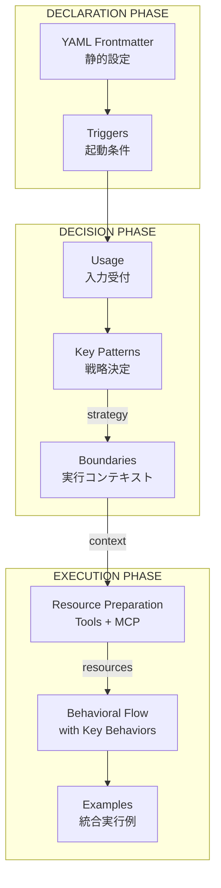

# Slash Command Structure Design Comparison

このドキュメントは、slash commandの構造設計に関する2つのアプローチを比較します。

## 背景

現在のSuperClaude Frameworkでは、slash commandの各セクションの責務が混在しており、特に以下の問題があります：

1. **Key BehaviorsとKey Patternsの混在**: 同じ内容が重複して記載される
2. **Key Patternsに実行フローが混入**: 変換ルールと実行順序が混同される
3. **セクション間の責務の曖昧さ**: どこに何を書くべきかが不明確

参考: `@reference/slash-command-section.md`では各セクションの責務を以下のように定義：
- **Behavioral Flow**: 実行順序（WHAT and WHEN）
- **Key Behaviors**: 動作特性（HOW it acts）- Behavioral Flow内に記載
- **Key Patterns**: 変換ルール（IF-THEN rules）
- **Boundaries**: 制限事項（CAN and CANNOT）

---

## Approach 1: User's Original Idea (Recommended)

### 構造の思想

実際のプログラム実行フローに沿った論理的な構造。入力を受け取り、解釈し、制約を確認してから実行するという自然な流れ。

### 実行フロー

```
Call slash command → Key Patterns → Boundaries → Behavioral Flow (with Key Behaviors)
```

### セクション構造（推奨改善版）

```yaml
静的設定:
  - YAML Frontmatter     # 静的設定は常にYAML Frontmatterに記載

コマンド定義:
  1. Triggers            # 実行開始条件
  2. Usage               # コマンド構文
  3. Key Patterns        # パターンマッチで責務を入力や状態から変換
  4. Boundaries          # 全体通して、やって良い事とやってはいけないことを把握
  5. Tool Coordination   # Claude Code ToolsとMCP Integrationを含む
                         # 必要なツールとサービスの準備
  6. Behavioral Flow     # すべての情報が揃った上で、どのように行動をするべきか把握して実行
     (with Key Behaviors) # 実行時の動作特性
  7. Examples            # Behavioral Flowが参考にするべき例示
```

### 設計原則

1. **早期検証パターン**: Key Patternsで処理方法を決定し、Boundariesで危険な操作を事前にブロック
2. **依存関係の明確化**: Behavioral FlowがKey Patterns、Boundaries、Tool Coordinationに依存
3. **実行時の論理的フロー**: 入力受付 → 解釈・変換 → 制約確認 → 準備 → 実行
4. **フィードバックループの明示**: Behavioral Flow内でループポイントを明確に示し、[STOP]マーカーで対話ポイントを明示

### `/spec:requirements`への適用例

````markdown
---
name: requirements
description: "Generate structured requirement documents"
category: workflow
---

## Triggers
- Starting new feature development
- Bug reporting needs documentation
- GitHub issue conversion needed

## Usage
```
/spec:requirements [--type prd|bug] [--issue <github-url>]
```

## Key Patterns
- **Type Detection**: --type prd → PRD template activation
- **Type Detection**: --type bug → Bug template activation
- **Source Detection**: --issue present → GitHub MCP activation
- **Source Detection**: no --issue → Interactive mode activation

## Boundaries
**Will:**
- Generate requirements.md only
- Iterate based on user feedback

**Will Not:**
- Perform design or investigation
- Auto-generate without confirmation

## Tool Coordination
**Claude Code Tools:**
- **Read**: Check existing requirements.md
- **Write/Edit**: Update requirements document
- **Bash(date:*)**: Generate timestamps

**MCP Integration:**
- **mcp__github__get_issue**: Fetch issue when --issue provided
- **GitHub Server**: Auto-fetch issue content when URL provided

## Behavioral Flow
1. **Initialize**: Apply patterns from Key Patterns section
2. **Gather Requirements**: Interactive or GitHub-based
   [STOP AND WAIT]
3. **Generate Document**: Create structured requirements
4. **Confirm**: Show completeness and get approval
   [STOP AND WAIT]
5. **Finalize**: Save to requirements.md

Key behaviors:
- Interactive refinement loops
- Completeness tracking display
- Progressive document enhancement

## Examples
[実行例...]
````

---

## Approach 2: Enhanced Three-Phase Architecture

### 構造の思想

実行フェーズを明確に分離し、宣言的設定、動的ルーティング、実行の3つのフェーズで構成。各フェーズが独立してテスト可能で、責務が明確。

### Three-Phase Architecture

```yaml
DECLARATION PHASE (静的メタデータ):
  - YAML Frontmatter    # 宣言的設定
  - Triggers           # 起動条件の定義

DECISION PHASE (動的ルーティング):
  - Usage              # 入力インターフェース
  - Key Patterns       # 変換＆ルーティング決定
  - Boundaries         # 実行コンテキスト定義

EXECUTION PHASE (実行):
  - Resource Preparation  # Tool Coordination + MCP Integration
  - Behavioral Flow      # 実行ステップ (with Key Behaviors)
  - Examples            # 統合実行例
```

### 実行フロー図



### 拡張された責務定義

#### Key Patterns (戦略決定エンジン)
```yaml
責務:
  - Input Transformation: 入力 → 処理方法
  - Execution Strategy: 並列/逐次/対話型の選択
  - Persona Routing: 適切なペルソナの活性化
  - MCP Selection: 必要なMCPサーバーの決定
  - Complexity Assessment: 処理の複雑度判定
```

#### Boundaries (実行コンテキスト定義)
```yaml
責務:
  Capabilities:
    - What operations are allowed
    - What resources can be accessed
  Constraints:
    - What must not be done
    - Safety and security limits
  Scope:
    - File/directory boundaries
    - Time/resource limits
```

#### Resource Preparation (統合リソース準備)
```yaml
責務:
  Tools:
    - Required tools based on Key Patterns
    - Fallback tools for error cases
  MCP Servers:
    - Primary servers for main functionality
    - Secondary servers for enhancement
  Caching:
    - Pre-fetch commonly needed resources
    - Session-based optimization
```

### `/spec:requirements`への適用例

````markdown
---
name: requirements
description: "Generate structured requirement documents"
category: workflow
complexity: standard
mcp-servers: [github]
personas: [analyst, architect]
---

## Triggers
- New feature planning needed
- Bug documentation required
- GitHub issue conversion

## Usage
```
/spec:requirements [--type prd|bug] [--issue <url>]
```

## Key Patterns (戦略決定)
- **Type Strategy**: prd → comprehensive template + iterative refinement
- **Type Strategy**: bug → focused template + reproduction emphasis
- **Source Strategy**: --issue → GitHub fetch + auto-population
- **Source Strategy**: manual → interactive gathering + guided questions
- **Complexity Assessment**: PRD → high complexity → multiple iterations
- **Persona Activation**: Requirements analysis → analyst + architect

## Boundaries (実行コンテキスト)
**Scope:**
- File: requirements.md only
- Iterations: Max 5 refinement rounds
- Time: 10-minute timeout per session

**Capabilities:**
- Read/write Kiro spec files
- Fetch GitHub issues
- Interactive user dialogue

**Constraints:**
- No design or implementation
- No automatic commits
- No external API calls except GitHub

## Resource Preparation
**Tools:**
- Primary: Write, Edit, MultiEdit
- Validation: Read (check existing)
- Metadata: Bash(date:*)

**MCP Integration:**
- GitHub: Issue fetching when --issue provided
- Fallback: Manual input if fetch fails

## Behavioral Flow
1. **Initialize** (Apply Key Patterns decisions)
   - Parse arguments
   - Load templates based on type
   - Fetch GitHub issue if needed

2. **Gather Requirements** (Interactive/Automated)
   - Present contextual questions
   - [STOP: Wait for user input]
   - Parse and structure responses

3. **Generate Document** (Progressive building)
   - Create sections based on input
   - Calculate completeness (60-100%)
   - Format for review

4. **Refinement Loop** (User-driven iteration)
   - Show document + completeness
   - [STOP: Get user feedback]
   - If approved → proceed to 5
   - If not → enhance and loop to 3

5. **Finalize** (Completion)
   - Save to requirements.md
   - Display final metrics
   - Confirm success

Key behaviors:
- Completeness percentage always visible
- Non-destructive editing
- Graceful degradation on GitHub failure
- Session state preservation

## Examples
[Complete execution scenarios]
````

---

## 比較分析

### 共通点

両アプローチとも以下の原則を共有：
1. **Early Validation**: 実行前に制約を確認
2. **Clear Dependencies**: セクション間の依存関係を明確化
3. **Logical Flow**: 入力 → 解釈 → 検証 → 実行の流れ

### 相違点

| 観点 | Approach 1 (User's Idea) | Approach 2 (Enhanced) |
|------|-------------------------|----------------------|
| **構造** | フラットな8セクション | 3フェーズに階層化 |
| **Tool/MCP** | 別セクション | Resource Preparationに統合 |
| **メタデータ** | 暗黙的 | YAML Frontmatterとして明示 |
| **テスタビリティ** | セクション単位 | フェーズ単位で独立テスト可能 |
| **複雑度** | シンプル | より構造化されているが複雑 |

### 利点と欠点

#### Approach 1 の利点
- ✅ シンプルで理解しやすい
- ✅ 現在のSuperClaude構造からの移行が容易
- ✅ 実装が直感的

#### Approach 1 の欠点
- ❌ Tool CoordinationとMCP Integrationの分離が冗長になる可能性
- ❌ フェーズの境界が暗黙的

#### Approach 2 の利点
- ✅ フェーズが明確で責務分離が徹底
- ✅ テスタビリティが高い
- ✅ 大規模コマンドでも構造が保持される

#### Approach 2 の欠点
- ❌ 初期学習コストが高い
- ❌ シンプルなコマンドには過剰な構造

